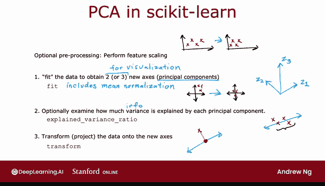
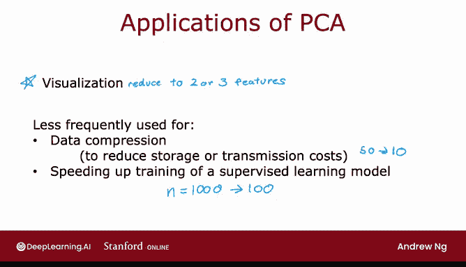

# 133：使用Scikit-learn实现PCA 🛠️


在本节课中，我们将学习如何使用Scikit-learn库来实现主成分分析（PCA）。我们将从数据预处理开始，逐步完成PCA的拟合、方差解释和最终的数据转换，并了解PCA的常见应用场景。

## 概述 📋

PCA是一种用于降维和数据可视化的强大技术。通过将高维数据投影到少数几个主成分上，我们可以捕捉数据中的主要变化模式。本节将详细介绍在Scikit-learn中执行PCA的步骤。

## 实现步骤 🚶‍♂️

上一节我们介绍了PCA的数学原理，本节中我们来看看如何在代码中实现它。

### 1. 特征缩放

如果数据特征的值域差异很大，进行预处理以缩放特征至可比较的范围是重要的。例如，在分析不同国家的特征时，GDP可能以万亿美元计，而其他特征可能小于100。在这种情况下，特征缩放有助于PCA为你找到一个好的坐标轴选择。

### 2. 拟合PCA模型

下一步是运行PCA算法来“拟合”数据，以获得两个或三个新轴Z1、Z2，可能还有Z3。这里假设你想要两个或三个轴以便在2D或3D中可视化数据。如果你需要更多轴，PCA实现也可以提供，只是更难可视化。

在Scikit-learn中，你将使用`fit`函数或`fit`方法来完成此操作。PCA中的`fit`函数会自动执行均值归一化，它会减去每个特征的均值，因此你无需单独执行均值归一化。

运行`fit`函数后，你将获得新轴Z1、Z2（可能还有Z3）。在PCA中，我们也称这些为主成分，其中Z1是第一主成分，Z2是第二主成分，Z3是第三主成分。



### 3. 检查解释方差比

之后，建议查看这些新轴或新主成分各自解释了数据中多少方差。这让你了解将这些数据投影到这些轴上是否有助于保留原始数据集中的大部分变异性或信息。这是通过`explained_variance_ratio_`函数完成的。

### 4. 转换数据

最后，你可以转换数据，即将其投影到新的主成分轴上。这是通过`transform`方法完成的。然后，对于每个训练示例，你只需得到两个或三个数字，并可以绘制这些数字以详细可视化你的数据。

以下是PCA代码的具体示例：

## 代码示例 💻

这是一个数据集X，包含六个示例。`X`是一个NumPy数组，包含这里的六个示例。

为了运行PCA将此数据从两个数字（x1， x2）减少到仅一个数字Z，你需要运行PCA并要求它拟合一个主成分。因此，这里的`n_components`等于1。

```python
from sklearn.decomposition import PCA
import numpy as np

# 示例数据
X = np.array([...]) # 你的数据

# 创建PCA模型，指定主成分数量为1
pca1 = PCA(n_components=1)
# 拟合模型
pca1.fit(X)
```

事实证明，如果你打印`pca1.explained_variance_ratio_`，结果是0.992。这告诉你，在这个例子中，当你选择一个轴时，它捕获了原始数据集中99.2%的变异性或信息。

最后，如果你想获取每个训练示例并将其投影到一个数字上，你可以调用`transform`方法。

```python
# 转换数据
Z = pca1.transform(X)
```

这将输出一个包含六个数字的数组，对应你的六个训练示例。例如，第一个训练示例[1, 1]投影到Z轴上得到数字1.383，依此类推。因此，如果要用一个维度可视化这些数据，这个数字将用于表示第一个示例。第二个示例被投影为这个数字，等等。

在可选实验中，你可以看到这六个示例已被投影到这条轴上，这就是为什么所有六个示例现在都位于这条看起来像这样的线上。第一个训练示例[1, 1]被映射到这个点，该点距离原点的距离为1.38。所以这就是为什么这里是1.38。

## 另一个示例 🔄

这个数据是二维数据，我们将其降为一维。如果你要计算两个主成分呢？从二维开始，最终也得到二维。这对于可视化来说不是那么有用，但可能有助于我们更好地理解PCA及其代码的工作原理。

这是相同的代码，只是我将`n_components`改为了2。我要求算法找到两个主成分。

```python
# 创建PCA模型，指定主成分数量为2
pca2 = PCA(n_components=2)
pca2.fit(X)
```

如果你这样做，`pca2.explained_variance_ratio_`变为[0.992, 0.0008]。这意味着Z1（第一主成分）仍然解释了99.2%的方差，而Z2（第二主成分或第二轴）解释了0.8%的方差。这两个数字加起来等于1，因为数据是二维的，所以Z1和Z2两个轴共同解释了数据中100%的方差。

如果你要转换或将数据投影到Z1和Z2轴上，这就是你得到的结果。现在，第一个训练示例被映射到这两个数字，对应于在Z1和Z2上的投影。第二个示例被投影到Z1和Z2上，变成了这两个数字。

如果你要重建原始数据，大致上这是Z1，这是Z2。那么第一个训练示例[1, 1]在Z1轴上的距离为1.38（因此是这个数字），在Z2轴上的距离为0.29（因此是这个距离）。重建实际上看起来与原始数据完全相同，因为如果你将二维数据“降维”到二维数据，就没有近似，你可以通过投影到Z1和Z2上得到原始数据集。

## PCA的应用场景 🌐

在结束之前，我想分享一些应用PCA的建议。

PCA经常用于可视化，你将数据减少到两个或三个数字，以便可以绘图，就像你在早期关于不同国家数据的视频中看到的那样，因此可以可视化不同的国家。

你可能偶尔会听到PCA的其他一些应用，这些应用在过去（可能是10、15、20年前）更流行，但现在少得多。

PCA的另一个可能用途是数据压缩。例如，如果你有一个包含许多不同汽车的数据库，每辆车有50个特征，但它占用了数据库太多空间，或者通过互联网传输50个数字需要太长时间，那么你可以做的一件事就是将这些50个特征减少到更少的特征。可以是10个特征，对应10个轴或10个主成分。你无法轻易可视化10维数据，但这是所需存储空间的五分之一，或者是网络传输成本的五分之一。许多年前，我更多地看到PCA用于此应用，但今天，随着现代存储能够存储相当大的数据集，以及现代网络能够比以前更快地传输更多数据，我很少看到这种PCA应用。

PCA的另一个应用，同样在过去（可能是10年、20年前）更常见，但现在少得多，是用于加速监督学习模型的训练。其思想是，如果你有1000个特征，拥有1000个特征使得监督学习算法运行缓慢，也许你可以使用PCA将其减少到100个特征。然后你的数据集基本上更小，你的监督学习算法可能运行得更快。这在一些老一代学习算法（例如支持向量机）的运行时间上曾起到作用。但事实证明，对于现代机器学习算法（如深度学习），这实际上没有太大帮助。更常见的做法是直接将高维数据集输入到你的神经网络中，而不是运行PCA，因为PCA也有一些计算成本。所以你可能会在其他一些研究论文中听到这个，但我真的不再经常看到这样做了。



但我今天使用PCA最常见的事情是可视化，我发现将高维数据降维以进行可视化非常有用。

## 总结 🎯

本节课中我们一起学习了如何使用Scikit-learn库实现PCA。我们涵盖了从数据预处理、模型拟合、解释方差分析到数据转换的完整流程。我们还探讨了PCA在数据可视化、压缩以及加速模型训练等方面的应用，并了解了在现代机器学习实践中其最常见的用途是数据可视化。掌握PCA将帮助你在面对新的高维数据集时，能够有效地将其降至二维或三维进行可视化，从而获得对数据的新见解。