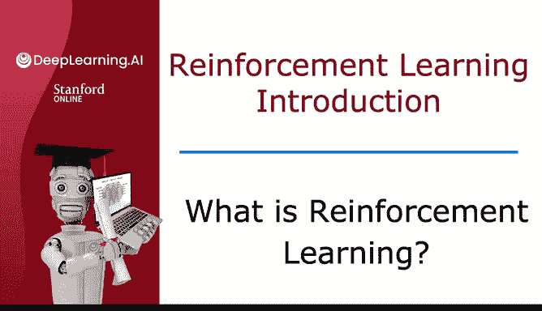
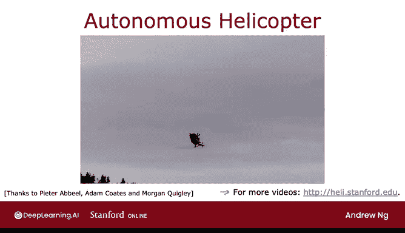
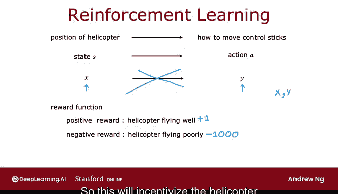
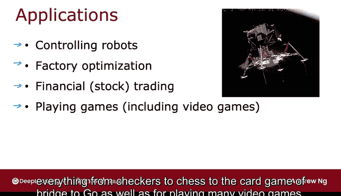

# 134：什么是强化学习？🤖



在本节课中，我们将要学习强化学习的基本概念。强化学习是机器学习的核心支柱之一，它通过奖励和惩罚机制，让机器自主学会如何采取行动以达到最佳目标。尽管目前在商业应用中不如监督学习广泛，但强化学习在机器人控制、游戏和优化等领域展现出巨大潜力。

---

## 强化学习示例：自动驾驶直升机 🚁

上一节我们介绍了强化学习的整体概念，本节中我们来看看一个具体例子：让自动驾驶直升机学会飞行。

这是一架斯坦福自动驾驶直升机，重32磅，配备了机载计算机、GPS、加速度计、陀螺仪和磁罗盘，能精确感知自身状态。控制这类直升机通常需要使用操纵杆，程序需要每秒十次根据直升机的位置、方向、速度等信息（我们称之为**状态 S**），来决定如何操纵两个控制杆以保持直升机平衡并飞行。

**公式表示任务：**
```
动作 A = 函数(状态 S)
```

通过强化学习算法，我们甚至能让这架直升机学会倒飞等特技动作。以下是实现这一目标的关键思路。

---



## 为什么不用监督学习？🤔

你可能会想，是否可以使用监督学习来解决这个问题？即收集大量状态数据，并让人类专家标注出每个状态下应采取的最佳动作，然后训练一个神经网络来学习从状态到动作的映射。

然而，这种方法存在挑战：
*   直升机在空中飞行时，对于任一状态，**“唯一正确”的动作通常非常模糊**（例如，操纵杆应该向左推一点还是推很多？）。
*   很难获取一个包含理想动作的大规模高质量数据集 `(X, Y)`。

因此，对于控制直升机这类机器人任务，监督学习效果不佳，我们转而使用强化学习。

---

## 核心：奖励函数 🏆

强化学习的一个关键输入是**奖励函数**。它告诉智能体（如直升机）什么时候做得好，什么时候做得不好。

理解奖励函数的一个好方法是类比**训练小狗**：
*   当小狗行为良好时，你说“好狗狗”并给予奖励。
*   当小狗行为不当时，你说“坏狗狗”并给予惩罚。
*   小狗通过这种方式自行学会多做能获得奖励的事，少做会导致惩罚的事。

训练强化学习算法也是如此：
*   当直升机飞行平稳时，给予正奖励（例如，每秒 `+1`）。
*   当直升机飞行不佳或坠毁时，给予负奖励（例如 `-1000`）。

**代码示例奖励逻辑：**
```python
if helicopter_is_flying_well:
    reward = +1
elif helicopter_crashes:
    reward = -1000
else:
    reward = -0.1
```

奖励函数的强大之处在于，你只需要告诉算法**“做什么”**（即目标），而不是**“怎么做”**（即具体每一步的最佳动作），这为系统设计提供了极大的灵活性。

---



## 更多应用实例 🎮

强化学习不仅用于控制直升机，还成功应用于许多其他领域。以下是部分应用场景：

*   **机器人控制**：例如，训练机器狗跨越障碍。通过奖励其向屏幕左侧移动，机器狗能自动学会如何协调四肢来越过各种障碍。
*   **工厂优化**：重新安排工厂布局和流程，以最大化生产效率和吞吐量。
*   **金融交易**：优化大宗股票的交易执行策略，以在较长时间内平滑卖出，从而获得更优价格。
*   **游戏**：从国际象棋、围棋到各类电子游戏，强化学习算法已能达到甚至超越人类顶尖水平。

---

## 总结 📚



本节课中我们一起学习了强化学习的基础。强化学习通过定义**奖励函数**，让智能体在环境中通过试错自主学习最佳策略，而不是依赖于大量人工标注的数据。其核心思想可以概括为：

**核心任务：** 让算法学会选择一个函数，将**状态 S** 映射到**动作 A**，以最大化随时间累积的总奖励。

虽然目前其应用广度不及监督学习，但强化学习在机器人学、游戏AI和复杂系统优化等领域正发挥着不可替代的作用。在接下来的课程中，我们将进一步形式化强化学习问题并开始开发自动选择优良动作的算法。