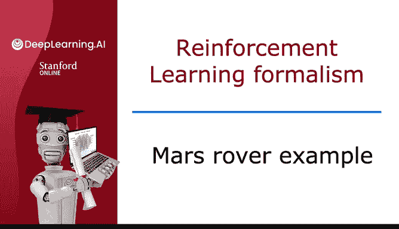
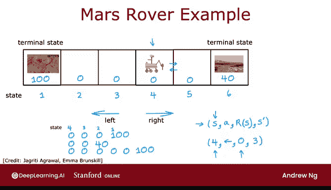

# 135：强化学习火星探测器示例 🚀

在本节课中，我们将通过一个简化的火星探测器示例，来具体了解强化学习的基本形式。我们将学习强化学习中的核心概念，如状态、动作、奖励和回报，并理解它们如何共同作用，以指导智能体（如火星车）做出决策。

---

为了具体阐述强化学习的形式化框架，我们不会使用像直升机或机器狗那样复杂的例子，而是采用一个受火星探测器启发的简化示例。这个例子改编自斯坦福大学教授艾玛·布鲁斯基尔和我的一位合作者杰克·里蒂·阿格拉韦尔的构思，后者编写的代码目前正在实际控制火星探测器，并帮助我梳理和构建了这个示例。

让我们开始吧。

我们将基于一个受火星探测器启发的简化示例来展开强化学习。在这个应用中，探测器可以处于六个位置中的任何一个，如上图所示的六个方框。探测器可能从某个位置开始，比如这里显示的四个点中的位置四。在强化学习中，火星探测器的位置被称为**状态**。

我将这六个状态分别称为状态1、状态2、状态3、状态4、状态5和状态6。因此，探测器从状态4开始。

探测器被送往火星是为了执行不同的科学任务。它可以前往不同地点，使用传感器（如钻头、雷达或光谱仪）分析星球上不同位置的岩石，或者前往不同地点拍摄有趣的照片供地球上的科学家研究。在这个例子中，左侧的状态1有一个非常有趣的表面，科学家非常希望机器人能去采样；状态6也有一个相当有趣的表面，科学家也比较希望探测器去采样，但不如状态1那么有趣。因此，我们更希望在状态1执行科学任务，而不是在状态6，但状态1距离更远。

我们将通过**奖励函数**来反映状态1可能具有的更高价值。

因此，状态1的奖励是 `R(1) = 100`。状态6的奖励是 `R(6) = 40`。而中间所有其他状态（状态2、3、4、5）的奖励，我将其写为 `R(s) = 0`，因为在这些状态下没有那么多有趣的科学工作可做。

在每个时间步，探测器可以选择两个**动作**之一：它可以向左走，也可以向右走。

那么问题是，探测器应该做什么？在强化学习中，我们非常关注奖励，因为这是我们判断机器人做得好坏的方式。

让我们看一些可能发生的情况示例。

如果机器人选择向左走，从状态4开始。那么，最初从状态4开始，它会获得奖励0；向左移动后到达状态3，再次获得奖励0；然后到达状态2，获得奖励0；最后到达状态1，获得奖励100。对于这个应用，我假设当它到达状态1或状态6时，这一天就结束了。在强化学习中，我们有时称此为**终止状态**。这意味着在到达这些终止状态之一后，它会在该状态获得奖励，但之后不会再发生任何事情。也许机器人电量耗尽或当天时间用完，这就是为什么它只能享受100或40的奖励，然后这一天就结束了，之后无法获得额外的奖励。

现在，机器人也可以选择向右走。在这种情况下，从状态4开始，它首先会获得奖励0；然后向右移动到达状态5，获得另一个奖励0；接着到达右侧的另一个终止状态——状态6，并获得奖励40。

但是，向左走和向右走并不是唯一的选择。机器人可以做的一件事是：从状态4开始，决定向右移动。它从状态4到5，在状态4获得奖励0，在状态5获得奖励0；然后它可能改变主意，决定开始向左走，如下所示。在这种情况下，它会在状态4获得奖励0，然后到状态3、状态2，最后到达状态1时获得奖励100。

在这一系列动作和状态中，机器人浪费了一些时间，所以这可能不是一个很好的行动选择，但它是算法可以选择的一种方式，不过希望它不会选择这个。

总结一下，在每个时间步，机器人处于某个状态，我称之为 `S`。它可以选择一个动作 `A`，并且享受从该状态获得的奖励 `R(S)`。作为其动作的结果，它会到达某个新状态 `S‘`。

作为一个具体例子，当机器人在状态4时，它采取了“向左”的动作，它“享受”了（也许并不享受）与该状态4相关的奖励0，并最终进入了新状态3。当你学习具体的强化学习算法时，你会发现这四个要素——状态 `S`、动作 `A`、奖励 `R(S)` 和下一个状态 `S‘`——基本上是你每次采取动作时都会发生的事情，这将成为强化学习算法在决定如何采取行动时所关注的核心要素。为了清晰起见，这里的奖励 `R(S)` 是与状态 `S` 相关联的，所以这个奖励0是与状态4相关联的，而不是与状态3相关联的。

以上就是强化学习应用如何运作的形式化描述。在下一个视频中，让我们看看如何具体指定我们希望强化学习算法做什么。特别是，我们将讨论强化学习中的一个重要概念——**回报**。让我们进入下一个视频，看看那是什么意思。