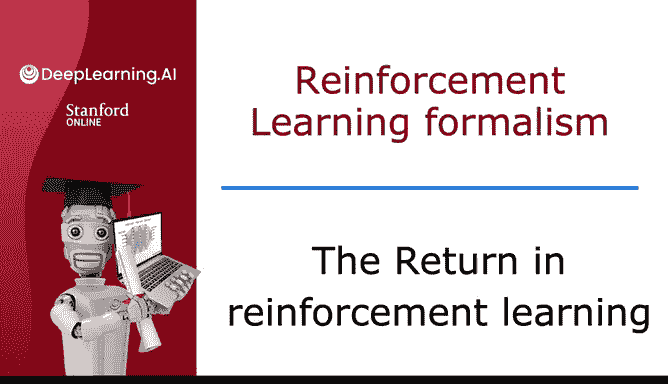
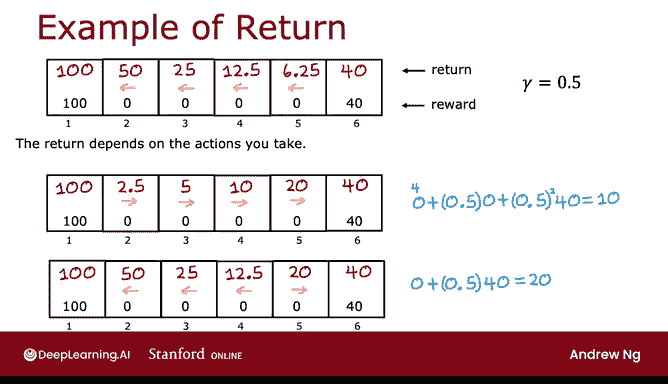

# 136：强化学习中的回报 📈



在本节课中，我们将学习强化学习中的一个核心概念——**回报**。回报用于量化评估智能体在一系列行动中获得的总收益，并考虑了时间因素对奖励价值的影响。

上一节我们介绍了强化学习中的状态、行动和即时奖励。本节中我们来看看如何将这些即时奖励整合成一个衡量长期表现的单一指标。

## 回报的定义

回报是智能体在一条轨迹（即一系列状态和行动）中获得的所有奖励的加权和。其核心思想是：**越早获得的奖励，其价值越高**。这通过一个称为**折扣因子**的参数来实现。

回报的通用计算公式如下：

```
G = R1 + γ * R2 + γ² * R3 + γ³ * R4 + ... + γ^(T-1) * R_T
```

其中：
*   `G` 代表回报。
*   `R1, R2, R3, ... R_T` 代表在每个时间步获得的即时奖励。
*   `γ` (Gamma) 是**折扣因子**，是一个介于0和1之间的数（通常为0.9、0.99等）。
*   `T` 是到达终止状态的总步数。

## 折扣因子的作用

折扣因子 `γ` 使强化学习算法变得“缺乏耐心”。它赋予即时奖励全额价值，而对未来奖励进行折现。`γ` 值越小，算法越看重短期收益；`γ` 值越接近1，算法越有远见，更考虑长期收益。

在金融领域，折扣因子有直观的解释：它类似于利率或货币的时间价值。今天的一美元比未来的一美元更值钱，因为今天的钱可以投资生息。

## 计算示例

让我们通过一个简单的网格世界例子来具体计算回报。假设智能体从状态4出发，始终向左移动，获得的奖励序列为：[0, 0, 0, 100]（到达状态1终止）。设定折扣因子 `γ = 0.5`。

其回报计算过程为：
```
G = 0 + 0.5 * 0 + 0.5² * 0 + 0.5³ * 100
  = 0 + 0 + 0 + 12.5
  = 12.5
```

以下是不同策略下，从各状态出发的回报示例：

*   **策略A：始终向左**
    *   从状态1开始：`G = 100`
    *   从状态2开始：`G = 50`
    *   从状态3开始：`G = 25`
    *   从状态4开始：`G = 12.5`

*   **策略B：始终向右**
    *   从状态4开始：`G = 10` （计算：`0 + 0.5*0 + 0.25*40 = 10`）
    *   从状态5开始：`G = 20`

*   **策略C：混合策略（在状态5时向右，其他向左）**
    *   从状态5开始：`G = 20` （计算：`0 + 0.5*40 = 20`）

通过比较可以看出，从状态4出发，策略A（回报12.5）优于策略B（回报10）。而策略C在状态5时做出了更优的局部决策。

## 回报与负奖励



当环境中存在负奖励（惩罚）时，折扣因子会产生一个有趣的效果：**它会激励系统尽可能地将惩罚推迟到遥远的未来**。

例如，如果需要支付10美元（即奖励为-10），那么如果能将支付推迟几年，由于金钱的时间价值，未来的10美元比现在的10美元“代价”更小。因此，回报机制自然地引导系统规避近期的惩罚。

本节课中我们一起学习了强化学习的核心概念——**回报**。我们明确了回报是未来奖励的折扣总和，理解了折扣因子如何影响智能体对短期与长期收益的权衡，并通过实例演示了如何计算不同策略下的回报。

下一节，我们将以此为基础，正式定义强化学习算法的目标。