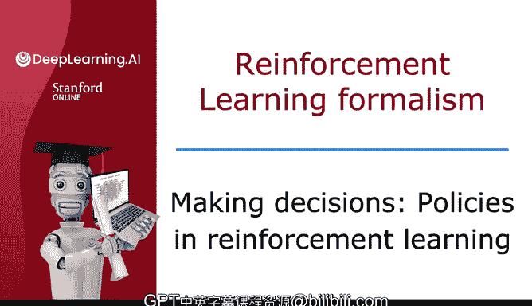
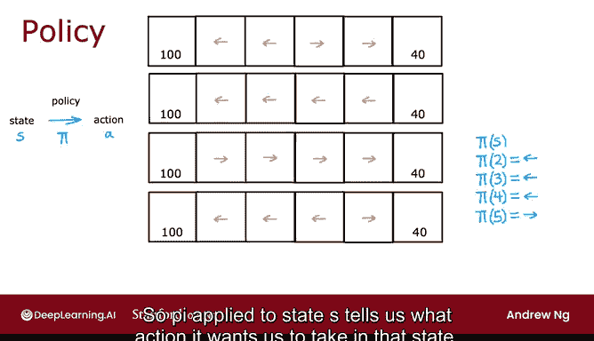
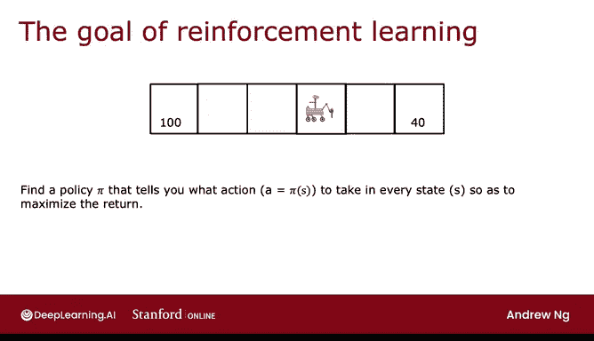

# 137：强化学习中的决策策略 🧠

在本节课中，我们将学习强化学习算法如何选择行动，并正式介绍“策略”这一核心概念。

## 概述

上一节我们讨论了强化学习中的回报概念。本节中，我们将探讨算法如何决定在特定状态下采取何种行动，这被称为“策略”。

## 什么是策略？

在强化学习问题中，有多种选择行动的方式。以下是几个例子：

*   **选择较近的奖励**：如果左侧奖励更近，则向左移动；如果右侧奖励更近，则向右移动。
*   **选择较大的奖励**：总是朝着当前可获得的较大奖励方向移动。
*   **选择较小的奖励**：虽然这通常不是好主意，但这也是一种可能的选项。
*   **特定规则**：例如，通常向左移动，除非距离右侧奖励仅一步之遥，此时则向右移动。

## 策略的正式定义

强化学习的目标是找到一个称为**策略**的函数，记作 **π**。策略 **π** 的职责是接收任意状态 **S** 作为输入，并映射到它希望我们采取的行动 **A**。

用公式表示，策略函数为：
**A = π(S)**

例如，对于某个具体策略，其映射关系可能如下：
*   在状态 **S2** 时，策略输出行动“向左”。
*   在状态 **S3** 时，策略输出行动“向左”。
*   在状态 **S4** 时，策略输出行动“向左”。
*   在状态 **S5** 时，策略输出行动“向右”。

因此，**π(S)** 告诉我们，在状态 **S** 下应该采取什么行动。

## 策略的目标

强化学习的最终目标是找到一个策略 **π** 或 **π(S)**，它能告诉你在每个状态下应采取什么行动，以**最大化总回报**。

关于术语“策略”的说明：它可能不是描述 **π** 功能最直观的词汇，但已成为强化学习领域的标准术语。或许称 **π** 为“控制器”会更自然，但“策略”是目前通用的叫法。

## 总结

本节课我们一起学习了强化学习中的核心概念——策略。我们了解到，策略 **π** 是一个函数，它根据当前状态 **S** 来决定行动 **A**，其终极目标是通过一系列行动最大化累积回报。

在上一节中，我们介绍了从状态、行动、奖励到回报等一系列概念。下一节，我们将快速回顾这些概念，然后开始探索如何寻找优秀策略的算法。