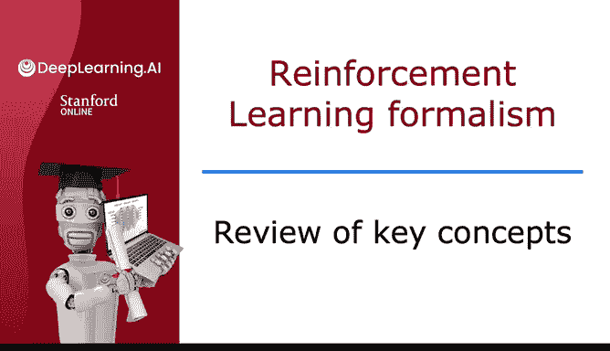
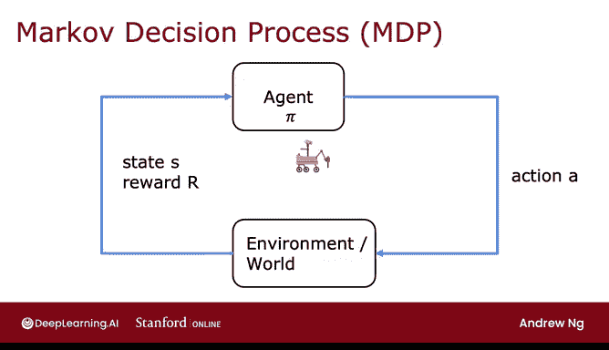

# 138：强化学习核心概念回顾 🧠

在本节课中，我们将回顾强化学习的关键概念，并了解这些概念如何应用于不同场景。我们将以火星车例子为基础，系统地梳理状态、动作、奖励、折扣因子、回报和策略等核心要素。

---

## 状态、动作与奖励

上一节我们介绍了火星车的例子，本节中我们来看看强化学习问题的基本构成要素。

强化学习问题通常由以下几个核心部分定义：

*   **状态**：描述系统当前情况的信息。在火星车例子中，状态是六个可能的位置，编号为1到6。
*   **动作**：智能体在每个状态下可以执行的操作。火星车的动作是向左或向右移动。
*   **奖励**：智能体在执行某个动作并到达新状态后获得的即时反馈。火星车在状态1（最左）获得奖励100，在状态6（最右）获得奖励40，在其他状态获得奖励0。

## 折扣因子与回报

理解了即时反馈后，我们需要考虑长期收益。折扣因子和回报就是为此设计的。

**折扣因子**（通常用希腊字母 γ 表示）是一个略小于1的数（例如0.5或0.99），它决定了未来奖励在当前的价值。**回报**则是从当前时刻开始，所有未来奖励经过折扣后的总和。

回报的计算公式如下：
`G = R1 + γ * R2 + γ^2 * R3 + ...`
其中，`R1, R2, R3...` 代表未来每一步获得的奖励。

在火星车例子中，我们使用的折扣因子是 **0.5**。

## 策略

有了衡量长期收益的“回报”，智能体需要一个行动指南来最大化它，这就是策略。

**策略**（通常用 π 表示）是一个函数，它根据当前状态告诉智能体应该采取哪个动作。强化学习算法的目标就是找到一个最优策略，使得智能体在任何状态下获得的期望回报最大。

## 概念的应用

这些核心概念构成了一套通用形式化框架，可以应用于众多领域。

以下是几个不同领域的应用示例：

*   **自动驾驶直升机**：
    *   **状态**：直升机的位置、姿态、速度等。
    *   **动作**：操纵控制杆的各种方式。
    *   **奖励**：飞行平稳时+1，坠毁时-1000。
    *   **目标**：学习一个策略，根据状态输入，输出控制动作以安全飞行。

*   **国际象棋游戏**：
    *   **状态**：棋盘上所有棋子的位置。
    *   **动作**：所有合法的走法。
    *   **奖励**：赢棋+1，输棋-1，和棋0。
    *   **折扣因子**：通常非常接近1，如0.99。
    *   **目标**：学习一个策略，根据棋盘局面，选择能最大化获胜概率的走法。

## 马尔可夫决策过程

这套形式化框架有一个专门的名称：**马尔可夫决策过程**。

MDP 中的“马尔可夫”性质是指：**未来只取决于当前状态，而与如何到达当前状态的历史无关**。换句话说，在 MDP 中，你只需要知道“现在在哪里”，而不需要知道“过去是怎么来的”。

另一种理解 MDP 的视角是智能体与环境的交互循环：
1.  智能体根据策略 π 选择动作 A。
2.  动作 A 作用于环境，环境发生变化。
3.  环境反馈给智能体新的状态 S‘ 和即时奖励 R。
4.  智能体根据新状态再次决策，循环往复。

这个循环清晰地刻画了强化学习智能体通过试错进行学习的过程。

---

本节课中我们一起学习了强化学习的核心概念框架：状态、动作、奖励、折扣因子、回报和策略。我们了解到这套框架被称为马尔可夫决策过程，并且看到了它在控制问题和游戏等不同领域的广泛应用。在接下来的视频中，我们将开始探索如何计算一个关键量——**状态-动作价值函数**，这是开发强化学习算法的第一步。