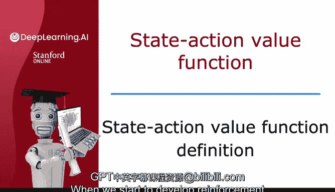
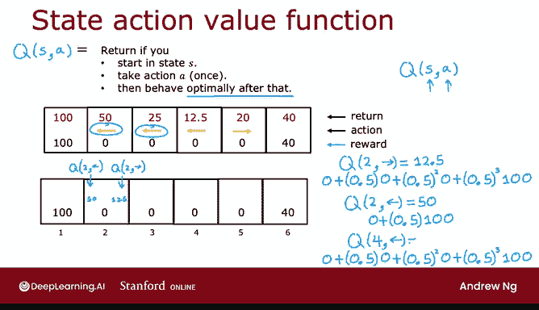
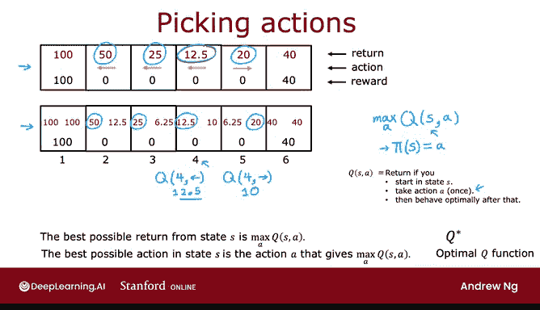

# 139：状态-动作价值函数定义 🧠

在本节课中，我们将要学习强化学习中的一个核心概念——**状态-动作价值函数**，它通常被称为 **Q函数**。理解这个函数是后续学习强化学习算法的基础。

---

## 概述

状态-动作价值函数是一个关键的量，强化学习算法会尝试计算它。这个函数告诉我们，在特定状态下采取某个特定动作，然后从该点开始**最优地**行动，所能获得的总回报是多少。

上一节我们介绍了回报和最优策略的概念，本节中我们来看看如何量化评估在某个状态下采取某个具体动作的“好坏”。

---

## Q函数的定义

状态-动作价值函数通常用大写字母 **Q** 表示。它是一个关于状态 **S** 和动作 **A** 的函数。

**Q(S, A)** 的值等于：如果你从状态 **S** 开始，**只采取一次动作 A**，然后在此之后都遵循**最优策略**行动，最终所能获得的总回报。

用公式可以表示为：
`Q(S, A) = 回报(从状态S开始，执行动作A，之后遵循最优策略π*)`

这里有一个看似矛盾的地方：为了计算 Q(S, A)，我们需要知道“之后的最优行为”。但如果我们已经知道了最优策略，为什么还需要计算 Q 函数呢？这个定义确实有些循环论证的意味。不过请放心，在后续的具体算法中，我们会找到一种方法，在尚未得出最优策略之前就能计算出 Q 函数。

---

## 通过例子理解 Q 函数

让我们通过之前火星车探索的例子来具体理解 Q 函数。假设折扣因子 **γ = 0.5**，并且我们已经知道下图所示的是一个最优策略（在状态2、3、4向左，在状态5向右）。

以下是几个计算 Q(S, A) 值的具体例子：

**例子1：计算 Q(状态2, 向右)**
1.  在状态2，执行动作“向右”，到达状态3，获得即时奖励 **0**。
2.  从状态3开始，遵循最优策略（向左），回到状态2，奖励 **0**。
3.  在状态2，遵循最优策略（向左），到达状态1（终点），获得奖励 **100**。
因此，总回报 = 0 + 0.5 × 0 + 0.5² × 0 + 0.5³ × 100 = **12.5**。
所以，**Q(状态2, 向右) = 12.5**。这个值仅仅计算了“如果向右然后最优行动”的回报，并不代表向右是个好主意。

**例子2：计算 Q(状态2, 向左)**
1.  在状态2，执行动作“向左”，直接到达终点状态1，获得奖励 **100**。
因此，总回报 = 0 + 0.5 × 100 = **50**。
所以，**Q(状态2, 向左) = 50**。

**例子3：计算 Q(状态4, 向左)**
1.  在状态4向左，到状态3 (奖励0)。
2.  从状态3最优行动（向左），到状态2 (奖励0)。
3.  从状态2最优行动（向左），到状态1 (奖励100)。
总回报 = 0 + 0.5×0 + 0.5²×0 + 0.5³×100 = **12.5**。
所以，**Q(状态4, 向左) = 12.5**。

按照这个方法为所有状态和动作进行计算，我们可以得到完整的 Q 函数表，如下图所示：

在终点状态（1和6），无论采取什么动作，都只会得到对应的终点奖励（100或40）。

---

## 为什么 Q 函数重要？

状态-动作价值函数（Q函数）之所以关键，是因为一旦我们能够计算出它，它就为我们提供了一种选择动作的方法。

观察上图中的 Q 值，你会发现一个规律：
*   在状态2，`Q(左)=50` 大于 `Q(右)=12.5`。
*   在状态3，`Q(左)=25` 大于 `Q(右)=6.25`。
*   在状态4，`Q(左)=12.5` 大于 `Q(右)=10`。
*   在状态5，`Q(右)=20` 大于 `Q(左)=10`。

从任何状态 **S** 出发，你能获得的**最佳可能回报**，就是 `Q(S, A)` 对所有可能动作 **A** 取最大值：
`最佳回报(S) = max over A of Q(S, A)`

更重要的是，为了获得这个最佳回报，你应该选择的动作，正是那个能使 `Q(S, A)` 值最大的动作 **A**。

因此，如果我们有办法计算出每个状态和每个动作的 `Q(S, A)`，那么制定策略就变得非常简单：当处于状态 **S** 时，只需查看所有可能的动作 **A**，然后选择使 `Q(S, A)` 最大的那个动作。

用策略函数表示就是：
`π*(S) = argmax over A of Q(S, A)`

这直观上是合理的，因为 `Q(S, A)` 衡量了“在状态S下采取动作A，然后一路最优能获得多少回报”。为了获得最大总回报，你自然应该选择能带来最大 `Q` 值的那个动作。

---

## 术语说明

*   **Q函数** 和 **状态-动作价值函数** 这两个术语可以互换使用。
*   在部分强化学习文献中，这个函数也可能被称为 **最优Q函数** 或记为 **Q***，它们指代的是我们这里定义的同一个概念。在本课程中，你无需为此担心。

---

## 总结

本节课中我们一起学习了**状态-动作价值函数（Q函数）**。

我们了解到：
1.  **Q(S, A)** 定义了在状态 **S** 下执行动作 **A**，之后遵循最优策略所能获得的总回报。
2.  通过具体的火星车例子，我们计算了几个状态-动作对的 Q 值。
3.  Q 函数的核心作用在于：**一旦已知 Q 函数，最优策略就是简单地选择能使 Q 值最大化的动作**，即 `π*(S) = argmax_A Q(S, A)`。

尽管 Q 函数的定义看起来有些循环（需要最优策略来计算，而最优策略又需要 Q 函数来得出），但在接下来的视频中，我们将探讨如何实际计算这些 Q 值，并最终构建出能够学习最优策略的强化学习算法。

