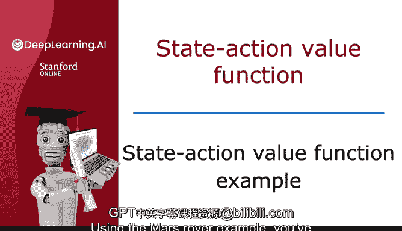
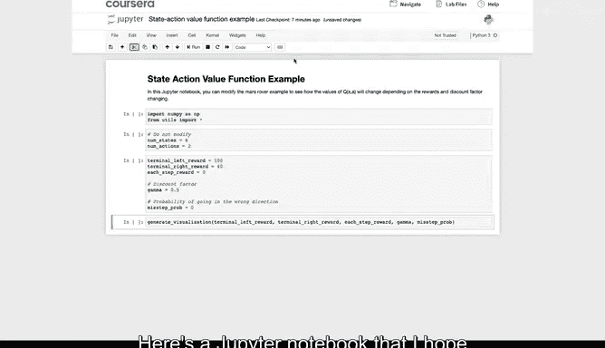
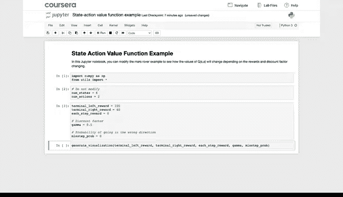
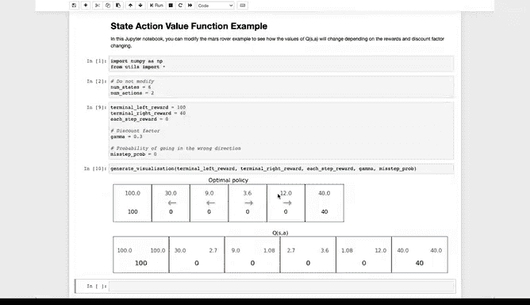

# 140：状态-动作价值函数示例 🚀

在本节课中，我们将通过一个火星车示例，深入探讨状态-动作价值函数 Q(s, a) 的数值变化。我们将直观地理解强化学习问题中，奖励和折扣因子如何影响 Q 函数的值、最优回报以及最优策略。课程最后提供了一个可选实验，供你动手调整参数并观察结果。

---

上一节我们介绍了状态-动作价值函数 Q(s, a) 的基本概念。本节中，我们来看看一个具体的火星车示例，通过调整参数来观察 Q 函数如何变化。

我们使用一个 Jupyter Notebook 来演示。代码中定义了两个动作和多个状态，并设置了终端奖励。左侧终端的奖励为 100，右侧终端的奖励初始为 40，中间状态的奖励为 0。折扣因子 γ 初始设为 0.5。我们暂时忽略“失误概率”，后续视频会讨论它。





运行以下代码，可以计算并可视化最优策略以及 Q 函数 Q(s, a)：

```python
# 初始化参数
num_states = 6
num_actions = 2
terminal_left_reward = 100
terminal_right_reward = 40
gamma = 0.5
```

目前你无需关心计算 Q(s, a) 的具体算法，只需关注其输出值。这些值与课程中展示的是一致的。

现在，有趣的部分开始了。我们可以修改一些参数，观察 Q(s, a) 如何随之改变。



首先，我将右侧终端的奖励修改为一个更小的值，例如 10：

```python
terminal_right_reward = 10
```

重新运行代码后，观察 Q(s, a) 的变化。例如，在状态 5：
*   选择向左并在之后采取最优行为，得到的回报是 6.25。
*   选择向右并在之后采取最优行为，得到的回报仅为 5。

当右侧奖励变得很小（只有 10）时，即使你离它很近，最优策略也变成了从所有状态都向左移动。

接下来，我们进行其他调整。将右侧终端奖励恢复为 40，但将折扣因子 γ 改为 0.9：

```python
terminal_right_reward = 40
gamma = 0.9
```

折扣因子越接近 1，表示智能体越“有耐心”，更愿意为了未来的高回报等待更久，因为未来的奖励不会被大幅折现（乘以 0.5 的高次幂，而是乘以 0.9 的高次幂）。

重新运行代码后，观察 Q(s, a) 的变化。现在在状态 5，向左移动的回报是 65.61，高于向右的回报 36。值得注意的是，36 正好是 0.9 乘以终端奖励 40，这些数值是合理的。当智能体更有耐心时，即使在状态 5，它也会选择向左。

现在，让我们将 γ 改为一个更小的数，比如 0.3：

```python
gamma = 0.3
```

这表示对未来奖励进行大幅折现，智能体会变得“极其没有耐心”。重新运行代码，行为再次改变。注意，现在在状态 4，智能体没有耐心去争取更大的 100 奖励，因为折扣因子 γ 太小（0.3）。它宁愿选择更近的、只有 40 的奖励。

以下是你可以尝试调整的核心参数及其影响：
*   **终端奖励**：直接影响目标的价值。
*   **折扣因子 γ**：控制智能体对未来奖励的重视程度。γ 越大，越有耐心；γ 越小，越短视。

我希望你能通过自己动手调整这些数值并运行代码，获得以下直观感受：
1.  Q(s, a) 的值如何随参数变化。
2.  最优回报（即 Q(s, a) 两个值中较大的那个）如何变化。
3.  最优策略如何随之改变。

因此，我鼓励你去完成这个可选实验，尝试修改奖励函数和折扣因子 γ，观察 Q(s, a) 的值、不同状态下的最优回报以及最优策略如何随这些不同值而变化。



通过动手实践，你将能更深刻地理解在强化学习应用中，这些不同的量是如何受到奖励设置等因素影响的。

在你完成实验后，我们将准备好回来讨论可能是强化学习中最重要的一个方程——**贝尔曼方程**。希望你在可选实验中玩得开心，之后让我们一起来学习贝尔曼方程。

---

本节课中我们一起学习了如何通过火星车示例来探索状态-动作价值函数 Q(s, a)。我们通过调整终端奖励和折扣因子，直观地观察了 Q 值、最优回报和最优策略的动态变化，这为理解强化学习智能体的决策过程奠定了坚实的基础。