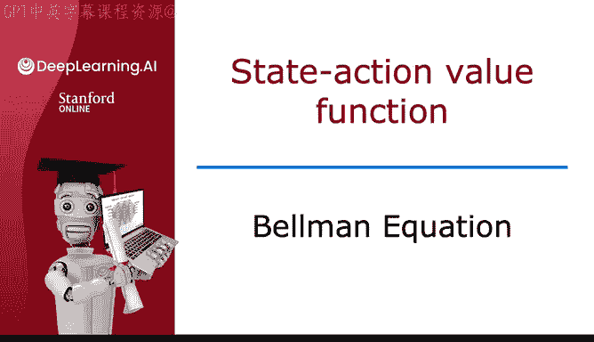
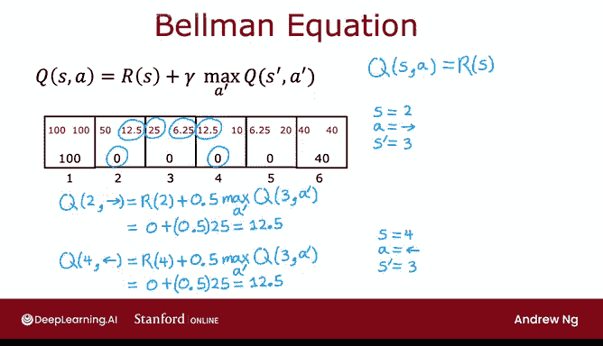
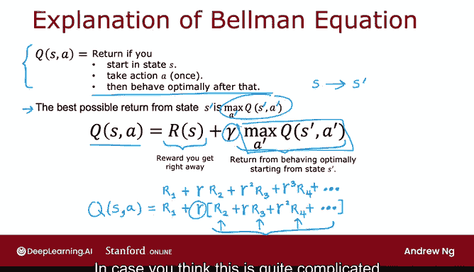
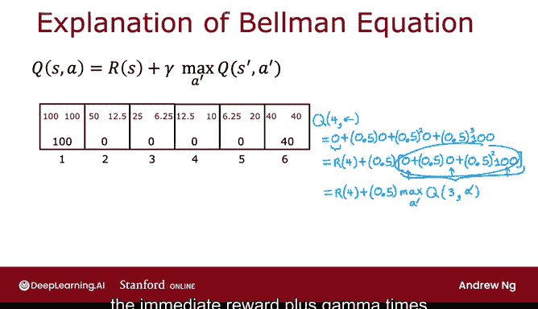

# 141：36_03_03_贝尔曼方程 🧠

## 概述
在本节课中，我们将要学习强化学习中的一个核心概念——贝尔曼方程。这个方程为我们提供了一种计算状态-动作价值函数 Q(s, a) 的方法，从而帮助我们找到从每个状态出发的最佳动作。

## 状态-动作价值函数回顾
上一节我们介绍了状态-动作价值函数 Q(s, a) 的定义。它表示从状态 s 出发，采取动作 a **一次**，然后在此之后**始终采取最优行为**所能获得的总回报。

如果我们可以计算出 Q(s, a)，那么从任何状态选择最佳动作就变得很简单：只需选择能使 Q(s, a) 值最大的动作 a。

**核心问题**：如何计算这些 Q(s, a) 值？在强化学习中，有一个关键方程可以帮助我们解决这个问题，那就是贝尔曼方程。

## 贝尔曼方程介绍
为了描述贝尔曼方程，我们首先需要明确一些符号定义：
*   **s**：表示当前状态。
*   **r(s)**：表示当前状态 s 的即时奖励。例如，在我们的 MDP 示例中，r(状态1) = 100，r(状态2) = 0，r(状态6) = 40。
*   **a**：表示在当前状态 s 下采取的动作。
*   **s‘**：表示在执行动作 a 后到达的新状态。例如，从状态4执行动作“左”，会到达状态3。
*   **a’**：表示在到达新状态 s‘ 后可能采取的动作。

符号约定是：s 和 a 对应当前状态和动作，而加上撇号（‘）的 s’ 和 a‘ 则对应下一个状态和动作。

以下是贝尔曼方程的核心公式：

**Q(s, a) = r(s) + γ * max[a‘] Q(s‘, a‘)**

这个公式包含了很多信息，让我们先通过几个例子来理解它，然后再探讨其背后的原理。

## 贝尔曼方程应用示例
让我们通过具体例子来应用贝尔曼方程。

**示例一：计算 Q(状态2, 动作右)**
假设当前状态是2，动作是“右”。
*   执行“右”动作后到达的新状态 s‘ 是状态3。
*   根据贝尔曼方程：
    Q(2, 右) = r(2) + γ * max[a‘] Q(3, a‘)
*   已知：r(2) = 0，折扣因子 γ = 0.5。
*   状态3有两个可能的Q值：Q(3, 左) = 25，Q(3, 右) = 6.25。因此 max[a‘] Q(3, a‘) = 25。
*   计算：Q(2, 右) = 0 + 0.5 * 25 = 12.5。

这个结果与我们之前计算的 Q(2, 右) 值一致。

**示例二：计算 Q(状态4, 动作左)**
假设当前状态是4，动作是“左”。
*   执行“左”动作后到达的新状态 s‘ 同样是状态3。
*   根据贝尔曼方程：
    Q(4, 左) = r(4) + γ * max[a‘] Q(3, a‘)
*   已知：r(4) = 0，γ = 0.5。
*   max[a‘] Q(3, a‘) 仍然是 25。
*   计算：Q(4, 左) = 0 + 0.5 * 25 = 12.5。

因此，Q(4, 左) 也等于 12.5。

**关于终止状态的说明**：如果当前状态是终止状态（如状态1或6），那么没有下一个状态 s‘，贝尔曼方程简化为 Q(s, a) = r(s)。这就是为什么终止状态的 Q 值直接等于其奖励值（100 或 40）。

你可以暂停视频，尝试将贝尔曼方程应用到其他状态-动作对上，验证计算结果。

## 贝尔曼方程的直观理解
现在，让我们深入理解贝尔曼方程背后的逻辑。

首先，回顾一下 Q(s, a) 的定义：从状态 s 出发，采取动作 a，然后最优行动所获得的总回报。这个总回报是由一系列随时间衰减的奖励之和计算得出的：

总回报 = R1 + γ * R2 + γ² * R3 + ...

贝尔曼方程将这个总回报序列分解为两个部分：

1.  **即时奖励 r(s)**：这是在状态 s 执行动作 a 后**立刻**获得的奖励（即 R1）。
2.  **未来回报的折现值**：到达新状态 s‘ 后，从该状态开始**未来**所有奖励总和的折现值。

更具体地说，方程中的 **max[a‘] Q(s‘, a‘)** 正是从新状态 s‘ 出发，采取最优策略所能获得的最佳总回报。而乘以折扣因子 γ，则表示这个未来回报在当前时刻的价值。

**核心直觉**：在强化学习中，从当前状态获得的总回报，等于“立即得到的奖励”加上“从下一个状态开始所能获得的最佳未来回报的折现值”。这就是贝尔曼方程的精髓。

为了更清晰地建立联系，让我们再看一个例子：Q(4, 左) = 12.5。
*   这个总回报 12.5 来自于奖励序列：在状态4得0，在状态3得0，在状态2得0，最后在状态1得100，并经过折扣计算（0.5² * 100 = 25，再乘以一个γ得到12.5）。
*   贝尔曼方程将其分解为：
    *   第一部分：r(4) = 0（即时奖励）。
    *   第二部分：γ * (从状态3开始的最佳回报)。从状态3开始的最佳回报正是 max[Q(3, 左), Q(3, 右)] = 25。
    *   因此，0 + 0.5 * 25 = 12.5。

我知道贝尔曼方程是一个有些复杂的方程。如果你觉得理解起来有困难，不必过于担心。只要掌握如何应用这个方程，你就能让后续的强化学习算法正确工作。我希望你至少能从高层次上理解“将总回报分解为即时奖励与未来回报”这一核心思想是合理的。

## 总结
本节课我们一起学习了强化学习中的关键工具——贝尔曼方程。
*   我们回顾了状态-动作价值函数 Q(s, a) 的作用。
*   我们引入了贝尔曼方程的公式：**Q(s, a) = r(s) + γ * max[a‘] Q(s‘, a‘)**。
*   我们通过具体示例演示了如何应用该方程进行计算。
*   最后，我们探讨了方程背后的直观理解：总回报是即时奖励与折现后的未来最佳回报之和。

在接下来的课程中，我们将基于贝尔曼方程来开发实际的强化学习算法。在进入算法部分之前，有一个关于随机马尔可夫决策过程的可选视频，介绍了当动作执行效果具有随机性时的应用，你可以选择观看。之后，我们将正式开始构建强化学习算法。