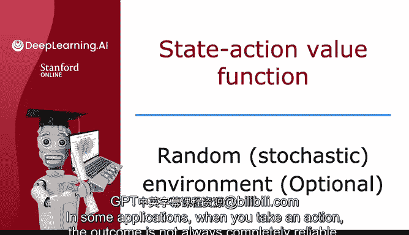
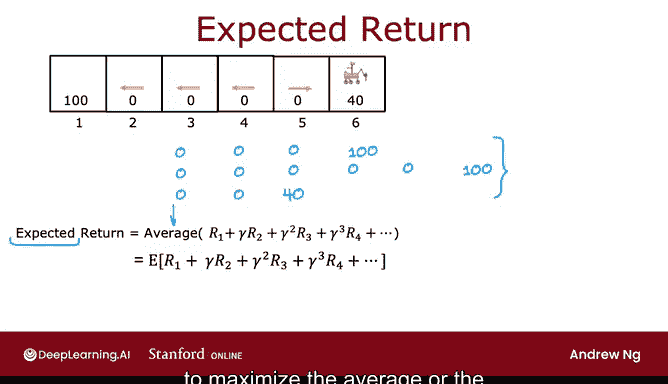
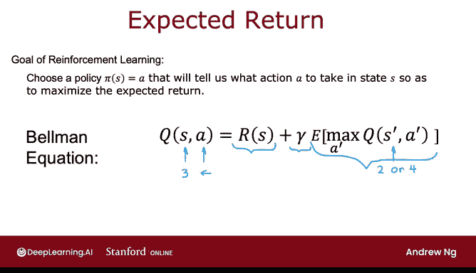
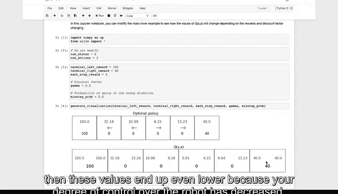

# 142：37_03_04 随机环境（可选）🎲

在本节课中，我们将学习强化学习在**随机环境**中的应用。我们将探讨当机器人的行动结果不完全确定时，如何建模和优化其行为策略。

---

## 概述

在之前的课程中，我们假设机器人在执行一个动作后，会确定性地转移到下一个状态。然而，在实际应用中，由于各种不确定因素（如地面打滑、风力影响），行动的结果往往是随机的。本节将介绍如何将强化学习框架扩展到这种**随机环境**中。

---

## 随机环境示例

上一节我们介绍了确定性环境下的马尔可夫决策过程，本节中我们来看看当环境变得随机时会发生什么。

在某些应用中，当你采取一个行动时，结果并不总是完全可靠的。例如，如果你命令你的火星车向左移动，可能因为地面有小石子或非常滑，它打滑并朝错误的方向移动。在实践中，许多机器人并不总是能完全按照你的指令行动，因为有风吹离航线或地面打滑等原因。因此，我们之前讨论的强化学习框架有一个推广，用于建模随机或**随机环境**。

继续我们简化的火星车示例，假设你采取行动并命令它向左移动。大多数时候它会成功，但如果有10%或0.1的概率，它实际上意外打滑并朝相反方向移动。

因此，如果你命令它向左移动，它有90%（即0.9）的概率正确向左移动，但有0.1的概率实际上向右移动。在这个例子中，它有90%的概率最终到达状态3，10%的概率到达状态5。

相反，如果你命令它向右移动并采取向右的行动，它有0.9的概率最终到达状态5，0.1的概率到达状态3。这就是一个**随机环境**的例子。

---

## 随机环境下的策略执行

让我们看看在这个强化学习问题中会发生什么。

假设你使用这里显示的策略，在状态2、3和4时向左移动，在状态5时尝试向右移动。如果你从状态4开始并遵循这个策略，那么你访问的实际状态序列可能是随机的。

例如，在状态4，你将向左移动，也许你有点幸运，它确实到达了状态3。然后你告诉它再次向左移动，也许它确实到达了那里。你告诉它再次向左移动，它到达了那个状态。如果发生这种情况，你最终会得到奖励序列 `0, 0, 0, 100`。

但是，如果你第二次尝试完全相同的策略，也许你第二次的运气稍差一些。你从这里开始，直到向左移动，假设它成功了，所以从状态4得到0，从状态3得到0。在这里，你试图向左移动，但这次你不走运，机器人打滑并最终回到了状态4。然后你告诉它向左移动，然后向左，然后向左，最终得到100的奖励。在这种情况下，这将是你观察到的奖励序列，因为你从4到3，回到4，再到3，2，然后1。

甚至有可能，如果你从状态4开始，遵循策略向左移动，你可能在第一步就不走运，最终到达了状态5，因为它打滑了。然后在状态5，你命令它向右移动，它成功了，你最终到达这里。在这种情况下，你看到的奖励序列将是 `0, 0, 40`，因为你从4到5，然后到状态6。

---

## 期望回报

我们之前将**回报**写为这些折后奖励的总和。但是，当强化学习问题是随机的时，你并不能确定地看到一个奖励序列，相反，你会看到不同的奖励序列。

因此，在一个随机强化学习问题中，我们感兴趣的不是最大化回报，因为那是一个随机数。我们感兴趣的是最大化折后奖励总和的**平均值**。这里的“平均值”指的是，如果你将你的策略尝试一千次、一万次或一百万次，你会得到许多像那样的不同奖励序列。如果你对所有不同序列的这个折后奖励总和取平均值，那么这就是我们所说的**期望回报**。

在统计学中，术语“期望”只是“平均”的另一种说法。但这意味着我们想要最大化我们预期平均获得的折后奖励总和。其数学符号表示如下：

**公式：** `E[R1 + γR2 + ...]`

其中 `E` 表示期望值。

因此，强化学习算法的工作是选择一个策略 `π`，以最大化折后奖励的平均值或期望总和。

---

## 总结与贝尔曼方程

综上所述，当你有一个随机强化学习问题或一个随机马尔可夫决策过程时，目标是选择一个策略，以决定在状态 `S` 下采取什么行动 `A`，从而最大化期望回报。

这与我们之前讨论的内容的最后一个不同之处在于，它稍微修改了贝尔曼方程。

这是我们之前写下的贝尔曼方程，但现在不同之处在于，当你采取行动 `A` 和状态 `S` 时，你到达的下一个状态 `S'` 是随机的。当你在状态 `S` 并尝试向左移动时，下一个状态 `S'` 可能是状态2，也可能是状态4。因此，`S'` 现在是随机的，这也是为什么我们在这里也放了一个平均算子或期望算子。

所以我们说，从状态 `S` 采取一次行动 `A` 并以最优方式行事的**总回报**，等于你立即获得的奖励（也称为即时奖励），加上折现因子 `γ`，再加上你预期平均获得的未来回报。

---

## 实验与影响

如果你想加深对这些随机强化学习问题的直觉，可以回到我刚才展示的可选实验。其中参数 `misstep_prob`（失误概率）是你的火星车朝你命令的相反方向移动的概率。

如果我们设置 `misstep_prob` 为 0.1 并执行笔记本，那么这里的数字就是**最优回报**。如果你采取最佳可能的行动，采取这个最优策略，但机器人有10%的时间步向错误方向。这些就是这个随机MDP的Q值。

请注意，这些值现在略低一些，因为你无法像以前那样好地控制机器人。Q值以及最优回报都下降了一点。事实上，如果你增加失误概率，比如有40%的时间机器人甚至不朝你命令的方向移动，只有60%的时间它按照你的指示移动，那么这些值最终会更低，因为你对机器人的控制程度降低了。

因此，鼓励你使用可选实验，改变失误概率的值，看看它如何影响最优回报或最优期望回报，以及Q值 `Q(S, A)`。

---

## 展望

到目前为止，我们所做的一切都在使用这个马尔可夫决策过程，即这个只有六个状态的火星车。对于许多实际应用，状态数量会大得多。下一个视频将把我们目前讨论的强化学习或马尔可夫决策过程框架，推广到更丰富、可能更有趣的问题集，这些问题的状态空间更大，特别是具有**连续状态空间**。让我们在下一个视频中看看这个。

---

## 本节课总结

在本节课中，我们一起学习了：
1.  **随机环境**的概念：行动结果不确定，由概率分布决定。
2.  随机环境下的策略执行会产生不同的状态和奖励序列。
3.  强化学习在随机环境中的目标是最大化**期望回报**，即所有可能奖励序列的平均折后奖励总和。
4.  随机环境修改了贝尔曼方程，需要引入期望算子 `E` 来计算未来回报的平均值。
5.  环境随机性（如失误概率）会降低对系统的控制度，从而导致最优回报和Q值下降。

通过理解随机环境，我们为处理更复杂、更贴近现实的强化学习问题奠定了基础。