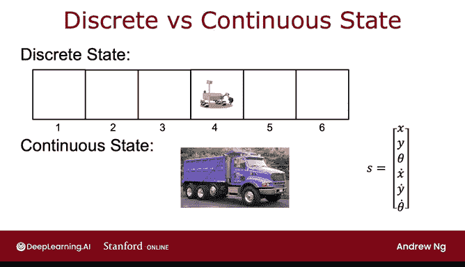

# 143：连续状态空间应用示例 🚀

在本节课中，我们将学习什么是连续状态空间，以及如何将之前讨论的概念推广到这种连续状态空间中。我们将通过对比简化的火星车例子，理解离散状态与连续状态的区别，并探讨在机器人控制（如汽车、直升机）和模拟登月器等实际应用中，状态是如何被定义的。

---


在上一节中，我们讨论了具有离散状态空间的马尔可夫决策过程。本节中，我们来看看当状态空间是连续时的情况。

许多机器人控制应用，包括你在实践实验室中操作的登月器应用，都拥有连续的状态空间。

这意味着，与之前简化的火星车例子（它只能处于六个可能位置之一）不同，大多数机器人可以处于无数个连续值位置中的任何一个。

例如，假设火星车可以在一条线上任意移动，其位置由一个介于0到6公里之间的数字表示，那么任何中间数字都是有效的。这就是一个连续状态空间的例子，因为位置可以由诸如2.7公里或4.8公里这样的数字表示。

---

## 汽车控制示例 🚗

让我们看另一个例子。我将使用控制汽车或卡车的应用作为示例。

如果你正在构建一辆自动驾驶汽车或卡车，并希望控制其平稳行驶，那么这辆卡车的状态可能包括几个数字。

假设卡车保持在平面上行驶，你或许不需要担心它的高度。因此，状态可能包括其x位置、y位置、方向角θ，以及它在x方向的速度、在y方向的速度和转弯的角速度。

以下是卡车状态向量的构成：

```
状态 s = [x, y, θ, ẋ, ẏ, θ̇]
```

其中：
*   **x, y** 是位置坐标。
*   **θ** 是方向角（例如，0到360度之间）。
*   **ẋ, ẏ** 分别是x和y方向的速度。
*   **θ̇** 是角速度（即方向角变化的快慢）。

对于之前六状态的火星车例子，状态只是六个可能数字中的一个。而对于汽车，状态由这个六维向量构成，其中每个数字都可以在其有效范围内取任意值。

---

## 直升机控制示例 🚁

接下来，我们看一个更复杂的例子。如果你正在构建一个强化学习算法来控制一架自主直升机，你该如何描述直升机的位置呢？



直升机的位置包括其x位置（例如，南北方向）、y位置（东西方向）以及z位置（离地高度）。

但除了位置，直升机还有朝向。传统上，可以用三个额外的数字来捕捉这个朝向：横滚角（向左或向右倾斜）、俯仰角（向前或向后倾斜）和偏航角（指南针方向，如面向北或东）。

此外，要控制直升机，我们还需要知道它在x、y、z方向上的速度，以及它的角速度（即横滚、俯仰、偏航变化的速率）。

因此，用于控制自主直升机的状态实际上是以下12个数字的列表：

```
状态 s = [x, y, z, φ, θ, ψ, ẋ, ẏ, ż, φ̇, θ̇, ψ̇]
```

其中：
*   **x, y, z** 是位置坐标。
*   **φ, θ, ψ** 分别是横滚角、俯仰角、偏航角（常用希腊字母表示）。
*   **ẋ, ẏ, ż** 是线速度。
*   **φ̇, θ̇, ψ̇** 是角速度。

策略的工作就是观察这12个数字，并决定对直升机采取什么适当的行动。

---

## 连续状态MDP的核心概念 📊

在连续状态强化学习问题，或称连续状态马尔可夫决策过程中，问题的状态不再只是少数几个可能的离散值（如1到6的数字），而是一个数字向量，其中每个分量都可以取大量可能值中的任何一个。

在本周的实践实验室中，你将亲自实现一个强化学习算法，并将其应用于模拟的登月器应用（在模拟中让某个物体在月球着陆）。

---

本节课中，我们一起学习了连续状态空间的概念。我们了解到，与离散状态不同，在机器人等实际应用中，状态通常由多个连续变量构成的向量来描述，例如汽车的位置、速度和朝向，或直升机更复杂的空间姿态与运动状态。这为策略函数提供了更丰富但也更复杂的输入信息。在接下来的视频中，我们将具体看看登月器这个连续状态应用包含了哪些内容。