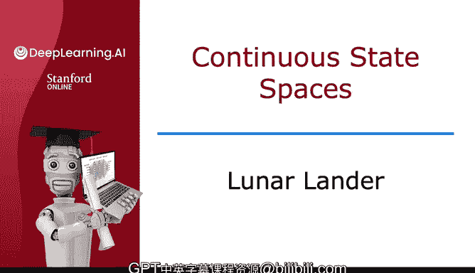
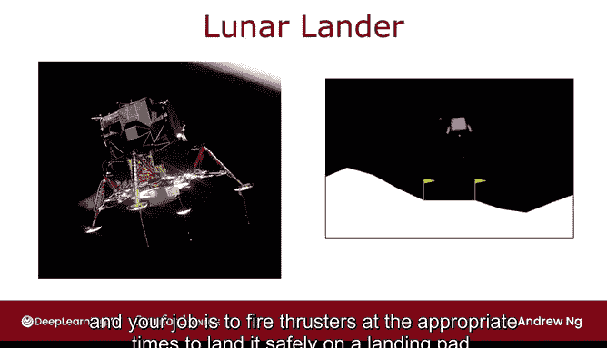
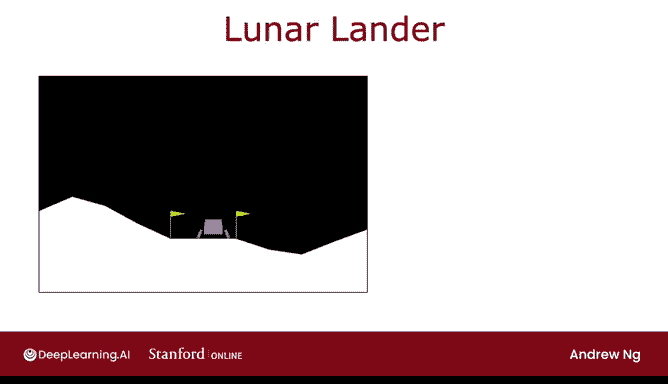
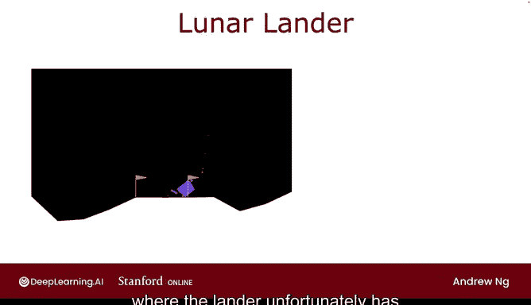
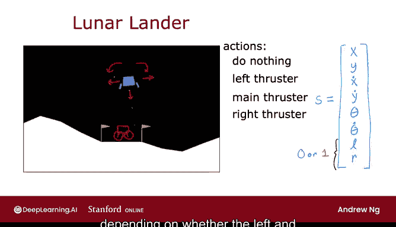
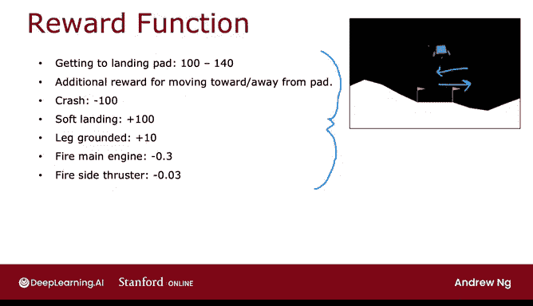
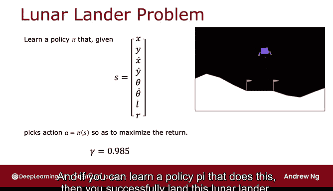

# 144：月球着陆器环境介绍 🚀

在本节课中，我们将学习一个经典的强化学习应用环境——月球着陆器。我们将了解这个模拟任务的目标、状态空间、动作空间以及奖励函数的设计。

月球着陆器让你操控一个模拟飞行器在月球上着陆。它类似于一个基础视频游戏，并被许多强化学习研究者广泛使用。接下来，我们具体看看这个应用。

## 任务目标 🎯

在这个应用中，你操控一艘正在快速接近月球表面的着陆器。你的任务是在适当的时机点燃推进器，使其安全降落在指定着陆台上。

为了让你直观感受，下图展示了月球着陆器成功着陆的过程。它通过向下、向左或向右喷射推进器来调整姿态，最终降落在两个黄色旗帜之间。

如果强化学习算法策略表现不佳，着陆器可能会坠毁在月球表面，如下图所示。

## 动作空间 🕹️

上一节我们介绍了任务目标，本节中我们来看看智能体可以执行哪些动作。

在每个时间步，你有四种可能的动作选择：
*   **无操作**：不执行任何动作，惯性和重力会将你拉向月球表面。
*   **点燃左侧推进器**：你会看到左侧出现一个小红点，这个动作倾向于将着陆器推向右侧。
*   **点燃主引擎**：点燃底部的向下主引擎。
*   **点燃右侧推进器**：这个动作会点燃右侧推进器，将你推向左侧。

为了简化描述，我们有时会将动作称为：
*   **nothing**：无操作
*   **left**：点燃左侧推进器
*   **main**：点燃主引擎
*   **right**：点燃右侧推进器

你的任务是持续选择动作，以使着陆器安全降落在着陆台的两个旗帜之间。

## 状态空间 📊

了解了动作之后，我们来看看环境如何描述着陆器的状态。

状态 `S` 是一个包含8个变量的向量：
1.  **位置 x**：水平方向（左/右）的位置。
2.  **位置 y**：垂直方向（高度）的位置。
3.  **速度 x_dot**：水平方向的速度。
4.  **速度 y_dot**：垂直方向的速度。
5.  **角度 theta**：着陆器向左或向右倾斜的角度。
6.  **角速度 theta_dot**：角度变化的速度。
7.  **左腿触地 L**：一个二进制值（0或1），表示左支撑腿是否接触地面。
8.  **右腿触地 R**：一个二进制值（0或1），表示右支撑腿是否接触地面。

其中，`x`, `y`, `x_dot`, `y_dot`, `theta`, `theta_dot` 是连续数值，而 `L` 和 `R` 是二元变量。引入 `L` 和 `R` 是因为着陆器细微的位置差异对其是否成功着陆影响很大。

## 奖励函数 ⚖️

定义了状态和动作，我们需要一个奖励函数来引导智能体学习正确的行为。

月球着陆器的奖励函数设计如下：
*   **成功着陆奖励**：如果成功降落在着陆台上，根据其飞行和抵达着陆台中心的精确程度，获得 **+100 到 +140** 的奖励。
*   **移动奖励**：根据其靠近或远离着陆台的程度给予额外奖励。靠近获得**正奖励**，远离获得**负奖励**。
*   **坠毁惩罚**：如果坠毁，获得 **-100** 的大额惩罚。
*   **软着陆奖励**：如果实现软着陆（非坠毁），获得 **+100** 奖励。
*   **腿部触地奖励**：每有一条支撑腿（左腿或右腿）触地，获得 **+10** 奖励。
*   **燃料消耗惩罚**：为了鼓励节约燃料，避免不必要的推进器点火：
    *   每次点燃主引擎，获得 **-0.3** 奖励。
    *   每次点燃左侧或右侧推进器，获得 **-0.03** 奖励。

这是一个中等复杂度的奖励函数。月球着陆器应用的设计者经过深思熟虑，将期望的行为（如安全着陆、节约燃料）和不期望的行为（如坠毁）编码在奖励函数中。

当你构建自己的强化学习应用时，通常也需要仔细思考并明确指定你期望和不期望的行为，并将其编码到奖励函数中。不过，设计奖励函数通常比为每一个可能的状态指定精确的正确动作要容易得多，后者在许多强化学习应用中要困难得多。

## 问题定义与目标 🎯

综合以上信息，月球着陆器问题的正式定义如下：

我们的目标是学习一个策略 `π`，当给定一个状态 `S` 时，该策略能选择一个动作 `a`，即：
**`a = π(S)`**

其目标是最大化**回报**，即折扣奖励的总和：
**`G = R_1 + γR_2 + γ^2R_3 + ...`**

通常对于月球着陆器，我们使用一个相当大的折扣因子 `γ`，其值设为 **0.985**，非常接近 1。

如果你能学习到一个实现此目标的策略 `π`，那么你就成功地让这艘月球着陆器安全着陆了。

这是一个令人兴奋的应用！现在，我们终于准备好开发学习算法了。该算法将利用神经网络和深度学习来得出一个能让月球着陆器着陆的策略。让我们进入下一个视频，开始学习深度强化学习。

## 总结 📝

本节课中，我们一起学习了月球着陆器强化学习环境。我们明确了任务目标是安全降落在指定区域，定义了四个基本动作，了解了由位置、速度、角度和腿部触地状态构成的八维状态空间，并分析了精心设计的奖励函数如何引导智能体学习安全、高效着陆的行为。最后，我们将问题形式化为学习一个最大化折扣回报的策略 `π`，为后续引入深度强化学习算法解决此问题奠定了基础。