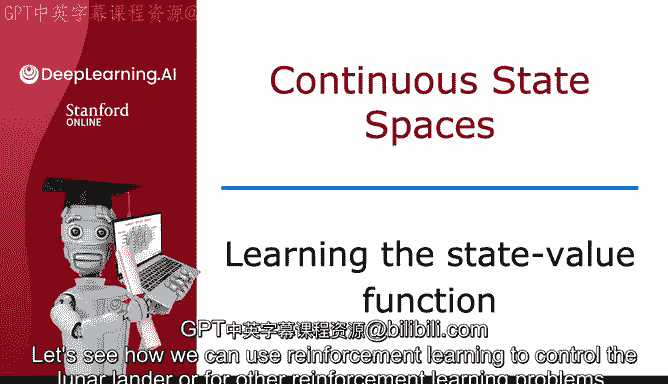
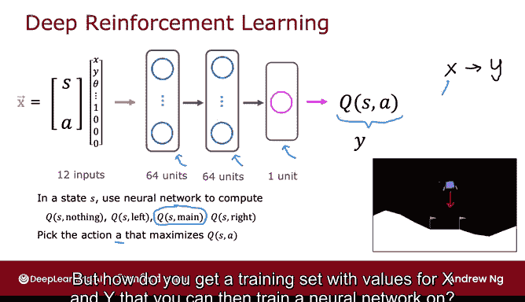
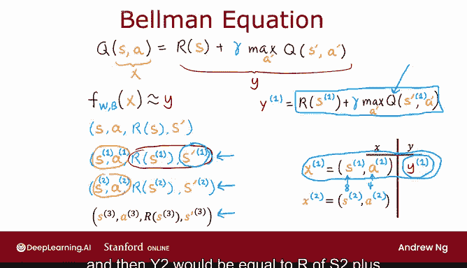
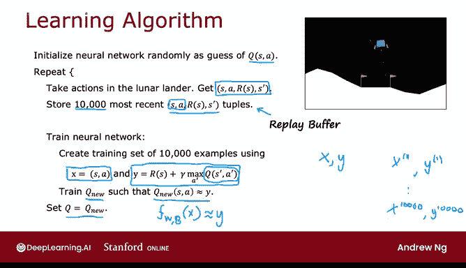

# 145：学习状态价值函数 🧠

在本节课中，我们将学习如何使用强化学习来控制“月球着陆器”或其他强化学习问题。核心思想是训练一个神经网络来计算或近似状态-动作价值函数 **Q(S, A)**，从而帮助我们选择最佳动作。

## 神经网络近似 Q 函数

上一节我们介绍了强化学习的目标。本节中我们来看看如何具体实现。关键在于训练一个神经网络，其输入是当前状态 **S** 和当前动作 **A**，输出是 **Q(S, A)** 的近似值。

具体到月球着陆器任务，状态 **S** 是之前提到的8个数字的列表（如位置、速度、角度等）。动作 **A** 有四种可能：无操作、左推进器、主引擎、右推进器。我们可以使用独热编码（one-hot）来表示这四种动作。

因此，神经网络的输入 **X** 是一个包含12个数字的向量（8个状态值 + 4个动作编码）。这个向量将被送入一个神经网络，例如，第一隐藏层有64个单元，第二隐藏层有64个单元，输出层有一个单元。

神经网络的输出就是 **Q(S, A)** 的近似值。我们也可以将这个目标值称为 **Y**。请注意，强化学习与监督学习不同：这里我们输入的是状态-动作对 **(S, A)**，目标是输出一个标量值 **Q(S, A)**，而不是直接输出一个动作。

一旦我们训练好这个神经网络，当着陆器处于某个状态 **S** 时，我们就可以用网络分别计算四个动作对应的 **Q(S, A)** 值，然后选择值最高的那个动作来执行。

## 如何训练神经网络：贝尔曼方程与训练集构建

那么，如何训练神经网络来输出准确的 **Q(S, A)** 呢？方法是利用贝尔曼方程来创建包含大量样本 **(X, Y)** 的训练集，然后像在监督学习中训练神经网络一样，学习从 **X** 到 **Y** 的映射。

以下是构建训练集的具体步骤：

首先，我们回顾贝尔曼方程：
**Q(S, A) = R(S) + γ * maxA' Q(S', A')**

方程的右边就是我们希望 **Q(S, A)** 等于的值，我们将其设为目标值 **Y**。神经网络的输入 **X** 就是状态-动作对 **(S, A)**。

为了获得训练数据，我们让智能体（如月球着陆器）在环境中尝试各种动作（可以是随机的）。每次尝试都会产生一个四元组经验：**(S, A, R(S), S')**，即“在状态 **S** 下采取动作 **A**，获得了即时奖励 **R(S)**，并转移到了新状态 **S'**”。

收集到大量这样的经验元组后，我们可以用每一个来构建一个训练样本 **(X, Y)**：
*   **X** = **(S, A)** （将状态和动作编码合并）
*   **Y** = **R(S) + γ * maxA' Q(S', A')**

你可能会问，计算 **Y** 时需要的 **Q(S', A')** 从哪里来？最初，我们并不知道真正的 **Q** 函数。我们可以从一个随机初始化的神经网络（即我们对 **Q** 函数的随机猜测）开始计算这个值。随着算法迭代，这个猜测会越来越准。

## 完整的 DQN 算法流程 🚀

上一节我们介绍了如何构建单个训练样本。本节中我们来看看如何将这些步骤整合成一个完整的算法——深度Q网络（Deep Q-Network, DQN）算法。

以下是算法的完整步骤：

1.  **初始化**：随机初始化神经网络 **Q** 的所有参数。这代表我们对 **Q** 函数的初始随机猜测。
2.  **收集经验**：让智能体在环境中（如月球着陆器模拟器）执行动作，可以是随机动作。将每次交互得到的经验元组 **(S, A, R, S')** 存储起来。通常我们只保留最近一定数量（例如10,000个）的经验，这个存储区称为“经验回放缓冲区”。
3.  **创建训练集**：从经验回放缓冲区中取出一批经验（例如10,000个）。对于每个经验 **(S, A, R, S')**，使用当前的 **Q** 网络来计算目标值 **Y**：
    **Y = R + γ * maxA' Q(S', A')**
    这样就得到了一个训练集，其中 **X = (S, A)**，**Y** 是计算出的目标值。
4.  **训练神经网络**：使用这个训练集，以监督学习的方式（如最小化均方误差）训练一个新的神经网络 **Q_new**，使其学会从 **X** 预测 **Y**。
5.  **更新网络**：将旧的 **Q** 网络参数更新为刚训练好的 **Q_new** 网络的参数，即令 **Q = Q_new**。
6.  **重复**：不断重复步骤2到5。

这个算法的核心思想是：通过贝尔曼方程，利用当前（可能不完美）的 **Q** 估计来生成更准确的目标值 **Y**，然后训练网络去拟合这些目标值。每次迭代，**Q** 网络的估计都会变得更准确一点，从而在下一次迭代中生成更好的目标值 **Y**。如此循环，**Q** 函数最终会收敛到一个较好的近似。

本节课中我们一起学习了 DQN 算法的基本原理。我们了解到，通过结合神经网络和贝尔曼方程，并利用经验回放机制，可以逐步学习出复杂环境中的状态-动作价值函数，从而为智能体找到优秀的决策策略。在接下来的课程中，我们将看到一些对此基础算法的改进，使其性能更加出色。