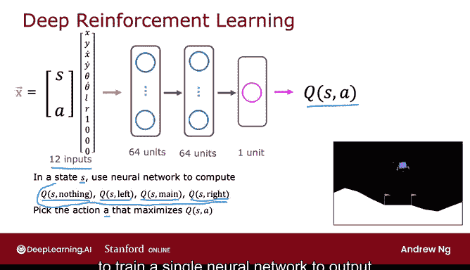
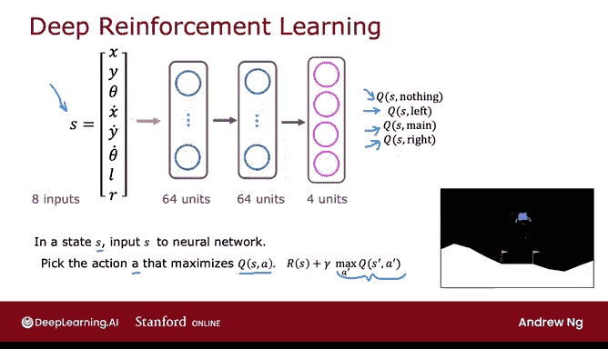

# 146：算法改进：优化的神经网络架构 🚀

在本节课中，我们将学习如何改进深度Q网络（DQN）的神经网络架构，使其计算效率更高。我们将探讨一种能够同时输出所有可能动作Q值的网络结构，并简要介绍即将学习的Epsilon贪婪策略。

## 从上一节的架构说起

上一节我们介绍了一种神经网络架构，它输入状态和动作，试图输出对应的Q函数值Q(s, a)。这种架构需要为每个状态单独进行多次推理来计算不同动作的Q值，效率较低。

## 更高效的架构设计

本节中我们来看看一种更高效的神经网络架构。事实证明，对网络结构进行一项改动可以大幅提升算法效率。因此，大多数DQN的实现实际上都采用了我们将在本视频中看到的这种更高效架构。

以下是这种架构的核心思路：与其训练一个网络来输出单个Q(s, a)值，不如训练一个神经网络来同时输出给定状态s下所有可能动作的Q值。

这是我们之前看到的神经网络架构。它输入12个数字（状态和动作的编码），输出Q(s, a)。每当我们处于某个状态s时，我们必须分别进行四次神经网络推理来计算这四个值，以便选择能给我们最大Q值的动作a。这效率很低，因为我们必须从每个单一状态进行四次推理。

相反，训练一个单一的神经网络来同时输出所有这四个值被证明是更高效的。

修改后的神经网络架构如下所示。

*   输入是8个数字，对应于登月器的状态。
*   然后数据经过神经网络，第一隐藏层有64个单元。
*   第二隐藏层有64个单元。
*   现在输出层有四个输出单元。神经网络的任务是让这四个输出单元分别输出：Q(s, “无操作”)、Q(s, “左”)、Q(s, “主引擎”)、Q(s, “右”)。

因此，神经网络的任务是同时计算当我们处于状态s时所有四个可能动作的Q值。

这被证明是更高效的，因为给定一个状态s，我们只需运行一次推理就能获得所有这四个值，然后可以非常快速地选择使Q(s, a)最大化的动作a。

您还会注意到，在贝尔曼方程中，有一个步骤我们必须计算 **max_{a'} Q(s', a')**。这个值乘以折扣因子γ，然后加上奖励R(s)。这个神经网络也使得计算这个最大值更加高效，因为我们同时获得了状态s'下所有动作a'的Q(s', a')值。这样，您就可以直接选取最大值来计算贝尔曼方程右侧的这个值。

对神经网络架构的这一改动使强化学习算法的效率大大提高，因此我们将在实践实验中使用这种架构。

## 过渡到策略改进

接下来，还有一个想法将对算法有很大帮助，它被称为Epsilon贪婪策略。这会影响您在学习过程中如何选择动作。让我们在下一个视频中看看这意味着什么。

## 本节总结

本节课中我们一起学习了如何优化DQN的神经网络架构。关键改进是将网络输出从单一动作的Q值改为一个状态s下所有可能动作的Q值向量。这种设计通过单次前向传播即可获得所有Q值，极大地提升了计算效率，特别是在执行动作选择和计算贝尔曼方程中的最大值时。在接下来的课程中，我们将学习Epsilon贪婪策略，以进一步改进智能体在探索与利用之间的平衡。