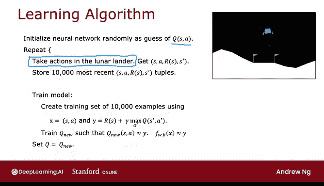
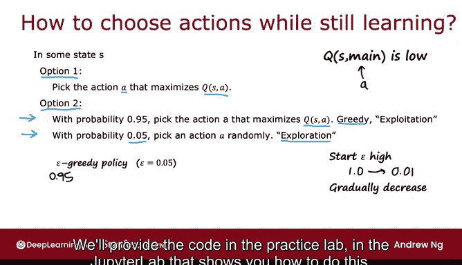

# 147：算法改进：贪婪策略 🚀

在本节课中，我们将学习强化学习算法中的一个重要改进策略——**ε-贪婪策略**。我们将探讨如何在算法学习过程中选择动作，以平衡“利用”已知知识和“探索”未知可能性，从而更有效地学习。


---

## 算法中的动作选择问题



上一节我们介绍了强化学习算法的基本框架。在本节中，我们来看看算法运行中的一个关键步骤：**如何在环境中采取行动**。

在算法运行过程中，即使我们仍在学习如何近似状态-动作价值函数 **Q(S, A)**，我们也需要在“月球着陆器”环境中采取行动。那么，在学习阶段，我们应如何选择这些动作呢？

最常见的方法是使用一种称为 **ε-贪婪策略** 的方法。让我们看看它是如何工作的。

## 动作选择方案对比

以下是两种不同的动作选择方案：

### 方案一：总是选择最优动作

一种自然的想法是，在状态 **S** 下，总是选择能最大化当前估计值 **Q(S, A)** 的动作 **A**。即使 **Q(S, A)** 的估计并不完美，我们也尽力而为，使用当前的最佳猜测。

```python
# 伪代码示例：总是选择最优动作
action = argmax_a(Q_network.predict(state))
```

这种方法可能有效，但并非最佳选择。

### 方案二：ε-贪婪策略

更常用的方法是 **ε-贪婪策略**。其核心思想是：
*   **大多数时候**（例如，95%的概率），我们选择能最大化 **Q(S, A)** 的动作（贪婪动作）。
*   **一小部分时间**（例如，5%的概率），我们**随机**选择一个动作。

```python
# 伪代码示例：ε-贪婪策略
import random

epsilon = 0.05  # 探索概率
if random.random() < epsilon:
    action = random.choice(all_possible_actions)  # 探索：随机选择
else:
    action = argmax_a(Q_network.predict(state))   # 利用：选择最优动作
```

## 为什么需要随机探索？

随机探索至关重要。假设由于随机初始化，神经网络错误地认为“启动主引擎”从来不是一个好主意（即 **Q(S, main)** 的初始值很低）。如果算法总是选择当前最优动作（方案一），它就**永远不会尝试**启动主引擎，因此也**永远无法学习**到在某些情况下启动主引擎实际上是个好主意。

通过方案二，我们在每一步都有一个小概率尝试不同的动作。这使得神经网络能够克服其自身可能存在的、关于“什么动作不好”的错误先入之见，并发现新的可能性。

## 探索与利用的权衡

在强化学习文献中，这被称为 **探索与利用的权衡**。
*   **探索**：尝试可能不是当前最佳的动作，以获取更多关于环境的信息。
*   **利用**：利用当前学到的知识，选择估计能带来最大回报的动作（即贪婪动作）。

ε-贪婪策略就是这个权衡的一种具体实现方式。历史上，选择贪婪动作有时也被称为 **利用步骤**。

## 关于名称与参数调整



需要指出的是，“ε-贪婪策略”这个名称可能有些令人困惑，因为算法在 **1-ε**（例如95%）的时间里是贪婪的，只在 **ε**（例如5%）的时间里进行探索。一个更准确的名称或许是“1-ε贪婪策略”，但历史原因使得“ε-贪婪策略”这个叫法被沿用下来。

此外，强化学习中一个常用的技巧是让 **ε 的值随时间衰减**：
*   **开始时**：设置较高的 ε（例如 1.0），进行大量随机探索，快速收集数据。
*   **逐渐地**：随着学习进行，逐步降低 ε（例如降至 0.01），更多地依赖不断改进的 **Q** 函数估计来选择好的动作。

## 强化学习的调参特点

与监督学习相比，强化学习算法通常对超参数的选择更为敏感。例如，在监督学习中，学习率设置得稍小，可能只是让训练时间变长几倍。而在强化学习中，如果 ε 或其他参数设置不当，学习时间可能会延长十倍甚至百倍。这使得调参过程有时更具挑战性。

不过，在配套的实践练习中，我们会提供一组经过验证的良好参数，帮助你成功实现月球着陆器的着陆。

---

## 总结

本节课我们一起学习了强化学习中的 **ε-贪婪策略**。我们了解到，为了有效学习，算法需要在**利用**当前最佳知识和**探索**未知可能性之间取得平衡。ε-贪婪策略通过以大概率选择最优动作、小概率随机选择动作的方式，巧妙地实现了这一平衡。我们还讨论了让探索概率 ε 随时间衰减的技巧，以及强化学习算法调参的一些特点。

在下一个可选视频中，我们将介绍另外两个算法改进：**小批量采样** 和 **软更新**。即使没有这些改进，当前的算法也能工作，但这些改进可以显著提升算法的运行速度和稳定性。