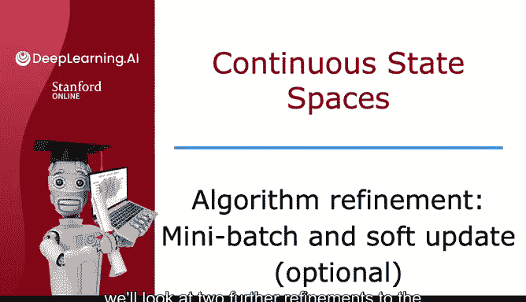
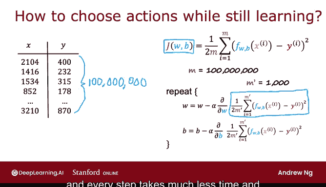
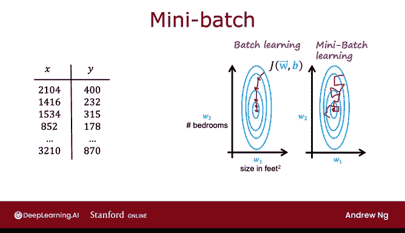
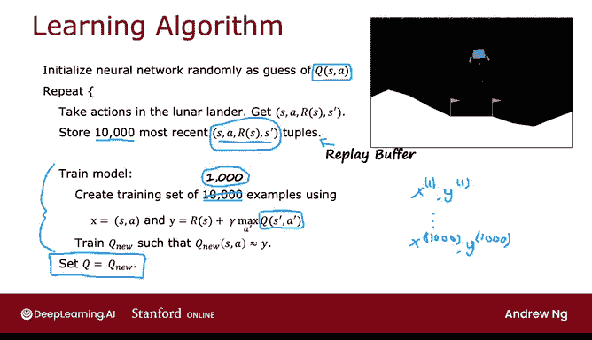
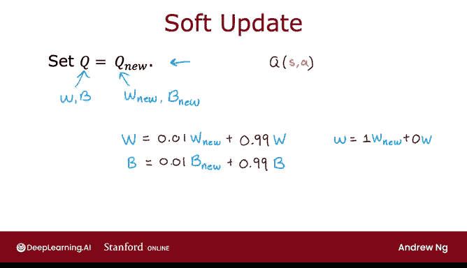

# 148：算法改进：小批量与软更新 🚀

在本节课中，我们将学习强化学习算法的两项重要改进：**小批量学习**与**软更新**。这两项技术能分别提升算法的训练速度和收敛稳定性。

---

## 小批量学习 📊

上一节我们介绍了基础的强化学习算法。本节中我们来看看如何通过小批量学习来加速训练过程。这个思想同样适用于监督学习，能显著提升如神经网络、线性回归等模型的训练效率。

在监督学习中，例如预测房价的线性回归模型，我们定义了成本函数 **J(W, B)**：

**J(W, B) = (1 / 2M) * Σ (ŷ - y)²**

梯度下降算法通过以下公式更新参数：

**W := W - α * (∂J(W, B) / ∂W)**
**B := B - α * (∂J(W, B) / ∂B)**

当训练集规模 **M** 非常庞大时（例如1亿个样本），每次梯度下降迭代都需要计算整个数据集的平均梯度，这将非常缓慢。

小批量梯度下降的核心思想是：**不每次使用全部数据，而是每次迭代只使用一个较小的子集（小批量）**。

以下是其工作原理：

*   **选择批量大小**：设定一个较小的数量 **M'**（例如1000），代替总样本数 **M**。
*   **修改成本函数**：每次迭代的成本函数变为基于 **M'** 个样本计算：**J(W, B) ≈ (1 / 2M') * Σ (ŷ - y)²**。
*   **迭代过程**：每次迭代随机选取不同的 **M'** 个样本进行梯度计算和参数更新。

与标准的批量梯度下降平稳地走向成本函数最小值不同，小批量梯度下降的路径是**有噪声但方向大致正确**的。虽然每一步可能不够精确，但**每一步的计算成本大大降低**，使得整体训练速度更快。

回到我们的强化学习算法，我们之前会将回放缓冲区中存储的大量 `(S, A, R, S')` 元组全部用于训练。应用小批量思想后，我们可以**每次只从缓冲区中随机抽取一个子集**（例如1000个）来训练神经网络。这会使每次训练更新略有噪声，但能**显著加快整体强化学习算法的运行速度**。

---

## 软更新 🔄

我们刚刚了解了如何用小批量加速训练。接下来，我们看看如何用“软更新”技术使算法收敛更稳定。

在之前的算法中，我们训练出一个新的Q网络 **Q_new** 后，会直接执行 **Q = Q_new**。这种硬替换可能带来问题：如果某次训练得到的 **Q_new** 质量不佳，甚至比旧的Q网络更差，那么这次更新就会直接损害当前对Q函数的估计。

软更新方法旨在**更平缓地更新Q网络的参数**，避免因单次不良更新导致性能骤降。

假设Q网络的参数为 **W** 和 **B**。训练后得到新参数 **W_new** 和 **B_new**。

*   **原始算法（硬更新）**：
    **W = W_new**
    **B = B_new**

*   **软更新算法**：
    **W = τ * W_new + (1 - τ) * W**
    **B = τ * B_new + (1 - τ) * B**

其中，**τ** 是一个很小的超参数（例如0.01）。这意味着每次更新，新参数值只以很小的比例（1%）融入现有参数，而现有参数保留了绝大部分（99%）的权重。

以下是软更新的关键点：

*   **控制更新幅度**：**τ** 控制了你向新值移动的激进程度。**τ=1** 时退化为硬更新。
*   **提升稳定性**：这种渐进式的更新方式使得强化学习算法**收敛更可靠**，减少了振荡或发散的可能性。

---

## 总结 🎯

本节课中我们一起学习了强化学习算法的两项改进：

1.  **小批量学习**：通过每次迭代只使用数据的一个子集进行训练，**大幅提升了算法速度**。这项技术对监督学习和强化学习都同样有效。
2.  **软更新**：通过渐进式地混合新旧网络参数（**W = τ * W_new + (1 - τ) * W**），取代直接的硬替换，使得算法的**收敛过程更加稳定可靠**。

结合这两项改进，你的强化学习算法将能更高效、更稳定地在“月球着陆器”等复杂挑战中学习，并成功完成任务。