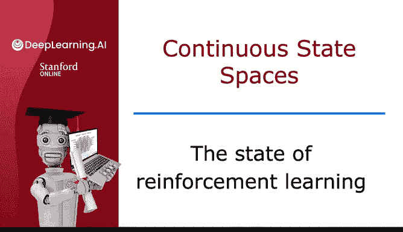

# 149：强化学习现状 🚀

在本节课中，我们将探讨强化学习这一激动人心的技术领域，并对其当前的实际应用现状、面临的挑战以及未来潜力进行客观分析。

---

## 强化学习概述与个人背景

强化学习是一系列令人兴奋的技术。

事实上，在我攻读博士学位期间，强化学习曾是我论文的研究主题。因此，我至今仍对这些想法感到兴奋。

尽管强化学习背后有强大的研究动力和热情，但我认为围绕它存在一些，有时甚至是大量的炒作。

因此，我希望做的是与大家分享一个实用的视角，了解强化学习目前在应用层面的效用究竟如何。

---

## 炒作的原因与模拟环境的局限性

围绕强化学习产生炒作的原因之一是，许多研究出版物都基于模拟环境。基于我在模拟环境和真实机器人两方面的工作经验，我可以告诉你，让强化学习算法在模拟环境或视频游戏中运行，远比在真实机器人上运行要容易得多。

许多开发者评论说，即使他们在模拟环境中取得了成功，要在现实世界或真实机器人上实现功能，其挑战性也令人惊讶。

因此，如果你将这些算法应用于实际应用，我希望你注意这一局限性，以确保你的成果能在实际应用中有效工作。

---

## 实际应用现状与对比

其次，尽管媒体对强化学习进行了大量报道，但如今强化学习的实际应用数量远少于监督学习和无监督学习。

如果你正在构建一个实际应用，你会发现监督学习和无监督学习有用或适合这项工作的概率，远高于你最终使用强化学习的概率。

我自己曾多次使用强化学习，特别是在机器人控制应用中。但在我日常的应用工作中，我最终使用监督学习和无监督学习的频率要高得多。

---

## 研究潜力与未来展望

目前，强化学习领域有许多激动人心的研究。我认为强化学习在未来应用中的潜力非常巨大。

强化学习仍然是机器学习的主要支柱之一。因此，将其作为一个框架，在你开发自己的机器学习算法时，我希望它能帮助你更有效地构建可运行的机器学习系统。

---

## 课程总结与寄语

我希望你喜欢本周关于强化学习的材料。特别是，我希望你能享受亲自让“月球着陆器”成功着陆的过程。

当你实现一个算法，然后看到因为你编写的代码，月球着陆器安全降落在月球上时，我希望这将是一次令人满意的体验。

这标志着我们这门专项课程的结束。让我们进入最后一个视频进行总结。

---

**本节课总结：** 我们一起学习了强化学习的现状。我们认识到，尽管强化学习在模拟环境中取得了显著成功，并拥有巨大的研究潜力，但其在真实世界中的应用仍面临挑战，且目前实际应用规模小于监督学习和无监督学习。理解这些现实情况，有助于我们更务实、更有效地在合适的场景中运用这项技术。