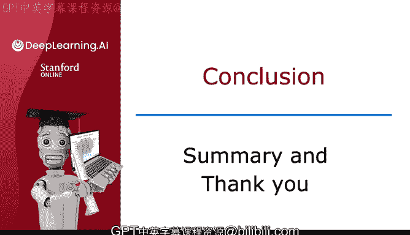
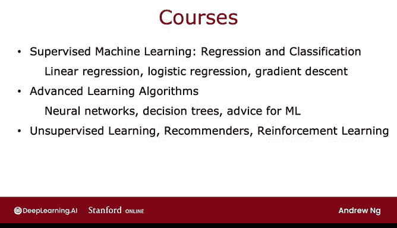
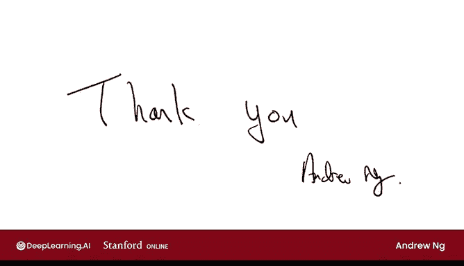

# 150：机器学习专项课程总结与致谢 🎓

在本节课中，我们将一起回顾吴恩达《机器学习》专项课程的核心内容，并对整个学习旅程进行总结。

---

## 课程内容回顾 📚

上一节我们完成了所有技术内容的学习，本节中我们来看看整个专项课程的脉络与核心收获。

我们共同度过了许多视频课程，这是最后一节。让我们一起总结所学过的主要课题。

### 第一门课程：监督学习

第一门课程涵盖了监督机器学习，包括回归和分类。你学习了线性回归、逻辑回归、成本函数以及梯度下降算法。

以下是监督学习的核心算法：
*   **线性回归**：用于预测连续值。其假设函数通常表示为 **`hθ(x) = θ₀ + θ₁x₁ + ... + θₙxₙ`**。
*   **逻辑回归**：用于分类问题。其假设函数使用Sigmoid函数：**`hθ(x) = g(θᵀx)`，其中 `g(z) = 1 / (1 + e⁻ᶻ)`**。
*   **梯度下降**：用于优化模型参数的通用算法。其更新规则为：**`θⱼ := θⱼ - α * ∂J(θ)/∂θⱼ`**。

### 第二门课程：高级算法与实践建议

第二门课程我们探讨了更高级的学习算法，包括神经网络、决策树和树集成方法。同时，我们也学习了机器学习的实践建议，例如偏差与方差、如何划分训练集、验证集和测试集，以及如何高效地改进学习算法。

以下是本部分的核心概念：
*   **神经网络**：通过多层神经元结构模拟复杂函数。
*   **决策树与集成方法**：如随机森林，通过构建多棵树并汇总结果来提高预测性能。
*   **偏差与方差诊断**：这是分析和改进模型性能的关键框架。

### 第三门课程：无监督学习与强化学习

第三门课程是关于无监督学习、推荐系统和强化学习。我们讨论了聚类算法、异常检测算法、协同过滤和基于内容的过滤。在最后一周，我们学习了强化学习。

掌握了这一系列工具后，你现在已经具备了构建广泛机器学习应用的能力。

---

## 祝贺与展望 🚀

恭喜你坚持到了最后一个视频。如果你完整地学完了这个专项课程，那么你现在已经拥有了非常扎实的机器学习基础。我认为你已经为成为一名机器学习专家奠定了良好的开端。

如你所知，机器学习正在对社会产生巨大影响。它是一个强大的工具，每天有数十亿人通过网页搜索、产品推荐、语音识别等众多应用在使用它。它甚至通过助力科学发现来增进人类知识，创造着数十亿美元的价值，并催生了几年前还无法想象的新应用。

但我认为，机器学习的最佳应用尚未被发明出来。而这把我们带到了你面前。你现在完全有能力运用机器学习的工具自己构建应用，并成就伟大的事业。我希望你能运用这些技能让他人的生活变得更美好。

---

## 最后的致谢 🙏

在结束这门课程之前，我想对你说最后一件事。教授这门课程对我而言是一件乐事，但就在不久之前，我自己也是一名学生。因此，我深知学习这些东西是多么耗时。我知道你生活忙碌，有许多其他事务需要处理。所以，感谢你抽出时间观看视频、完成测验和实验。我知道你在这门课程中投入了大量的时间和精力。

因此，我只想对你表示衷心的感谢。感谢你成为这门课程的学生。我非常感激你，并感谢你花时间与我、与这个专项课程共度的所有时光。谢谢你。

---

## 总结

本节课中，我们一起回顾了整个机器学习专项课程的知识体系，从监督学习到无监督学习与强化学习。你已建立起坚实的理论基础，并掌握了构建实际应用的强大工具集。学习之旅告一段落，但运用知识创造价值的征程才刚刚开始。再次祝贺你完成课程！