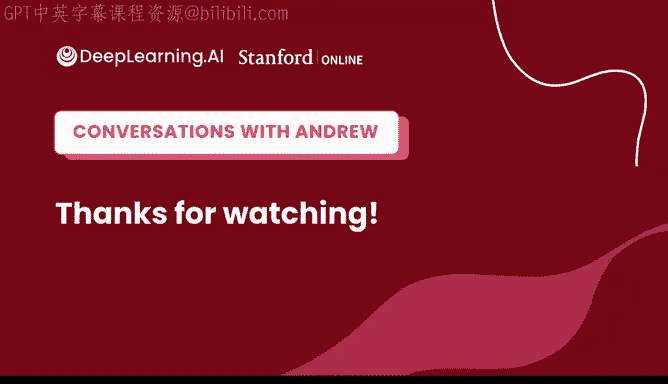

# 151：人工智能与机器人技术 🚀🤖

在本节课中，我们将跟随吴恩达教授与斯坦福大学教授切尔西·芬恩的对话，探讨机器学习，特别是强化学习在机器人技术领域的应用、挑战与未来展望。我们将了解机器人技术的现状、如何让机器人更通用、以及研究人员在实验室中的日常工作。

---

## 概述

切尔西·芬恩教授的研究专注于将机器学习，尤其是强化学习，应用于机器人技术。本次对话探讨了机器人能力的现状、实现通用性的挑战、数据收集的重要性、模拟与现实世界的差距，以及为进入该领域的学习者提供的建议。

---

## 机器人技术的现状：能力与局限 🤔

上一节我们介绍了课程主题，本节中我们来看看机器人当前真正能做什么和不能做什么。

在流行媒体中，我们常看到机器人完成各种复杂动作的视频。这些演示虽然令人印象深刻，但机器人通常是为特定环境精心设置的。如果环境或任务发生改变，机器人可能无法正常工作。

当前机器人技术的核心挑战在于**泛化**能力，即让机器人能够处理多种不同的场景、物体和环境。目前，机器人能在工厂等受控环境中可靠工作，但要获得人类般的灵活性和通用技能仍然非常困难。

当看到一个酷炫的机器人演示时，我们应该思考以下问题：
*   如果环境中的某些东西改变了会怎样？
*   如果机器人的起始位置稍有不同会怎样？
*   系统对这些变化的鲁棒性或韧性如何？

那些即使被“戳一下”或环境稍有变化仍能工作的演示，才真正令人印象深刻。

---

## 实现机器人泛化的路径：数据是关键 📊

上一节我们讨论了机器人泛化能力的挑战，本节中我们来看看如何通过数据来解决这个问题。

在其他机器学习领域，使用大型多样化数据集（如整个维基百科）训练模型取得了巨大成功。切尔西教授的研究方向之一，就是尝试在机器人领域复制这种成功，即收集多样化的数据并让机器人从中学习。

这面临几个挑战：
1.  缺乏现成数据集：不存在像“维基百科”那样的机器人运动控制数据集。
2.  需要自主收集数据：机器人原则上可以自己收集数据，这既是机遇也是挑战。

为了解决这个问题，研究探索了多种方法：
*   让机器人在多种不同环境中自主收集数据。
*   向机器人演示如何完成任务。
*   利用互联网数据（如人类视频）来教导机器人。
*   整合所有这些不同数据源。

目标是让机器人在见过如此多样化的数据后，能够泛化到实验室环境之外的真实世界。

---

## 模拟与现实世界的挑战 🎮➡️🌍

上一节我们探讨了利用真实数据的重要性，本节中我们来看看模拟器作为数据源的作用与局限。

模拟和电子游戏一样，可以生成大量数据用于训练AI系统。然而，模拟器中的物理规律与现实世界并不完全相同。例如，桌面摩擦或瓶盖螺纹的摩擦力很难精确建模。

模拟器面临的挑战包括：
*   **物理建模不精确**：模拟引擎的物理参数存在误差，导致在模拟中学到的策略无法直接迁移到现实世界。
*   **创建内容成本高**：真实世界极其多样，在模拟中创建日常生活中遇到的所有物体和环境需要大量手动工作，难以规模化。

因此，模拟是一个有前景的数据补充来源，但由于这些不准确性和迁移挑战，不应是唯一依赖的方法。我们应努力利用大量真实数据。

---

## 进军非受控环境：家庭与厨房 🏠

上一节我们提到了受控环境，本节中我们来看看将机器人应用到家庭等非受控环境的探索。

工厂等受控环境是机器人已取得成功的地方。从长远来看，切尔西教授希望看到机器人能进入家庭或办公室等任何环境并发挥作用。

为了实现这一目标，需要开始在真实环境中收集数据。通常，机器人研究只在实验室环境中收集一次数据。如果只收集实验室数据，机器人永远无法进入真实世界。因此，研究正在尝试启动数据收集工作，将机器人真正放入现实世界，让它们看到不同家庭中的多样性，而不仅仅是实验室中的狭窄数据。

关于机器人需要见过多少个不同的厨房才能在一个新厨房里成功完成“制作一碗麦片”这样的复杂任务，切尔西教授估计可能需要成千上万个厨房的数据。即使有了大量数据，问题可能仍未完全解决，就像自动驾驶领域一样。因此，除了依赖数据，还需要让机器人具备在新环境中即时适应的能力。

---

## 元学习：让机器人学会学习 🧠

上一节我们讨论了机器人需要适应新环境，本节中我们来看看“元学习”如何帮助机器人做到这一点。

元学习，即“学会学习”，其动机在于：当机器人进入一个新厨房时，我们不希望它只是运行之前学到的知识，它可能需要通过少量试错经验来即时适应和学习。例如，打开一个略有不同的 pantry 门。

如果仅用少量数据从头开始进行机器学习，效果不会好。元学习试图利用先前在多个厨房或任务中获得的经验，来优化学习新事物的能力。其核心思想是，基于学习过许多旧事物的经验，来提升学习新事物的效率。

元学习的一种方法是**双层优化**，将一个学习问题嵌套在另一个学习问题中，优化内部学习问题的所有参数，以实现更快或更高效的学习。

---

## 机器人实验室的日常与调试 🛠️

上一节我们介绍了一些算法思想，本节中我们来看看在机器人实验室中进行研究的实际体验。

在实验室工作与运行机器学习实验有相似之处，都需要编写代码、训练模型和评估模型。但除此之外，还需要与真实的机器人交互。

工作流程可能包括：
*   从模拟开始，使用物理引擎迭代算法。
*   设置控制栈，以便向机器人发送移动指令。
*   设置摄像头。
*   通过VR控制器等方式引导机器人收集数据。
*   在真实机器人上运行模型进行评估。

看到机器人真正做出动作，而不仅仅是看到模型准确度数字，是非常有成就感的。但这过程也需要耐心，因为机器人可能会出故障，可能出现比纯软件系统更多的错误。

调试机器人系统涉及排除软件和硬件两方面的错误源。一些方法包括：
*   检查机器人收集的数据和看到的图像。
*   可视化模型学习到的特征。
*   在多个机器人上重放动作以确保可复现性。

与纯软件不同，硬件错误可能导致机器人损坏，需要时间修复或更换部件，这是机器人学独特的挑战。

---

## 强化学习在机器人中的应用与实践技巧 ⚙️

上一节我们了解了实验室的日常工作，本节中我们深入探讨强化学习这一核心工具在机器人中的应用。

强化学习对机器人学非常有吸引力，因为它原则上允许机器人通过试错、从自身收集的数据中自主学习。然而，将其应用于现实世界也面临挑战：

1.  **奖励函数定义**：真实世界不会给机器人“分数”。机器人可能需要同时学习任务的含义（奖励函数）和学习如何在物理世界中完成任务。解决方法包括提供成功示例、完整演示，或使用**逆强化学习**等技术来推断行为背后的奖励函数。
2.  **自主重置**：在试错过程中，尝试一次任务后需要回到起点才能再次尝试。学习这种重置行为本身也具有挑战性，涉及学习如何执行任务与学习如何从失败中恢复之间的复杂交互。

切尔西教授是较早探索完全**端到端机器人强化学习**的研究者之一，即训练单个神经网络直接从机器人摄像头拍摄的图像映射到机器人关节的扭矩。早期这项工作面临质疑，但如今使用神经网络表示策略（根据图像选择动作）已成为机器人学中更主流的范式。

她预测，随着机器学习不断进步，这种范式在机器人领域将继续增长，特别是在处理世界物体和环境的巨大多样性方面。

---

## 未来展望：标准化与可共享数据集 🤝

上一节我们回顾了端到端学习的发展，本节中我们展望机器人技术的未来方向。

切尔西教授对未来感到兴奋的一个方向是转向使用更广泛、可重复使用的数据集。目前机器人学习领域仍多为每个项目在实验室收集小规模数据。如果计算机视觉研究人员必须为每个项目收集 ImageNet 数据，进展将非常缓慢。

她的预测是，未来几年将转向一种新范式：大量重复使用数据集，使用更大型的数据集，并理想化地在不同机构和机器人平台之间共享数据集，从而扩大系统训练数据的规模，使其能够更广泛地泛化。

实现这一愿景的挑战在于硬件标准化。一个可行的起点是：
1.  社区达成共识，在特定机器人平台和大致设置上标准化。
2.  在该标准化平台上收集大量多样化数据。
3.  取得初步成功后，逐步放宽标准化程度，纳入更多不同的机器人、夹具和环境。

---

## 给初学者的建议与学习资源 📚

在最后一节，我们为希望进入强化学习或机器人领域的学习者提供一些实用建议。

切尔西教授的主要建议是**动手实践**，尝试构建一些东西。通过设定目标并尝试实现来学习，是最有效的方式之一。

**如何开始：**
*   **从模拟机器人入手**：学习曲线较低，无需购买硬件。可以探索 MuJoCo 等免费物理引擎。
*   **接触真实硬件**：虽然更具挑战性，但成功时成就感更大。现在有许多价格相对便宜的机器人套件，甚至可以用乐高搭建机器人入门。

**推荐学习资源：**
*   **强化学习**：在线课程、视频、Sutton & Barto 的教科书。
*   **机器人操作系统**：学习 ROS 有助于与机器人交互。
*   **代码库与教程**：利用网上的各种教程和代码库。

这是一个令人兴奋的领域，进入的途径每年都在增长，也变得更容易。

---

## 总结

本节课中，我们一起学习了：
*   当前机器人技术在受控环境中表现良好，但**泛化**到新环境仍是核心挑战。
*   解决泛化问题需要**多样化的大规模数据**，数据收集是关键。
*   **模拟器**有用但存在局限，需与真实数据结合。
*   **元学习**可以让机器人更快地适应新场景。
*   在机器人实验室工作涉及软件、硬件和调试的综合技能。
*   **强化学习**是机器人学的重要框架，但需解决奖励定义和自主重置等实际问题。
*   未来的一个重点是建立**标准化、可共享的大型数据集**以推动进步。
*   对于初学者，最好的方式是**动手实践**，并从模拟和现有资源开始学习。

感谢切尔西·芬恩教授分享她在机器人技术与强化学习交叉领域的深刻见解。