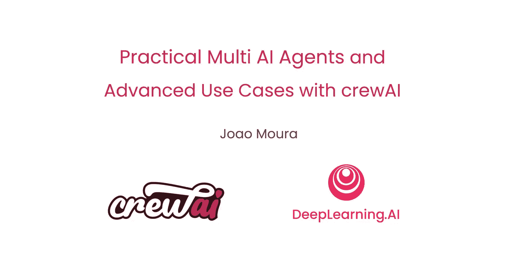
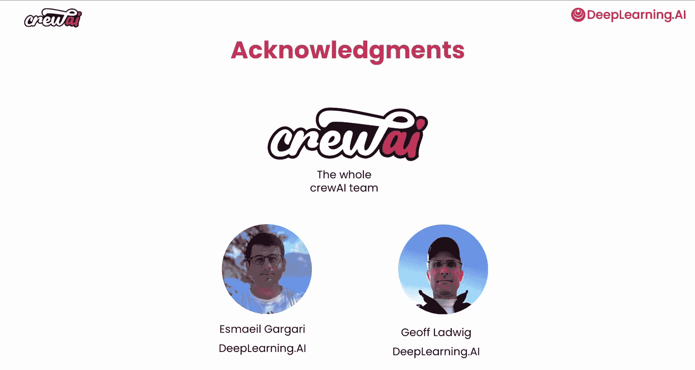

# 001：课程介绍 🎯

在本节课中，我们将学习吴恩达与crewAI创始人João Moura共同推出的《多AI智能体实践与高级应用》课程的核心内容与学习路径。这是一门高度实践性的课程，旨在教你构建能够实际部署并创造价值的智能体系统。

多AI智能体系统涉及多个AI智能体通过协作、委派和共享信息来共同完成复杂任务。如果你学习过之前的多AI智能体系统课程，你会了解到可以创建多个具有特定任务或角色的智能体，这些智能体可以协作执行复杂的工作流。

在本课程中，你将学习如何为更高级的用例构建基于智能体的应用程序，并看到许多基于当前行业实践的真实用例。构建多智能体应用时，一个关键挑战是在保持结果一致性的同时，平衡速度与质量。不同的模型选择和规模会影响这些因素。

在本课程中，你将学习通过测量关键指标来严格测试你的应用程序，并利用这些指标持续推动改进。你还将学习如何使用人类反馈来训练你的智能体，从而随着时间的推移不断完善你的应用。

---

很高兴能与crewAI的创始人João Moura一同在这里，João将是本课程的讲师。他也曾教授之前的多AI智能体系统课程。欢迎回来。

非常感谢。很高兴能再次与你一起。通过这门关于多智能体系统的新实践课程，我们看到许多公司正在使用crewAI构建多AI智能体应用程序，运行并聚合数千万个智能体，创建涉及多个智能体并行工作、多个“团队”协作的更复杂工作流，并进行大量严格的性能测试和应用训练。

在之前的课程中，你解释并演示了多智能体系统的基本构建模块，例如智能体如何协作完成任务、如何使用工具，以及如何用相对较少的代码构建一些非常酷的应用程序。

也许你可以谈谈学习者在本课程中可以期待什么？

当然。我们将从快速回顾智能体系统开始。然后，你将学习如何通过内部和外部系统来**编排**你的多智能体自动化流程。这使你的应用能够执行诸如查询内部数据、调用现有系统、发送电子邮件等操作。

接下来，你将学习如何创建从顺序执行到并行执行以及介于两者之间的各种“团队”设置，包括一些混合设置。你将学习如何并行运行任务，以及如何在流水线中连接多个“团队”。

然后，我们将探讨如何使用任务和训练方法来优化多智能体系统的性能。之后，你将学习如何创建使用多种不同大语言模型来完成任务的“团队”。例如，你可以让一个研究员智能体使用更小、更快的模型来处理相对简单的任务，而让一个写作智能体使用经过微调以反映你公司品牌声音的大型模型。我将这种方法称为**多模型**方法，它允许你根据手头的任务混合搭配多种大语言模型，从而帮助你构建更高效、更定制化的AI系统。

---

许多人共同努力创建了这门课程。我要感谢整个crewAI团队，以及来自DeepLearning.AI的Ed Gagliardi和Jeff Ladwig，他们也为本课程做出了贡献。

这门课程将充满乐趣。你将构建几个实践项目，例如自动化项目规划、潜在客户评分与互动自动化、支持数据分析和规模化内容创作。我自己非常喜欢使用crewAI，我相信你也会喜欢。

让我们进入下一个视频，开始学习吧。