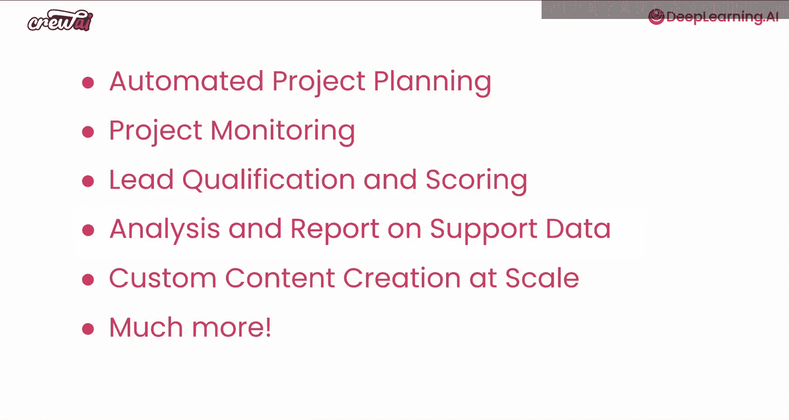
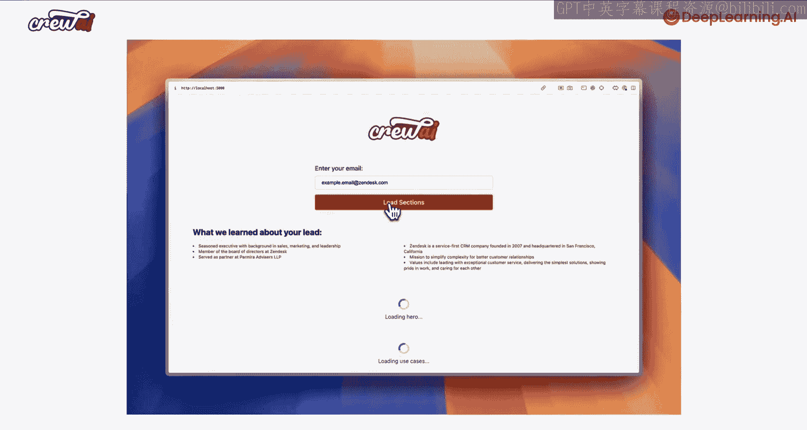
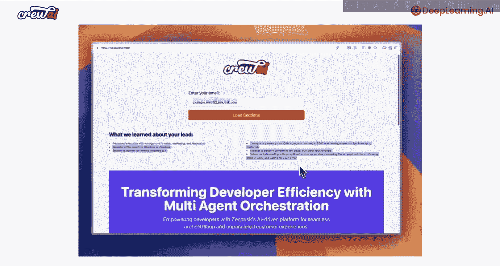
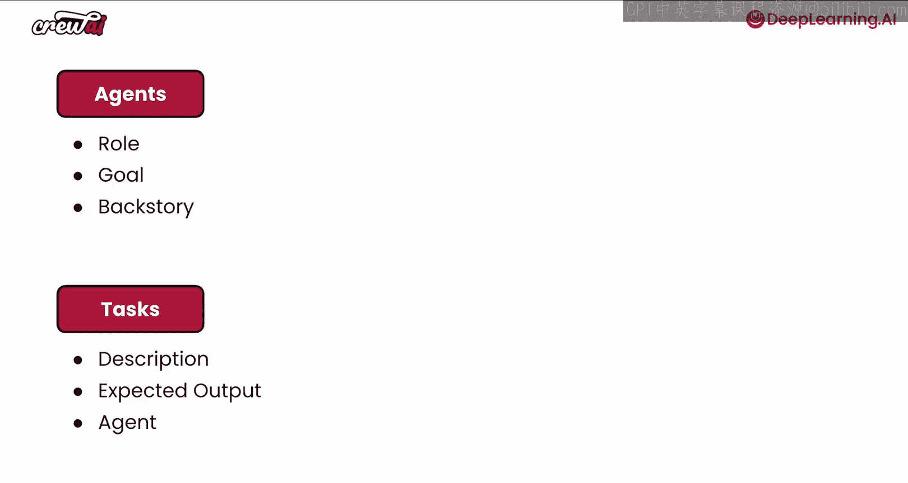
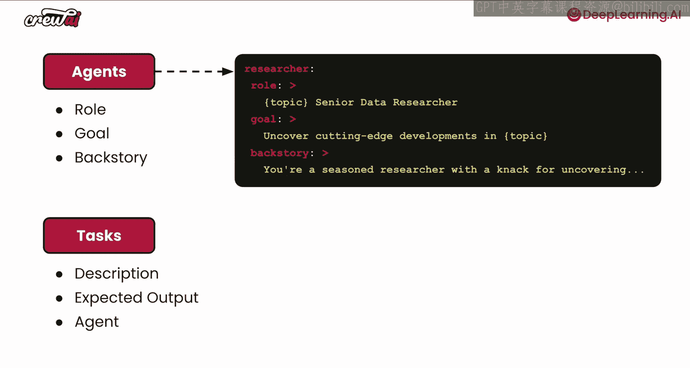
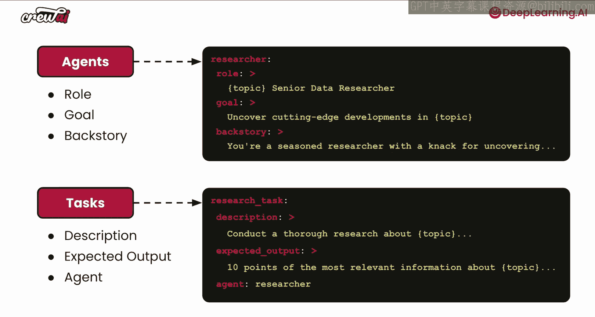
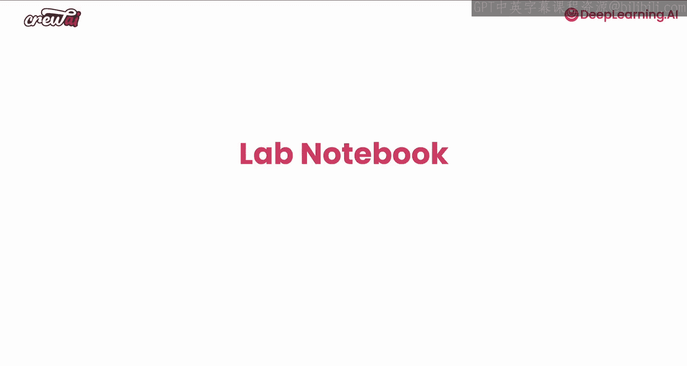

# 002：系统概述 🧠

在本节课中，我们将对多AI智能体系统进行概述。我们将讨论构建这些AI智能体的核心模块，包括智能体本身、任务和团队。同时，我们也会探讨使这些智能体工作的不同要素，例如缓存、内存、防护栏等。这将帮助你全面了解开始使用AI智能体系统所需的一切知识。让我们开始学习。

## 课程学习目标 📚

在本课程中，你将学到很多内容。

我们将讨论现实世界中的多智能体自动化。

这意味着你将亲自动手实践，并构建许多不同的项目。这些项目将帮助你理解如何为任何可能的应用场景构建自动化系统。

你将使用CrewAI和多智能体构建一个自动化项目规划系统。

你还将构建项目监控、资格审核与评分等应用案例。此外，还有更多内容。

我们将讨论对支持数据的分析与报告、定制内容创作、规模化以及许多其他应用案例。

请继续学习，因为这将非常有趣。

## 一个强大的示例 💪

在开始深入讨论之前，让我们先看一个快速示例，了解这些系统有多么强大，以及你能从它们中获得何种自动化能力。

让我们观看这个快速示例。

在这里，你可以看到我即将与Zendesk的CEO进行通话。我希望准备一些销售材料。我只需将他的电子邮件输入系统，系统便开始对Tom进行研究。我们了解到他拥有销售、营销和领导力的背景。同时，我们也了解了很多关于Zendesk的信息，例如它成立于2007年。所有这些数据都是由智能体研究完成的。现在，这个智能体整理了一份登陆页PDF，我们可以导出并实际发送给Tom。这份PDF从Zendesk的角度出发，详细介绍了Zendesk公司及其如何努力简化复杂性。这是一个非常酷的应用案例，你可以看到这些智能体不仅进行研究，还能生成完整的报告，以协助我们完成通话等任务。此外，还有许多其他应用案例。

你可以看到许多运营自动化案例，其中也有很多销售应用案例。我们还看到许多营销应用案例、代码开发、研究、教育、支持等。有许多不同的应用案例跨越了众多垂直领域。关键在于，无论你为哪个垂直领域构建应用案例，我们都能看到一个共同的模式：这些智能体和自动化尝试做的事情通常呈现长尾分布。

## 通用工作流程 🔄

它通常始于你从现有系统中提取数据。这些系统可能是ERP、CRM、数据库或其他任何系统。一旦从这些系统中提取数据，通常会有一个研究步骤。这里的研究可以是研究文档、互联网或你可能拥有的其他系统。之后，你会进入分析过程。分析可以包括比较数据、提取特定数据，甚至推断你之前没有的新数据。经过一些分析后，大多数应用案例会进入总结过程，你可能希望提取经验教训、绘制图表或生成特定的执行摘要。最后，你可以进行报告。有时，你可能希望报告以PDF或JSON格式呈现，以便推送到另一个系统，或者以Markdown格式呈现。

关键在于，最终你可能希望将结果推送到现有系统中。因此，无论是什么垂直领域，无论是销售、营销、人力资源还是其他，大多数应用案例通常都围绕研究、分析、总结和报告这一过程展开。并非所有步骤都是必需的，也不一定总是按照这个顺序进行，但这是我们看到的大多数应用案例的核心。当然，有些公司正在将这项技术推向前沿，尝试使用视频模型和图像模型等做非常创新的事情，我们也会讨论其中的一些内容。

## 智能体系统简介 🤖

快速回顾一下，如果这是你第一次了解多智能体系统和CrewAI，我想谈谈它们是什么以及如何构建它们。

我们工程师多年来构建的常规应用程序与这种新型AI应用程序之间存在差异。

如果你考虑常规应用程序，它通常具有非常强的类型化。我的意思是，你非常清楚进入应用程序的数据是什么，也非常清楚这些数据将经历哪些转换才能得到预期的输出。一个很好的例子是一个从潜在客户表单获取输入的系统，你理解根据这些答案，你将有一系列条件来决定执行哪些自动化或输出。

但是，如果你看看这些新的应用程序，我在这里称之为AI应用程序，它们非常不同，因为它们现在更加模糊。这意味着你不太清楚进入这些应用程序的数据是什么。例如，如果你考虑ChatGPT，你不知道用户输入的文本是食谱还是博士论文，或者其他任何内容，它是模糊的。然后，这些数据经过一个黑盒模型，最终产生模糊的输出，因为你不知道输出会是什么，它将严重依赖于输入和模型。

因此，你可以将多AI智能体视为一种更加模糊的AI应用程序。但正因为如此，它允许你构建以前不可能的自动化系统，因为现在你不需要处理每一个边缘情况。你基本上可以让你的智能体实时决定如何对特定数据做出反应，并决定使用哪些工具来完成你想要的任务。

## 智能体的构成 🧩

当你观察这些智能体时，它们的构成是什么？其实很简单。

中心有一个大语言模型（LLM），这个LLM可以访问一些工具。一旦你给这个LLM一个任务，它就会想办法使用这些工具来提供最终答案。当你再进一步观察时，你实际上看到的是这种多智能体系统，现在你不仅有一个智能体，而是有两个、三个或更多。现在，这些智能体不仅可以自己使用工具，还可以相互委托工作，相互提问，以完成你想要的最终结果。它通常始于非常简单的情况，但一旦你开始将这些自动化系统投入生产环境，你会发现有很多需求。

## 生产环境需求 🏗️

你会意识到需要一个缓存层。无论你的智能体使用什么工具，它们都不需要反复消耗必要的额度或重复使用这些工具。你还希望确保它们有一个内存层，这样它们就能记住过去做过的事情，并与其他智能体共享记忆。因此，如果它们再次遇到相同的数据点，它们会记得上次是如何处理的。还有训练数据，我们将在特定课程中讨论这一点，我对此非常兴奋。此外，还有防护栏，以及如何保护这些智能体避免产生疯狂的幻觉等等。

## 编排与流程 ⚙️

不仅包括所有这些功能，一旦这些智能体协同工作，你真的需要仔细考虑如何编排它们。有时，你只希望它们按顺序工作；其他时候，你可能希望有一个管理者智能体来委托工作和审查输出。但你可以在这方面发挥创意，可以采用混合方法，其中一些任务并行执行，而其他任务则等待多个任务完成后再继续。你也将创建一个这样的示例。有些任务可能完全并行，有些则可能完全异步。因此，有许多不同的应用案例。如果你愿意，你还可以通过使用多团队（multi-crews）变得更加复杂，你将使用我们称为“流”的功能，能够将一个团队的结果与另一个团队连接起来。

## 核心构建模块 🧱

好了，你刚刚了解了AI智能体、它们如何工作、它们的构成以及如何让它们协同工作。那么，构建这些多AI智能体系统的主要构建模块是什么？

一切都始于智能体，但你也需要确保有任务。

在这个应用案例中，你可以看到任务比智能体多，这不是问题，因为一个智能体可以执行多个任务，我们将在示例中看到这一点。为了让这个智能体能够完成这些任务，我们需要给它们工具。因此，你可以给你的智能体分配工具，让它们在执行任何任务时使用；或者你可以给你的任务分配工具，让你的智能体知道要使用哪些工具来完成该任务。一旦你有了这些，你基本上就有了一个团队。

一个团队（Crew）是多智能体及其任务的组合。

一旦你拥有了所有这些智能体和任务，CrewAI就会介入，并提供你所需的所有功能，以便在生产环境中运行这些系统。它通过添加防护栏来避免你的智能体产生幻觉，还提供任务质量评估功能，允许委托，让你的智能体可以自动相互委托和提问，以及训练数据，以便你可以进一步训练这些智能体，还有内存功能，让这些智能体随着时间的推移变得更好。我们将讨论很多内容，请务必继续学习。

## 智能体与任务定义 📝

让我们看看这些智能体和任务。CrewAI中的每个智能体都需要有一个角色、一个目标和一个背景故事。每个任务都需要有一个描述、一个预期输出和一个指定的智能体。

现在，这些智能体实际上被定义为YAML文件，我们将在课程中详细讲解。你可以轻松地看到这些智能体如何设置其角色、目标和背景故事，以及任务如何设置其描述和预期输出。这使得非技术人员能够轻松地为这些智能体和任务做出贡献，只需更新YAML文件，而无需更新任何代码。

## 动手实践 🚀

好了，既然我们知道可以使用YAML文件创建智能体和任务，为什么不亲自动手构建我们的第一个团队呢？这将非常令人兴奋。让我们切换到下一个标签页，进入Jupyter笔记本，一起构建我们的第一个团队。我们稍后见。

## 总结 📌

在本节课中，我们一起学习了多AI智能体系统的基本概述。我们探讨了智能体系统的核心概念、构成要素以及从研究到报告的通用工作流程。我们还比较了传统应用与AI应用的区别，并介绍了使用CrewAI构建智能体系统的主要构建模块：智能体、任务和团队。最后，我们了解了如何通过YAML文件定义智能体和任务，为动手实践奠定了基础。下一节，我们将进入Jupyter笔记本，开始构建第一个实际的智能体团队。