# 003：自动化项目规划、估算与分配 📋

在本节课中，我们将学习如何使用CrewAI构建一个自动化项目规划系统。该系统能够将项目分解为任务、估算时间并进行资源分配，这对于需要快速响应客户需求的机构（如咨询公司或网络代理）非常有用。

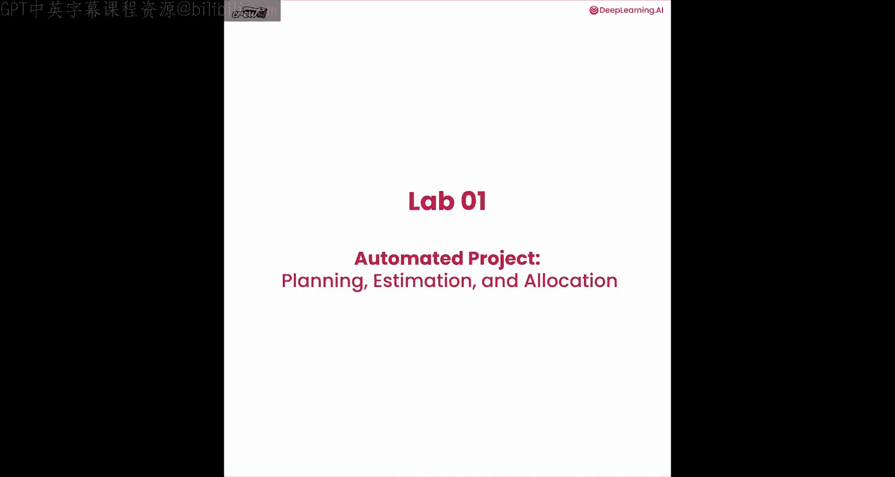

## 概述

我们将创建一个由三个智能体组成的“团队”，每个智能体负责一个特定任务。通过输入项目的基本信息，这个团队可以快速生成一个结构化的项目计划，包括任务列表、时间估算和人员分配，最终输出格式化的JSON数据，便于集成到Jira、Trello等项目管理工具中。

## 环境与模型设置

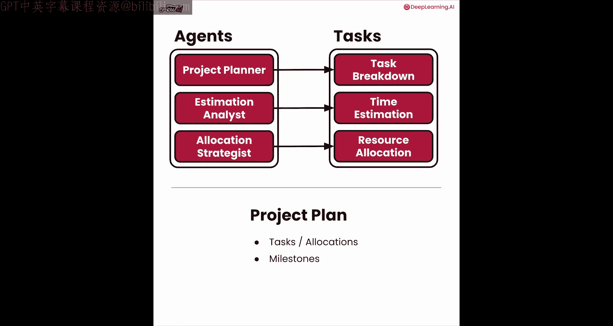

首先，我们需要导入必要的库并设置AI模型。

```python
import os
import yaml
from crewai import Agent, Task, Crew
from langchain_openai import ChatOpenAI

# 设置模型，例如使用GPT-4o-mini以控制成本
llm = ChatOpenAI(model="gpt-4o-mini", temperature=0.7)
```

## 定义智能体与任务

智能体和任务的配置通过YAML文件管理，这使配置更清晰且易于修改。

以下是智能体YAML文件 (`agents.yaml`) 的示例结构：

```yaml
project_planner:
  role: "资深项目规划师"
  goal: "将 {project_type} 项目分解为清晰、可执行的任务列表。"
  backstory: "你是一位经验丰富的项目经理，擅长将模糊的需求转化为具体的行动计划。"

estimation_analyst:
  role: "估算分析师"
  goal: "为 {project_type} 项目中的每个任务提供现实的时间估算。"
  backstory: "你是一位数据分析专家，精通评估软件开发任务的工作量。"

allocation_strategist:
  role: "资源分配策略师"
  goal: "根据 {team_members} 的技能，为 {project_type} 项目中的任务分配最佳人选。"
  backstory: "你是一位人力资源专家，擅长将合适的人匹配到合适的任务上。"
```

以下是任务YAML文件 (`tasks.yaml`) 的示例结构：

```yaml
task_breakdown:
  description: |
    分析 {project_requirements}，为 {project_type} 项目创建一个详细的任务分解结构。
  expected_output: "一份包含任务描述、依赖关系和初步责任人的任务列表。"

time_estimation:
  description: |
    基于 {project_requirements} 和任务分解结果，估算每个任务所需的小时数。
  expected_output: "一个包含每个任务名称和估算工时的列表。"

resource_allocation:
  description: |
    根据 {team_members} 的可用性和技能，为所有任务分配具体的团队成员。
  expected_output: "最终的项目计划，包含任务、估算、分配和里程碑。"
```

在代码中加载这些配置：

```python
# 加载YAML配置
with open('agents.yaml', 'r') as file:
    agents_config = yaml.safe_load(file)
with open('tasks.yaml', 'r') as file:
    tasks_config = yaml.safe_load(file)

# 创建智能体
project_planner_agent = Agent(config=agents_config['project_planner'], llm=llm)
estimation_analyst_agent = Agent(config=agents_config['estimation_analyst'], llm=llm)
allocation_strategist_agent = Agent(config=agents_config['allocation_strategist'], llm=llm)

# 创建任务
breakdown_task = Task(config=tasks_config['task_breakdown'], agent=project_planner_agent)
estimation_task = Task(config=tasks_config['time_estimation'], agent=estimation_analyst_agent)
allocation_task = Task(
    config=tasks_config['resource_allocation'],
    agent=allocation_strategist_agent,
    output_pydantic=ProjectPlan # 指定结构化输出模型
)
```

## 定义结构化输出

为了获得可被外部系统使用的输出，我们使用Pydantic模型来定义数据结构。

```python
from pydantic import BaseModel
from typing import List

class TaskEstimate(BaseModel):
    task_name: str
    estimated_hours: float
    required_resources: List[str]

class Milestone(BaseModel):
    name: str
    tasks: List[str]

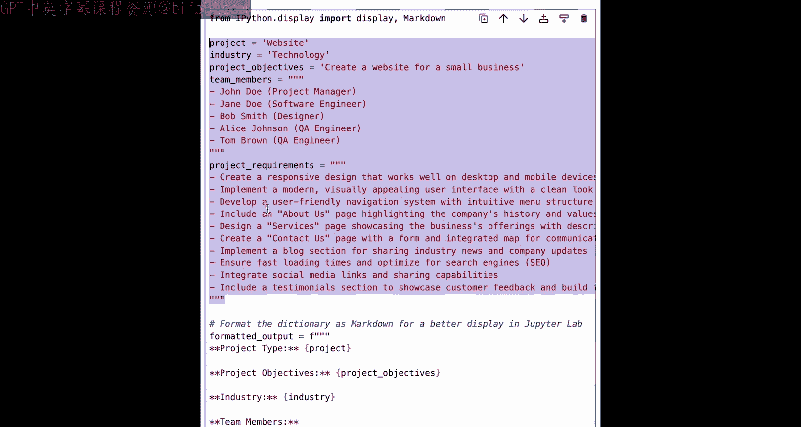

class ProjectPlan(BaseModel):
    tasks: List[TaskEstimate]
    milestones: List[Milestone]
```

`ProjectPlan` 模型将作为最终任务的输出格式，确保结果是结构化的JSON。

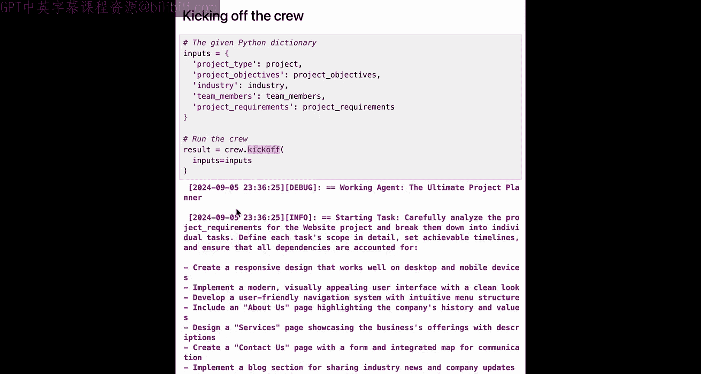

## 组装团队并执行

现在，我们将智能体和任务组合成一个“团队”，并提供项目输入信息。

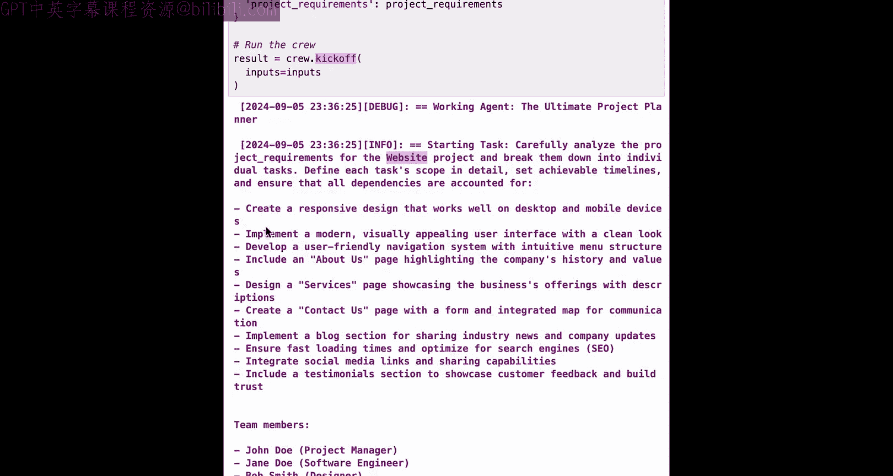

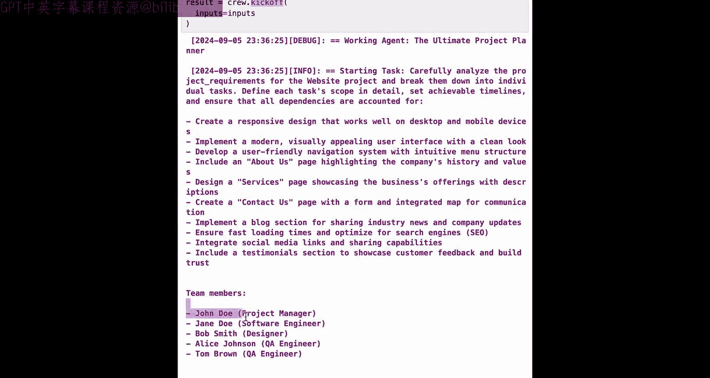

```python
# 创建团队
crew = Crew(
    agents=[project_planner_agent, estimation_analyst_agent, allocation_strategist_agent],
    tasks=[breakdown_task, estimation_task, allocation_task],
    verbose=2 # 启用详细日志以观察执行过程
)

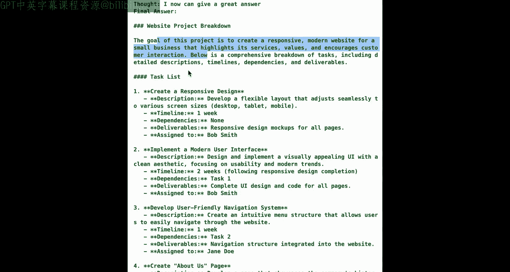

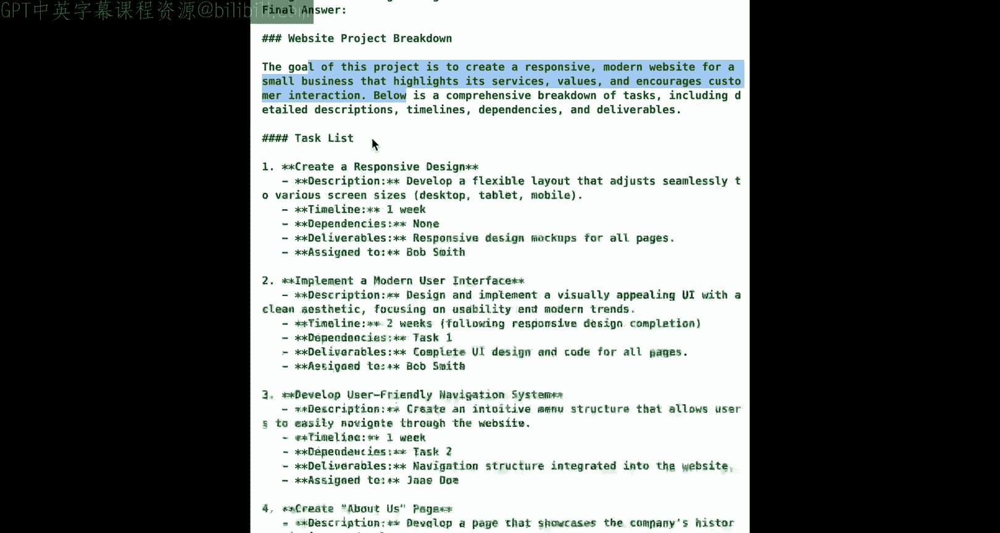

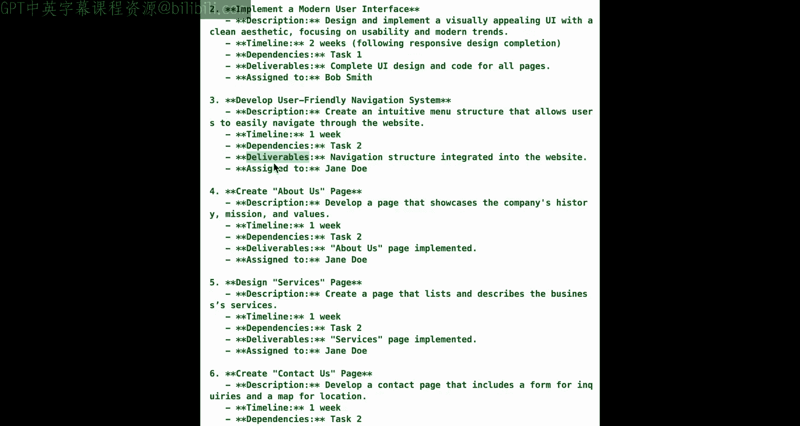

# 定义项目输入
inputs = {
    "project_type": "网站开发",
    "industry": "科技",
    "project_objectives": "为一家小型科技企业创建官方网站。",
    "team_members": ["项目经理", "软件工程师", "设计师", "QA工程师1", "QA工程师2"],
    "project_requirements": """
        1. 响应式设计。
        2. 现代且视觉吸引力强。
        3. 用户友好。
        4. 包含‘关于我们’、‘服务’、‘联系我们’页面。
        5. 集成博客版块。
        6. 加载速度快。
        7. 集成社交媒体链接。
        8. 展示客户评价。
    """
}

# 执行团队任务
result = crew.kickoff(inputs=inputs)
```

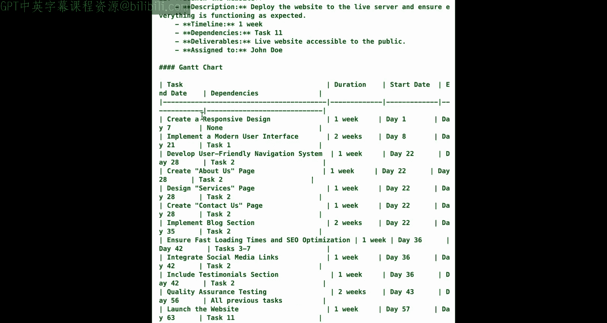

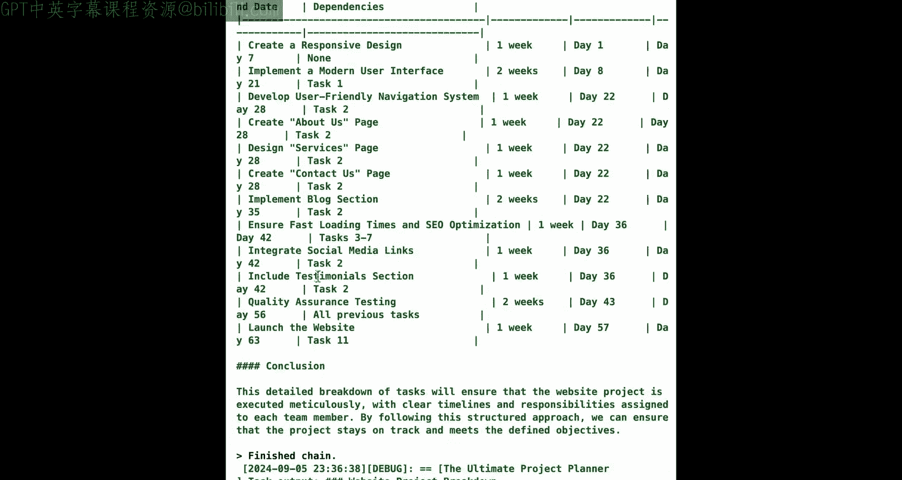

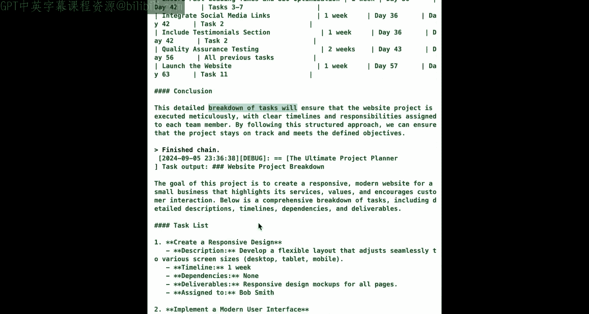

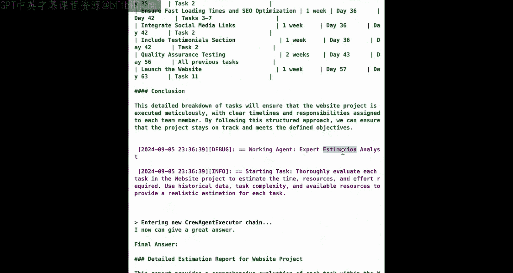

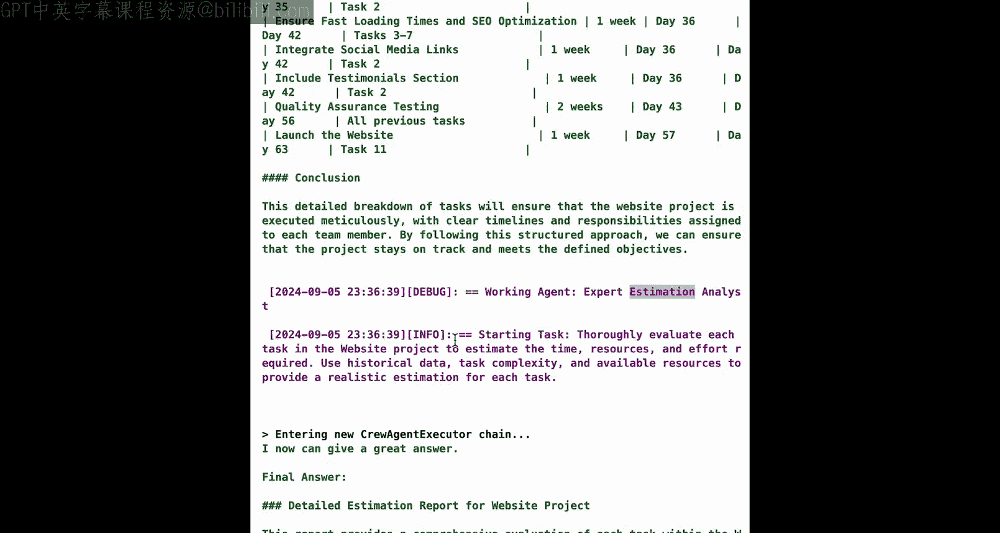

## 分析结果与成本

执行完成后，我们可以查看结构化的输出结果，并计算本次运行的大致成本。

```python
# 查看原始输出（ProjectPlan对象）
print(result)

# 将任务列表转换为Pandas DataFrame以便查看
import pandas as pd
tasks_df = pd.DataFrame([t.dict() for t in result.tasks])
print(tasks_df)

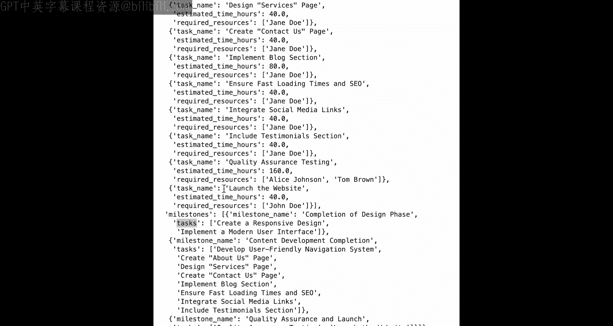

# 查看里程碑
milestones_df = pd.DataFrame([m.dict() for m in result.milestones])
print(milestones_df)

# 成本估算（示例，实际值取决于使用量）
# 假设使用了约7000个token，GPT-4o-mini模型每百万tokens输入$0.15，输出$0.60
# 总成本 ≈ (输入token数 * 0.15 + 输出token数 * 0.60) / 1,000,000
# 本次运行成本极低，约0.001美元。
```

## 总结

本节课中，我们一起学习了如何利用CrewAI构建一个自动化项目规划系统。我们完成了以下步骤：
1.  **设置环境与模型**：导入库并配置AI模型。
2.  **定义智能体与任务**：通过YAML文件配置不同角色的智能体及其目标。
3.  **设计结构化输出**：使用Pydantic模型确保输出格式规范，便于系统集成。
4.  **组装与执行团队**：将智能体和任务组合，输入项目信息并运行。
5.  **分析结果**：获得了包含任务分解、时间估算和资源分配的完整项目计划。

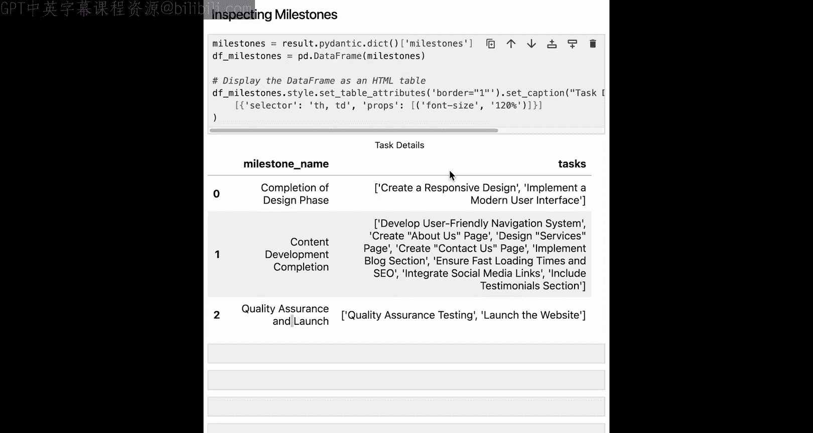

这个用例展示了如何将耗时数小时的人工规划流程，在几分钟内自动化完成，并能以极低的成本大规模运行。这只是多智能体协作能力的开始，在接下来的课程中，我们将探索更复杂、更强大的应用场景。