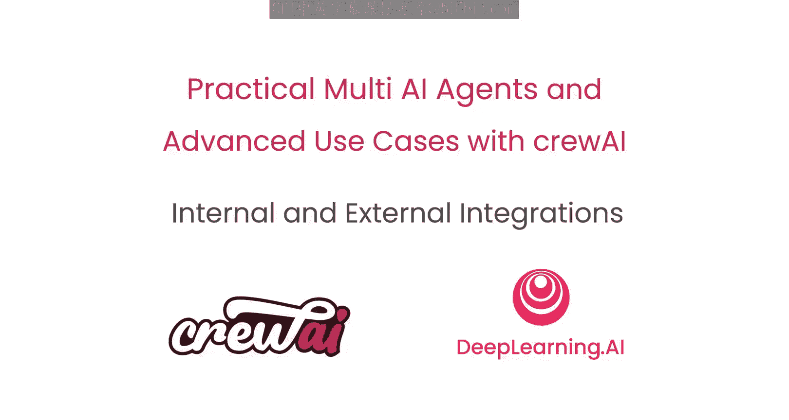
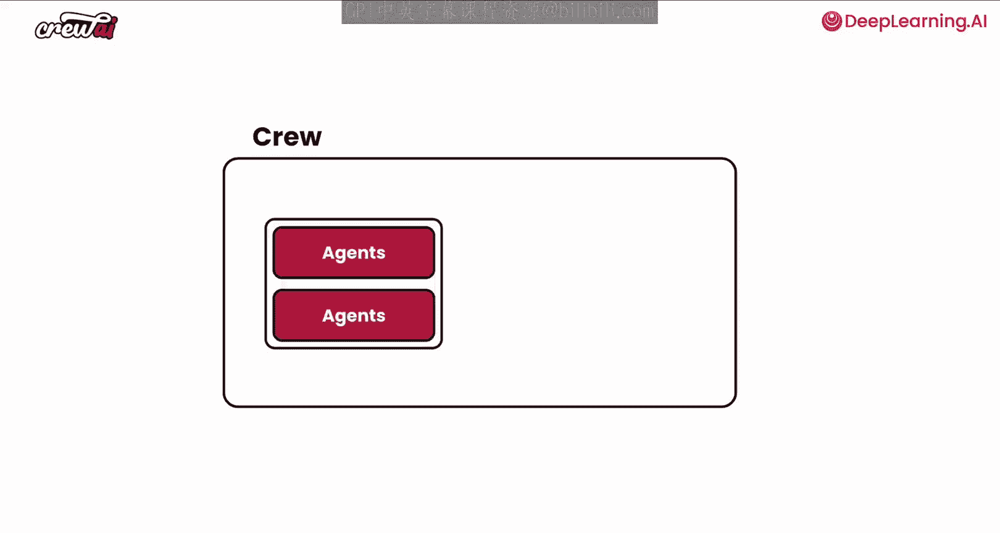
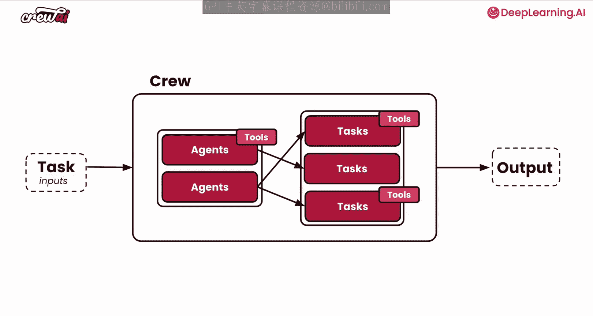
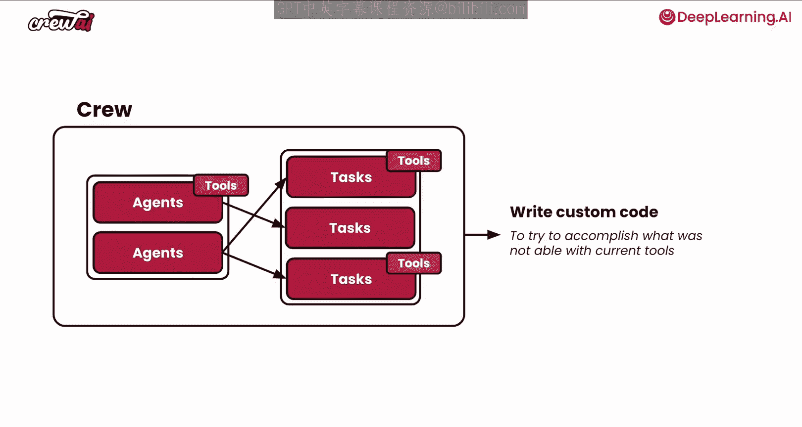
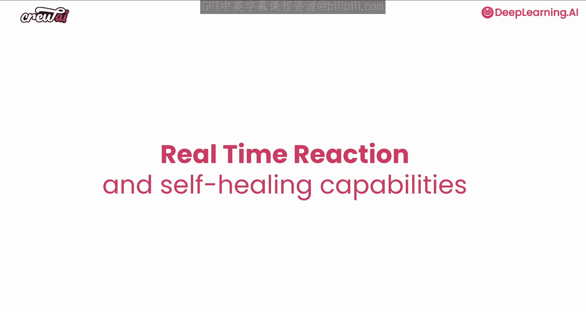
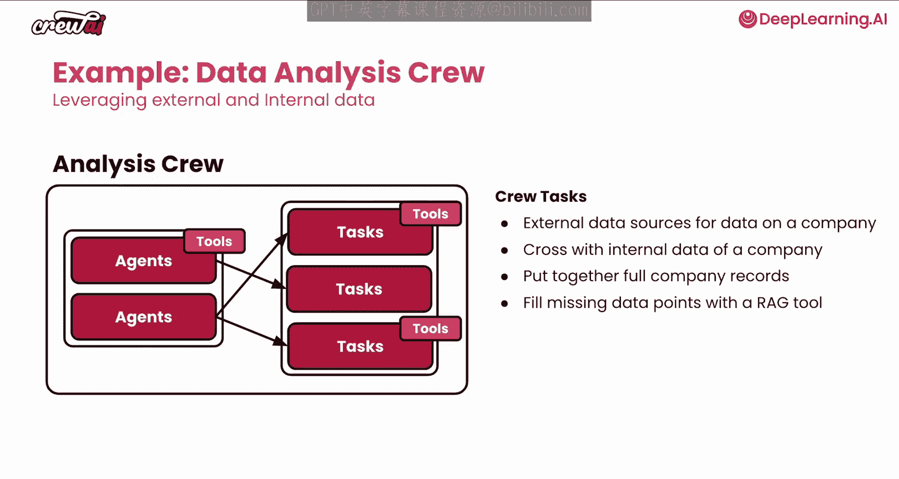
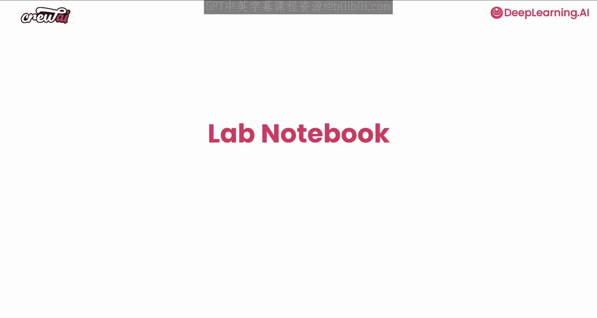

# 004：集成外部系统 🛠️

在本节课中，我们将学习如何为AI智能体构建集成。集成对于所有AI智能体自动化和应用程序都至关重要，因为您需要从内部或外部系统拉取或推送信息。本节课将涵盖构建这些集成的全部知识，以及如何让您的智能体能够与这些系统进行交互。

## 理解集成的重要性

上一节我们介绍了智能体、任务和工具的基本概念。本节中我们来看看集成的具体场景。在智能体执行过程中，有多个时刻可能需要与内部或外部系统进行通信。

有时，您可能希望在智能体开始运行之前与系统通信，以便获取可以传递给智能体的数据。其他时候，您可能希望在智能体处理完成后调用系统。这两种情况相对简单，因为它们本质上只是常规代码。但核心问题是，有时您希望您的工具能够调用外部或内部系统。

## 工具如何与系统交互

以下是工具可以调用的系统类型示例：

*   **其他应用程序或云服务**：例如，一个可以搜索互联网、查看日历或回复邮件的工具。
*   **数据库或内部应用程序**：例如，在现有向量数据库上进行相似性搜索、执行SQL查询，甚至触发某些副作用。

关键在于，您需要谨慎地允许您的智能体使用这些系统。有时，您可能希望智能体能够执行一些自定义操作，例如编写代码。我们将在后续课程中学习如何允许智能体这样做，以及具体实现方式。

## 实时反应与自我修复能力

现在，让我们谈谈集成内部和外部系统的一个巨大优势：**实时反应**和**自我修复**能力。我的意思是，当您的智能体调用这些工具时，如果工具因任何原因（无论是外部还是内部系统的变更）而失败，您的智能体将能够察觉到这种变化，并以不同的方式再次尝试。

让我们通过一个例子来说明。假设我们有一个执行分析任务的智能体，它试图利用外部和内部数据来完成工作。

## 构建一个集成示例

我们将构建一个具体的集成示例。这个智能体工作流程如下：

1.  **初始任务**：一个智能体尝试从公司数据中提取数据源。它围绕公司、其行业及相关信息进行研究。
2.  **交叉验证**：然后，它将外部研究结果与该公司的内部数据进行交叉验证，例如您可能已有的关于同一公司的现有报告。
3.  **整合记录**：接着，它将尝试根据所学到的关于特定公司的所有信息，整合出完整的公司记录。
4.  **处理缺失信息**：有时信息可能会缺失。如果发现信息缺失，它将尝试通过使用RAG工具进行向量搜索来查找缺失的数据点。

通过这个例子，您可以看到这些智能体如何超越常规的简单RAG搜索或数据增强流程。它们能够接入众多不同的数据源，包括外部的、内部的，并使用向量嵌入等技术。这为许多新的应用场景解锁了巨大潜力。

## 动手实践

现在，让我们进入Jupyter Notebook，亲自构建这个智能体。让我们开始动手，集成外部工具。这将非常有趣，请继续关注，我们马上进入下一步。

---

**本节课总结**：本节课我们一起学习了AI智能体集成的核心概念。我们了解了为什么集成至关重要，探讨了工具如何与外部及内部系统交互，并认识了集成带来的实时反应和自我修复能力。最后，我们概述了一个结合外部研究、内部数据验证和RAG工具进行数据补全的智能体分析流程示例，为接下来的动手实践奠定了基础。