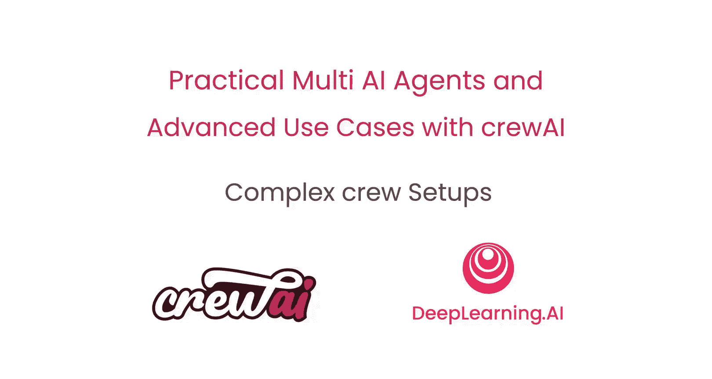
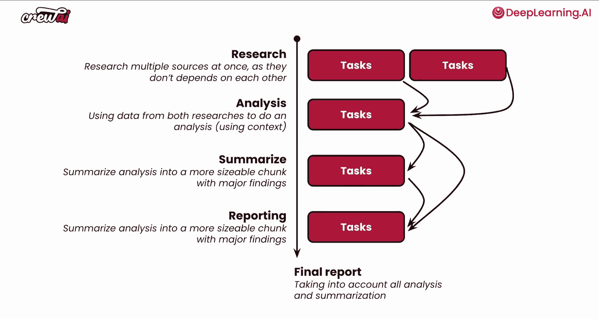
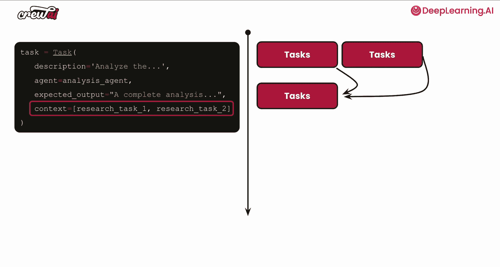
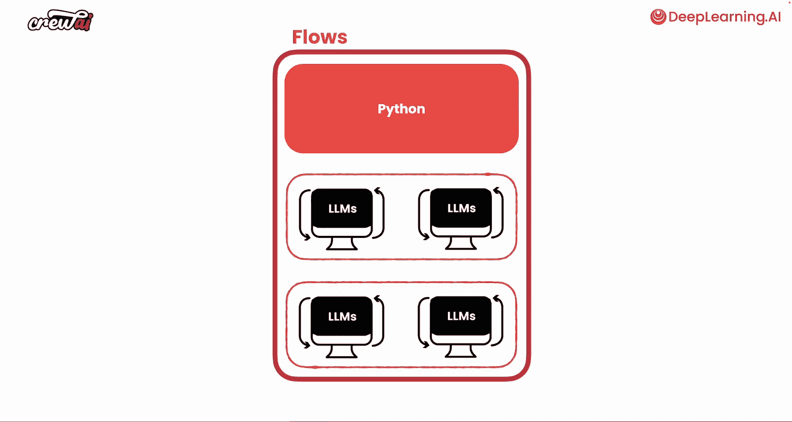
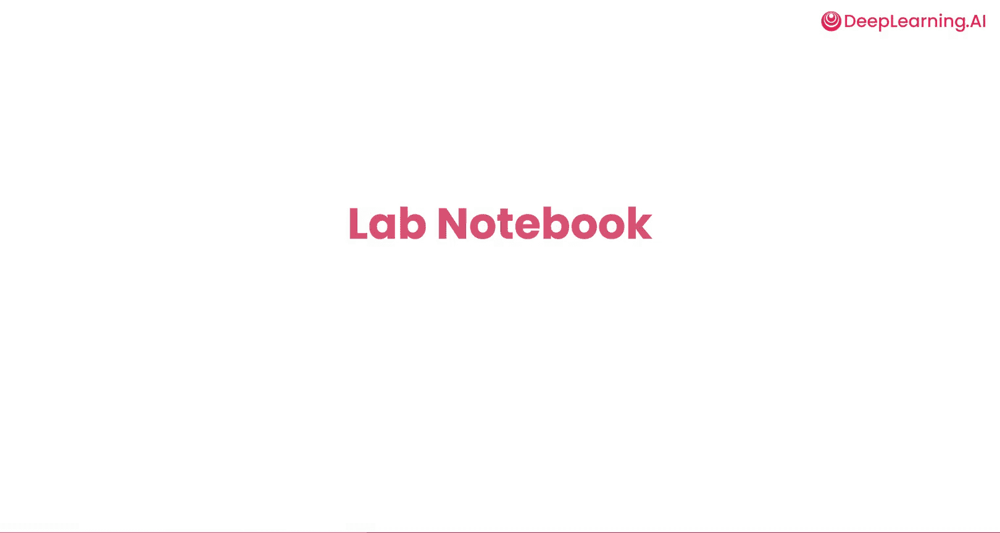

# 006：复杂工作流设置 🚀



在本节课中，我们将学习如何构建复杂的CrewAI工作流。我们将探讨如何不仅在一个Crew内部连接多个智能体，还能将多个Crew连接在一起，并使用条件逻辑来控制它们的执行顺序和信息传递。这为许多以前无法实现的高级用例打开了大门。

## 工作流控制基础

上一节我们介绍了智能体执行任务的多种方式。智能体可以按顺序、分层、混合模式，甚至并行或异步地执行任务。关键在于，你可以在这些不同选项之间进行混合和匹配，从而精细地控制工作的完成方式。

让我们快速看一个例子。假设你的Crew可以并行启动两个任务，例如，这两个都是研究任务。一个任务可能是研究一家公司，另一个可能是研究一个行业或一个人。这些任务彼此不依赖，这意味着它们可以同时开始。

```python
# 设置任务并行执行
task1.async_execution = True
task2.async_execution = True
```

## 任务间的依赖与上下文传递

但是，在这之后，假设你想进行一些分析，但你需要先获取所有那些不同任务的结果才能开始。这时，我们可以使用一个名为 `context` 的属性。这个属性允许你将前两个任务的输出结果，作为输入传递给第三个任务。

现在，我们想进行一个总结任务，这是一个更直接的任务。我们可以确保将分析任务的输出结果传递给这个任务，以便撰写一份漂亮的总结。

然而，对于最终的报告任务，我们希望进行全面的撰写。为此，我们需要获取分析和总结的结果，以确保在将最终报告推送到外部系统之前，能够审查这份完整的最终报告。

那么，如果你必须用CrewAI构建这个流程，你会怎么做呢？让我来展示给你看。



## 使用Flows实现复杂编排

为了实现任务的并行执行，你可以将属性 `async_execution` 设置为 `true`。这意味着你的任务将被并行执行。对于我们的第三个任务，你可以设置另一个名为 `context` 的属性，它允许你指定一个或多个其他任务，当前任务会等待这些任务完成后才开始执行。

```python
# 设置任务依赖关系
task3.context = [task1, task2]
```

通过这种方式，你可以对任务的执行顺序拥有很大的控制权。我们讨论的所有不同任务都使用了这些属性的不同组合。但是，你还可以通过使用 **Flows** 来实现更复杂的编排。

Flows是CrewAI的一个全新功能，它之所以如此特别，是因为它不仅允许你运行Crew，还能执行常规的Python代码。你可以在Crew执行之前、期间或之后执行这些代码。



这意味着你可以混合搭配，不仅连接多个Crew，还可以在它们之间使用常规Python代码。例如，当你需要获取文件、抓取数据或发送数据，而又不希望将这些工作留给智能体处理时，这将非常强大。

我们非常兴奋地看到，已经有人在生产用例中使用Flows构建应用了。现在，让我们深入代码，谈谈如何自己构建Flows。

## 总结





本节课中，我们一起学习了如何构建复杂的CrewAI工作流。我们探讨了通过设置 `async_execution` 和 `context` 属性来控制任务的并行执行与依赖关系。更重要的是，我们介绍了强大的 **Flows** 功能，它允许你将多个Crew与常规Python代码无缝结合，从而解锁了高度灵活和强大的自动化编排能力，为构建复杂的多智能体应用提供了坚实的基础。