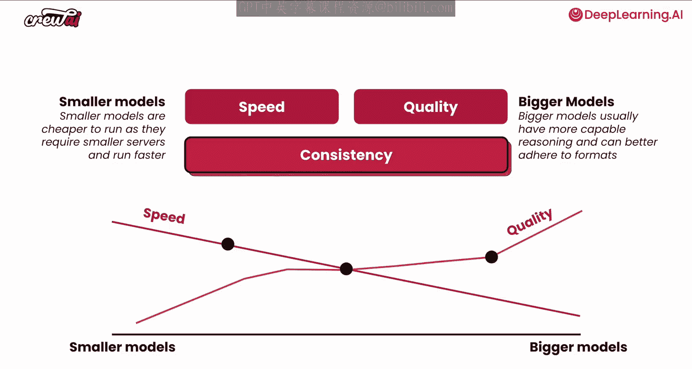
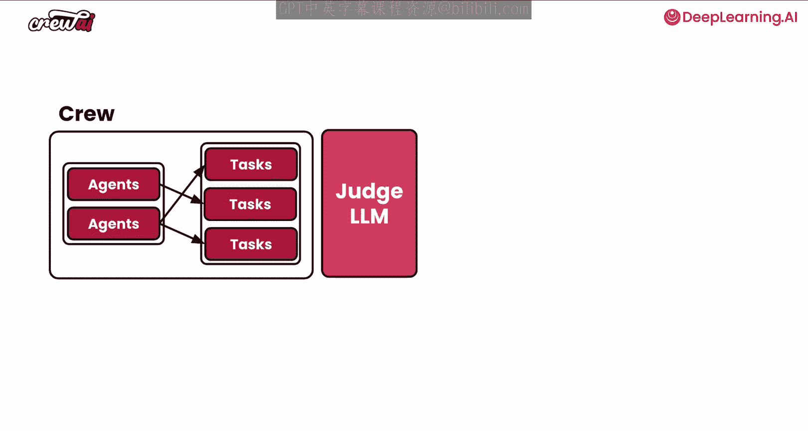
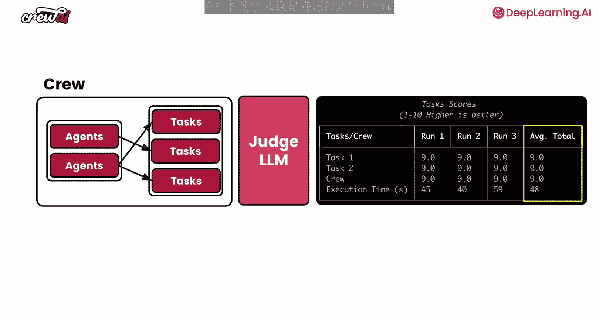
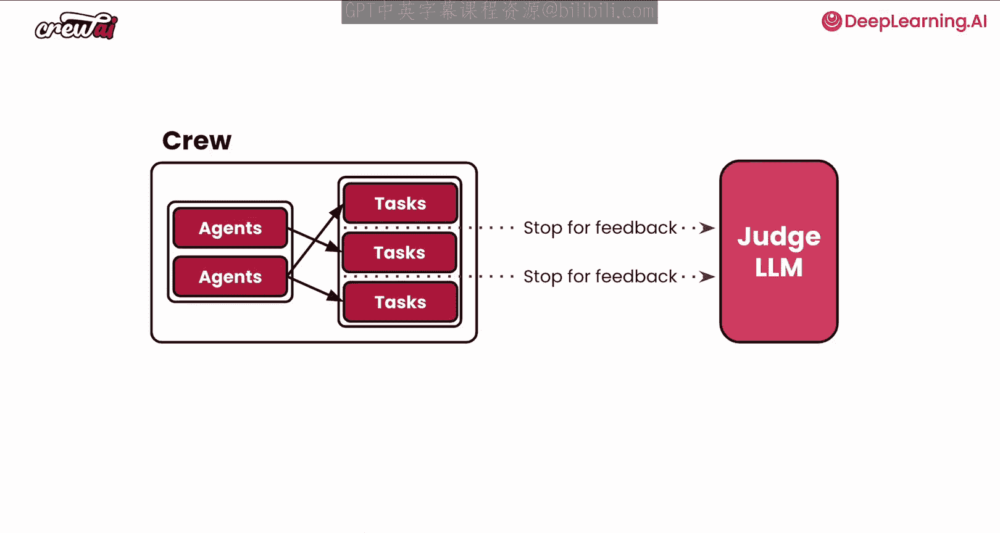
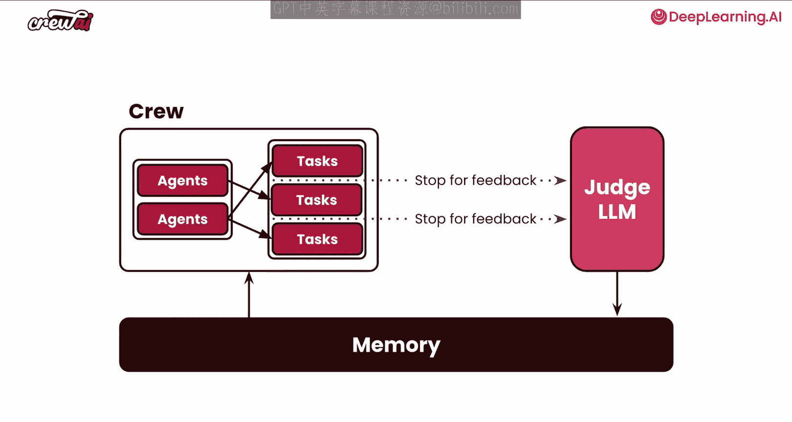
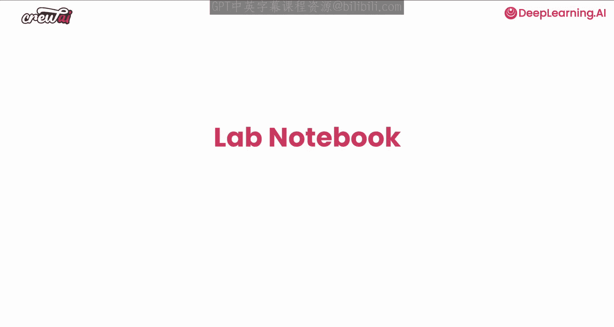

# 008：性能优化 🚀

在本节课中，我们将学习如何优化AI智能体及其团队的性能。性能优化是部署生产系统的关键环节，它涉及到在速度与质量之间做出权衡，并确保结果的一致性。我们将深入探讨如何测量和改进智能体与团队的表现。

## 速度与质量：核心权衡 ⚖️

上一节我们介绍了性能优化的目标，本节中我们来看看其核心权衡：速度与质量。

在AI自动化中，两个主要考量因素是**速度**和**质量**。

*   **速度**通常源于使用较小的模型。这些模型可以在较小的设备上运行，即使在云端运行也相当快。
*   **质量**通常与较大的模型相关，例如GPT-4等。这些模型擅长提供复杂的结果，但生成结果所需时间更长。

无论你优化的是哪个方面，有些任务可能需要速度，而另一些任务可能需要质量。但有一点必须确保，那就是**一致性**。

一致性是关键，因为你需要确保即使这是一个模糊的自动化过程，每次运行都能获得相同的速度或质量水平。

## 理解模型性能分布 📊

当我们思考较小和较大模型之间的分布时，会发现速度与模型大小接近线性关系：模型越大，速度越慢。

但质量与模型大小的关系则不一定如此线性。质量很大程度上取决于你试图完成的任务类型。如果智能体要完成的任务并不复杂，那么较小的模型可能已经能提供足够好的质量。

其美妙之处在于，当考虑生产用例和复杂用例时，你实际上可以在这个分布中选择不同的点。你可以让智能体在一个任务中使用一个模型，在另一个任务中使用另一个模型。关键在于，无论选择什么，都要保持一致性。因此，无论你为每个任务单独优化什么，都要确保这种优化是稳定一致的。

## 如何测量性能？ 📏

我们知道速度和质量是两个变量，并且我们希望保持一致性。但我们如何测量呢？

这就是测试智能体性能的意义所在。我们将讨论crewAI中的一个特定功能：`crewai task`。

## 利用 `crewai task` 进行测试 🧪

当你思考一个任务时，它基本上包含**描述**、**预期输出**和**执行智能体**。

有趣的是，通过比较描述和预期输出，你可以判断结果是否接近预期。这使我们能够对任务进行评分，并衡量其输出的好坏。

这是crewAI从一开始就做出的设计选择，旨在让你能够大规模地测试任务。

你可以在终端中使用 `crewai task` 命令来运行此测试。当你这样做时，你的团队会执行所有指定的任务，然后将这些信息传递给你可以设置的任意大语言模型作为“法官”。最终，你会得到一份报告，其中可以看到团队中的任务以及每次运行中每个任务的输出。

在报告中，你可能会看到很高的分数，但这并非总是如此。这是一种简单的方法，可以让你衡量智能体和任务输出的一致性和质量，以便采取行动。

例如，我们可能发现任务一的输出质量评分为7。

## 如何改进性能？ 🔧

我们如何改进这个任务、智能体乃至整个团队，使其能够持续地提升输出质量呢？

通常问题出在一些小细节上。可能是不遵循特定格式、未应用特定风格，或者缺少某些信息（例如信息来源的原始搜索记录）。

如果你能帮助智能体理解它们缺失了这些小细节，它们就能严格遵守要求，从而使你的输出质量更高，团队结果更好。

## 利用 `crewai train` 进行高效训练 🏋️

那么，如何在不花费大量时间改进描述和预期输出的情况下做到这一点呢？这就是 `crewai train` 功能的用武之地。

这个功能非常强大，可以对你团队的性能产生重大影响。你可以通过在终端运行 `crewai train` 命令轻松执行它。

当你执行此命令时，会发生以下几件事：

1.  你的团队会照常运行。
2.  但现在，每当它完成一个任务时，它会暂停，并针对团队中的每个任务向你征求反馈。
3.  你将能够告诉它缺失了什么。例如，对于任务一，可能缺少研究的原始搜索记录；对于任务二，可能缺少你希望遵循的特定格式。

关键在于，现在你可以为每个任务提供非常具体的反馈。一旦反馈完成，这些信息会自动推送给一个新的法官大语言模型。这个法官模型将提取该特定任务的每一个学习点，并将其推送到你的团队记忆中。

其运作方式是：从现在开始，每当你的团队再次运行时，对于每个任务，它都会记住你给它的反馈，并确保遵守这些反馈。这非常强大，因为它允许你构建非常复杂的用例，并在多次运行中获得相当一致的结果。

我强烈建议你尝试一下这个功能。

## 总结 📝

本节课中，我们一起学习了AI智能体团队的性能优化。我们探讨了速度与质量的核心权衡，以及保持结果一致性的重要性。我们介绍了如何使用 `crewai task` 命令来测量和评估任务性能，以及如何利用强大的 `crewai train` 功能，通过提供具体反馈来高效地训练和提升智能体，确保它们在后续执行中能持续改进并产出更高质量、更一致的结果。