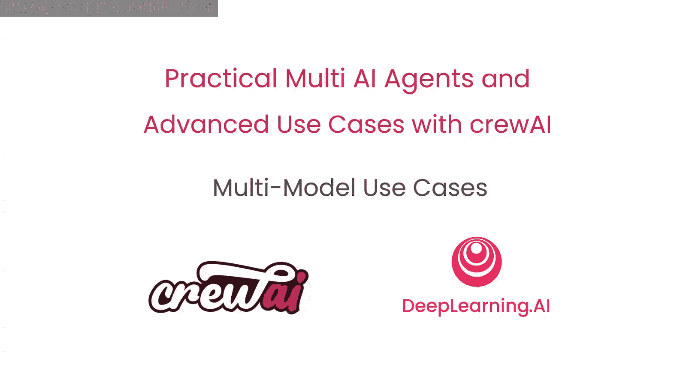
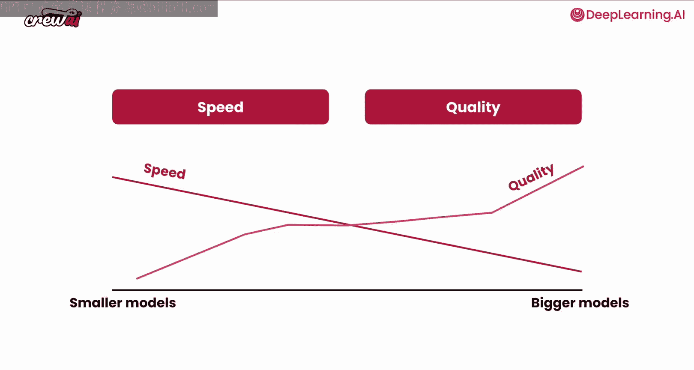
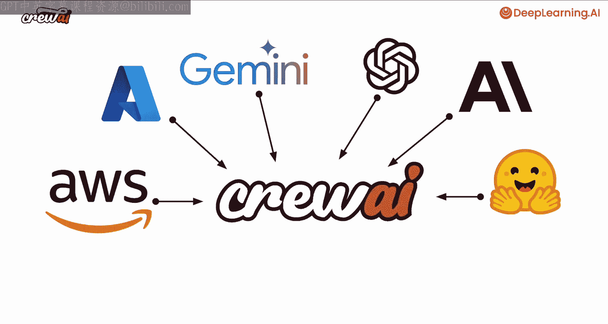
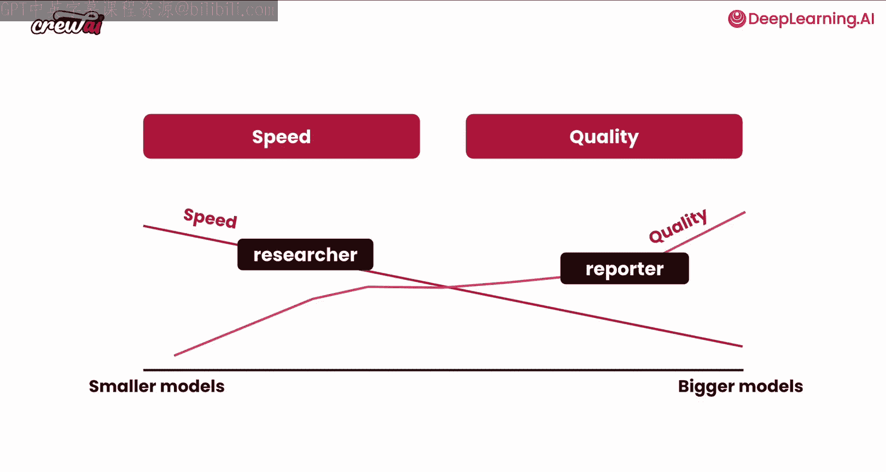
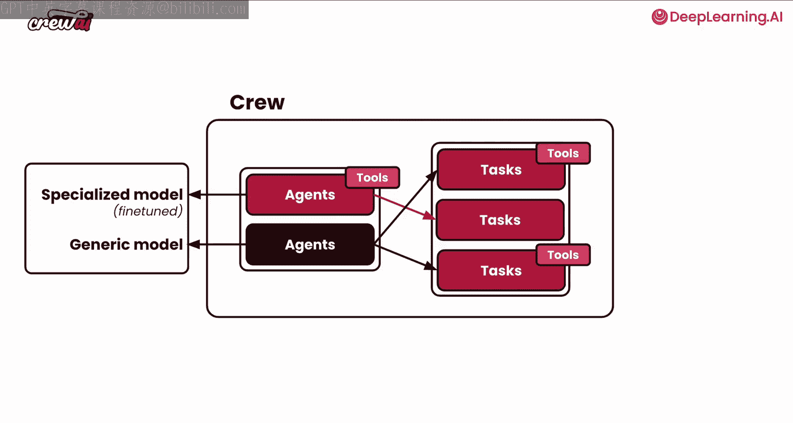
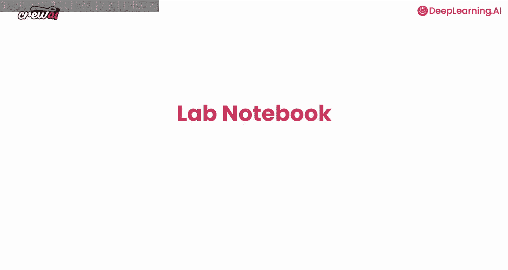

# 010：多模型智能体系统

在本节课中，我们将要学习如何构建一个由不同大语言模型驱动的多智能体系统。我们将探讨如何为不同的智能体分配不同规模或不同供应商的模型，以实现速度、成本、质量或专业性的优化。

## 🧠 多模型智能体系统概述

上一节我们介绍了智能体的基本概念，本节中我们来看看如何让多个智能体协同工作，并且每个智能体可以选用不同的大语言模型。

这意味着你可以让一些智能体由较小的模型驱动，而另一些智能体由较大的模型驱动。你甚至可以选择不同的模型供应商。你还可以探索使用特定的微调模型，从而构建完全由多模型组成的智能体团队。这可以针对不同目标进行优化，并解锁许多以前无法实现的新用例，让你能够创建非常专业的智能体。

接下来，让我们看看如何在智能体系统中使用多模型。

## ⚙️ 多模型实现原理与优势

现在，让我们谈谈多模型实现在CrewAI中是如何工作的，以及你能从中获得哪些好处。

我们已经了解到，较小的模型和较大的模型针对不同目标进行了优化。在某些用例中，你可能选择优化速度，而在其他用例中则优化质量。关键在于，使用CrewAI，你可以利用任何主流供应商的模型。

以下是你可以使用的模型供应商示例：
*   你可以使用AWS Bedrock和Anthropic的模型。
*   你可以使用Azure上的任何模型。
*   你可以使用Gemini。
*   你可以使用OpenAI、Anthropic或Hugging Face以及其他任何供应商的模型。

这意味着你拥有大量模型可供选择。其美妙之处在于，你可以为每个单独的智能体挑选和选择模型。

例如，你可以让智能体一号使用一个较小的模型，而智能体二号使用一个较大的模型。

这有助于针对不同目标进行优化。例如，你可以设定智能体一号是研究员，智能体二号是报告撰写员。它们协同工作能够产生比单独工作更大、更好的成果。

除了根据模型规模优化智能体之外，你还可以针对不同的供应商进行优化。例如，你可以让智能体一号使用Azure的模型，而智能体二号使用Anthropic的模型。

这为你提供了更大的灵活性，并可以应对诸如速率限制、以及你是否能访问特定供应商等问题。

除此之外，你还可以定制智能体以使用微调模型。你可以让一个智能体使用来自任何供应商的通用模型，而另一个智能体使用微调模型。这个微调模型可以是专门训练用于模仿你公司的写作风格、某个人的风格，或者具备关于你公司特定业务案例的非常专业的知识。

通过这种为单个智能体选择单个模型的能力，你可以在非常细致的层面上控制你希望智能体如何行为。这让你在想要构建何种用例以及希望智能体如何表现方面拥有很大的权力。

## 🛠️ 动手实践：构建多模型智能体

这非常有趣，但让我们动手构建一些东西。让我们深入其中，学习如何利用一些供应商的模型来为我们服务。

接下来，让我们进入Jupyter Notebook，亲自构建一些东西。我们稍后见。

本节课中我们一起学习了多模型智能体系统的核心概念与优势。我们了解到，通过为不同角色和任务的智能体分配合适的模型（如小模型优化速度，大模型或专业微调模型优化质量与专业性），可以构建出更高效、灵活且强大的智能体协作系统。这为开发复杂的AI应用提供了新的可能性。