# 011：大规模内容创作 🚀

在本节课中，我们将学习如何构建一个能够大规模创建内容的智能体团队。你将了解如何让智能体不仅监控网络，还能理解搜索目标，甚至利用RAG技术即时生成出色的博客文章。

## 概述

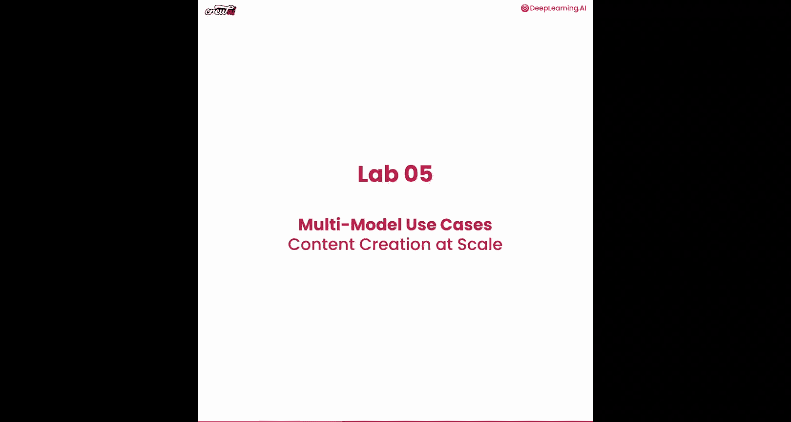

这是一个强大的应用案例。我们将构建一个能够大规模进行内容创作的智能体团队。这个团队将学习如何监控网络、理解搜索主题，并利用RAG技术即时生成高质量的博客文章。我们看到一些客户已经在实际部署此类应用。他们的做法是监控特定主题的新闻，确保能及时创建出能带来实际效果的内容，以此进行内容营销。

为了实现这个用例，我们首先要确保我们的智能体团队能够与互联网交互，并能够搜索相关内容和新闻。接下来，我们将配置多个智能体和任务。

为了能够解析这些信息，我们将从市场分析师智能体开始。然后，我们将依次配置数据分析师智能体、内容创作者和首席内容官。这四个智能体将执行四项不同的任务：解析最新新闻、搜索市场趋势、撰写博客和社交媒体内容，最后审查所有内容以确保其质量。

这些智能体通过顺序处理数据，能够为我们生成关于当前热门话题的精彩博客文章和社交媒体内容。

一个有趣的地方是，我们可以优化其中一些智能体和任务，使其运行得更快。为此，我们将使用一个主要的提供商来驱动这些智能体，即Groq。Groq是目前最快的推理提供商之一，其模型运行速度极快，使得这些智能体能够迅速处理大量新闻和市场趋势。因此，我们将确保这些智能体使用Groq运行。

对于这个团队，我们使用了之前未使用过的工具组合，这非常有趣。我们使用Serper进行网络搜索，同时将RAG作为一种工具使用。这意味着我们不仅能抓取整个网页，还能使用网站搜索工具。

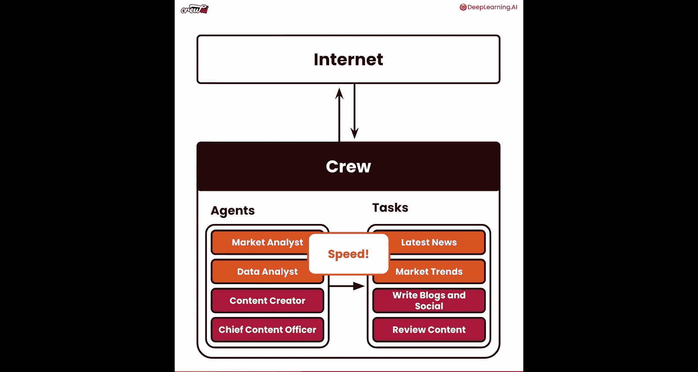

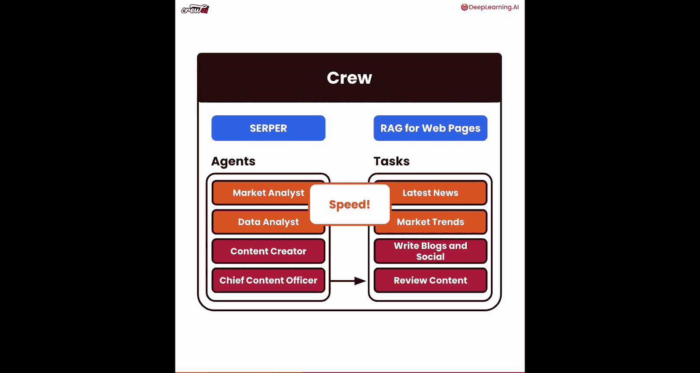

这个网站工具将使我们的智能体能够自动下载内容、即时嵌入内容、将其推送到向量数据库，然后对其进行搜索。这样，你的智能体就能够独立进行数据库操作和搜索，这解锁了许多潜在的应用场景。

最终，我们将得到一个内容创作团队，它将执行以下几项工作：搜索金融主题的最新新闻；搜索并分析相关的市场数据；基于这些信息创建社交媒体内容；根据所学知识撰写一篇完整的博客文章；最后，确保审查博客文章，使其内容通顺。

如果结合我们在其他课程中学到的训练和测试方法，这些内容的质量会非常高。现在，让我们深入代码，亲自构建这个团队。

## 代码实现

我们将从导入所需的类和模块开始。确保设置好所有环境变量，并从CrewAI导入主要类，就像我们在其他课程中做的那样。

现在，我们将创建一个结构化输出，以确保从团队获得的数据能够被使用并推送到其他系统中。这个结构化输出非常简单直接。

我们将创建一个`ContentOutput`模型，它包含文章本身和社交媒体帖子。社交媒体帖子是一个`SocialMediaPost`模型的列表，该模型基本上包含平台和内容。因此，在这个团队执行过程中，它不仅会撰写文章，还会生成配套的社交媒体帖子，以便我们可以在LinkedIn、Twitter等平台发布。

现在，让我们加载智能体和任务的YAML文件。加载智能体和任务的YAML文件非常简单，与我们之前的方法相同。

让我们看看我们的智能体和任务。这里有四个智能体：首席市场分析师、首席数据策略师、创意内容总监和首席内容官。你可以根据需要自由调整这些智能体的角色、目标和背景故事，看看是否能得到不同的结果。

现在，让我们检查一下任务。我们也有四个任务：第一个任务是监控和分析最新新闻；第二个任务是分析给定主题的市场数据和趋势。在这里，你可以看到我们再次在任务中插入了变量，就像在其他课程中一样。这意味着当我们启动团队时，需要确保传递这个输入。

你还可以看到，我们有一个内容创建任务，它基于洞察力尝试不仅撰写博客文章，还生成配套的社交媒体更新。然后，我们有一个质量保证任务，负责审查和优化关于该主题的所有内容，确保博客文章和社交媒体帖子都符合要求。

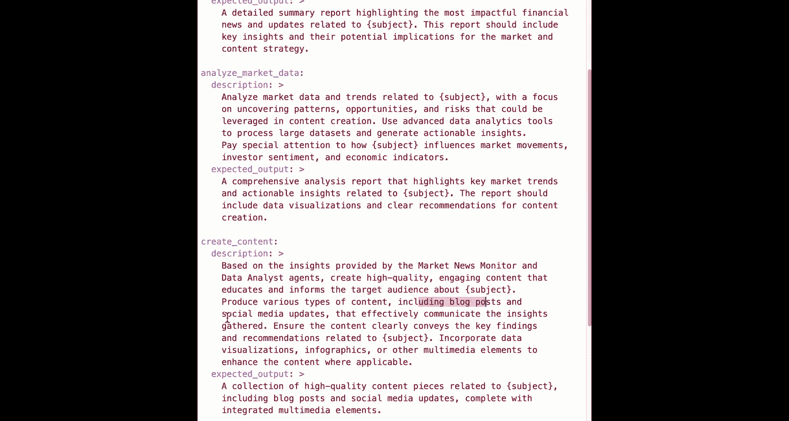

现在，让我们回到代码并继续构建。

现在，让我们导入我们将要使用的CrewAI工具。这些工具非常简单：我们使用通常的Serper Dev工具进行谷歌搜索，以及我们的网站抓取工具来抓取整个网站的内容。但这次我们引入了一个新工具：网站搜索工具。这是一个RAG即工具。

它的作用是，当我们的智能体搜索互联网并找到包含有趣信息的网站时，它会自动下载这些网站，将其分解成更小的块并进行批处理，然后保存到本地嵌入数据库中，以便你可以实时进行向量搜索。你的智能体会自行完成所有这些操作，你无需担心任何细节。它们将生成嵌入，并选择搜索什么以及何时搜索。

既然我们知道了将要使用的一个工具，接下来让我们导入并设置本课将要使用的LLM。请注意，我们在这个例子中使用了多个模型，以展示其强大功能以及如何针对特定任务优化某些方面。

首先，让我们设置OpenAI模型。我们将设置`OPENAI_MODEL_NAME`环境变量，并将其值设为`gpt-4o-mini`，这是CrewAI的默认设置，但我们仍然进行设置，以便更明确和直接。

我们还将使用一个Groq模型，具体是`Llama-3.1-70b`。我们可以通过设置一个变量来实现，稍后在创建智能体时会引用这个变量。它是一个Groq模型，模型名称是`llama-3.1-70b-versatile`。

现在，让我们创建我们的智能体、任务和团队。首先创建智能体。对于智能体，我们将使用智能体配置的YAML文件。你可以看到，市场新闻监控智能体拥有与数据分析师和内容创作者不同的工具集。

市场新闻智能体可以访问Serper Dev工具进行互联网搜索，还可以访问网站抓取工具来从整个网站提取信息。这对于该智能体很有用，因为它试图广泛地寻找我们关心主题的尽可能多的信息。

然后，我们的数据分析师智能体和内容创作者可以进行谷歌搜索，但现在它们也会对找到的任何内容进行RAG搜索。这样，它们就不需要解析整个网站及其所有信息，而是搜索它们关心的特定主题。

最后，我们的质量保证智能体没有任何工具，负责确保内容看起来和听起来都很棒。

创建好智能体后，让我们创建任务。我们也将有四个不同的任务，每个智能体一个。第一个任务只是监控新闻，第二个任务是分析市场，第三个任务是创建内容。如果你仔细观察，可以看到我们传递了一个`context`属性，将监控金融新闻和分析市场任务的结果都带入这个任务中。这样，当它撰写内容和社交媒体帖子时，就拥有了完成这项工作所需的所有信息。

在我们的最终智能体——质量保证智能体中，将执行质量保证任务，并确保无论我们得到什么输出，都会使用上面声明的模型，这样我们不仅得到实际的文章，还得到所有不同社交网络的社交帖子。

创建好任务后，让我们将它们整合到我们的团队中。对于我们的团队，我们只需要将智能体和任务组合到这个单一对象中，这个团队就准备就绪了。让我们启动它，看看它是如何工作的。

现在，我们将启动这个团队，这将非常有趣，因为想想这里发生的一切：我们有智能体在研究网络，抓取网页；然后有智能体下载内容、分解成块、生成嵌入、存储到向量数据库，并自动搜索以找到撰写最精彩文章所需的每一段信息。这是一个非常棒的设置，允许你创建许多不同的内容。

让我们启动这个团队。别忘了你需要传递输入，因为我们需要告诉它我们希望内容是关于什么主题的。在这个例子中，我们选择了一个复杂的主题：我们希望找到关于2024年美国通胀及其对股市影响的具体信息。你可以看到这是一个非常困难的任务，但这些智能体可以处理它。让我们运行它们。

😊，看看我们得到了什么？让我们从监控第一个智能体——首席市场分析师开始。它的第一个任务非常直接：监控和分析金融市场的最新新闻和更新。在这个例子中，它开始搜索2024年美国通胀及其对股市影响的最新新闻。我们可以看到它找到了很好的信息来源，比如德勤、华尔街日报、今日美国等，它找到了一堆可以使用的信息。

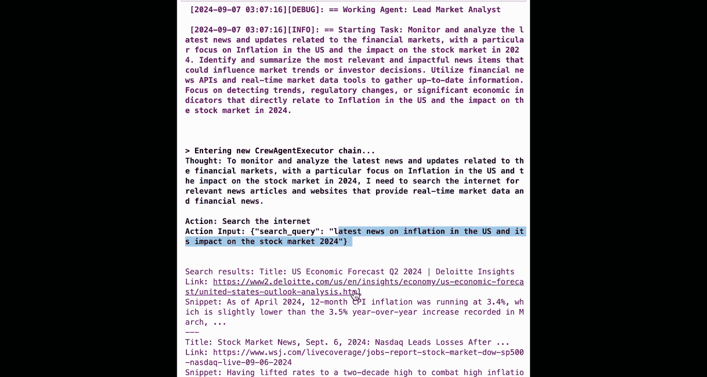
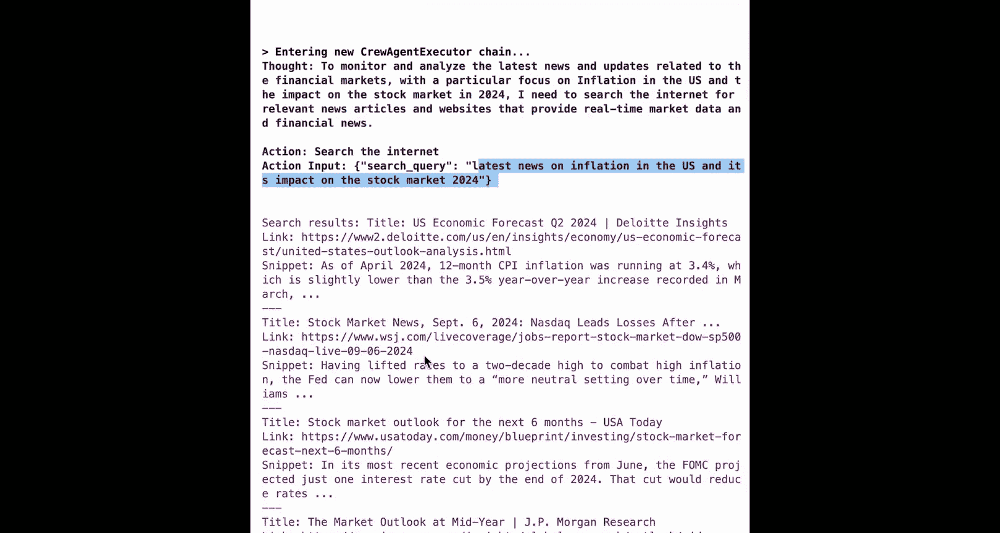

从这一点开始，你可以看到它通过查看其中的所有内容来帮助抓取网站内容，确保我们找到学习此事所需的所有信息。

现在，我们的首席市场分析师完成了工作，并为我们提供了一份完整的报告和摘要，涵盖了所学到的关于美国通胀率对股市潜在影响的一切，包括消费者价格指数等等。

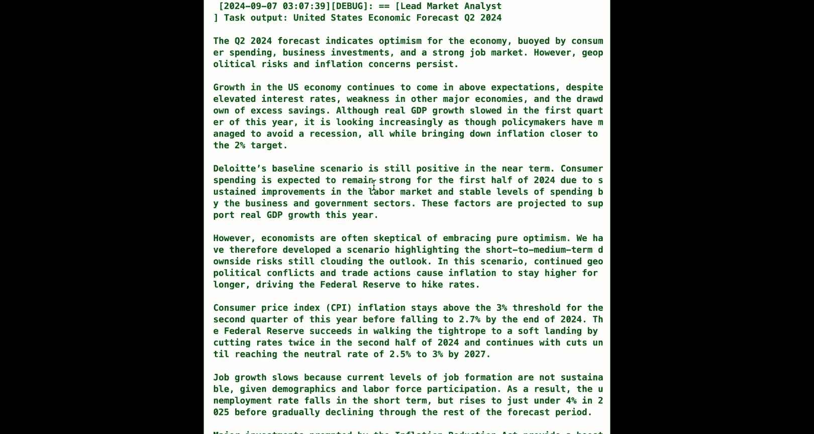

第一个智能体完成工作后，让我们看看接下来会发生什么。

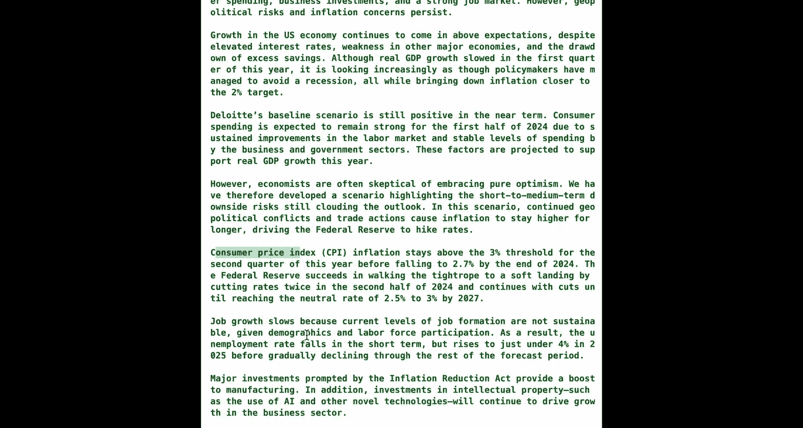
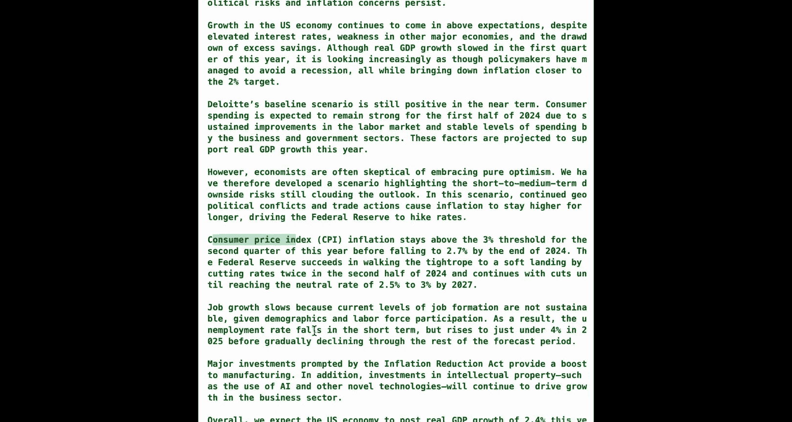

在这里，我们可以看到我们的第二个智能体——首席数据策略师，开始分析市场数据，以更好地理解美国通胀对实际股市的影响。你可以看到它从简单的搜索开始。

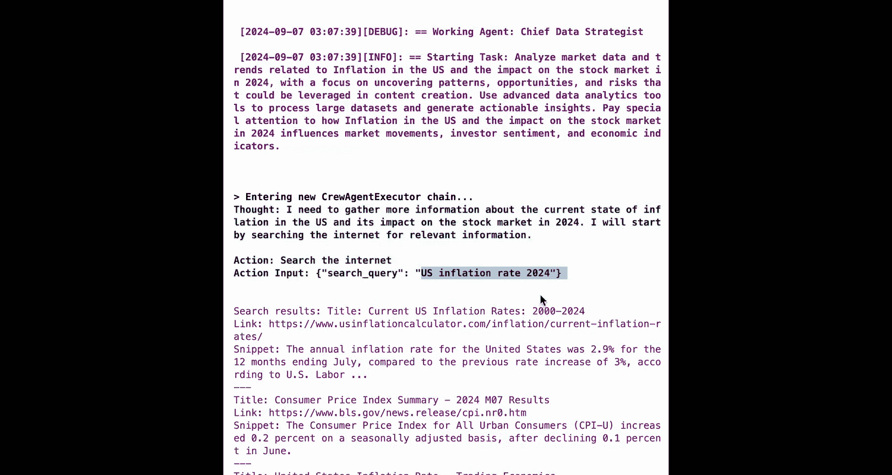

现在，我们的首席数据策略师完成了工作。你可以看到它提供了一个相当长的摘要，包括当前状态、通胀率、股市影响，甚至关键趋势、机会和风险。

现在，我们的内容创作者将开始围绕我们撰写博客材料和社交媒体帖子。

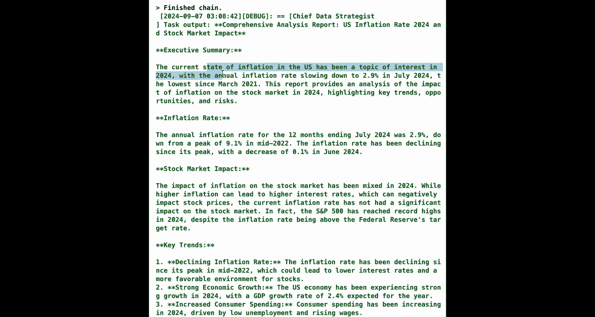

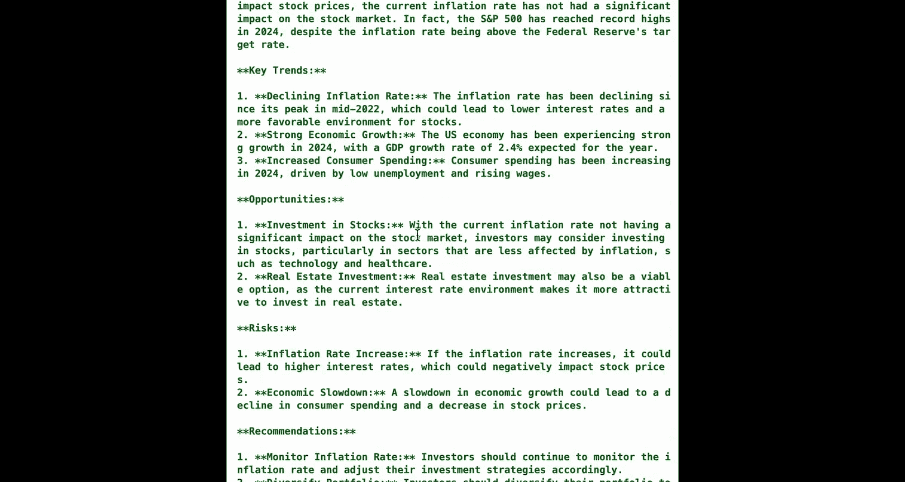

在这里，你可以看到我们的创意内容总监开始工作，基于洞察力撰写博客文章的初稿。让我们看看结果如何。在这里，你可以看到我们的智能体搜索了2024年美国通胀趋势及其对市场分析的影响，并在整个网络上找到了大量数据。

😊。

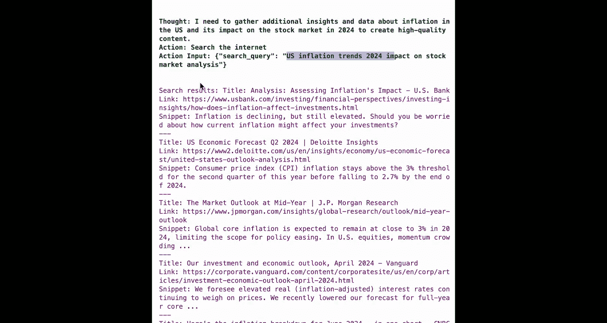

但它并没有就此停止，而是决定深入研究德勤的特定网页，以了解通胀对美国的影响。这不仅仅是抓取网站，这是使用RAG即工具。它会自动下载该网页的内容，然后即时嵌入并将其推送到ChromaDB中，以便你实际进行搜索。在这里，你可以看到返回的内容仅针对该智能体实际关心的特定内容。这非常有趣，因为你的智能体基本上是在进行RAG并即时构建向量数据库。

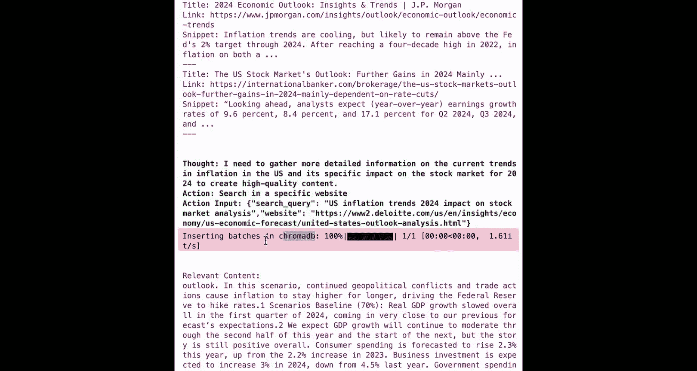

让我们继续，看看这个智能体是如何工作的。

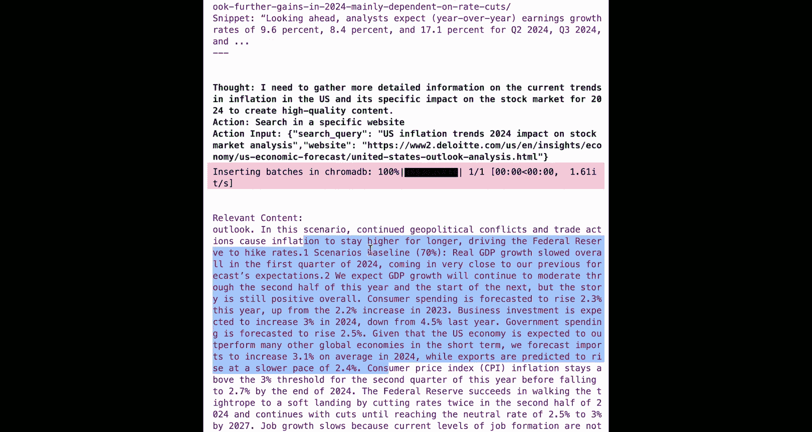

在这里，我们可以看到我们的最终智能体——首席内容官，完成了内容审查，并返回了一个遵循我们在本课早期创建的`ContentOutput`模型的对象。现在让我们进一步检查它，以便更好地了解这篇文章的实际内容。

首先，让我们检查该智能体为我们创建的社交媒体内容。在这里，你可以看到它为Twitter、LinkedIn和Instagram创建了帖子。你可以看到Twitter和Instagram有表情符号，但LinkedIn没有。这是一个非常有趣的概念，这些模型实际上能够理解LinkedIn可能不像其他社交网络那样接受表情符号。

现在，让我们看看博客文章。另一个值得强调的地方是，你可以看到LinkedIn帖子的语气比Instagram上的要专业得多，甚至在Instagram帖子中，它提到了“向上滑动阅读专家分析”。这非常理解在Instagram上，人们使用该产品的方式与LinkedIn等平台存在某些动态差异。

现在，让我们看看博客文章的实际内容。好的，我将首先以Markdown格式打印这篇博客文章，以便我们真正阅读并理解其中的一些影响。

就是这样，这就是关于2024年美国通胀及其对股市影响的博客文章。它有引言、通胀现状、通胀驱动因素、未来通胀预测、影响和股市影响，甚至涉及短期和长期考虑，并为投资者提供了一些建议。

这就是我们最终由这些智能体撰写的博客文章，从一个非常复杂的单一主题开始，然后四处研究网络以获取对该主题的更好理解，接着在特定网页上使用RAG即工具以收集其中最重要和最相关的信息，然后确保它们写出精彩的内容，并审查这些内容以确保其坚实可靠。

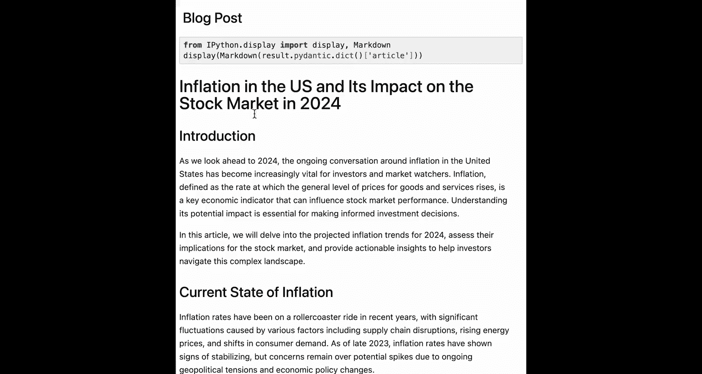
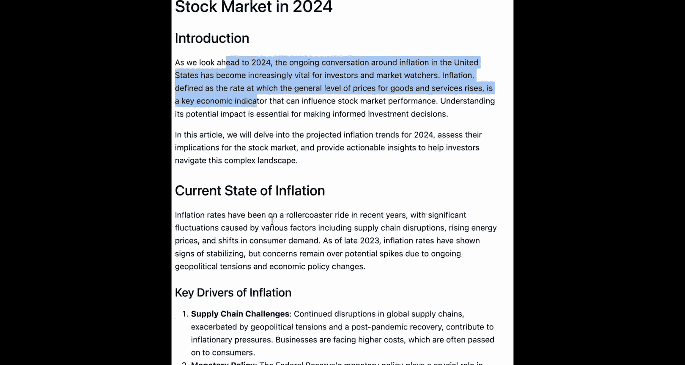
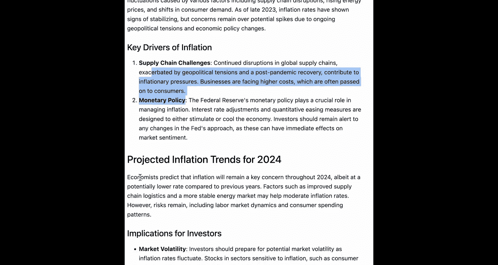
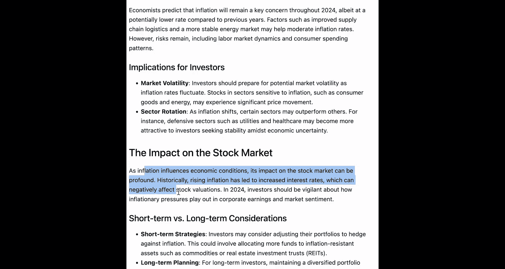
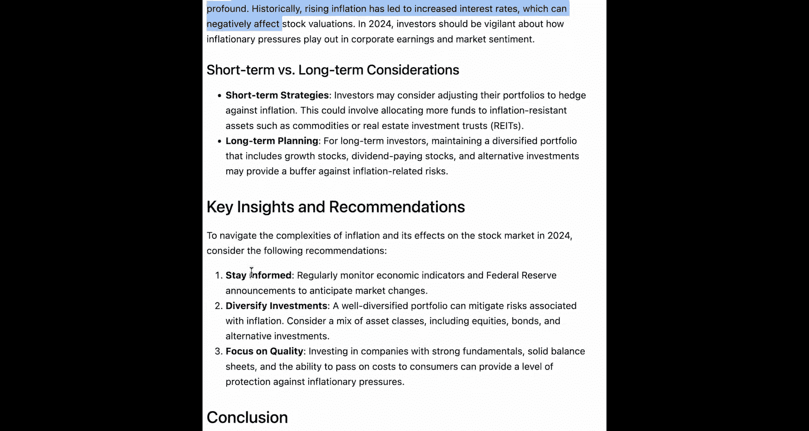
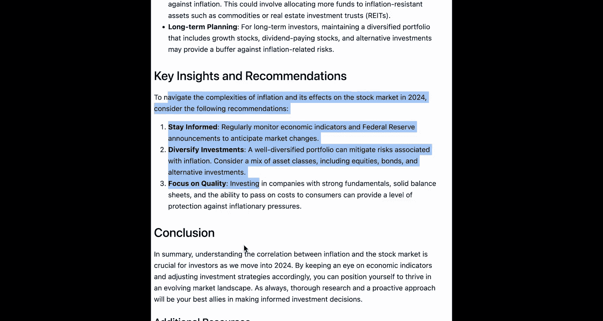

在这里，你有一个很好的用例，我们看到一些CrewAI的客户和用户实际上已经部署了这些用例来进行大规模的内容营销。这解锁了许多关于如何使用它来不仅生产内容，还使用这些不同的工具和模型来自行构建有趣事物的用例。

请记住，这四个智能体中有两个使用Groq运行Llama 3.1 70B，速度非常快。因此，你可以有一些针对速度进行优化的智能体，它们将使用像这样的模型和像Groq这样的提供商，而其他智能体将使用更大的模型，比如内容撰写智能体使用ChatGPT的情况。

这是一节非常有趣的课程，希望你和我一样乐在其中。现在，让我们进入下一课，开始讨论更多的用例。我们稍后见。

😊。

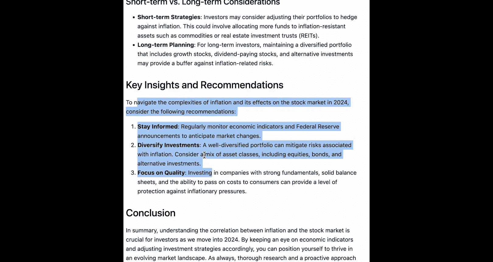

## 总结

在本节课中，我们一起学习了如何构建一个能够大规模创建内容的智能体团队。我们了解了如何配置多个具有不同角色和工具的智能体，使其能够监控新闻、分析市场趋势、撰写内容并进行质量审查。通过结合使用Serper、网站抓取和RAG即工具，我们实现了智能体自主搜索、处理信息并生成高质量博客文章和社交媒体内容的能力。我们还看到了如何通过使用不同的LLM提供商（如OpenAI和Groq）来优化任务执行速度和质量。这个强大的框架为自动化内容营销和许多其他应用场景打开了大门。