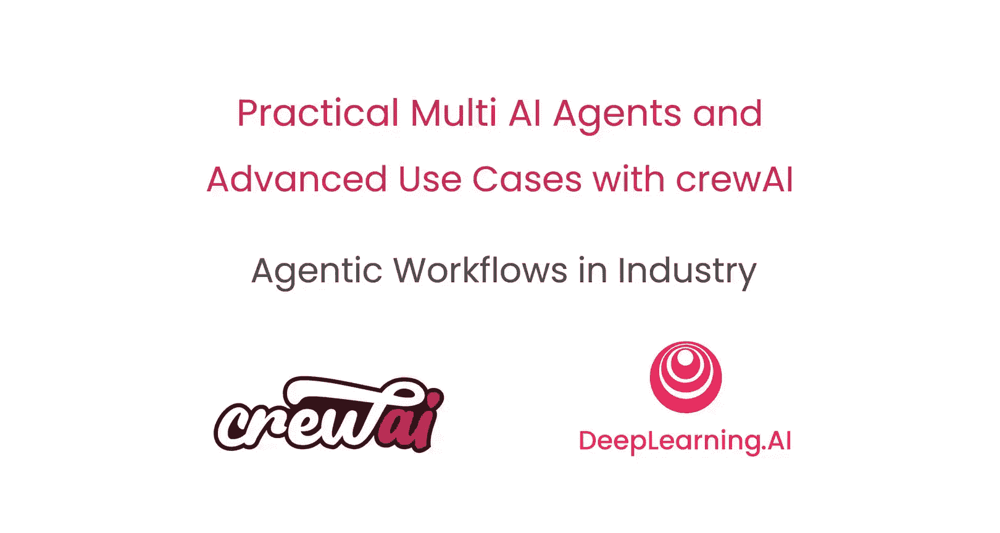

# 012：生产环境部署与价值实现 🚀

在本节课中，我们将探讨如何将AI智能体工作流部署到生产环境，并了解其带来的监控需求与商业价值。我们特别邀请了来自普华永道的行业专家Jacob，分享他们在企业级环境中应用CrewAI平台的经验与洞见。

---

上一节我们探讨了智能体的构建与协作。本节中，我们来看看如何将智能体系统投入实际生产，并衡量其成效。

## 企业为何探索AI智能体方案？

普华永道在约两年前开始其生成式AI转型。当时，可用的智能体框架很少，技术也处于早期阶段。因此，他们最初开发了自己的专有框架来启动项目。随着技术演进和用例复杂度的增加，团队需要重新评估方案，以优化解决方案的**准确性**和**整体用户体验**。

## 采用AI智能体的关键驱动因素

决定采用AI智能体的核心因素，正是上文提到的准确性与用户体验。例如，在软件开发生命周期转型和生成长篇复杂文档（如功能规格说明书）的初期方案中，顾问们反馈需要更**实时的反馈**。这促使团队意识到，是时候引入智能体来提供实时反馈，并将反馈整合到解决方案中，通过多轮验证来达成正确的结果。

## CrewAI平台如何助力？

对于并非天生就是智能体专家的广大开发者而言，使用智能体框架处理复杂用例存在一定的入门门槛。CrewAI的优势在于其**低门槛**，能让任何人快速上手并开始创建智能体。同时，对于更资深的开发者或数据科学家，它也提供了深入底层API的**灵活性**，以便按需进行深度定制。

## 部署AI智能体的间接收益

除了直接目标外，部署AI智能体带来了一个重要的间接收益：**流程透明度**。在推动业务转型时，企业需要分析和监控众多方面，以衡量效率提升和投资回报。CrewAI与智能体监控工具的原生集成，提供了直接的可见性。团队可以查看智能体完成任务所需时间、在此过程中选择了哪些工具，并能详细分析数据，比较智能体与顾问完成同一流程的时间，从而清晰地解释**投资回报率**。

以下是监控可提供的关键洞察维度：
*   **任务耗时**：智能体完成特定任务所需的时间。
*   **工具使用**：智能体在执行过程中调用哪些工具或API。
*   **效率对比**：智能体与人工执行相同任务的效率差异。

## 早期成果与影响

在代码生成这一主要用例中，效果提升显著。普华永道为客户实施的大型系统涉及许多专有开发语言。在采用智能体工作流之前，代码生成的准确率波动很大，有时低至**10%**。引入智能体后，通过实时代码验证、在真实运行时环境中执行代码并分析日志输出以生成更好的代码，准确率提升至**70%** 以上。

## 规模化实施的主要挑战

实施AI智能体规模化应用时，除了通用的技术和GenAI解决方案的扩展性问题（如令牌限制、速率限制）外，更大的挑战在于**开发模式的标准化**。如何为创建的智能体制定标准？如何让为代码生成用例创建的智能体在不同专有语言间复用？这更多是关于优化智能体创建模式、实现跨用例复用的工作。

## 从测试到生产的过渡

从测试环境过渡到生产环境，技术上的基础设施挑战依然存在。但更困难的部分在于**变革管理**和**人力因素**。如何推动变革与采纳，让人们习惯于在日常工作流程和业务流程中与智能体协同工作，这是团队近期投入大量精力的领域。

## 成功的最关键因素

回顾普华永道的智能体应用之旅，最关键的成功因素始终是**准确性**和**用户体验**。如果无法驱动正确的准确性和体验，用户的信任会迅速丧失，而一旦在初期失去信任，要重新赢回将困难得多。

## 给其他企业的建议

对于考虑采用AI智能体技术的企业开发者，建议是：**从简单开始，逐步增加复杂度**。遵循“爬、走、跑”的古老格言。可以从一些基础的提示工程、检索增强生成管道应用开始，识别需要解决的缺口。面对更大的缺口和更高的复杂性时，像CrewAI这样的智能体框架和工具就能介入，帮助填补这些缺口，确保驱动更高的准确性和更好的用户体验。

---

本节课中，我们一起学习了将AI智能体工作流部署到生产环境的核心考量，包括其驱动因素、关键收益、面临的挑战以及成功要素。通过普华永道的实际案例，我们看到了智能体技术如何显著提升特定任务（如代码生成）的准确性，并强调了变革管理与用户体验在成功落地中的重要性。