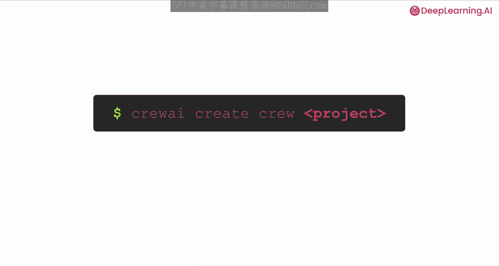
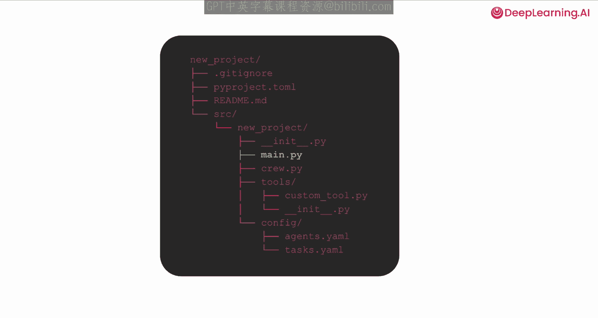
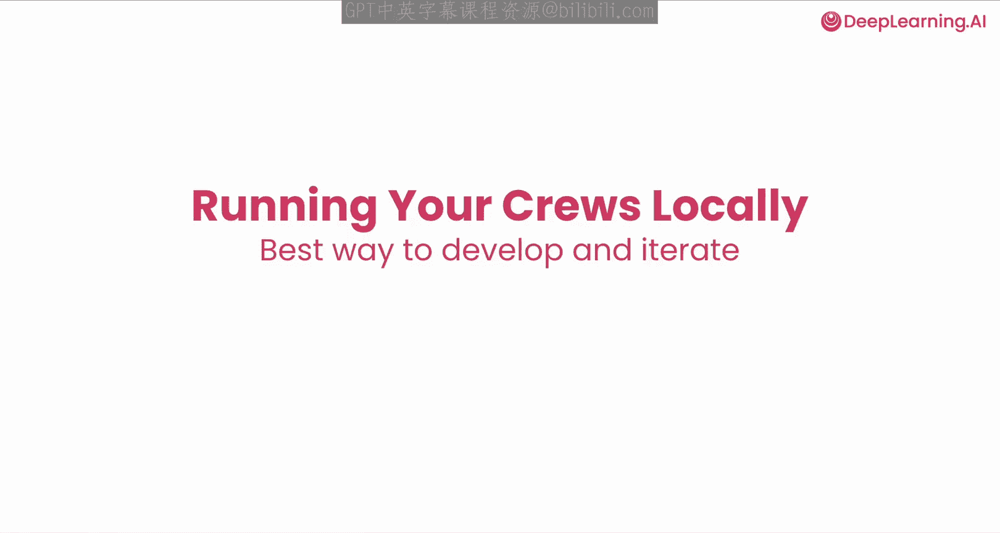
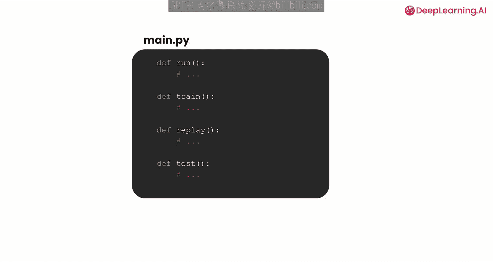
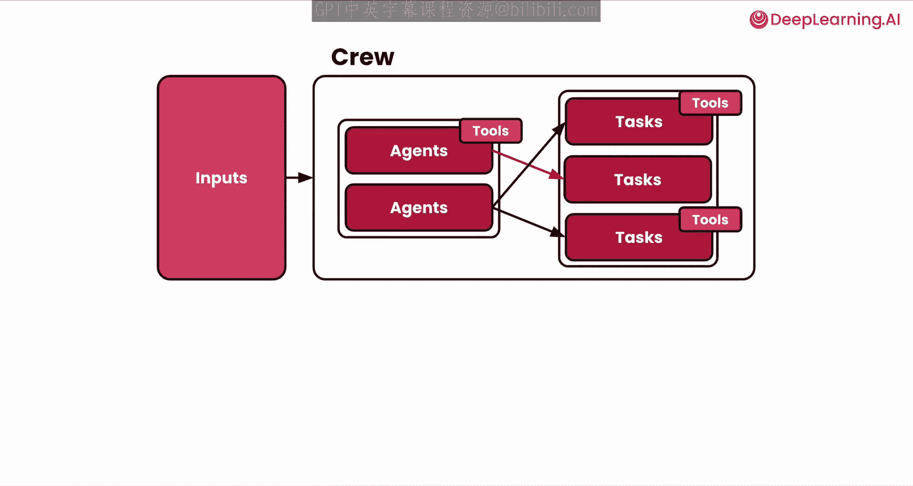
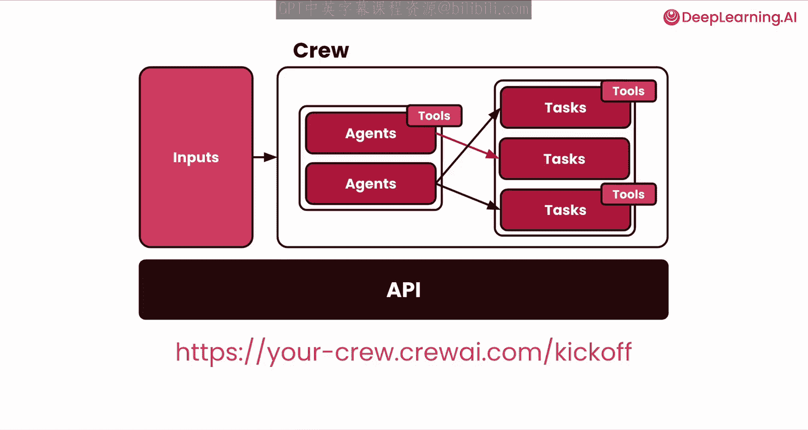
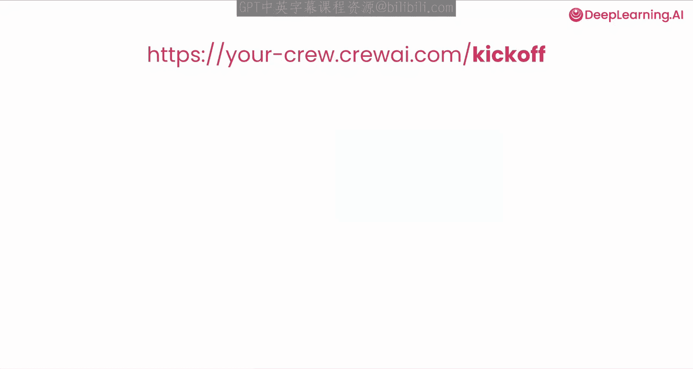
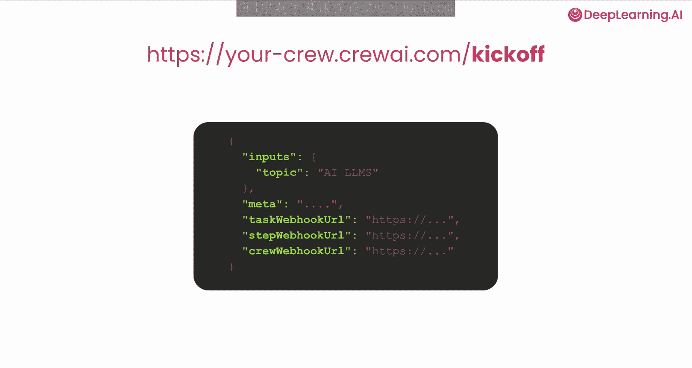
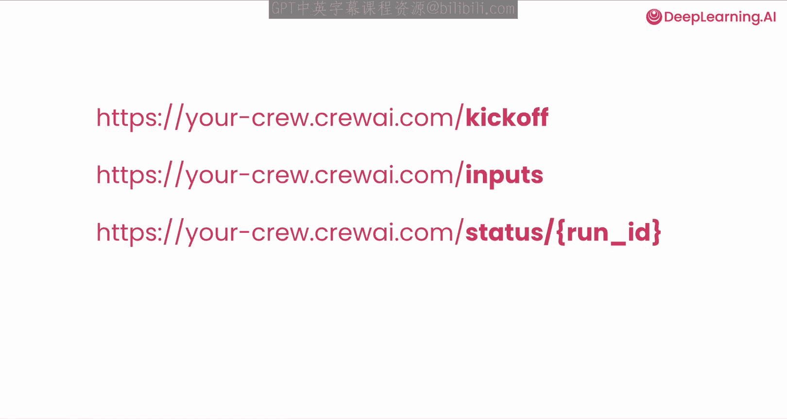

# 013：部署与监控

在本节课中，我们将学习如何将构建好的AI智能体团队（Crew）部署到生产环境，并探讨其监控方法以及能为团队和公司带来的价值。

## 🚀 从零开始创建Crew项目

到目前为止，我们一直在Jupyter Notebook中运行和测试Crew。现在，我们将学习如何从头开始创建一个全新的Crew项目。

crewAI提供了一个非常简单的命令行工具，只需一行命令即可创建包含所有必要文件夹结构的新项目。



以下是创建新项目的命令：
```bash
crewai create {项目名称}
```
执行此命令后，系统会自动生成项目所需的所有文件和目录结构。


## 📁 项目结构解析

让我们了解一下自动生成的项目文件。

**README.md**： 此文件包含了项目的所有说明。你可以在这里找到如何安装依赖、运行代码、设置环境变量等所有必要信息。

**agents.yaml 和 tasks.yaml**： 这两个文件与我们之前在Jupyter Notebook中构建的完全一样。你可以在这里定义特定的智能体和任务。

**tools/** 文件夹： 此文件夹用于存放自定义工具。如果你需要集成内部或外部API、连接数据库或其他系统，可以在这里编写和放置你的代码。



**crew.py** 文件： 这是将你的智能体和任务组合在一起的核心文件。你可以通过加载 `agents.yaml` 和 `tasks.yaml` 文件来创建智能体，这与我们在Jupyter Notebook中的做法非常相似。在这里，你还可以导入自定义或内置的工具，并将其分配给相应的智能体。

**main.py** 文件： 此文件用于在本地运行你的Crew。通过执行这个文件，你可以运行、训练和测试你的Crew，以及使用我们之前介绍过的所有功能。


## ⚙️ 安装依赖与本地运行

在开始修改和运行代码之前，你需要首先安装项目依赖。



运行以下命令来安装所有依赖项，并自动创建一个虚拟环境：
```bash
crewai install
```



安装好依赖后，你可能会问如何在本地运行Crew以进行开发和迭代测试。

我们之前提到的 `main.py` 文件是关键。这个文件包含几个重要的函数：

*   **run 函数**： 当你执行 `crewai run` 命令时，实际运行的就是这个函数。这个函数通常是一个样板，你无需做太多修改，主要可能需要调整传递给Crew的输入参数。
*   **其他函数**： 类似地，还有用于训练、重放和单个任务测试的函数。

你可以通过命令行工具来调用这些功能：
*   `crewai run` - 执行你的Crew。
*   `crewai train` - 运行训练。
*   `crewai replay` - 重放执行过程。
*   `crewai task` - 执行单个任务测试。

最常用的命令是 `crewai run`，它负责执行你的Crew。




## ☁️ 部署到生产环境



现在你可以在本地运行和修改Crew了，那么如何将其部署到生产环境，以便与其他服务集成和使用呢？

这就是我们需要讨论的Crew部署环节。

crewAI 提供了 **crewAI+** 功能，你可以免费使用。只需运行以下命令，即可将你的智能体部署到云端：
```bash
crewai deploy
```

这个过程非常神奇。你的Crew（包含智能体、任务和工具）以及一系列输入参数，会被自动转换成一个API。现在，你可以通过向这个API端点发送POST请求并传递输入参数，来调用你的Crew。




## 🔗 集成与共享

拥有一个可作为API调用的生产级Crew后，你就可以将其与任何外部系统集成。

你可以从 Slack、HubSpot、Zapier 或任何其他系统中调用这个API。更有趣的是，你的Crew也可以通过轮询功能或Webhook回调任何你指定的URL或应用程序。

当你部署API后，主要会调用一个“启动”端点。你可以向它发送详细信息，包括：
*   **Crew期望的输入**： 例如，在我们的用例中，我们传递了一个名为 `topic` 的输入参数，它将在智能体和任务中被使用。
*   **元数据**： 你也可以传递任何需要的元数据信息。
*   **Webhook设置**： 你可以为任务完成、步骤完成或整个Crew完成等事件设置特定的Webhook。这为你提供了极大的灵活性，允许你将Crew的执行进度与时间线或其他UI界面集成，并展示给用户。



此外，你还可以使用其他端点，如 **inputs** 端点获取输入信息，**status** 端点轮询Crew的执行状态。这解锁了无数可能性，让你不仅能本地运行Crew，还能将其与公司现有系统、数据或消息平台集成，从而最大化智能体的价值。


## 🎯 课程总结



在本节课中，我们一起学习了如何将AI智能体团队（Crew）从开发环境带入生产环境。我们涵盖了从使用 `crewai create` 命令创建新项目，到理解项目结构、安装依赖、在本地运行和测试，再到使用 `crewai deploy` 命令将Crew部署为云端API的完整流程。最后，我们还探讨了如何通过API和Webhook将部署好的Crew与外部系统（如Slack、HubSpot等）进行集成，从而实现价值的最大化。现在，你已经掌握了将AI智能体应用落地的关键部署与集成技能。