# 014：14.L6 为生产环境构建你的Crew

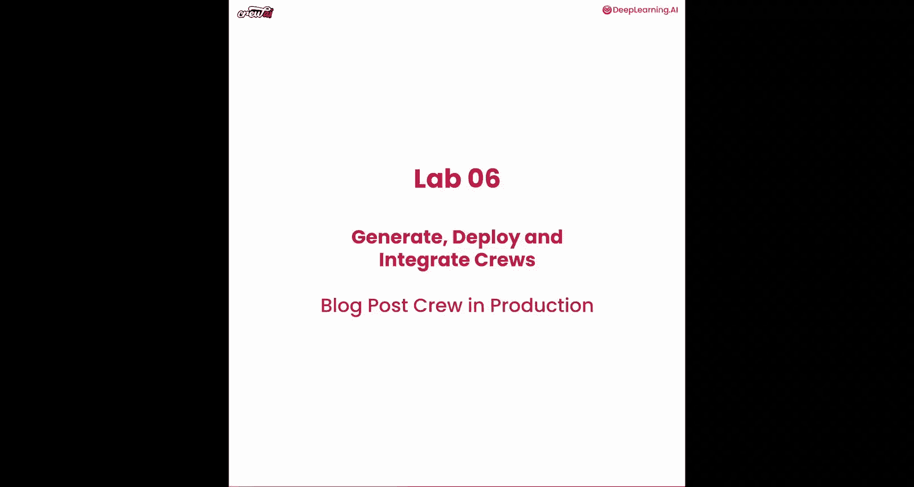

在本节课中，我们将学习如何从零开始构建一个可用于生产环境的Crew。我们将使用命令行工具创建项目、安装依赖并执行Crew，了解其完整的文件结构和工作流程。

## 概述

在之前的课程中，我们主要在Jupyter Notebook环境中构建和运行Crew。本节内容将有所不同，我们将学习如何从零开始，使用命令行工具创建一个独立的、可用于生产环境的Crew项目。这将涉及项目初始化、依赖管理、环境变量配置以及最终的执行。

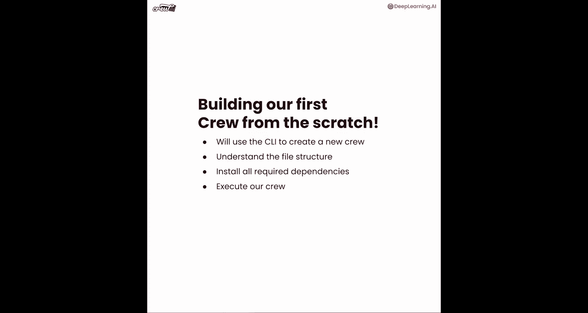

## 创建新项目

首先，我们需要创建一个新的Crew项目。这可以通过一个简单的命令行指令完成。

以下是创建新项目的步骤：

1.  打开你的终端或命令行界面。
2.  运行命令 `crewai create crew <项目名称>`。例如，我们可以将项目命名为 `new_project`。
3.  执行该命令后，系统会自动生成一个包含所有必要文件的初始项目文件夹。

运行命令后，你将看到初始文件夹已创建，其中包含了运行Crew所需的所有文件。这些文件包括：
*   `pyproject.toml`：用于管理项目依赖。
*   `main.py`：Crew的主执行文件。
*   `agents.yaml` 和 `tasks.yaml`：用于定义智能体和任务的配置文件。
*   其他配置文件，如 `.gitignore`。

至此，我们的项目框架已经准备就绪。

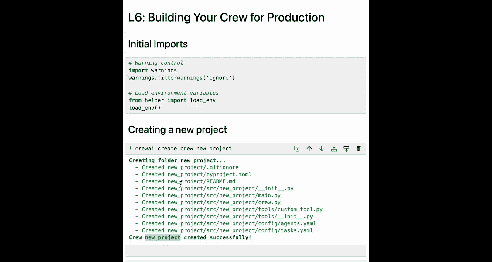

## 安装项目依赖

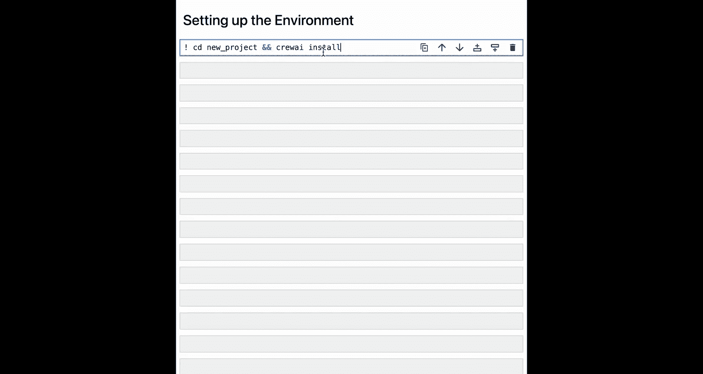

项目创建完成后，下一步是安装运行Crew所需的所有依赖包。

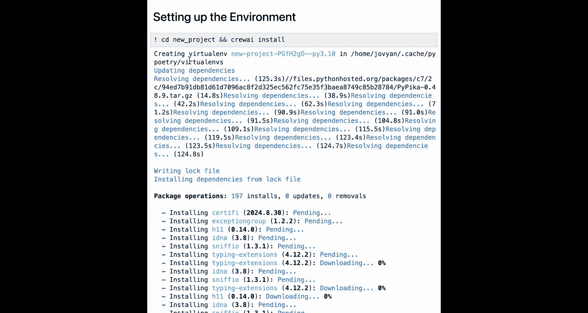

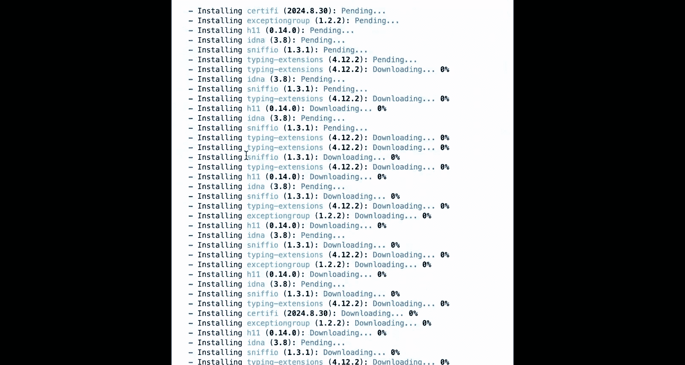

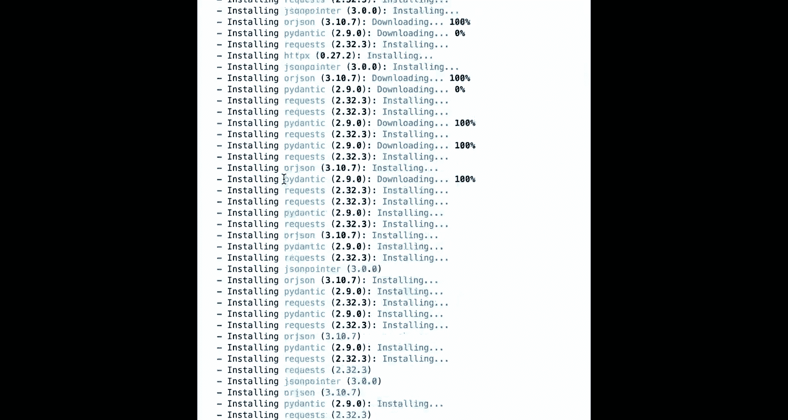

安装依赖的过程非常简单直接。你只需要在项目根目录下运行一个命令。

以下是安装依赖的步骤：

1.  确保你的终端当前路径位于新创建的项目文件夹内。
2.  运行命令 `crewai install`。
3.  该命令会自动读取 `pyproject.toml` 文件，并安装所有列出的依赖项。

运行 `crewai install` 后，你可以看到所有依赖项正在被安装。这个过程可能需要一些时间，具体取决于网络速度和依赖包的数量。安装完成后，所有必要的软件包都已就位，Crew的执行环境已准备就绪。

通常，我们还需要注意环境变量的配置。项目中会有一个 `.env` 文件，你需要在此处设置API密钥等敏感信息。如果你在Jupyter Notebook中运行，环境变量可能已自动注入；但若在本地终端或服务器上运行，则必须手动配置这些密钥，以确保能正确调用不同的模型提供商。

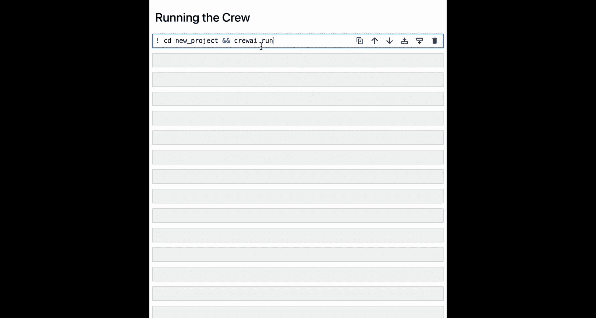

## 执行Crew

依赖安装完毕且环境变量配置完成后，我们就可以运行这个新创建的Crew了。

执行Crew只需要一个命令。让我们来看看如何操作。

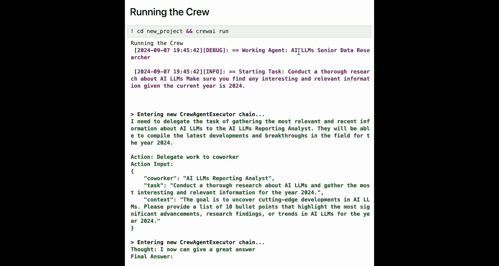

以下是执行Crew的步骤：

1.  在项目根目录下，运行命令 `crewai run`。
2.  执行后，你将在终端中看到Crew的运行日志，智能体会按顺序执行定义好的任务。

首次执行Crew时可能会花费一些时间，因为它需要在虚拟环境中启动。在日志中，你可以看到智能体们逐个完成任务。这个示例项目是一个简单的博客创作Crew：首先由一名**高级数据研究员**负责研究内容，然后将结果传递给**博客内容撰写员**来撰写最终的报告。

通过这个过程，你就能体会到如何从零开始构建自己的Crew。你可以在终端中自由地创建、修改和分享Crew项目，并将其推送到GitHub。这非常强大，因为你不再局限于Jupyter Notebook环境，使得开发和部署变得更加便捷。

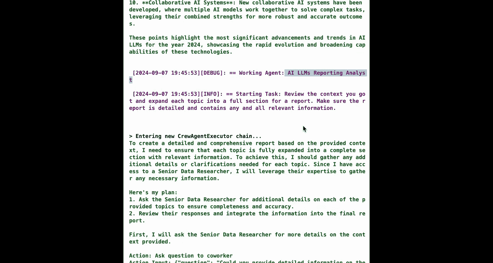

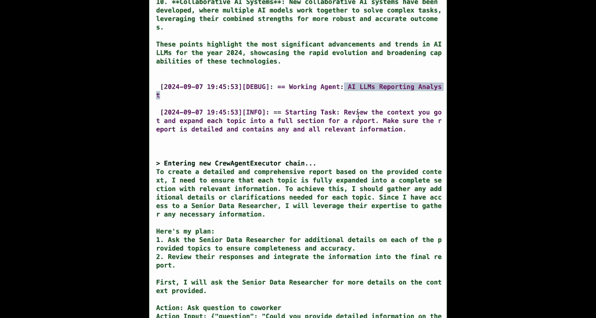

## 扩展：创建Flow项目

除了创建Crew，命令行工具同样支持创建更复杂的Flow项目。

创建Flow的流程与创建Crew非常相似。这为你构建多Crew协作的工作流提供了便利。

以下是创建Flow的步骤：

1.  运行命令 `crewai create flow <Flow名称>`。
2.  该命令会为你设置好Flow的初始架构，包括文件夹和所有必需的文件。

让我们看一下为Flow创建的文件结构。初始结构虽然与Crew项目相似，但如果你查看Flow文件夹内部，会发现：
*   `crews/` 文件夹：允许你在其中放置任意多个Crew。
*   `main.py`：这是Flow的主执行代码。
*   `tools/` 文件夹：你可以在此处放置任何自定义工具。

这展示了如何使用相同的策略来创建更高级的Flow，以满足复杂场景的需求。

## 总结

本节课中，我们一起学习了如何为生产环境构建Crew。我们从使用 `crewai create crew` 命令创建新项目开始，然后通过 `crewai install` 安装依赖，最后使用 `crewai run` 执行Crew并观察其运行。我们还了解到，可以使用 `crewai create flow` 以类似方式创建更复杂的Flow项目。

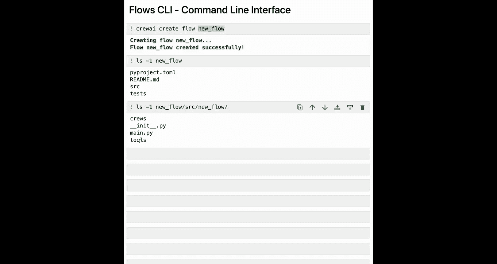

这种方法的强大之处在于，你现在不仅可以完全从零开始构建Crew，理解其内部运作，还能轻松地部署它。将Crew部署为API后，你可以通过其端点和Webhook与任何现有应用程序（如Slack或其他业务系统）集成，从而在实际生产环境中引入多智能体系统的强大能力。希望你在本节课中有所收获，并能开始构建属于自己的智能体应用。