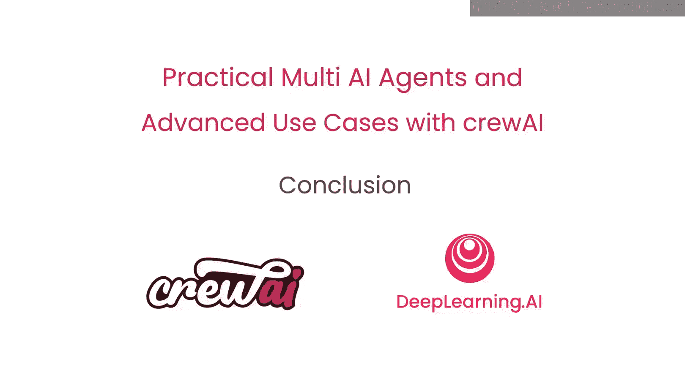

# 015：结论

## 概述
在本节课中，我们将对《多AI智能体实践与高级应用课程》的全部内容进行总结，回顾所学到的核心知识与技能。

## 课程内容回顾
恭喜你完成了这门课程。你学到了许多不同的知识。

以下是你在本课程中学到的核心内容列表：
*   你学习了AI智能体系统的基本构成模块。
*   你学习了如何创建智能体。
*   你学习了如何创建任务。
*   你学习了如何创建智能体团队。
*   你学习了如何将智能体系统与内部及外部系统进行集成。
*   你学习了如何让多个智能体协同运行。
*   你学习了如何让多个智能体团队协同工作。
*   我们讨论了如何部署智能体系统。
*   我们讨论了如何监控、训练和测试智能体系统。

## 总结
这门课程内容丰富，涵盖了大量知识。我们期待看到你能够运用所学，独立构建出优秀的AI智能体应用。现在，请务必行动起来，将你掌握的AI智能体构建知识传播出去。