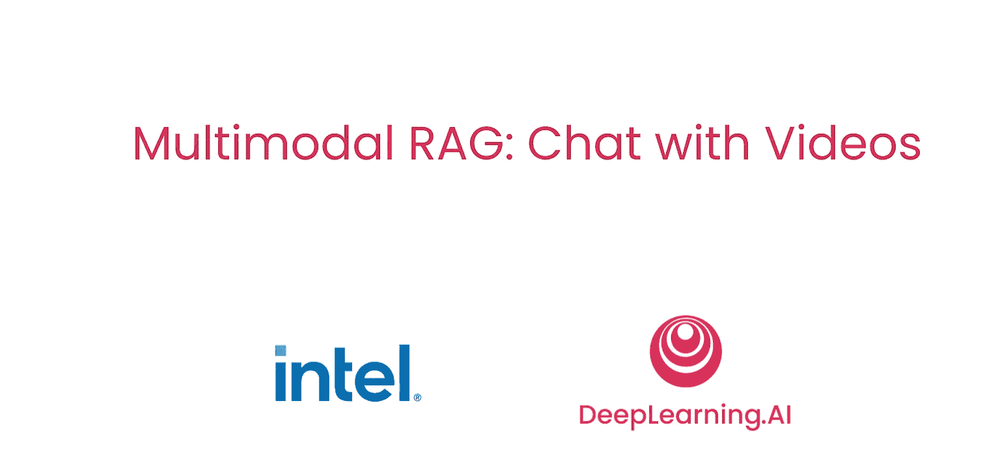
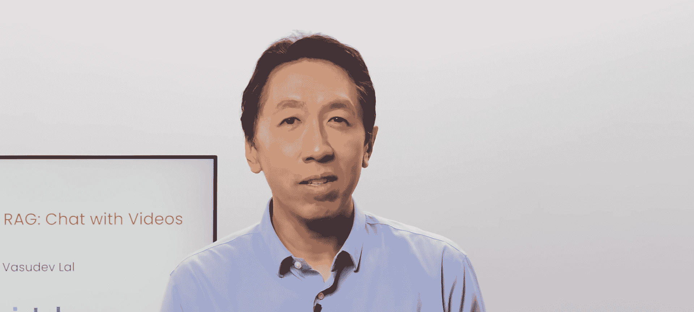
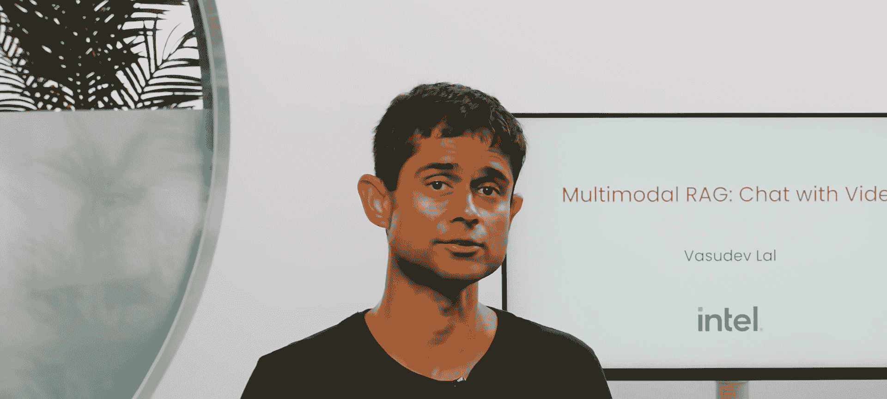
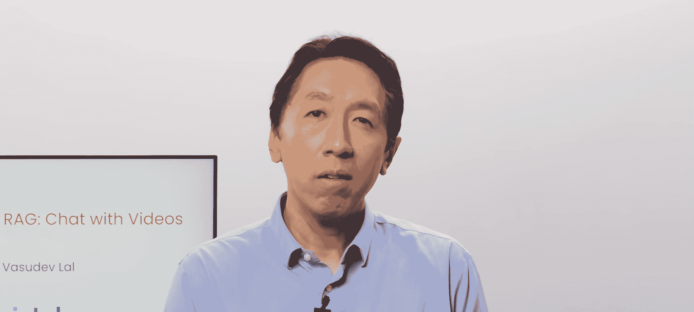
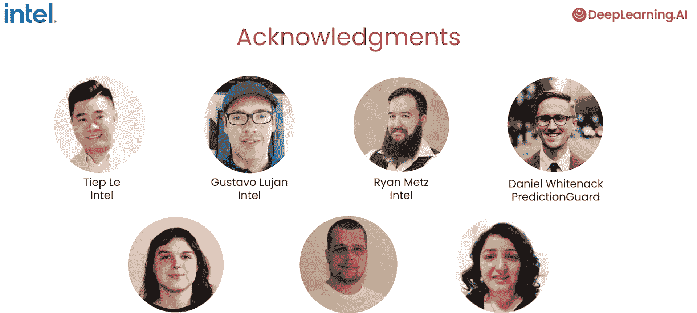

# 001：课程概述 🎬

在本课程中，我们将学习如何构建一个能够与视频内容进行对话的问答系统。我们将探索多模态人工智能技术，特别是如何将视频中的视觉和文本信息结合起来，创建一个强大的检索增强生成（RAG）系统。

## 课程简介

欢迎来到由英特尔合作创建的《多模态RAG聊天系统与视频》课程。

在本课程中，你将学习如何为一组视频构建一个问答系统。你将探索多模态编码转换器模型，这些模型将视觉和文本数据合并到一个统一的语义空间中。你还将学习如何创建一个能够与视频集合进行交互的系统。

## 课程内容与流程

首先，你将从BridgeTower模型开始，该模型嵌入了文本和图像。你会生成嵌入并将它们存储在向量数据库中。

接下来，你将开发一个RAG管道，以从这个数据库中提取相关的多模态内容，并将其作为输入上下文传递给下游的大规模视觉语言模型，为用户生成响应。

到课程结束时，你将构建一个交互式AI系统，允许你与视频语料库进行对话。

## 讲师介绍

我很高兴为本课程授课的是Vasudev Lau，他是英特尔实验室多模态认知AI团队的首席AI研究科学家。Vasudev和他的团队进行大量关于多模态基础模型的研究，特别是模型规模扩大如何使视觉和文本表示相互对齐的研究。为了进一步支持研究和开发者社区，他们经常开源他们的工作，并在主要AI会议上展示详细的技术论文。

## 你将学习的关键技能

谢谢，Andrew。在本课程中，你将学习多模态嵌入模型，如BridgeTower模型，以及如何为图像和字幕对创建联合嵌入。这些嵌入能够在一个共同的多模态语义空间中表示视觉和语言模态。

你将学习如何处理多模态应用中的视频数据，包括使用Whisper模型进行转录，以及使用大规模视觉语言模型生成字幕，并学习如何开发能够处理复杂查询（涉及文本和图像）的强大检索系统。

利用工具如向量存储和LangChain进行数据检索和相似性搜索。你还将学习如何使用大规模视觉语言模型执行任务，例如图像字幕生成、基于视觉和文本线索回答问题，以及保持对话流程。

## 技术栈与合作伙伴

本课程使用的API基于PredictionGuard的多模态模型，PredictionGuard是一家在英特尔云上托管模型的初创公司。你将学习如何实现一个完整的多模态检索增强生成（RAG）系统。该系统接受复杂的用户查询，检索相关的视频片段，并提供基于特定视频帧的全面响应。

Vasudev将指导你了解这些概念、工具和方法，包括BridgeTower模型、Whisper模型、向量存储、LangChain工作流和PredictionGuard API。

## 多模态AI的重要性

多模态AI这个主题让我感到非常兴奋，出于实际原因。世界上大部分数据以视频和其他多模态文档形式存在，如你将在本课程中观看的视频，或我每天审阅的幻灯片和论文。拥有能够利用所有这些模态数据的AI助手是非常有用的。这一能力对于客户支持、教育和娱乐等应用至关重要，在这些领域，多模态交互增强了用户体验。

本课程使用的模型是开源的，可以很容易地与其他开源或专有模型进行替换。

## 致谢

许多人为创建本课程做出了贡献。我想感谢来自英特尔的Diep Le、Gustavo Lujan和Ryan Metz。来自PredictionGuard的Daniel Weitknecht、Jacob Manstorfer和Florian Paton，以及来自DeepLearning.ai的Diala Ezzedine。

## 课程实践

在第一节课中，您将与多模态RAG系统进行互动，通过一个交互式的Gradio应用与视频聊天。

---

**总结**

本节课中，我们一起学习了《多模态RAG：与视频对话》课程的总体概述。我们了解了课程的目标是构建一个能与视频对话的AI系统，认识了讲师Vasudev Lau，并预览了将要学习的关键技术，包括多模态嵌入模型、视频处理、RAG管道构建以及相关的开源工具和API。在接下来的课程中，我们将动手实践这些概念。