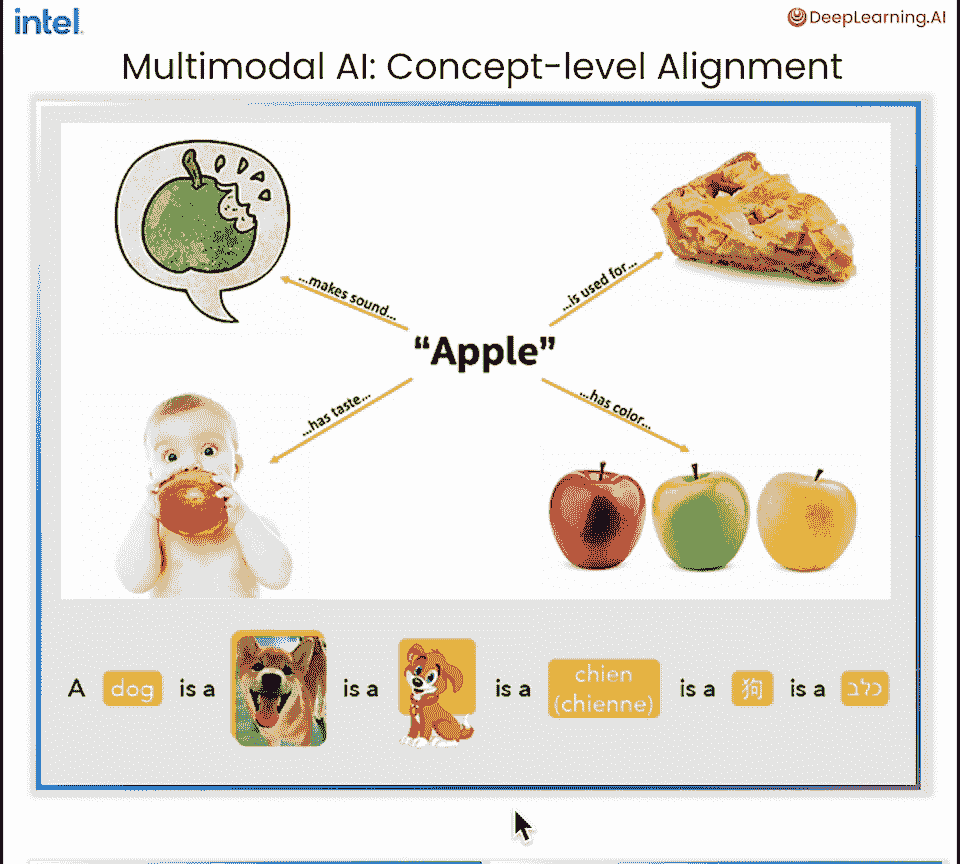
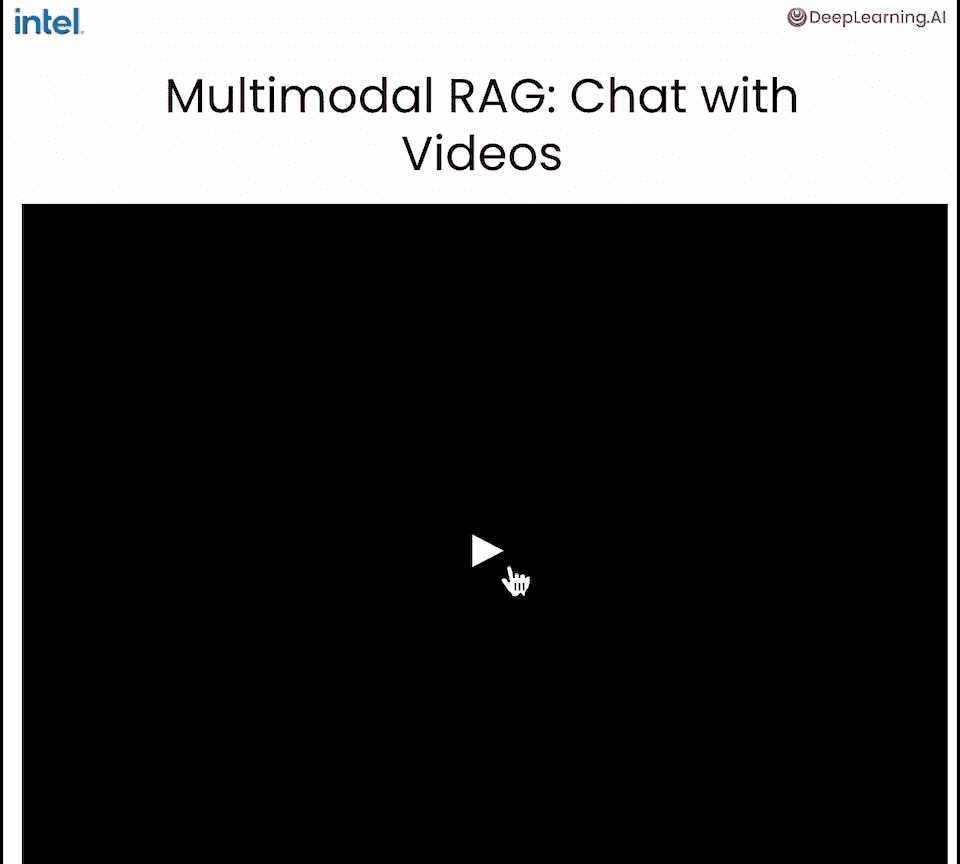
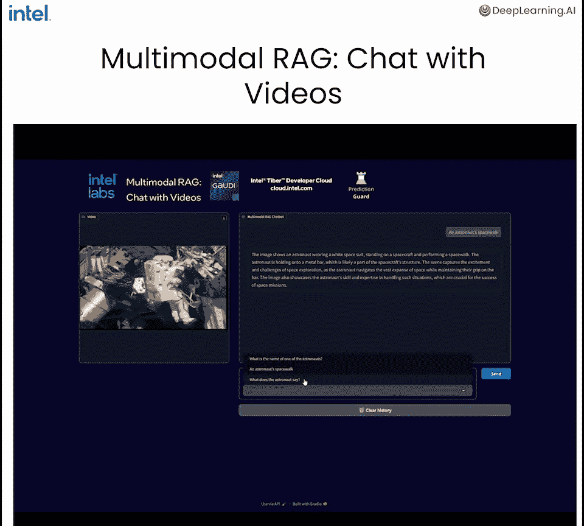
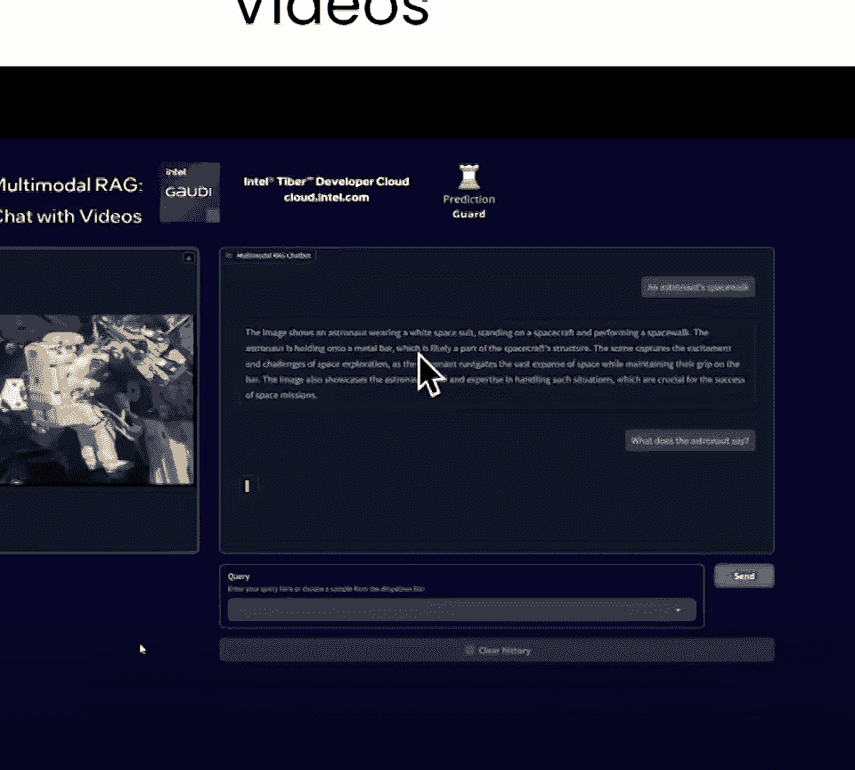
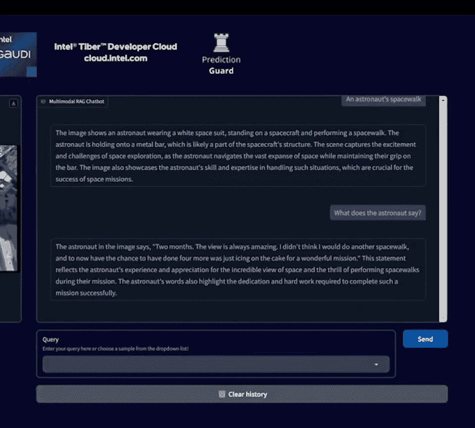
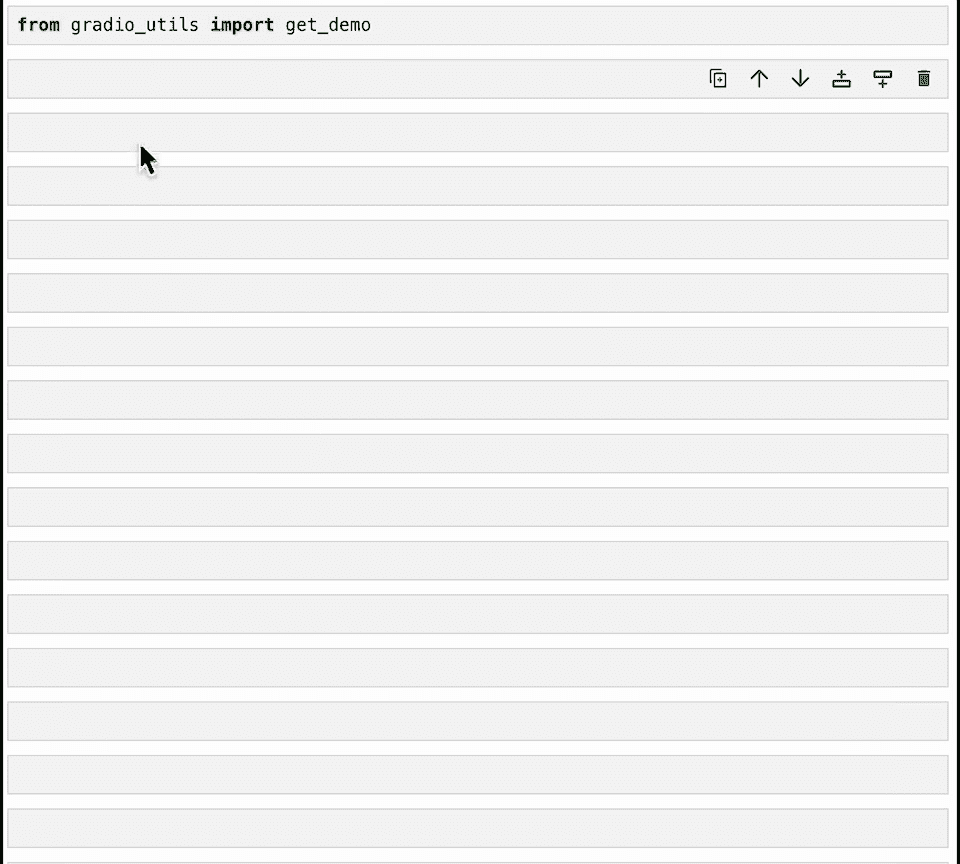
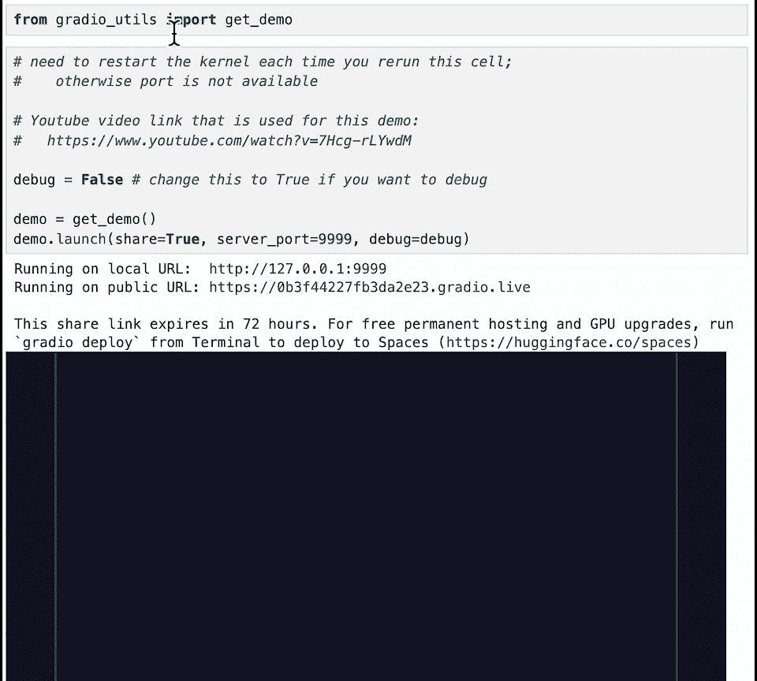
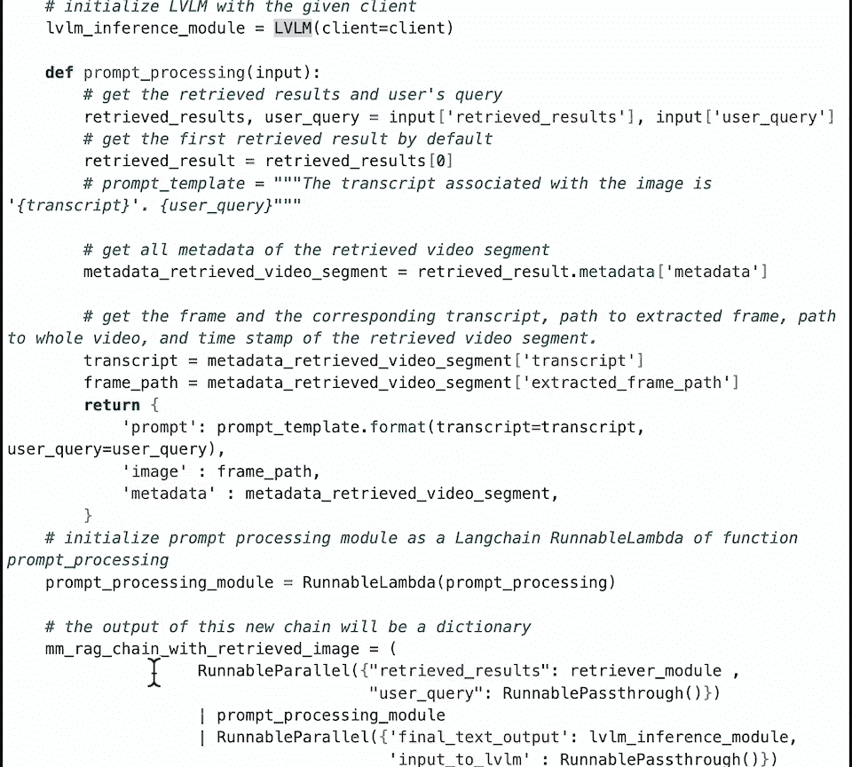

# 002：课程概述与交互演示 🎬

在本节课中，我们将学习多模态检索增强生成（RAG）系统的基本概念，并通过一个交互式演示，直观地体验如何与视频内容进行对话。我们将初步了解系统的各个组成部分，为后续课程中学习如何构建它们打下基础。

人类通过所有感官来理解世界。例如，对于“苹果”这个概念，我们理解咬苹果的声音、它的味道、颜色、质感，以及它能被做成苹果派的事实。无论是视频、图像中表达的“狗”，还是用任何一种人类语言提到的“狗”这个词，其核心概念都是相通的。真正的认知AI系统也需要能够通过所有模态（如图像、文本、声音）来连接和理解这些概念。

## 系统演示与目标 🎯



假设我们有一段视频，例如宇航员从任务中返回的记录。一个多模态AI系统应该能够综合利用视频中的多种信息来回答问题：

1.  **视频中的书面文本**（如字幕、屏幕文字）。
2.  **视频中的纯视觉信息**（如人物、物体、场景）。
3.  **视频中所讨论的音频信息**（如对话、旁白）。
4.  **进行多轮对话**的能力，允许我们就视频内容提出后续问题。



接下来，让我们通过一个Gradio应用程序来具体看看这个系统是如何工作的。

## 交互演示详解 💻


以下是应用程序界面的一个示例。我们可以输入用户查询，例如“**宇航员的名字是什么？**”。



系统首先会**检索**一个与问题最相关的视频片段。例如，它可能找到宇航员自我介绍或名牌出现的片段。



> “我们在国际空间站上的这次任务，我很自豪能够参与其中的大部分科学工作。”



然后，大型视觉语言模型会分析这个片段，并生成一个**自然语言的回答**：“其中一名宇航员的名字是罗伯特·本肯。”

我们可以接着提出后续问题，例如“**宇航员的太空行走**”。系统会再次检索相关片段。

> “再进行一次太空行走，现在有机会再进行四次，真是令人激动。”

模型会提供该场景的详细描述。如果我们进一步追问“**宇航员说了什么？**”，模型会从视频的转录文本中提取信息，并组织成流畅的回答。

## 系统架构总览 🏗️



这就是我们将要构建的多模态RAG系统的架构。在本课程中，我们将逐步研究其每个核心组件：

1.  **多模态嵌入模型**：学习如何将图像和文本映射到同一个语义空间。核心公式可表示为：`embedding = model(image, text)`，使得不同模态的信息可以相互比较。
2.  **视频数据预处理**：学习如何将自己的视频数据（帧、音频、字幕）处理成嵌入模型可以使用的格式。
3.  **向量数据库存储与检索**：学习如何将处理后的多模态数据存入向量数据库，并实现高效的相似性检索。核心操作是：`results = vector_db.search(query_embedding)`。
4.  **大型视觉语言模型**：学习能够同时理解图像和文本的LVLM，它负责生成最终的回答。
5.  **系统集成**：学习如何使用LangChain等工具，将以上所有组件组合成一个完整的、可交互的多模态RAG流水线。

## 动手实验 🧪

现在，让我们进入第一课的实践部分。我们将启动一个预构建的Gradio应用程序。

首先，我们导入必要的库并启动应用。
```python
from utils.gradio_utils import demo
demo.launch()
```
应用程序界面启动后，你可以尝试输入不同的查询。

例如，输入“宇航员的名字是什么？”。系统会检索相关片段，模型会生成答案。你可以点击“清除历史”按钮开始新一轮对话，再尝试查询“关于宇航员太空行走”。观察系统如何检索不同的片段并生成回答。

你还可以进行多轮对话，例如接着问“宇航员说了什么？”，体验系统如何利用上下文历史记录来给出连贯的回答。

## 代码探索与预习 🔍



这个演示应用的代码定义在 `gradio_utils.py` 文件中。我强烈建议你现在简要浏览一下这个文件，你会看到其中涉及了几个关键部分：

*   使用 **Bridge Tower** 模型生成视频数据的嵌入向量。
*   初始化了一个**向量存储**用于检索。
*   调用**大型视觉语言模型**来生成回答。
*   使用 **LangChain** 框架将以上组件串联成流水线。

在接下来的课程中，我们将深入讲解每一个组件。当你完成所有课程后再回看这个文件，你会更清楚地理解这些模块是如何协同工作，最终构建出一个能与视频对话的交互式应用的。

---



**本节课总结**：我们一起初步了解了多模态RAG系统的强大能力，它能够结合视频的视觉、文本和语音信息来回答我们的问题。通过交互演示，我们直观地体验了系统检索相关视频片段并生成自然语言回答的过程。最后，我们概览了构建此类系统所需的五大核心组件，为后续的深入学习做好了准备。