# 003：多模态嵌入


在本节课中，我们将学习如何将图像和文本数据（即多模态数据）嵌入到一个共同的多模态语义空间中。我们将使用BridgeTower模型来处理图像-文本对，生成512维的向量表示，并探索如何测量不同嵌入之间的相似性。最后，我们将使用UMAP技术将这些高维向量投影到二维平面进行可视化，以便更直观地理解数据的分布。

## 🏗️ BridgeTower模型架构

上一节我们介绍了多模态嵌入的概念，本节中我们来看看实现这一目标的核心模型——BridgeTower。

BridgeTower模型由英特尔实验室与微软研究院合作开发，其架构设计灵感来源于一座桥梁。模型包含两个主要部分：
*   **文本塔**：一个文本转换器，用于处理文本标记。
*   **视觉塔**：一个视觉转换器，用于处理图像补丁。

为了融合这两种模态的信息，模型引入了**交叉注意力块**。这些块连接了文本和视觉转换器的隐藏表示，将文本和图像的信息结合起来，最终在模型输出端为我们提供**跨模态的联合嵌入**。

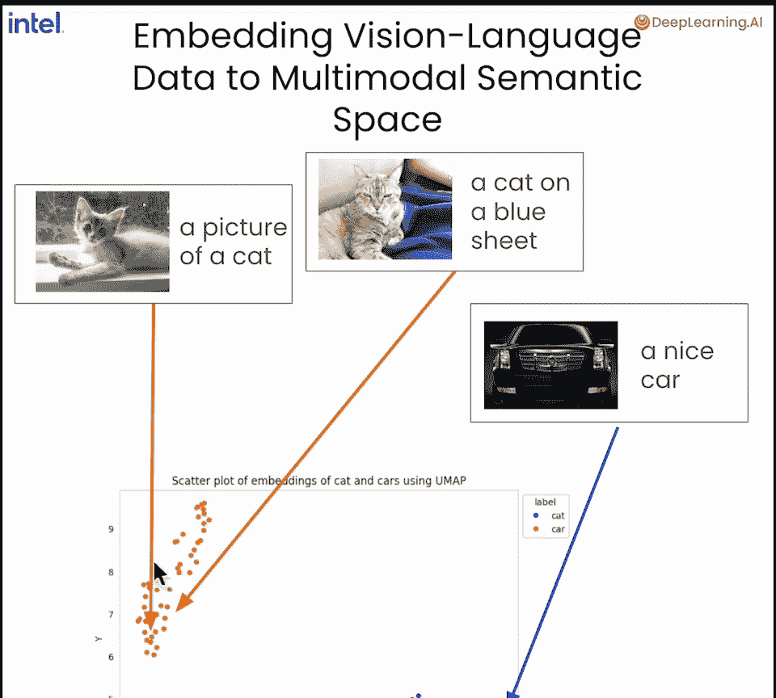

在我们的多模态RAG系统中，BridgeTower模型将负责将视频片段及其相关的文本描述嵌入到同一个语义空间中。

## 💻 实践：创建与探索多模态嵌入

现在，让我们进入实践环节，看看如何使用BridgeTower模型从图像-文本对数据中创建多模态嵌入。

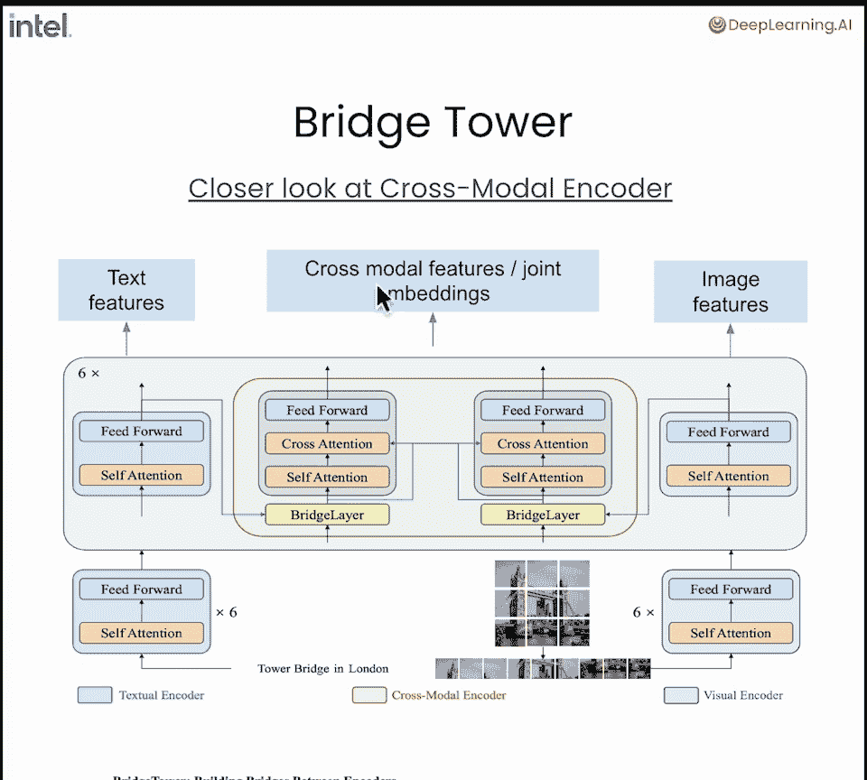

### 准备示例数据

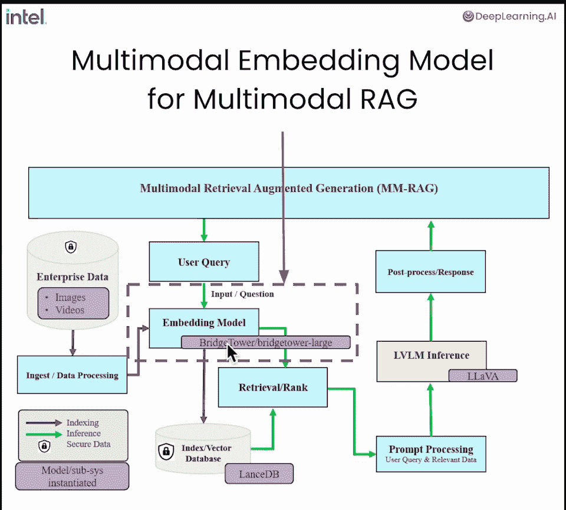

首先，我们从一个包含三个图像-文本对的小例子开始。以下是数据定义的示例：


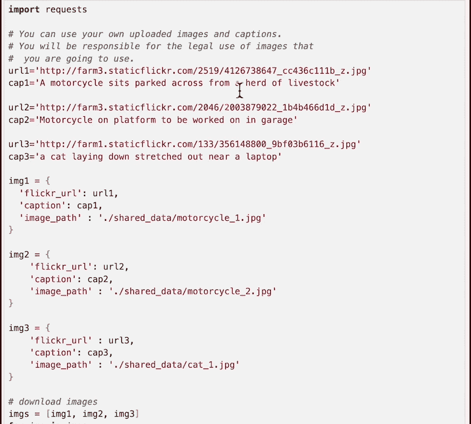

```python
examples = [
    {
        “image_url”: “https://example.com/motorcycle1.jpg”,
        “caption”: “A red motorcycle on the street.”,
        “path”: “./data/motorcycle1.jpg”
    },
    {
        “image_url”: “https://example.com/motorcycle2.jpg”,
        “caption”: “A black motorcycle parked.”,
        “path”: “./data/motorcycle2.jpg”
    },
    {
        “image_url”: “https://example.com/cat1.jpg”,
        “caption”: “A cute cat sleeping.”,
        “path”: “./data/cat1.jpg”
    }
]
```

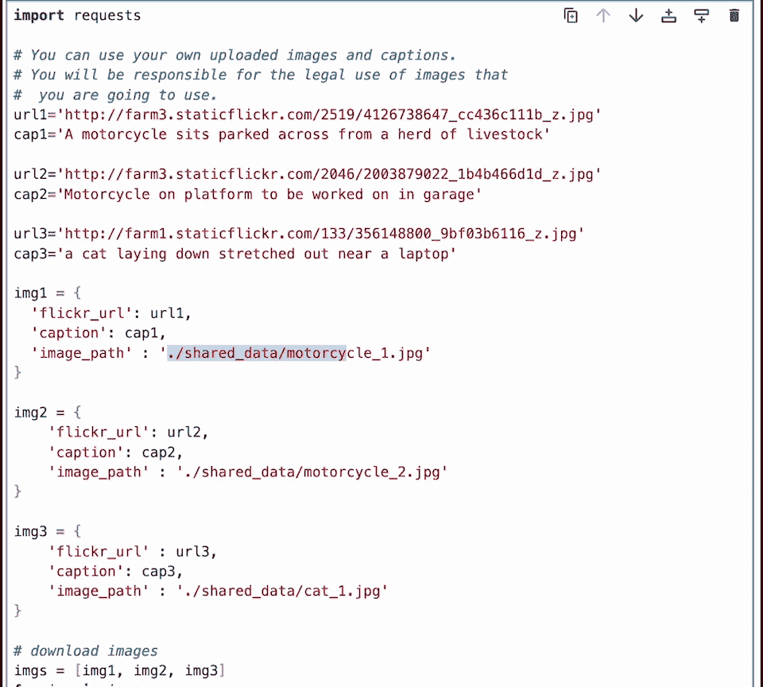

字典的三个字段分别指向图像的URL、与图像关联的文本（字幕），以及图像的本地下载路径。我们将遍历这些数据，下载图像和文本。

下载完成后，我们可以看到：
*   第一张图片是关于摩托车的。
*   第二张图片也是关于摩托车的。
*   第三张图片是关于猫的。

### 生成多模态嵌入

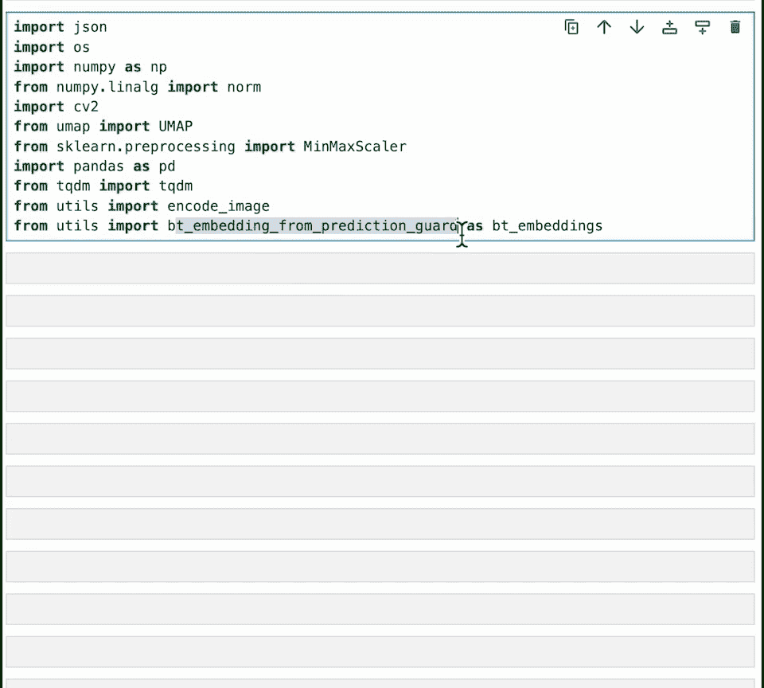

接下来，我们希望通过BridgeTower模型处理这些图像-文本对，将它们转换为多模态嵌入向量。我们将通过一个API（例如PredictionGuard，运行在英特尔AI加速器上）来调用模型。

核心函数 `btEmbeddingsFromPredictionGuard` 会处理这个调用。具体步骤如下：
1.  遍历每张图片，将其编码为base64格式。
2.  将base64图像和对应的文本字幕一起提供给BridgeTower模型。
3.  模型会返回一个512维的向量，代表该图像-文本对在多模态语义空间中的位置。

我们将所有生成的嵌入收集到一个列表中。每个嵌入都是一个512维的向量。

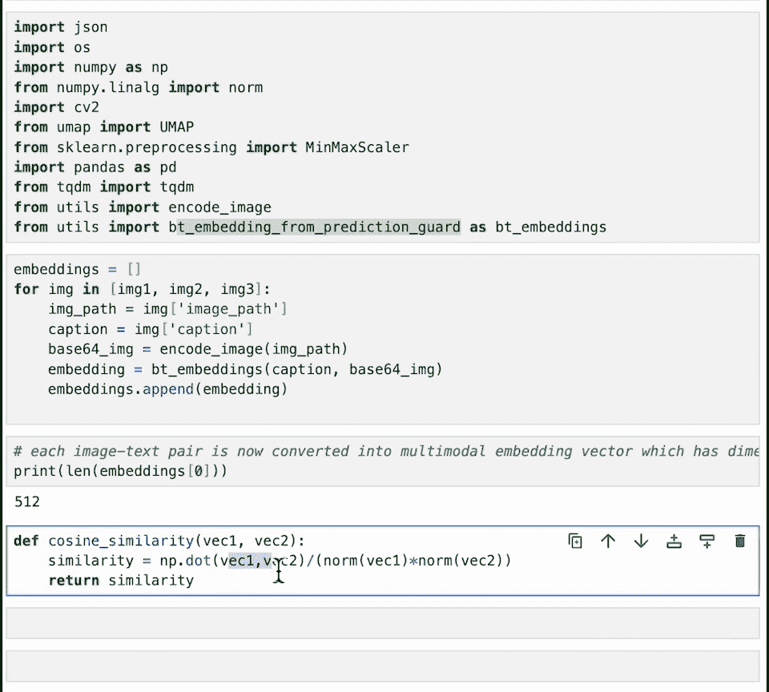

### 测量嵌入间的相似性

生成了嵌入之后，我们如何衡量它们之间的相似性或距离呢？以下是两种常用的方法：

**1. 余弦相似度**
这是一种非常流行的方法，它测量的是两个向量在方向上的相似程度，而忽略其大小（模长）。余弦相似度的值在-1到1之间，值越接近1，表示两个向量的方向越一致，即越相似。

计算公式如下：
**余弦相似度 = (A·B) / (||A|| * ||B||)**
其中 `A·B` 是向量A和B的点积，`||A||` 和 `||B||` 分别是向量A和B的模长（L2范数）。

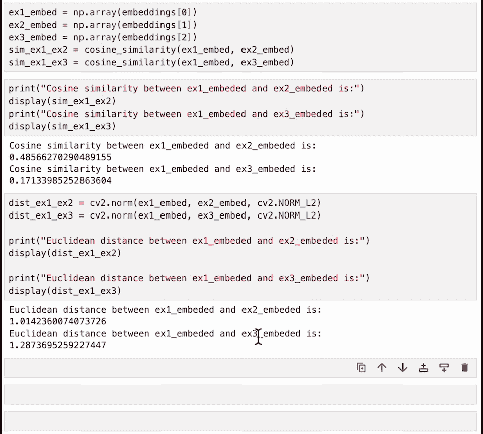

**2. 欧氏距离**
欧氏距离测量的是两个向量在空间中的直线距离。距离越小，表示两个向量越接近。

计算公式如下：
**欧氏距离 = sqrt( Σ (Ai - Bi)² )**

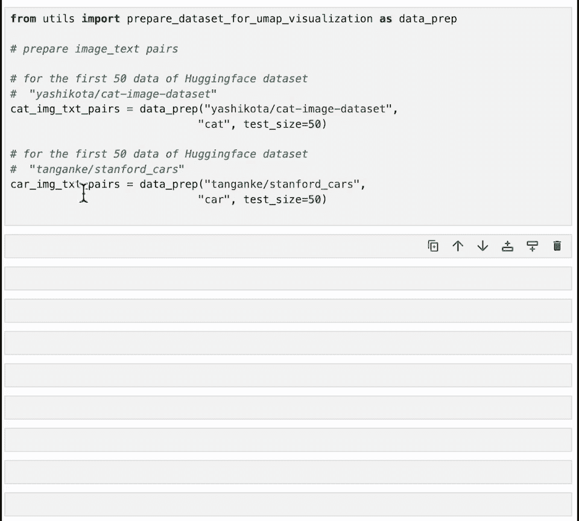

在我们的例子中，计算结果显示：
*   两个摩托车示例之间的**余弦相似度很高**（例如0.85），**欧氏距离很小**。
*   摩托车示例与猫示例之间的**余弦相似度较低**（例如0.15），**欧氏距离较大**。

这符合我们的预期，因为前两者语义相近（都是摩托车），而后者语义不同（猫）。余弦相似度因其计算高效且常被用作训练损失函数，在此类任务中尤为常用。

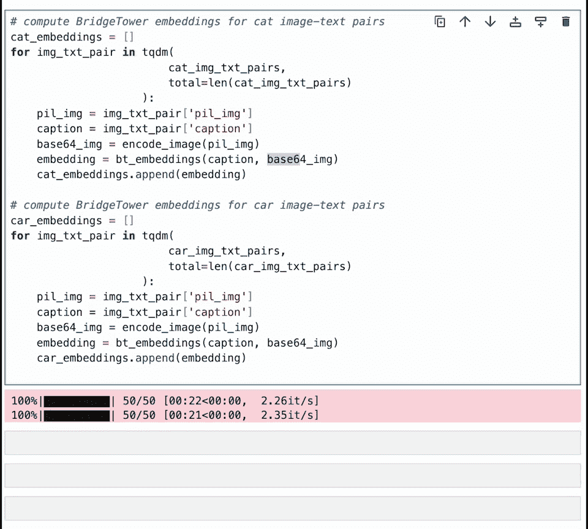

### 可视化高维嵌入

当处理大量图像-文本对时，可视化多模态嵌入的分布非常有帮助。由于我们无法直接观察512维的空间，我们需要先进行降维。

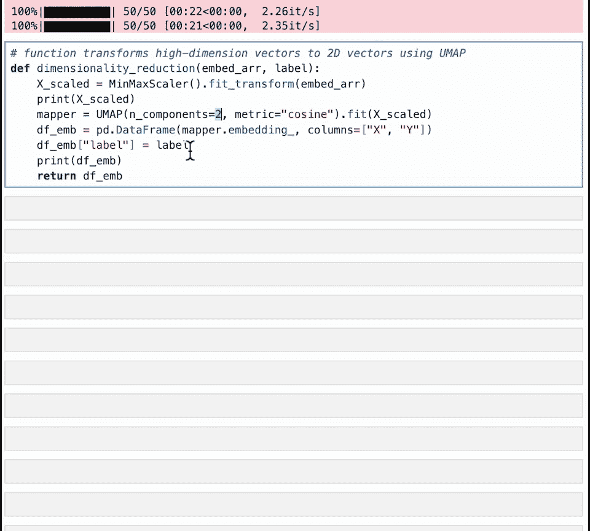

我们将使用**UMAP**技术，将这些512维的向量投影到二维空间，以便进行可视化。这种分析有助于我们理解数据的整体结构，并可能发现潜在的规律。

以下是操作步骤：
1.  **准备更大数据集**：我们准备一个包含50个“猫”图像-文本对和50个“汽车”图像-文本对的数据集。
2.  **生成嵌入**：使用BridgeTower模型为所有100个样本计算512维嵌入。
3.  **应用UMAP降维**：调用UMAP算法，将所有512维向量转换为二维的(X, Y)坐标。
4.  **绘制散点图**：在二维平面上，用不同颜色（如蓝色代表猫，橙色代表汽车）绘制这些点。

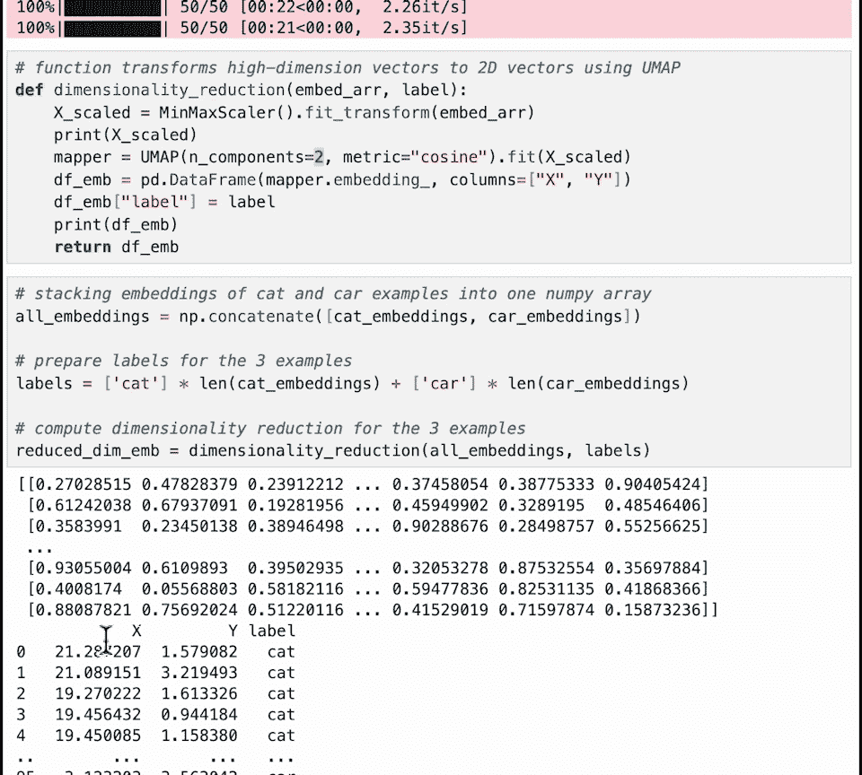

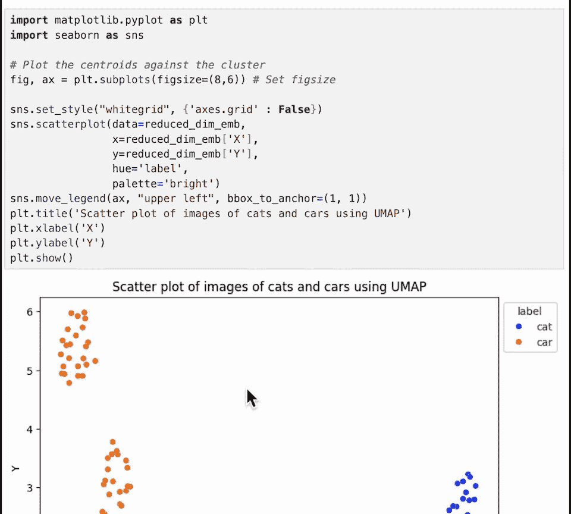

可视化结果会清晰显示，属于“猫”的嵌入点（蓝色）在二维空间中聚集在一起，属于“汽车”的嵌入点（橙色）也聚集在另一区域，并且两个聚类彼此分离。这直观地证明了BridgeTower模型成功地将语义相近的样本映射到了嵌入空间中相近的位置。

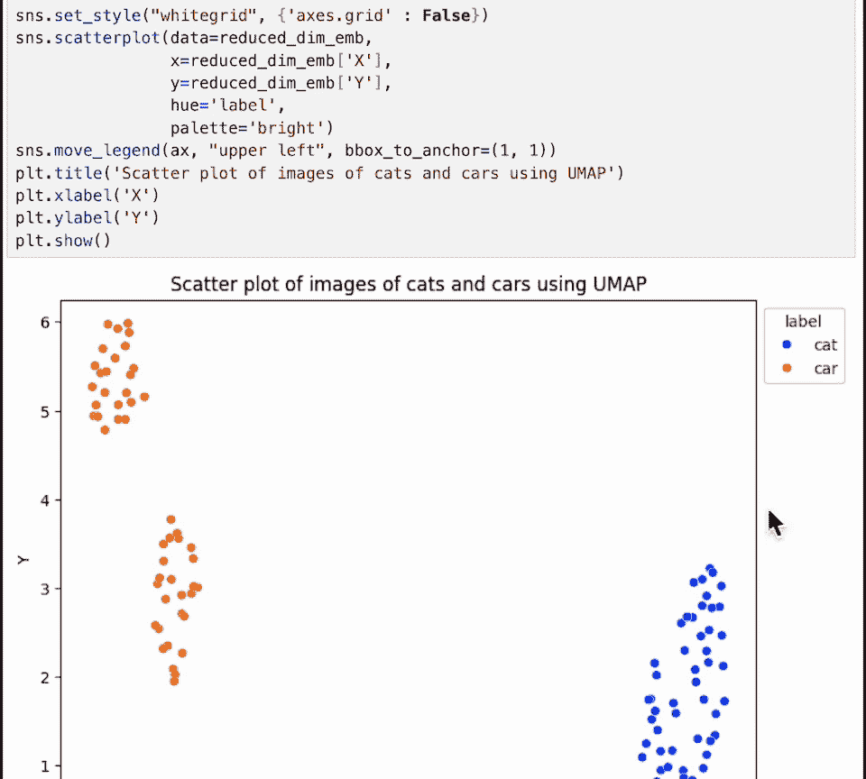

## 📝 总结

在本节课中，我们一起学习了多模态嵌入的核心知识。我们首先了解了如何准备图像-文本配对数据，并使用BridgeTower模型计算它们的多模态嵌入。接着，我们探索了如何使用**余弦相似度**和**欧氏距离**来量化不同嵌入之间的相似性。最后，我们掌握了通过**UMAP进行降维**并在二维空间中可视化这些高维嵌入的方法，从而更直观地理解数据的聚类与分布情况。

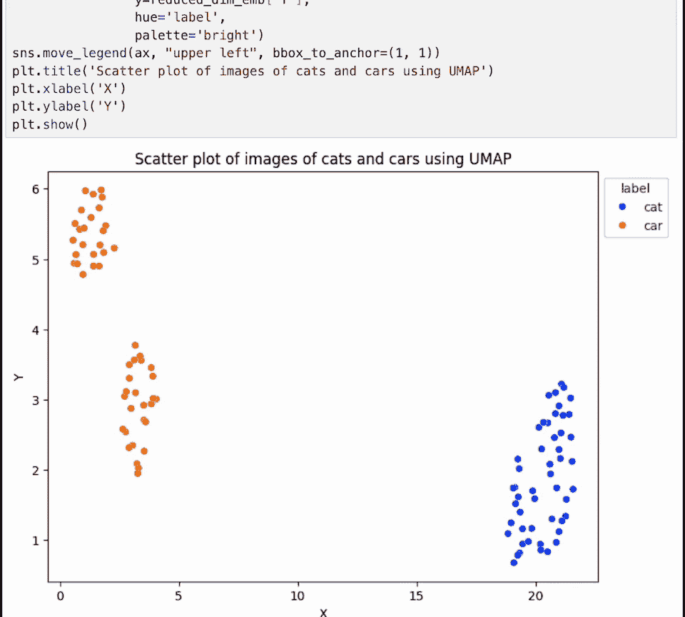

现在，你可以尝试使用自己的图片和描述文字进行实验，观察模型如何将不同的视觉-语言概念映射到共享的语义空间中。