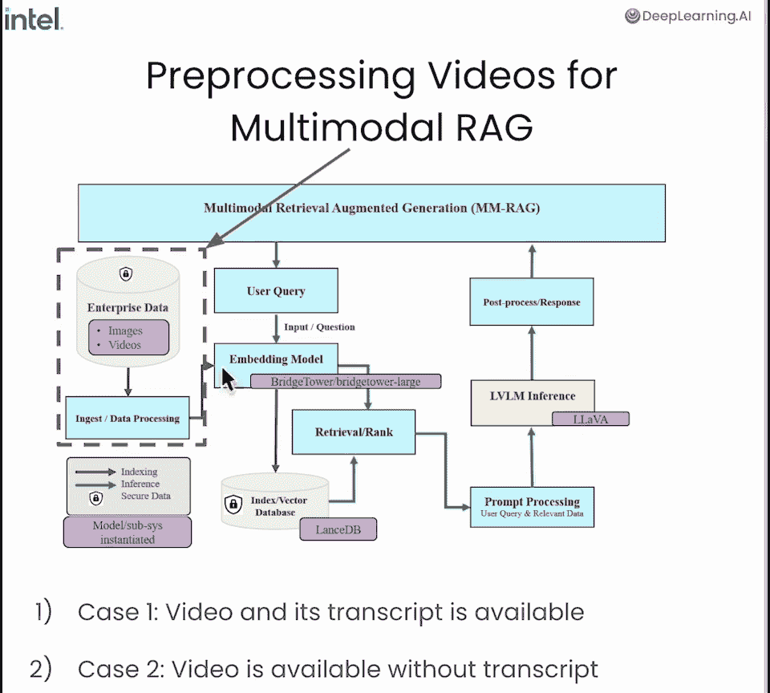
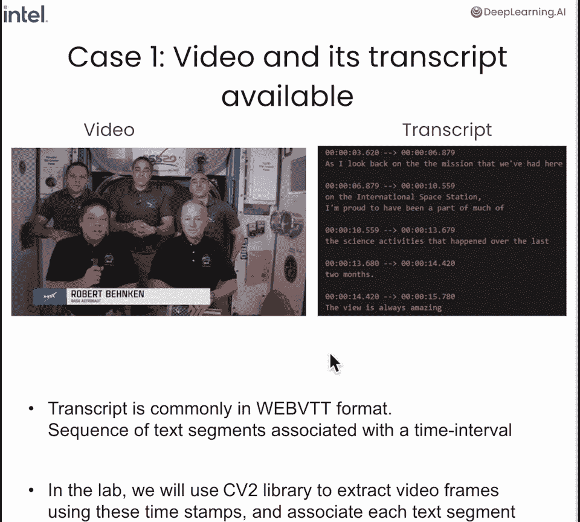
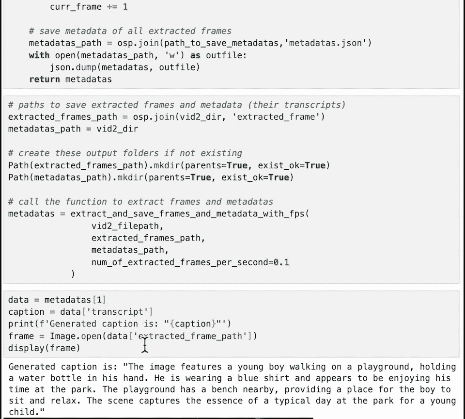
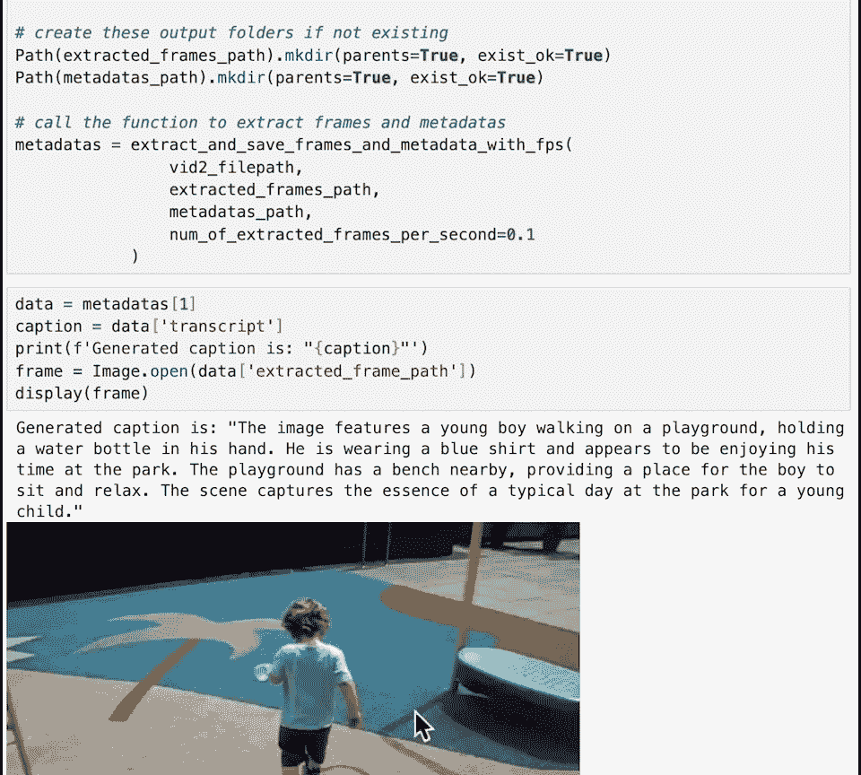

# 004：视频预处理教程 🎬

在本节课中，我们将学习如何将视频预处理成适合输入到多模态RAG（检索增强生成）管道的形式。我们将了解三种主要情况：当视频自带转录文件时如何处理；当没有转录文件时，如何使用Whisper模型生成转录；以及当视频没有明确语言信息时，如何使用大型视觉语言模型为视频帧生成字幕。通过本教程，您将掌握将视频转化为“视频帧-关联文本”配对数据的关键步骤。

## 系统概览与预处理模块



上一节我们介绍了多模态RAG系统的整体架构，本节中我们来看看其中的预处理模块。




预处理模块负责将原始视频转化为结构化的数据。我们将主要处理以下三种情况：

1.  **视频自带转录文件**：转录文件通常为Web VTT格式，包含与时间戳关联的文本。
2.  **视频无转录文件**：使用OpenAI的Whisper模型自动生成音频转录。
3.  **视频无明确语言信息**：使用大型视觉语言模型（LVLM）为视频帧生成描述性字幕。

接下来，我们将进入代码实践部分。

## 准备工作：导入库与获取视频

我们首先导入必要的Python库，并从YouTube下载一个示例视频及其自带的转录文件（VTT格式）。

```python
# 示例：导入必要库
import cv2
import whisper
# ... 其他库
```

您也可以使用自己选择的视频进行练习。下载完成后，我们获得一个MP4视频文件和一个VTT格式的转录文件。

## 情况一：处理自带转录文件的视频

当视频已有Web VTT格式的转录文件时，我们的目标是将每个文本片段与视频中的一个中心帧关联起来。

以下是处理流程的核心步骤：

1.  **解析时间戳**：使用辅助函数将VTT文件中的字符串时间（如`00:00:01.000`）转换为毫秒数值。
    ```python
    def string_to_time(time_str):
        # 将“时:分:秒.毫秒”字符串转换为毫秒数
        # ... 实现代码
    ```
2.  **提取中心帧**：遍历每个转录文本片段，计算其时间区间的中点（毫秒），并使用OpenCV（cv2）在该时刻提取视频帧。
3.  **调整帧尺寸**：使用辅助函数保持纵横比调整帧大小，以适配后续的BridgeTower等多模态模型。
    ```python
    def keep_aspect_ratio_resize(image, target_size):
        # 保持原图宽高比进行缩放
        # ... 实现代码
    ```
4.  **保存元数据**：将提取的帧保存为图像文件，并创建一个元数据字典（或文件），记录`帧文件路径`、`关联文本`、`片段ID`和`中心点时间戳`。

调用处理函数后，视频就被转化为了一个结构化的数据集，供下游应用使用。

## 情况二：使用Whisper模型生成转录

当视频没有现成的转录文件时，我们需要为其生成一个。这里我们使用OpenAI的Whisper模型。

处理步骤如下：

1.  **提取音频**：使用MoviePy等库从视频文件中提取音频，并保存为MP3格式，因为Whisper模型以音频为输入。
2.  **加载模型**：加载Whisper模型（例如`base`或`small`版本），并设置语言（如英语）。
    ```python
    model = whisper.load_model("small")
    result = model.transcribe("video_audio.mp3", language="en")
    ```
3.  **格式转换**：将Whisper的输出结果，通过辅助函数转换为标准的Web VTT格式文件。

现在，我们就得到了一个与情况一相同的VTT转录文件，可以继续使用情况一的方法进行处理。

## 情况三：使用LVLM为视频帧生成字幕

对于没有明确语言信息（如纯音乐视频、无声视频）的视频，我们需要为视觉内容本身生成描述。我们将使用大型视觉语言模型（如LLaVA）。

我们将在第五课深入学习LLaVA。本节课，我们通过Prediction Guard提供的API来使用它。

以下是操作步骤：

1.  **定义提示词**：构建一个请求模型生成图像描述的提示。
    ```python
    prompt = “Please generate a concise caption for this image.”
    ```
2.  **采样视频帧**：以固定的帧间隔（如每秒1帧）读取视频，对采样到的帧进行Base64编码。
3.  **调用模型生成字幕**：将编码后的图像和提示词发送给LLaVA模型，获取生成的文本描述。
    ```python
    caption = query_llava_model(base64_image, prompt)
    ```
4.  **保存元数据**：与之前类似，保存帧图像和其对应的生成字幕到元数据中。

这种方法不仅适用于无声视频，也可以为已有转录的视频生成更丰富、更侧重视觉细节的字幕，从而增强视频的语言信息。


*图：LLaVA模型为视频帧生成的字幕示例——“图片显示一个小男孩在操场上行走”。*


## 课程总结



本节课中，我们一起学习了多模态RAG系统中视频预处理的三种核心方法：

1.  对于**有转录文件**的视频，我们解析VTT文件，提取时间戳对应的中心帧，建立“帧-文本”关联。
2.  对于**无转录文件**的视频，我们使用**Whisper模型**自动生成音频转录，再按方法一处理。
3.  对于**无明确语言信息**的视频，我们使用**大型视觉语言模型（如LLaVA）** 为采样帧生成描述性字幕。

通过以上步骤，我们将各种类型的视频数据转化为了结构化的“视觉-文本”配对数据。在下一节课中，我们将利用本节课生成的数据，学习如何计算多模态嵌入，为最终的检索与问答做准备。