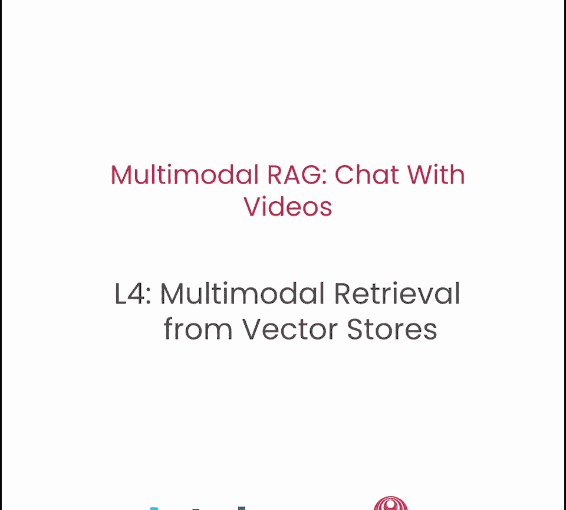
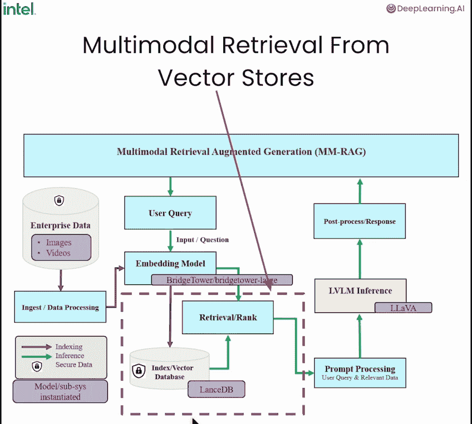
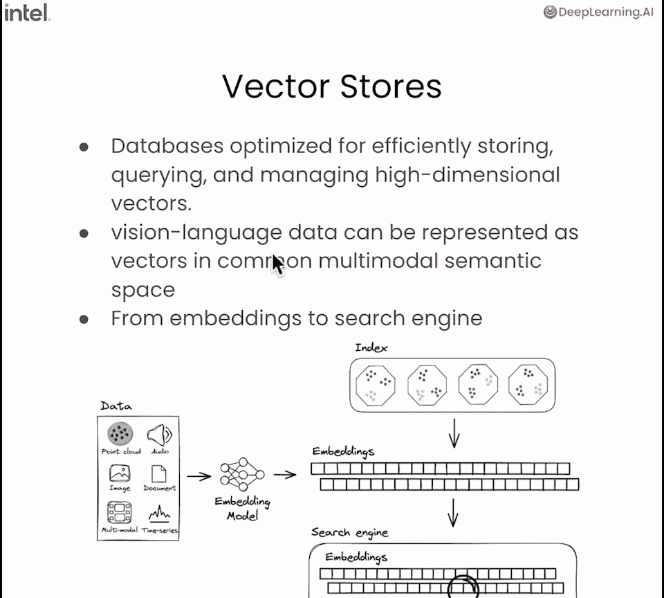
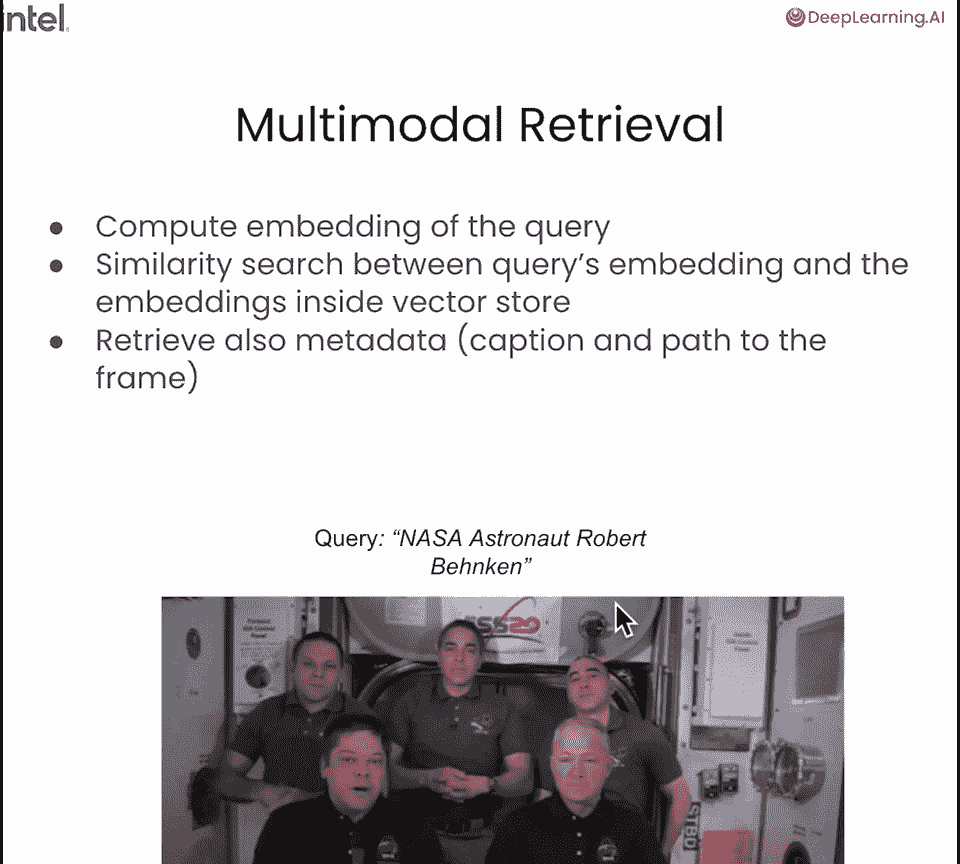
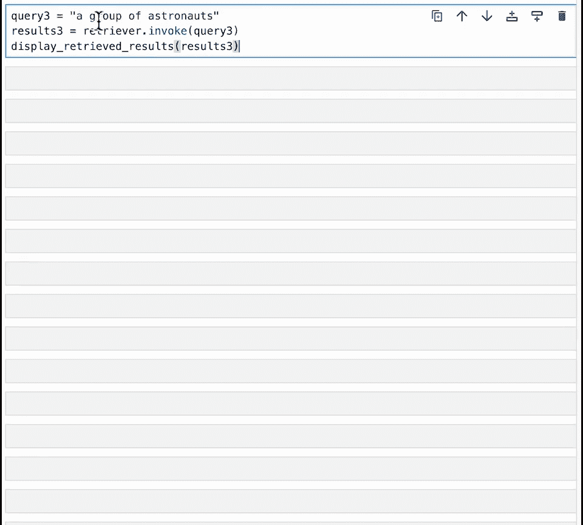

# 005：从向量存储进行多模态检索 🧠




在本课中，我们将学习如何创建能够处理文本和图像复杂查询的强大检索系统。课程结束时，你将能够将数据导入LanceDB向量存储，执行相似性搜索，并展示结合不同模态信息（如视频帧及其相关字幕）的检索结果。

## 概述

上一节我们介绍了多模态RAG系统的整体架构。本节中，我们将具体学习如何填充向量存储，并从中进行多模态检索。




向量存储是为存储和检索高维向量而优化的数据库。正如之前所见，我们可以将视觉和语言数据表示为共用的多模态语义向量空间中的嵌入。向量存储的作用，就是将这些嵌入转变为可用的搜索引擎。

## 多模态检索流程




构建好多模态向量存储后，下一步就是进行多模态检索。此任务的流程如下：
1.  输入一个查询。
2.  计算该查询的嵌入向量。
3.  在查询嵌入与向量存储中所有嵌入之间执行相似性搜索。

通过这种方式，我们能够检索到最符合查询要求的视频帧及其相关字幕等元数据。接下来，让我们通过第4课的实践来具体操作。

## 实验：填充与检索向量存储 🧪




欢迎来到第4课的实验环节。在本实验中，我们将练习将视频语料库导入LanceDB向量存储，并使用LangChain执行多模态检索。

### 实验准备

在上一课中，我们已经完成了视频下载、帧提取、转录获取和字幕生成。本实验将在此基础上进行。

以下是实验的主要步骤：
1.  导入必要的库。
2.  连接并初始化向量存储。
3.  加载并增强视频元数据。
4.  使用多模态嵌入填充向量存储。
5.  执行多模态语义搜索。

首先，让我们导入处理多模态数据所需的库。由于涉及多模态数据，我们扩展了几个LangChain类，它们位于我们导入的`multimodal-lancedb`库和`BridgeTower`嵌入库中。

```python
# 示例代码：导入库
import lancedb
from langchain.vectorstores import LanceDB
from multimodal.embeddings import BridgeTowerEmbeddings
```

### 连接向量存储

现在，我们将通过声明数据库路径和表名来建立与LanceDB向量存储的连接，并完成初始化。

```python
# 示例代码：连接并初始化向量存储
uri = “./data/lancedb”
table_name = “video_frames”
db = lancedb.connect(uri)
table = db.create_table(table_name, mode=“overwrite”)
```

### 加载与增强数据

接下来，我们加载之前构建的视频元数据文件，并将所有转录文本和视频帧图像分别收集到列表中。

需要注意的一点是，某些视频片段的转录可能是碎片化的，导致单个视频帧的文本上下文不足。为了缓解这个问题，我们可以通过合并每个帧相邻n个帧的转录文本来增强其上下文。这会导致相邻帧的转录有部分重叠，但整体上能显著增加每个帧可用的文本信息量。

在本实验中，我们将n设置为7来实现这种增强。让我们通过一个例子来观察增强前后的对比。

增强前的转录示例可能非常简短，例如“太空行走”或“现在有机会完成了”，这不足以提供充分的上下文。增强后，简短的转录被相邻帧的转录内容所丰富，从而为理解该视频帧提供了足够的背景信息。

```python
# 示例代码：增强转录上下文
def enhance_transcript(transcripts, frame_index, n=7):
    start = max(0, frame_index - n)
    end = min(len(transcripts), frame_index + n + 1)
    enhanced_text = “ “.join(transcripts[start:end])
    return enhanced_text
```

### 填充向量存储

现在，我们将视频数据导入LanceDB向量存储。我们初始化BridgeTower嵌入模型，并将其作为嵌入函数传递给向量存储。我们需要同时传入文本数据（收集的视频转录）和图像数据（收集的视频帧）。

```python
# 示例代码：初始化嵌入模型并填充向量存储
embeddings = BridgeTowerEmbeddings()
vectorstore = LanceDB.from_texts_and_images(
    texts=enhanced_transcripts_list,
    images=video_frames_list,
    embedding=embeddings,
    connection=table
)
```

至此，向量存储已构建完成。我们可以将其内容以Pandas DataFrame的形式查看，会发现它包含了所有的转录文本，并且每一行都关联了一个从视频中提取的帧图像。

### 执行检索

现在，我们为向量存储添加一个检索器。我们定义该检索器使用BridgeTower模型，并设置k值为1，这意味着检索器将返回向量存储中与查询最匹配的一个条目。

```python
# 示例代码：定义检索器
retriever = vectorstore.as_retriever(search_kwargs={“k”: 1})
```

现在，我们可以对向量存储运行查询了。例如，对于查询“幼儿和成人”，我们调用检索器并获得结果。我们可以展示检索到的图像和文本，系统检索到了一个准确描述包含幼儿和成人场景的视频帧及其关联文本。

```python
# 示例代码：执行查询
query = “幼儿和成人”
results = retriever.get_relevant_documents(query)
# 显示结果中的图像和文本
```

接下来，让我们尝试相同的查询，但将k值设为3，以获取前三个最匹配的结果。我们可以看到，第一个结果与之前完全相同，第二个结果可能只包含一个幼儿，第三个结果可能包含两个幼儿。第一个结果得分最高是合理的，因为它完全匹配了查询描述。

我们再运行几个查询示例：
*   查询：“宇航员太空行走，身后是地球的壮丽景色”。系统检索到了展示地球景色和宇航员太空行走的合适视频帧及其转录。
*   查询：“一群宇航员”。系统检索到了显示一群宇航员的视频帧及其相关转录片段。




现在，你可以尝试输入自己的查询进行实验。你也可以遵循相同流程，将自己的视频数据嵌入到这个向量存储中。

## 总结

本节课中，我们一起学习了多模态检索的核心流程。我们从连接和初始化LanceDB向量存储开始，接着加载并增强了视频的文本上下文，然后使用BridgeTower多模态嵌入模型将文本和图像数据共同填充到向量存储中。最后，我们实践了如何通过自然语言查询，从这个多模态向量存储中执行语义搜索，成功检索出相关的视频帧和字幕。这构成了多模态RAG系统中“检索”环节的关键步骤。