# 006：大规模视觉语言模型 (LVLMs) 🖼️🤖

在本节课中，我们将学习如何利用大规模视觉语言模型的能力来处理复杂的多模态任务，例如为图像生成描述、基于视觉内容回答问题以及从图像中推理信息。我们将通过调用 Prediction Guard 的 API 来实践这些功能。

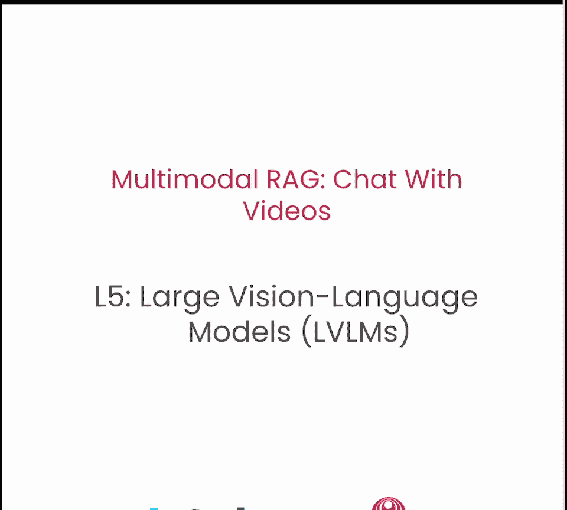

## 概述

上一节我们介绍了多模态RAG系统的整体架构。本节中，我们将重点学习如何实现其中的**LVLM推理模块**。LVLM代表大规模视觉语言模型，它能够同时理解图像和文本信息，并生成文本输出。

## LLM 与 LVLM 的比较

首先，我们来比较一下LLM和LVLM的核心区别。

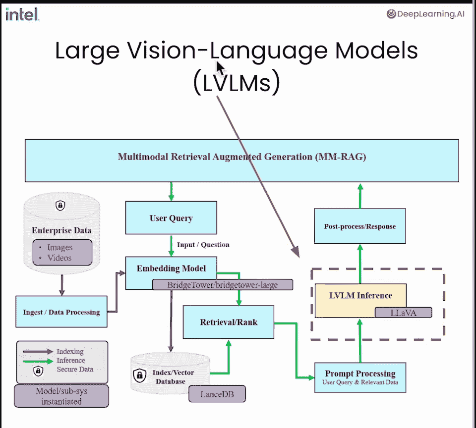

*   **LLM**：专注于自然语言处理与生成。
    *   **输入**：仅文本。
    *   **输出**：文本。
    *   **公式**：`Output_Text = LLM(Input_Text)`

*   **LVLM**：结合了视觉与文本信息，连接了计算机视觉和语言理解。
    *   **输入**：图像 + 文本。
    *   **输出**：文本。
    *   **公式**：`Output_Text = LVLM(Input_Image, Input_Text)`

这些模型在图像描述生成、视觉问答等任务上表现出色。

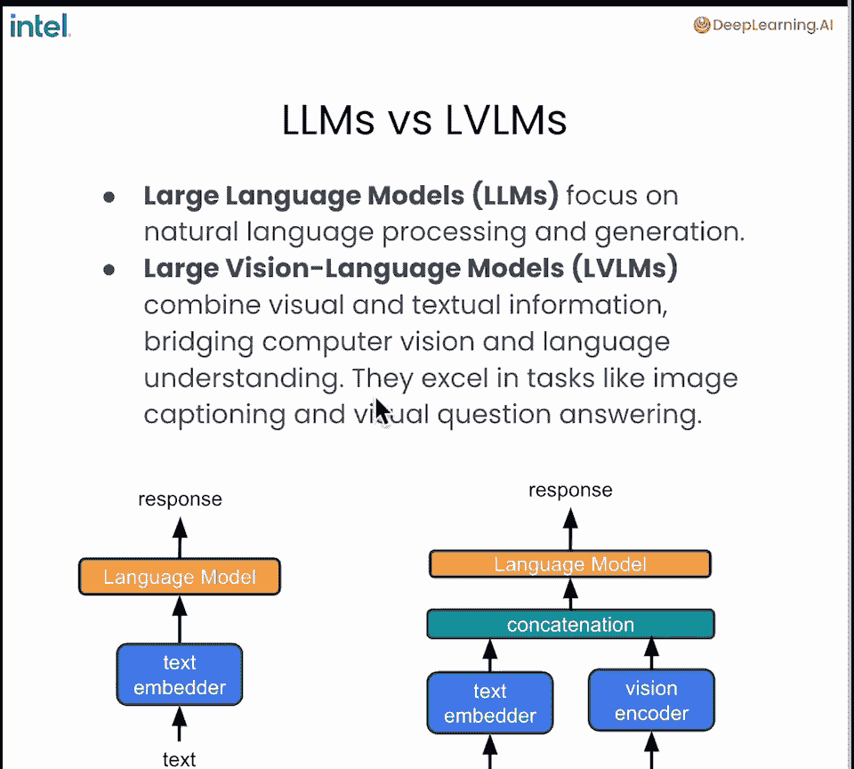

## LAVA 模型简介

在本实验中，我们将使用一个名为 **LAVA** 的开源LVLM。LAVA代表大规模语言与视觉助手。

LAVA模型的核心架构如下：
1.  图像通过一个视觉编码器（如CLIP的视觉转换器）进行处理。
2.  编码后的视觉特征通过一个投影矩阵，被映射到与语言模型相同的语义空间。
3.  这些视觉特征与文本指令（或查询）一起，输入到一个强大的语言模型（通常是LLaMA系列）中，最终生成文本响应。

LAVA模型的一个优点是，可以通过少量训练轻松更换其骨干语言模型，灵活性很高。

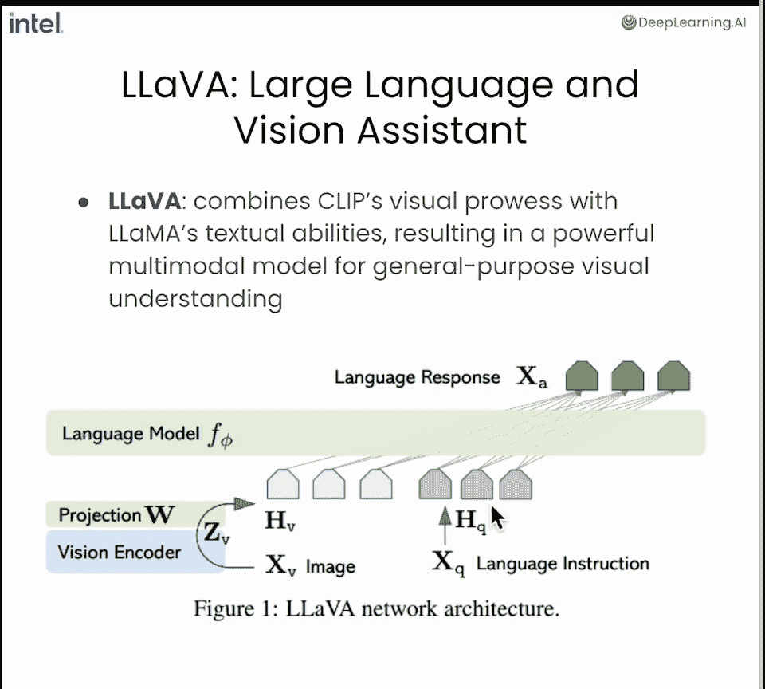

## 实验准备

现在，让我们进入第5课的实践环节。在之前的课程中，我们学习了像BridgeTower这样的多模态嵌入模型。本实验中，我们将使用LAVA模型家族。

我们将通过Prediction Guard提供的API来调用LAVA 1.5模型，该模型运行在英特尔开发者云的AI加速器上。

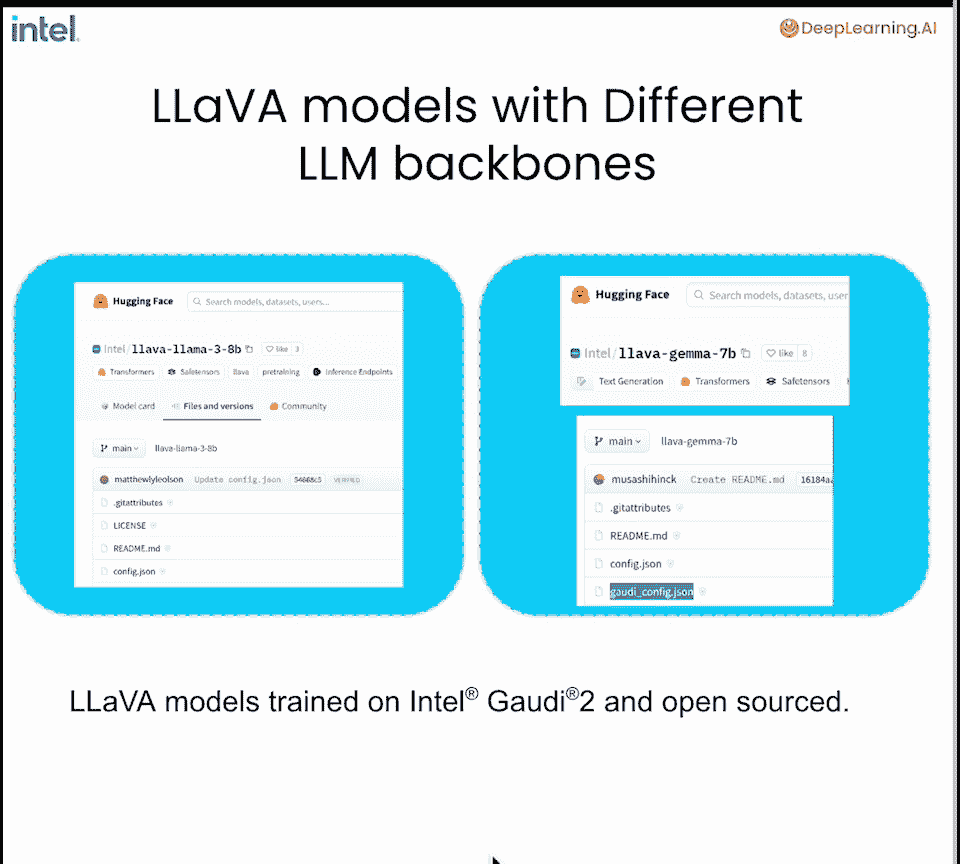

以下是导入所需库的代码：

```python
# 导入必要的库
import requests
import base64
from PIL import Image
import json
```

## 数据准备

我们将使用第2课中从视频提取的帧和转录文本，并引入一些额外的图像数据。

例如，我们读取之前保存的转录文本和视频中心帧。同时，我们也加载了一些新的数据，这些数据包含图像的URL及其描述。

```python
# 加载第3课提取的转录和帧
# 加载新的图像URL和描述数据
# （此处为示例，具体代码取决于数据存储格式）
```

## 应用场景一：图像描述生成

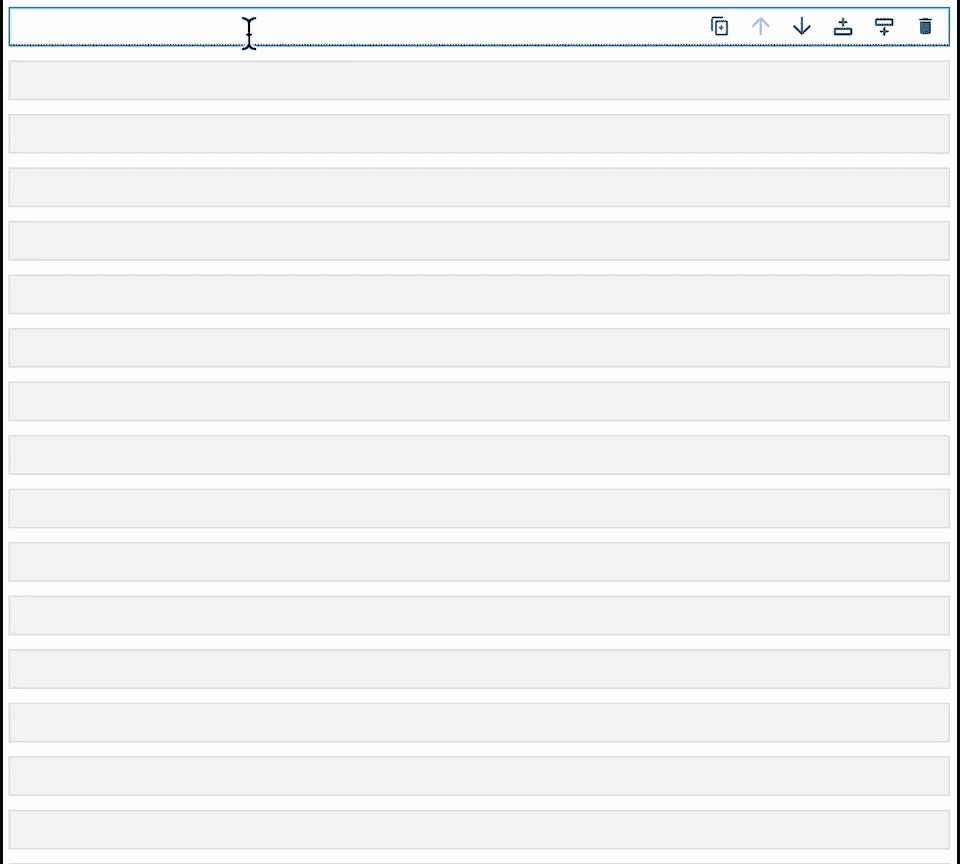

第一个应用是让模型为图像生成描述性文字。

我们首先将图像编码为Base64格式，然后构建一个对话对象，用于存储模型返回的字幕。

以下是核心步骤的代码示例：

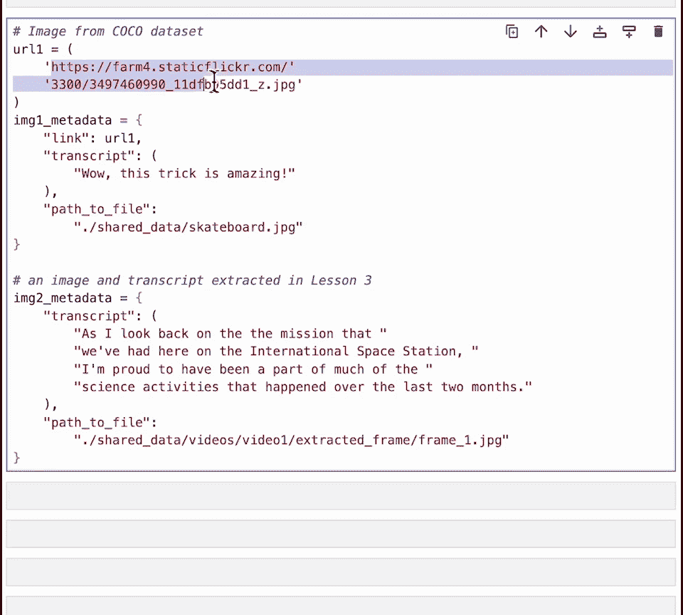

```python
def encode_image_to_base64(image_path):
    with open(image_path, "rb") as image_file:
        return base64.b64encode(image_file.read()).decode('utf-8')

image_base64 = encode_image_to_base64("path_to_your_image.jpg")
prompt = "请描述这张图片。"
# 构建包含图像和提示的请求数据
# 调用Prediction Guard API
```

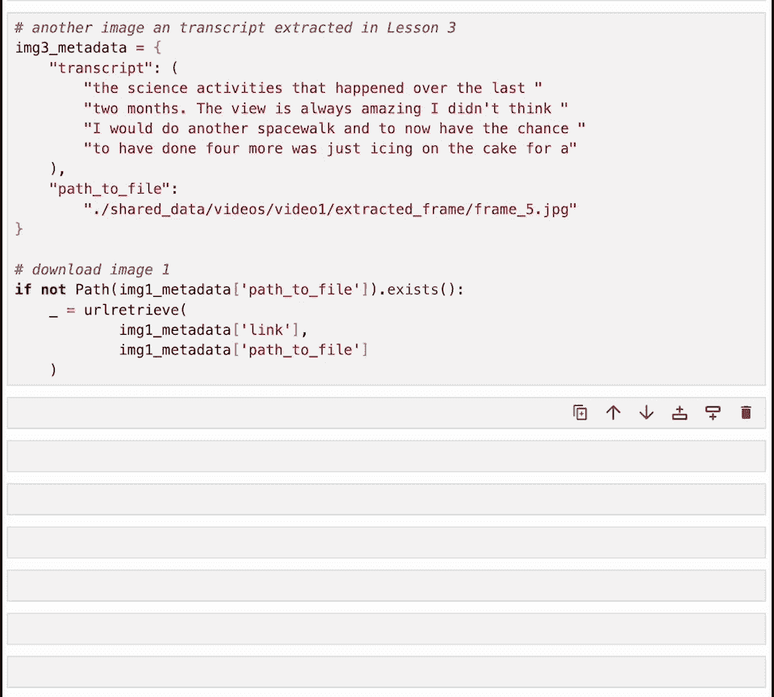

让我们看一个例子。模型为一张包含人物的视频帧生成了准确的描述：“图片中有五名男子...”，并提取了许多其他细节。

## 应用场景二：基于视觉线索的问答

接下来，我们尝试基于图像内容进行问答。

我们向模型展示一张图片，并提出一个具体问题，例如：“接下来可能会发生什么？”

模型不仅准确描述了图像内容（“男子正在沙滩上用滑板做倒立”），还进行了合理的推理（“他可能会失去平衡，从滑板上摔下来”）。这表明LAVA模型能够从视觉内容中进行逻辑推理。

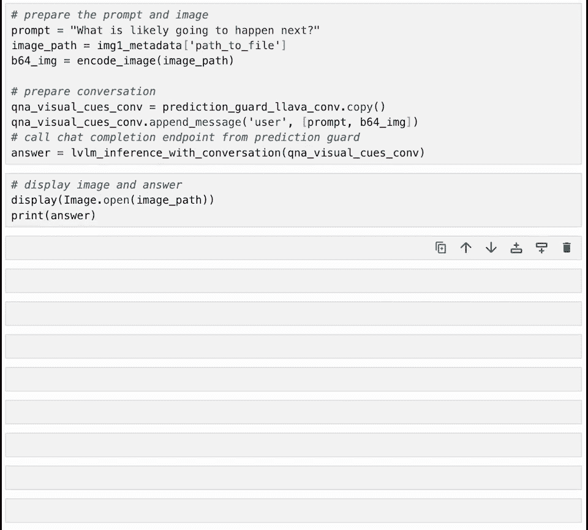

## 应用场景三：理解图像中的文本

LVLM还能识别和理解图像中的文字信息。

例如，我们向模型展示一个带有文字的宇航员视频帧，并提问：“这位宇航员的名字是什么？”

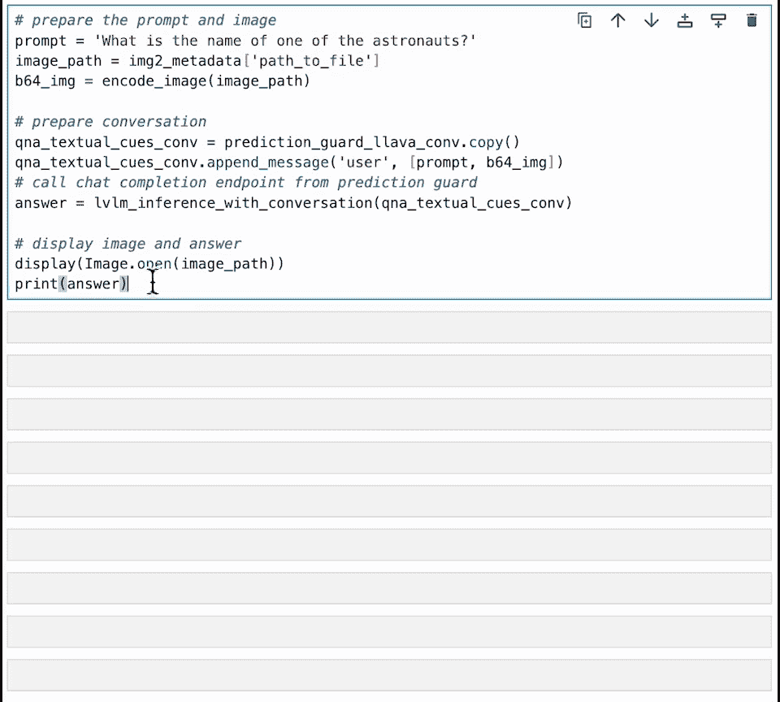

模型成功检测并读取了帧中的文本“Robert Behnken”，并在回答中正确指出了宇航员的名字。

## 应用场景四：结合图像与关联文本进行问答

我们还可以结合与图像相关的文本来提问。

我们构建一个提示，其中包含相关的文本记录（例如视频转录），然后提出一个问题，如：“宇航员对他们的工作有什么感受？”

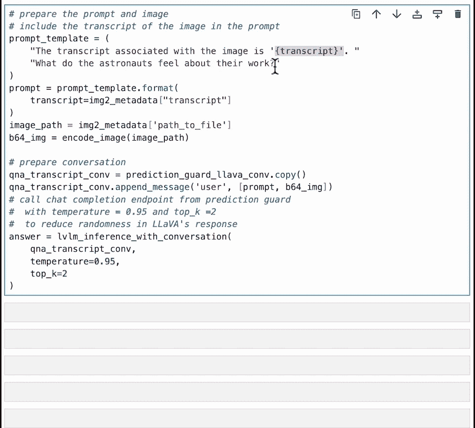

模型能够综合文本记录中的信息，给出回答：“宇航员对他们在国际空间站的工作感到自豪。” 这展示了模型整合多模态信息的能力。

## 扩展对话：多轮交互

最后，我们来看如何与LAVA模型进行多轮对话。关键在于维护对话历史。

以下是一个示例，我们对模型的上一个回答提出一个跟进问题：

```python
# 假设 `conversation_history` 是一个列表，存储了之前的对话轮次
conversation_history = [
    {"role": "user", "content": "宇航员对他们的工作有什么感受？"},
    {"role": "assistant", "content": "他们对工作感到自豪。"}
]

follow_up_question = "宇航员从哪里返回？"
# 将跟进问题加入历史，或构建新的包含历史的提示
# 再次调用API
```

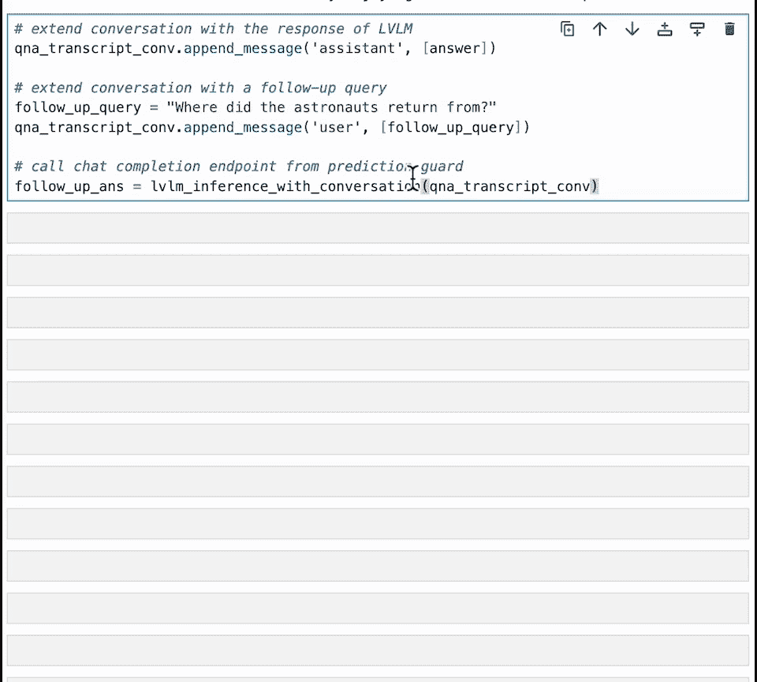

在这个例子中，模型成功回答了“宇航员是从国际空间站返回的”。通过维护对话历史，我们可以实现连贯的多轮对话。

## 总结

本节课中，我们一起学习了大规模视觉语言模型的核心概念与应用。我们了解到LVLM能够同时处理图像和文本输入，并生成文本输出。通过LAVA模型，我们实践了图像描述生成、视觉问答、文本识别以及结合多模态信息的推理。最后，我们还探索了如何通过维护对话历史来实现与模型的多轮交互。

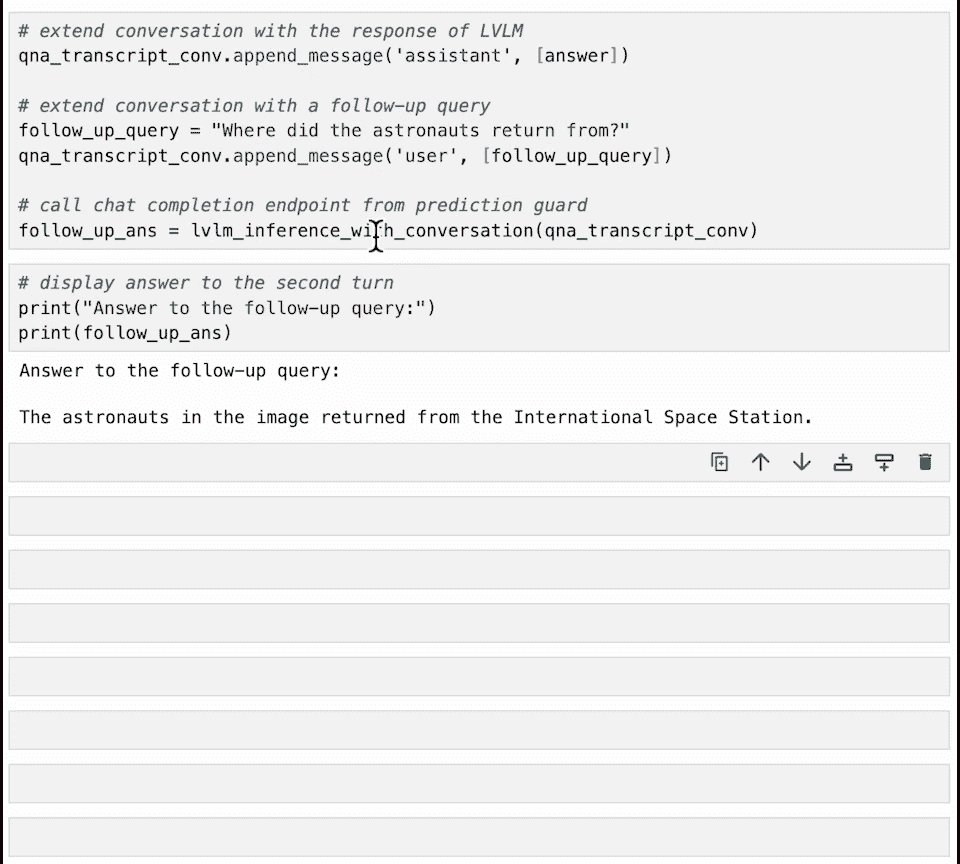

现在，你可以尝试使用自己的图像和文本提示，来探索这个托管的LVLM模型的更多可能性。