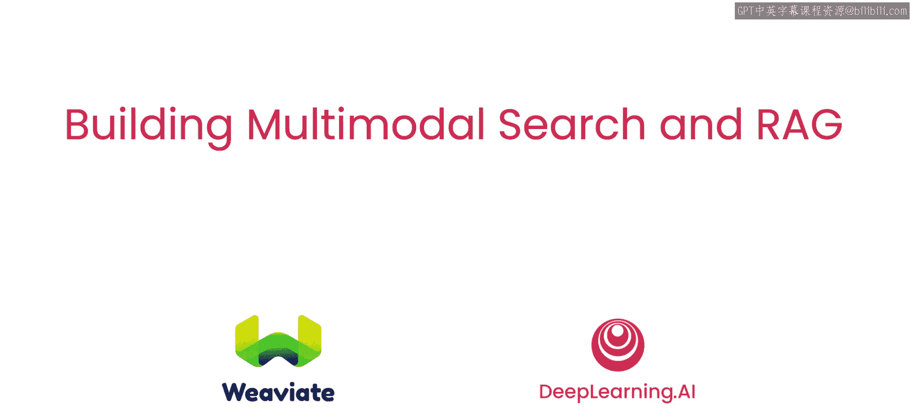
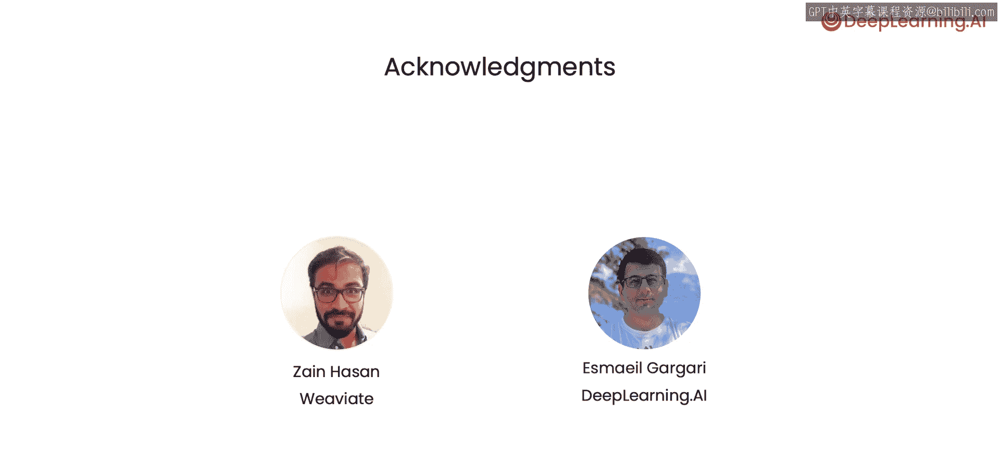

# 001：课程介绍 🎬

在本节课中，我们将要学习《构建多模态搜索和RAG》这门短期课程的概述，了解其核心目标、技术背景以及你将掌握的关键技能。

欢迎来到这门短期课程《构建多模态搜索和RAG》。本课程与Weaviate合作推出。RAG，即检索增强生成系统，为大型语言模型提供包含你专有数据信息的上下文，并要求模型在生成回答时使用该上下文。

构建RAG应用的一种常见方法是使用向量数据库来存储文本文档的嵌入向量。然后，给定一个查询，你从向量数据库中检索相关信息，并将其作为文本上下文添加到你的提示词中。

但是，如果你想要的上下文包含一张演示文稿的图片、一段音频剪辑，甚至可能是一段视频呢？本课程将教你使用此类多模态数据实现RAG背后的技术细节。

第一个关键点是找到一种计算嵌入向量的方法，使得不同模态下但主题相关的数据能够被相似地嵌入。例如，一段关于狮子的文字、一张显示狮子的图片、一段狮子吼叫的视频或音频，它们的嵌入向量应该彼此接近，这样关于狮子的查询就能检索到所有这些数据。换句话说，我们希望概念的嵌入表示是**模态无关**的。

在下一节视频中，你将学习如何通过一个称为**对比学习**的过程来实现这一点。在你拥有了这样的多模态检索模型之后，你将用它来检索与用户查询相关的上下文。这样，你现在就可以构建一个多模态搜索应用，例如，用一张狮子的图片来检索与该图片相关的视频、音频和文本。

现在，如果你有一个支持多模态输入的生成模型，你可以将检索结果作为上下文提供给模型，并要求它基于相关的多模态上下文信息来回答查询。我很高兴能与Darren Schter共同讲授这门课程。Sebastian将在这里解释多模态应用在底层是如何工作的。

Sebastian是Weaviate的开发者关系负责人，他是向量数据库领域的专家，在开发者关系领域工作了十多年。事实上，他的全职工作就是帮助像你这样的开发者成功使用向量数据库。

感谢Andrew，我非常高兴能与你合作这门课程。在这门课程中，你将首先学习如何教会计算机理解多模态数据的概念。然后，你将构建一个“文本到任意模态”以及“任意模态到任意模态”的搜索系统。接下来，你将学习如何将语言模型和多模态模型结合成能够理解图像和文本的语言视觉模型。

之后，你将专注于多模态RAG，将多模态搜索与多模态生成和推理相结合。作为最后一步，你将通过实现不同的现实案例（包括分析发票和流程图）来学习多模态在工业界是如何应用的。

许多人共同努力创建了这门课程。我要感谢来自Weaviate的Zen Hasan以及来自DeepLearning.AI的Emael Gegari对本课程的贡献。那么，带着这些激动人心的主题，让我们进入下一个视频，正式开始学习。

---

本节课中，我们一起学习了《构建多模态搜索和RAG》课程的总体介绍。我们了解了RAG系统的基本概念、处理多模态数据（如图像、音频、视频）的挑战与目标，以及通过对比学习实现模态无关嵌入的核心思想。课程将引导我们从理解概念开始，逐步构建多模态搜索，最终实现结合了检索与生成功能的多模态RAG应用。