# 002：多模态概述 🧠

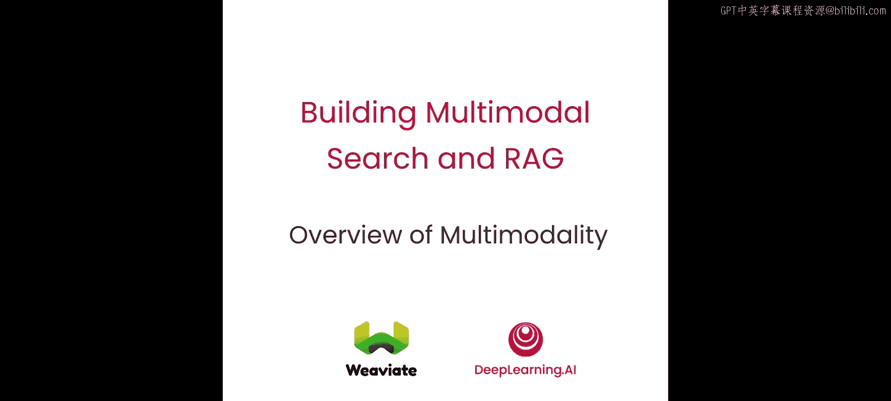

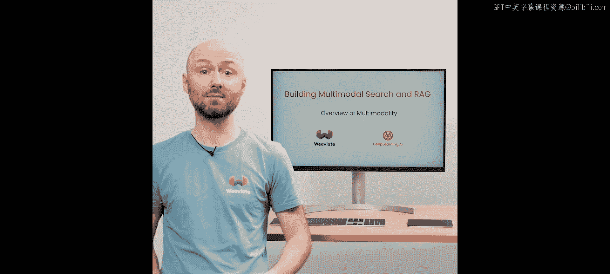

在本节课中，我们将学习多模态的概念，了解什么是多模态模型，并重点探讨如何通过对比表征学习的过程，教会计算机理解多模态数据。

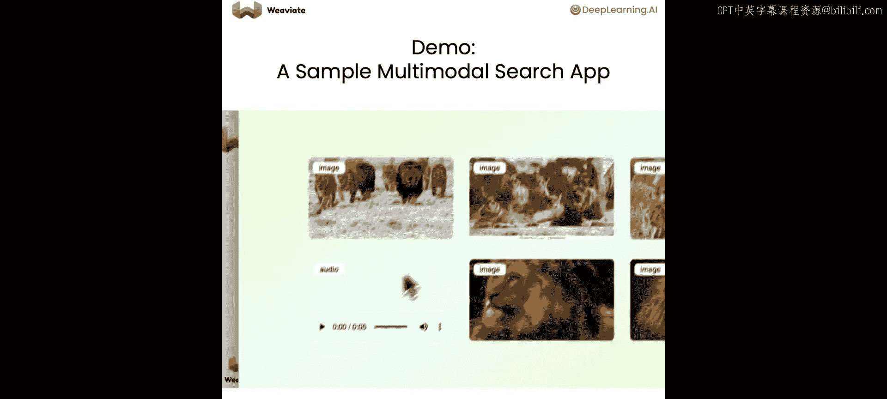

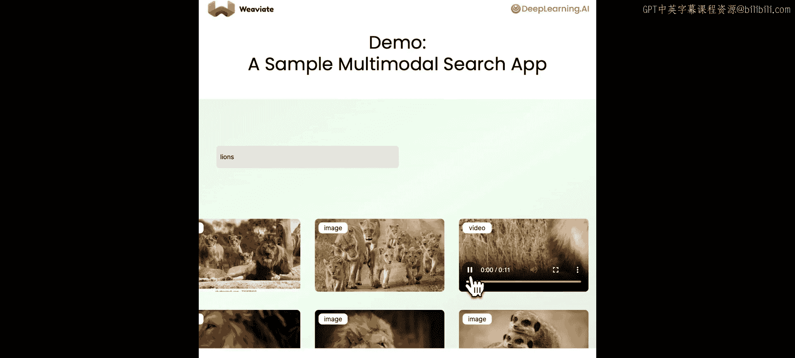

---

## 多模态搜索演示 🚀

为了激发你的想象力，我们先来看一个实时的多模态搜索演示，了解如何跨不同类型的内容进行搜索。在这个演示中，我可以输入文本（例如“一群狮子”）进行搜索，并得到图像、音频和视频文件的返回结果。本课程将深入讲解其背后的工作原理、支撑该应用的核心技术，并让你亲手实践如何构建类似的功能。我们不一定完全复现这个应用，但学完本课程后，你将掌握足够的知识来构建此类应用甚至更多。

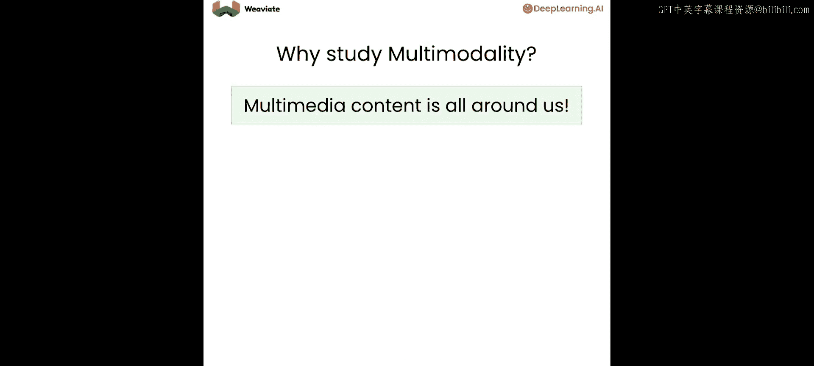

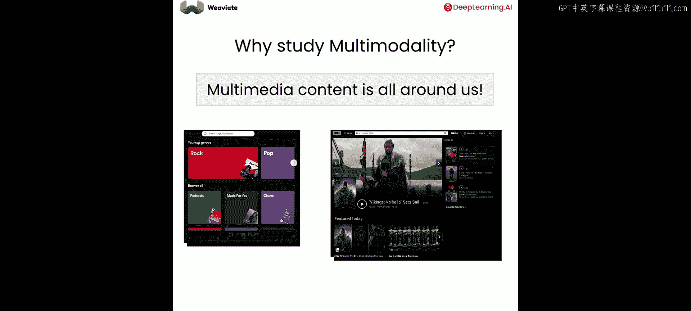

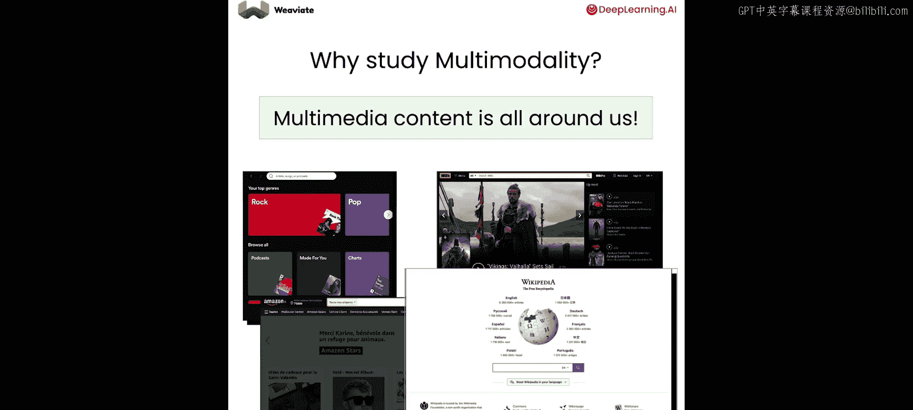

---

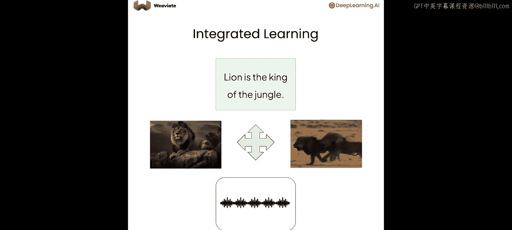

## 为何要学习多模态？🤔

多媒体内容无处不在。无论是搜索喜欢的歌曲、寻找想看的电影、浏览想购买的商品，还是查找维基百科文章，我们的一切行为都始于搜索。但我们不仅想搜索文本，还想搜索歌曲、电影预告片、产品图片等，即我们想搜索多模态数据。

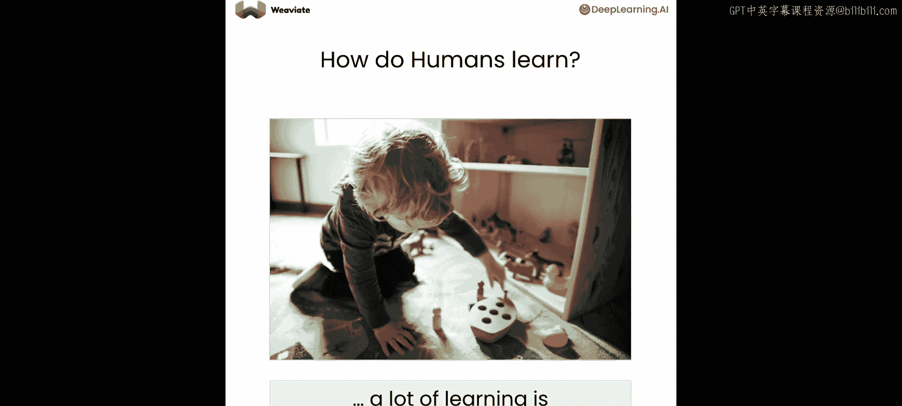

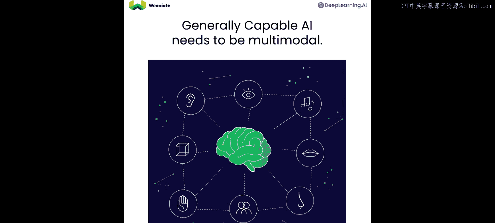

那么，什么是多模态数据？多模态数据是来自不同来源的数据，可以包括文本、图像、音频、视频等。这些不同的模态通常描述相似的概念。例如，一张狮子的图片、一段描述“丛林之王”的文字、一段狮子奔跑的视频，甚至一声狮吼。每种模态都携带不同类型的信息。通过结合这些信息，我们能更好地理解它们所代表的概念。

试想一下，同时看到和听到狮子咆哮，远比仅仅安静地看着它更令人印象深刻，甚至感到震撼。毕竟，只有当你既看到又听到狮子时，才能真正理解它为何是“丛林之王”。

我们想要从多模态数据中学习的另一个动机，是思考人类如何学习。想象一个婴儿在学会说话前的第一年，他们的大量学习是通过与物体的互动完成的——触摸、闻、感受质地，甚至品尝（即使是肥皂）。同时，他们也通过观察和倾听周围的一切来学习。这种基础知识的建立是通过与世界的多模态互动，而非仅通过语言完成的。因此，如果你想构建更智能、能力更强的AI，它也需要像人类一样学习和思考不同模态的信息。

---

## 多模态嵌入与对比学习 🧩

为了让计算机处理多模态数据，我们首先需要了解多模态嵌入。多模态嵌入允许我们在同一个向量空间中表示多模态数据，使得一张狮子的图片、一段描述狮子的文字、一声狮吼或一段狮子奔跑的视频的向量表示都彼此接近。

多模态嵌入模型能生成一个理解所有模态的联合嵌入空间。它可以理解电子邮件、图像、音频文件等。这里的核心概念是，该模型保留了模态内部和跨模态的语义相似性。这意味着，无论模态如何，相似对象的向量都会彼此接近（例如一张狮子图片和相关的文字描述），而不同概念（如狮子和喇叭）的向量在多模态空间中则相距甚远。

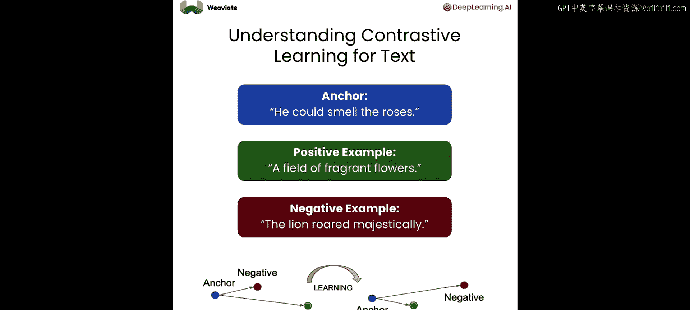

为了开始训练多模态嵌入模型，我们需要从理解单一模态的模型开始。这些独立的模型专门用于理解文本、图像、音频或视频。接下来的任务是将这些模型统一起来，使得无论何种模态，相似概念都能产生接近的向量。这个过程是通过**对比表征学习**完成的。

对比表征学习是一种通用过程，可用于训练任何嵌入模型，而不仅仅是多模态嵌入模型。具体到这里，它也可以用于将多个模型统一成一个多模态嵌入模型。其主要思想是，我们希望为多种模态创建一个统一的向量空间表示。我们通过为模型提供相似概念和不同概念的正例和负例来实现这一点。然后，我们训练模型，将相似示例的向量拉近，将不同概念的向量推远。

让我们通过一个文本示例来理解其工作原理。首先，我们需要一个锚点，这可以是任何数据点，例如句子“他能闻到玫瑰花香”。然后，我们需要一个正例，即与锚点相似的示例，例如“一片芬芳的花田”。最后，我们需要一个负例，即与锚点不同的示例，例如“狮子威严地咆哮”。现在，我们可以获取每个数据点的向量嵌入，并希望将负例向量推离锚点，同时将正例向量拉近锚点。

我们可以用同样的方法训练一个图像模型。锚点可以是一张德国牧羊犬的图片，正例可以是同一张图片的灰度版本，而负例可以是一张苹果的图片。任务同样是推远负例，拉近正例。

这种“推拉”过程是通过**对比损失函数**实现的。首先，我们需要将锚点和示例编码成向量嵌入，然后计算锚点与示例之间的距离。在训练过程中，我们希望最小化锚点向量与正例向量之间的距离，同时最大化与负例向量之间的距离。

现在，让我们将对比学习扩展到多模态数据。我们可以提供不同模态的正例和负例。例如，给定我们的锚点是一段狮子奔跑的视频，我们可以提供图像和文本作为对比示例。然后，我们可以跨模态应用“推拉”操作，从而使模型在所有模态的同一向量空间中对齐。

一个棘手的部分可能是找到足够的锚点和对比示例。在2021年的一篇CLIP论文中，研究人员将图像及其对应的标题（各自代表不同模态）配对。图片及其标题代表锚点和正例（如矩阵对角线所示），而任何其他随机的图片-标题配对则很可能是负例。通过这种方式，他们能够应用对比损失函数来训练那个文本-图像多模态模型。

现在，让我们看看对比损失函数的样子。首先，你需要编码函数，将锚点和对比示例转换为相同维度的向量。

假设我们有一个函数 **F**，它接收一张图像并返回一个向量 **Q**。
同时，我们有一个函数 **G**，它接收一段视频并生成一个向量 **K**。

然后，我们取这些向量表示。在分子部分，我们有正例之间的相似度（例如一张狮子图片和一段狮子奔跑的视频），我们希望这个相似度尽可能高。在分母部分，我们有一个负例（例如一张狮子图片和一段骑自行车的猫的视频）。实际上，这是你需要求和的众多负例之一。我们希望这个公式返回一个概率值，因此在分母中，我们通过再次加入分子的正例来进行归一化。公式前面有一个负号，这意味着我们实际上希望最小化这个损失函数。通过最小化它，正例视频的嵌入将被拉近锚点图像的嵌入，而负例视频的嵌入将被推离锚点图像的嵌入。

你可以对音频、文本、视频等所有模态逐一进行这个过程。这正是ImageBind论文中所做的。

---

## 实践：在实验室中训练嵌入模型 💻

现在，让我们在实践中看看这一切。在实验室中，你将使用对比损失训练一个嵌入模型，然后可视化学习到的向量空间。

在这个实验中，你将训练一个神经网络来学习MNIST图像数据集的嵌入。首先，运行代码以忽略任何对我们分析不重要的警告。

首先，导入所需的库。你将使用PyTorch训练模型以及一系列支持库，其中最重要的是用于可视化的库，如Plotly和UMAP。最后，你需要导入`MNISTDataset`类，用于获取训练和测试所需的正例和负例。

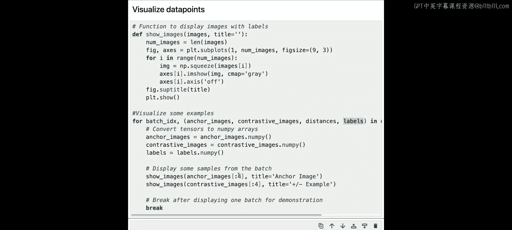

MNIST数据集基于0到9的数字图像，每个数字图像都标有其对应的值，这样我们就知道它代表的是0、5还是9。`MNISTDataset`类为你提供一个锚点（一个数字）以及正例和负例（也是数字图像），正如我们在幻灯片中讨论的那样。例如，如果锚点是5，那么正例将是另一个5的图像，而负例可能是6或7的图像。

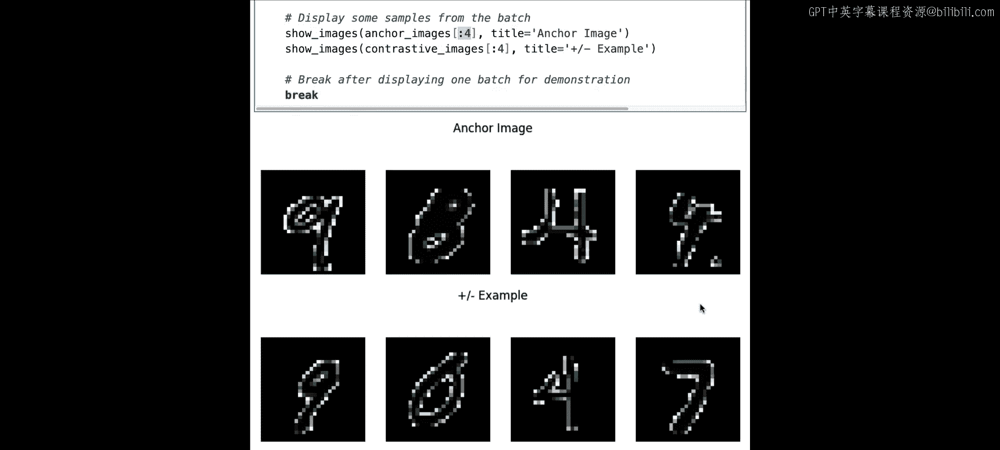

现在，让我们从`MNISTDataset`加载数据。这里需要加载训练数据和验证数据。数据加载后，你需要设置PyTorch数据加载器，以便为神经网络提供训练数据。

现在，使用上述数据加载器来可视化锚点及相应的正例和负例。首先，添加一个辅助函数来显示提供的图像。然后，你需要遍历训练数据加载器中的批次数据，从中获取锚点图像、对比图像、它们的理想距离和标签。运行此代码，你应该能看到每个示例的四张图像。

接下来，定义一个神经网络架构，该架构将接收MNIST图像并输出64维向量。这是一个简单的架构，包含两个卷积层（用于提取数字的视觉特征）和两个前向线性层（用于将卷积层学习到的视觉特征转换为64维表示）。所有这些都在前向传播函数中组合。

为了训练神经网络，我们使用对比损失函数。该函数将接收锚点和正例或负例的64维向量表示，并确保满足理想距离。如前所述，正例的理想余弦距离为1，负例为0。这是本实验代码中最重要的部分。

对比损失被定义为计算两点之间的余弦相似度。在前向函数中，你有锚点和一个对比示例（可以是正例或负例）以及理想距离。前向函数的实现分为两步：首先计算锚点和对比图像之间的余弦相似度得分；第二步，将此得分与期望的理想距离进行比较。这两个得分之间的距离越小，损失越低，我们最终希望最小化这个损失。

这里使用CPU作为默认训练选项，但如果GPU可用，则将使用GPU。你还需要配置神经网络的训练参数，包括优化器（执行梯度下降）、对比损失函数和学习率调度器。

现在进入有趣的部分：执行模型训练的代码。我们需要一个检查点文件夹来保存训练结果，以便后续重新加载。训练循环可以设置为运行任意数量的周期。在每个周期中，循环通过前向传播和反向传播训练模型。关键部分是损失函数，它接收锚点和对比向量及其期望距离，并计算每个数据点的损失。损失被累加，在每个周期结束时用于计算平均损失，从而判断模型训练是否在改进。每个周期完成后，循环将结果保存到检查点文件夹。

请注意，训练过程相当缓慢，每个周期可能需要2到3分钟。因此，运行10、20甚至100个周期可能需要相当长的时间。为了节省时间，我们提供了一个预训练了100个周期的模型检查点，建议直接加载这个预训练模型。

运行以下代码来获取你的模型。默认情况下，它将尝试从检查点加载模型。如果你希望自己进行完整训练，可以将训练标志更改为`True`，但请记住这是一个漫长的过程，需要耐心等待。

如果你选择自己训练模型，可以绘制损失随周期变化的曲线。在我们的案例中，训练大约在20个周期后基本稳定，大部分学习发生在前5到10个周期。

---

## 可视化向量空间 📊

现在你有了一个训练好的神经网络，可以可视化向量空间，看看实际学到了什么。

为了可视化向量空间，你需要获取训练数据集，并用模型对所有数据进行编码。结果，你将得到数据的64维向量表示。你还需要每个项目的标签，以便用不同颜色显示每个数字。

因为我们无法看到64维的世界，所以需要进一步进行降维。这里你将使用**主成分分析**，将维度从64降至3，这样我们就可以看到了。

现在你有了3D向量，可以在交互式散点图中可视化这些数据。使用在X、Y和Z轴上降维后的三维数据，创建一个绘图对象布局并显示它。在绘制的图表中，你会看到向量被绘制在图上，每种颜色代表不同数字的点。由于你在训练中使用了余弦距离度量，相似数字的嵌入呈放射状或线状排列，而不是聚集成簇。这是因为余弦距离依赖于嵌入之间的角度，不像欧几里得距离那样最小化邻近性。

你可以移动和旋转这个3D图，从不同角度观察空间。

接下来，你可以使用**UMAP**技术在2D空间上可视化训练好的嵌入。请注意，这里提供的度量设置为`cosine`，这一点非常重要，因为UMAP默认使用欧几里得距离，这不会给你准确的向量嵌入空间视图。运行此代码，UMAP可能需要半分钟到一分钟来完成。最终，2D图将显示出来。

在这个图表中，每个数字由不同的颜色表示，你可以看到数字如何以类似水母触手的模式聚集。这证明了对比训练是成功的，每个数字的表示都聚集在向量空间的不同部分。

出于好奇，如果你运行相同的代码但不指定距离度量，UMAP将使用欧几里得距离，你会得到一串串的点。你仍然可以看到这些“串”彼此靠近，并相互跟随。

最后，你可以播放一个视频，亲眼观看对比学习在100个训练周期中的过程。你可以看到，在开始时，所有数据点都聚集在一起，但随着时间的推移，相似的嵌入逐渐对齐，而不同的数字则向其他方向扩散。这正是拉近相似示例、推远不同示例的效果，这就是对比训练的工作原理。

---

## 总结 📝

在本节课中，你学习了如何实现对比学习来在图像数据集上训练神经网络。你也了解了推远负例和拉近正例如何帮助训练模型。最后，你使用PCA和UMAP绘制了降维后的向量嵌入，以分析向量空间训练的结果。

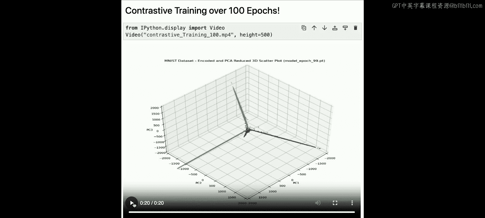

在下一课中，你将学习如何将向量数据库与多模态模型结合使用，以向量化图像和视频，并进行文本、图像和视频输入的搜索。