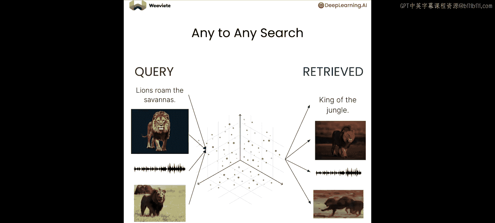
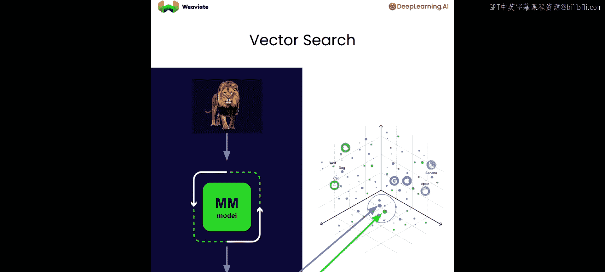
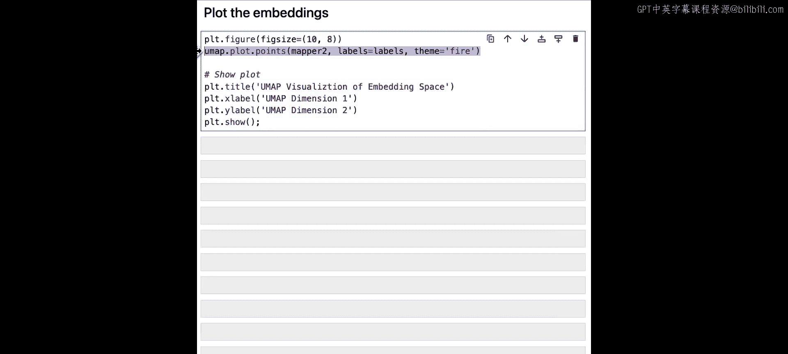
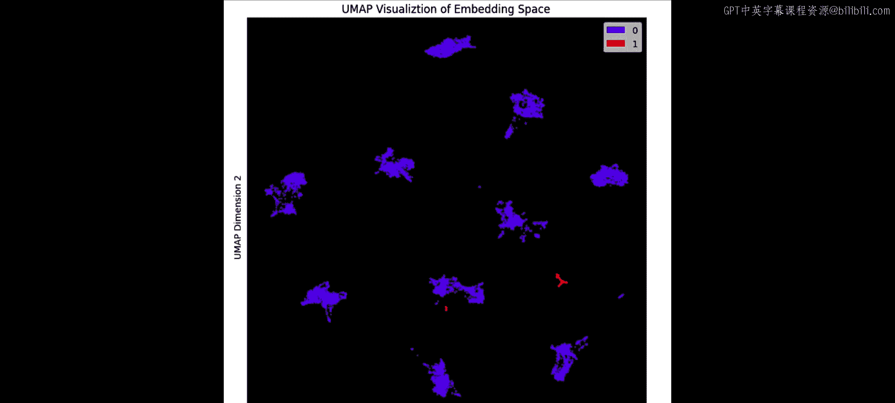
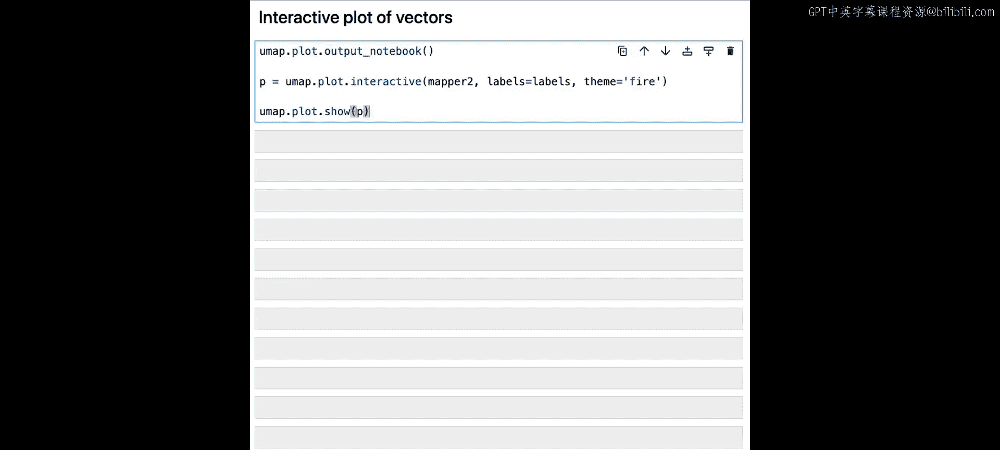
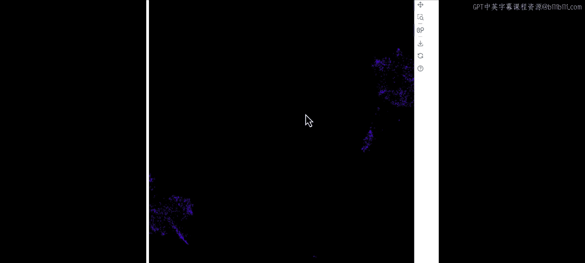
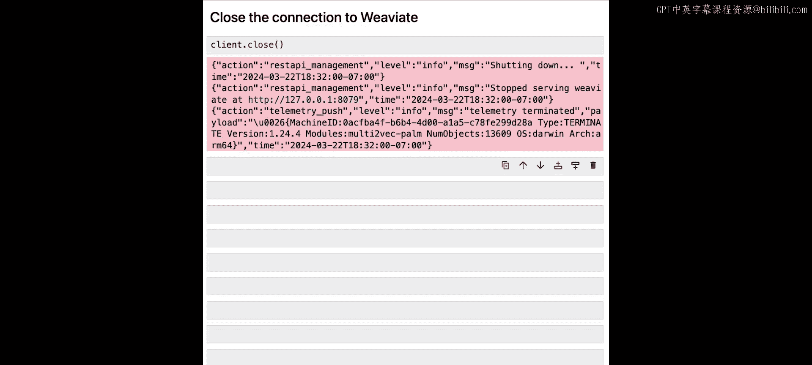

# 003：3.L2 多模态搜索

## 概述
在本节课中，我们将学习如何理解跨越多种模态（如文本、图像、视频）的同一概念，并利用开源向量数据库 Weaviate 实现一个多模态检索系统。我们将构建“文本到任意模态”以及“任意到任意模态”的搜索功能。

人类非常擅长跨模态推断信息。即使听不到视频的声音，你也能在脑海中“听到”狮子的吼声或火车经过的“呜呜”声。这是因为我们能通过多种感官（视觉、听觉、触觉等）理解同一个数据点。

机器要获得类似的多模态理解能力，需要创建一个**共享的多模态向量空间**。在这个空间里，无论数据属于哪种模态，只要内容相似，其向量表示就会被放置在彼此接近的位置。

有了统一的多模态嵌入空间，你就可以执行**文本到任意模态搜索**。例如，搜索“在草原上咆哮的狮子”，可以返回代表最相似内容的多模态数据，无论是文本、图像、音频还是视频。你甚至可以执行**任意到任意搜索**，即查询和检索结果都可以是任意模态。

## 多模态搜索的工作原理
上一节我们介绍了多模态搜索的概念，本节中我们来看看它的具体实现步骤。



以下是多模态搜索的工作流程：
1.  将数据（如“丛林之王”文本或狮子视频）输入多模态模型，得到向量嵌入。
2.  对海量数据重复此过程，最终构建一个包含所有向量嵌入的向量空间。
3.  进行搜索时，将查询（如一张狮子图片）输入同一模型，得到其向量嵌入。
4.  在向量空间中查找与该查询向量最接近的向量，返回对应的数据对象（如图片或视频）。

## 实践：构建多模态搜索
现在，让我们通过代码实践，将多模态数据添加到向量数据库，并执行任意到任意搜索。

### 1. 环境设置与数据库连接
首先，我们需要导入必要的库并设置环境。



```python
# 忽略不必要的警告
import warnings
warnings.filterwarnings('ignore')

# 加载API密钥（用于大模型）
import os
os.environ['OPENAI_API_KEY'] = 'your-api-key-here'

# 连接至Weaviate向量数据库（内存嵌入式版本）
import weaviate
from weaviate.embedded import EmbeddedOptions

client = weaviate.Client(
    embedded_options=EmbeddedOptions()
)
```

### 2. 创建多模态集合
接下来，我们创建一个用于存储向量嵌入的集合（Collection）。

```python
# 定义集合模式
collection_name = "animals"

# 定义多模态向量化器配置
vectorizer_config = weaviate.classes.config.Configure.Vectorizer.multi2vec_clip(
    image_fields=["image"],
    video_fields=["video"]
)

# 定义集合配置
data_collection = client.collections.create(
    name=collection_name,
    vectorizer_config=vectorizer_config,
    properties=[
        weaviate.classes.config.Property(name="name", data_type=weaviate.classes.config.DataType.TEXT),
        weaviate.classes.config.Property(name="path", data_type=weaviate.classes.config.DataType.TEXT),
        weaviate.classes.config.Property(name="media_type", data_type=weaviate.classes.config.DataType.TEXT),
    ]
)
```

### 3. 数据准备与导入
在导入数据前，我们需要一个辅助函数将媒体文件转换为Base64格式，这是模型处理所需的格式。

```python
import base64

def file_to_base64(file_path):
    """将文件转换为Base64字符串。"""
    with open(file_path, "rb") as f:
        return base64.b64encode(f.read()).decode('utf-8')
```

以下是导入图像数据的步骤：
1.  获取目标集合。
2.  遍历图像文件夹中的所有文件。
3.  使用批处理方式导入数据，将每个图像转换为Base64并生成向量嵌入。

```python
# 获取集合
animals = client.collections.get(collection_name)

# 设置图像文件夹路径
image_folder = "./source_images/"

# 开始批处理导入
with animals.batch.dynamic() as batch:
    batch.batch_size = 100
    for filename in os.listdir(image_folder):
        file_path = os.path.join(image_folder, filename)
        # 将图像转换为Base64
        image_b64 = file_to_base64(file_path)
        # 创建数据对象
        data_object = {
            "name": filename,
            "path": file_path,
            "media_type": "image",
            "image": image_b64  # 关键：将Base64图像传递给向量化器
        }
        # 添加到批处理
        batch.add_object(properties=data_object)
```

导入视频数据的流程类似，但需要将Base64数据传递给`video`属性，并将`media_type`标记为`video`。

```python
video_folder = "./source_videos/"
with animals.batch.dynamic() as batch:
    batch.batch_size = 100
    for filename in os.listdir(video_folder):
        file_path = os.path.join(video_folder, filename)
        video_b64 = file_to_base64(file_path)
        data_object = {
            "name": filename,
            "path": file_path,
            "media_type": "video",
            "video": video_b64  # 关键：将Base64视频传递给向量化器
        }
        batch.add_object(properties=data_object)
```

### 4. 执行多模态搜索
数据导入后，我们就可以执行搜索了。首先，我们需要一些辅助函数来美观地展示结果。

```python
from IPython.display import Image, display, Video

def display_media(result_object):
    """根据media_type显示图像或视频。"""
    media_type = result_object.properties['media_type']
    file_path = result_object.properties['path']
    if media_type == 'image':
        display(Image(filename=file_path))
    elif media_type == 'video':
        display(Video(filename=file_path, width=300))
```

#### 文本到任意搜索
我们可以用文本来搜索所有模态的数据。

```python
# 执行文本查询
query_text = "叼着棍子跑的狗"
response = animals.query.near_text(
    query=query_text,
    limit=3,
    return_properties=["name", "path", "media_type"]
)

# 显示结果
for obj in response.objects:
    print(f"名称: {obj.properties['name']}")
    display_media(obj)
```

#### 图像到任意搜索
我们也可以用一张图片作为查询输入。

```python
# 将查询图像转换为Base64
query_image_path = "./query_images/dog_with_stick.jpg"
query_image_b64 = file_to_base64(query_image_path)

# 执行图像查询
response = animals.query.near_image(
    near_image=query_image_b64,
    limit=3,
    return_properties=["name", "path", "media_type"]
)

# 显示结果
for obj in response.objects:
    print(f"名称: {obj.properties['name']}")
    display_media(obj)
```

#### 视频到任意搜索
最复杂的任务之一是用视频进行搜索。

```python
# 将查询视频转换为Base64
query_video_path = "./query_videos/meerkats_chilling.mp4"
query_video_b64 = file_to_base64(query_video_path)

# 执行视频查询
response = animals.query.near_media(
    near_media=query_video_b64,
    media_type="video",  # 指定查询模态为视频
    limit=3,
    return_properties=["name", "path", "media_type"]
)

# 显示结果
for obj in response.objects:
    print(f"名称: {obj.properties['name']}")
    display_media(obj)
```

### 5. 可视化向量空间
为了更直观地理解多模态向量空间，我们可以将高维向量降维并可视化。

以下是使用UMAP库进行降维和可视化的步骤：
1.  从集合中获取所有对象的向量嵌入和元数据。
2.  使用UMAP将向量从1400维降至2维。
3.  使用散点图绘制降维后的向量，相似内容会聚集在一起。

```python
import pandas as pd
import umap
import plotly.express as px





# 1. 获取所有对象的向量和元数据
all_objects = animals.iterator(include_vector=True)
embeddings = []
labels = []
for obj in all_objects:
    embeddings.append(obj.vector['default'])
    labels.append(obj.properties['media_type'])



# 2. 使用UMAP降维
reducer = umap.UMAP(n_components=2, random_state=42)
embeddings_2d = reducer.fit_transform(embeddings)

# 3. 创建DataFrame并绘图
df = pd.DataFrame(embeddings_2d, columns=['x', 'y'])
df['media_type'] = labels



fig = px.scatter(df, x='x', y='y', color='media_type',
                 title='多模态向量空间可视化 (UMAP降维)')
fig.show()
```

## 总结
本节课中我们一起学习了多模态搜索的核心原理与实践。我们了解到，通过创建共享的多模态向量空间，可以让机器像人类一样理解跨越不同模态的同一概念。我们使用Weaviate向量数据库，实现了以下功能：
1.  **向量化与存储**：将图像和视频通过多模态模型转化为向量嵌入，并与元数据一同存储。
2.  **多模态搜索**：实现了“文本到任意”、“图像到任意”和“视频到任意”的搜索，并能返回混合模态的结果。
3.  **空间可视化**：通过降维技术可视化了向量空间，直观展示了相似概念（无论其原始模态如何）在向量空间中彼此靠近的现象。



这为构建更智能的检索增强生成（RAG）系统奠定了坚实基础。在下一节课中，我们将深入探讨大语言模型（LLM）和多模态大模型（LMM）的工作原理及训练过程。