# 004：4.L3.LMMs

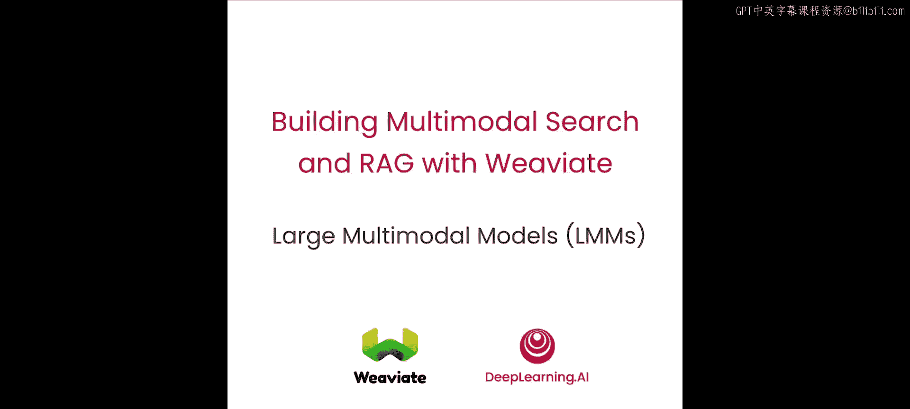

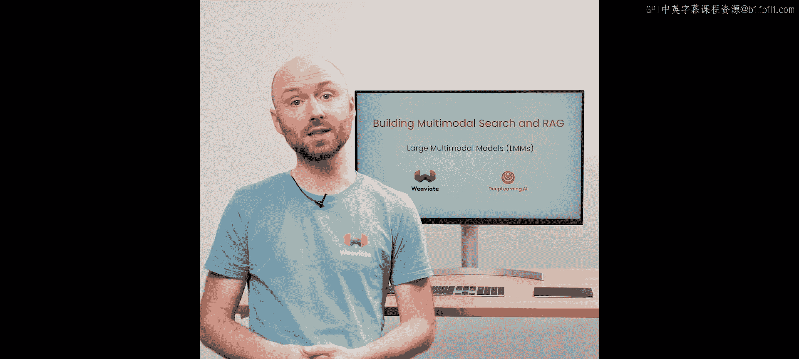

在本节课中，我们将学习大语言模型的工作原理及其如何理解文本。接着，我们将了解如何通过一个名为“视觉指令微调”的过程，将大语言模型与多模态模型结合成语言视觉模型。最后，我们将实际应用这些模型。

## 大语言模型的工作原理 🤖

当前的大语言模型都是基于生成式预训练变换器构建的，例如 Llama 2、ChatGPT 或 Mixtral。这类模型是自回归的，因为它们一次只生成一个词元或一个词片段。后续生成的词元仅依赖于先前提供或生成的词元。

这些模型通过预测数万亿词元中的下一个词，以无监督的方式进行训练。在此训练过程中，模型会输出所有可能的下一个词元的概率分布，训练的目标是让这个概率分布变得准确。

让我们看一个例子。对于输入“Jack and Jill went up the ____”，模型会为每个候选词元输出一个分数。像“mountain”和“hill”这样更可能的词元会获得较高的分数，而像“apple”和“llama”这样不太可能的词元则分数较低。你可以将这些分数视为未归一化的概率。这些分数随后会被归一化为百分比。

## 生成过程详解 🔄

给定一个提示词“the rock”，我们想看看模型如何补全它。我们使用独热向量来表示每个单词，然后查找每个词元的嵌入向量。一旦获得词元的嵌入，变换器模型会通过“关注”第一个词来尝试生成下一个词。它总是以句子开始标记作为起点。

因为我们知道前两个词是“the rock”，我们可以强制模型输出它们。实际上，模型正是这样被训练的。一旦模型输出了“rock”，我们将这个词的表示作为独热向量重新输入。

现在，模型会查找“rock”的嵌入向量，并关注同一句子中的前一个词，然后输出下一个可能词元的概率分布，我们可以从中采样。在这里，我们采样得到了单词“rolls”。我们将其向前传递，生成下一个词“along”。这个过程可以持续进行，直到达到词元限制或遇到句子结束标记，从而完成生成。由于输出是概率性的，每次生成都可能得到不同的结果。

让我们看另一个可能的补全示例。假设我们得到了单词“skips”，并将其向前传递。我们得到的下一个词是“fast”。如果继续这个过程，我们可能会得到一个完全不同的生成响应。

## 视觉模型基础 👁️

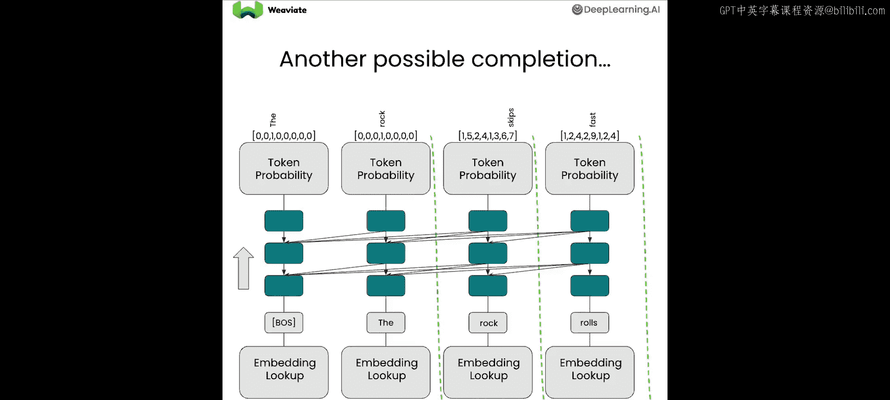

这是一个简单的图像分类模型示例，它接收一张图像并输出一个类别标签。

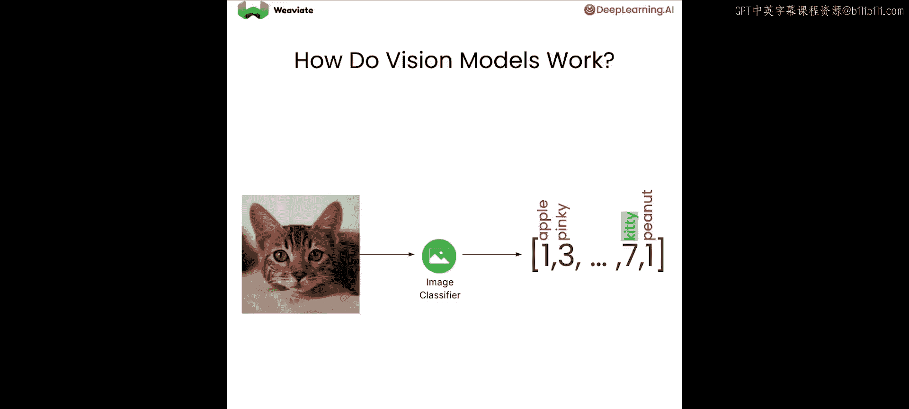

视觉变换器在此分类任务中表现良好。它将图像作为图块而非单个像素进行处理，这使得分析效率更高。让我们更详细地看一下。图像的每个图块被向量化并传入变换器模型。变换器可以选择关注任何图块，并被优化以输出正确的标签。

## 视觉指令微调 🎨

现在，让我们看看如何使用视觉指令微调来训练一个语言模型，使其能够同时处理图像和文本。给定一张图像和一个文本指令，例如图像是《星夜》，问题是“谁画了这幅画？”，你可以训练模型以文本形式输出正确答案，即文森特·梵高。

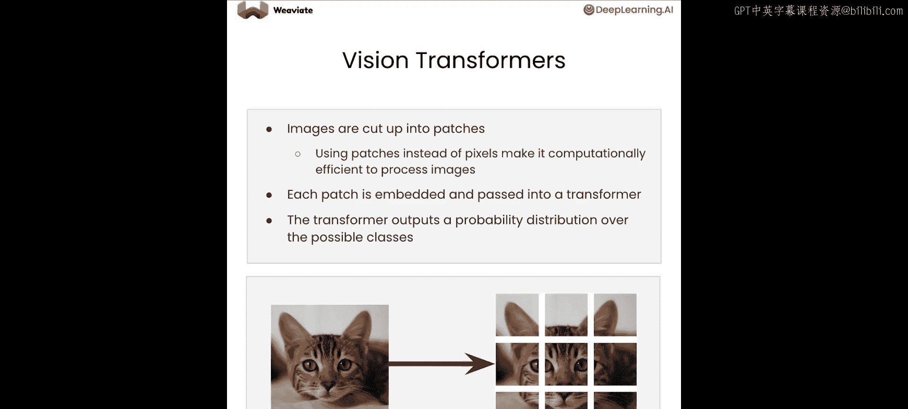

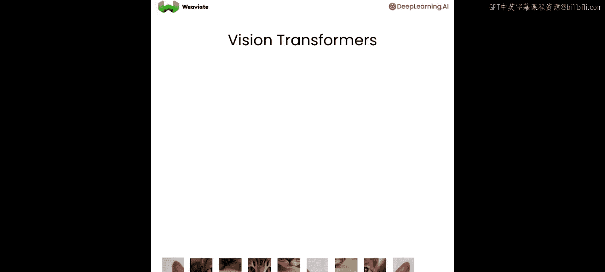

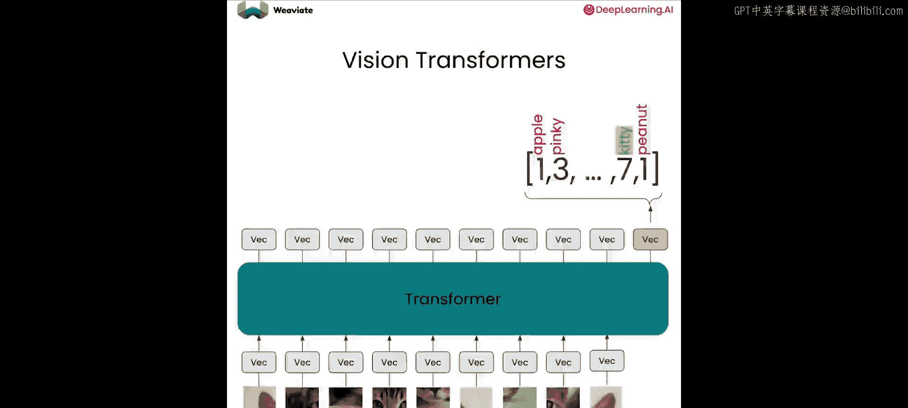

让我们看一个视觉指令微调的具体例子。你将从图像《星夜》开始，将其切割成图块。同时，你有一个文本指令“谁画了这幅画？”。接下来，你将图像的图块嵌入为向量，并将句子中的词元也嵌入为向量。

然后，语言模型将被训练去理解和关注图像图块词元以及语言词元，并且必须为答案“文森特·梵高”输出正确的词元。这被称为视觉指令微调，因为你同时提供了视觉信息和指令，并且知道正确答案，你可以优化模型生成正确输出词元的概率。在此过程中，模型学会了理解图像。

## 大语言视觉模型的应用 💡

在通过视觉指令微调训练语言模型之后，它现在可以同时处理图像和文本。你现在可以将这个模型视为一个大型多模态模型。你也可以询问关于图像中物体的问题。例如，要求对图像内容进行详细的结构描述，比如“为我描述这张图片”。

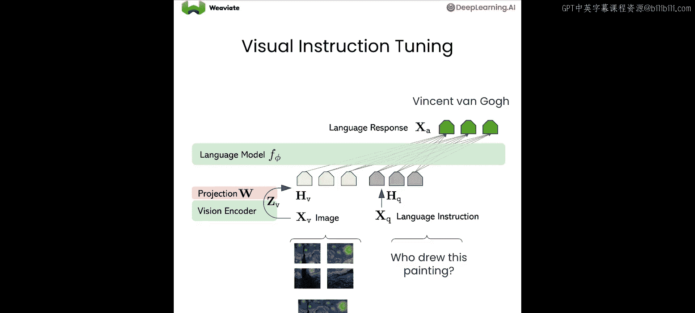

## 实践环节：代码示例 💻

现在让我们在实践中看看这一切。在这个实验中，你将使用图像和文本作为输入，然后让大语言视觉模型对其进行推理。

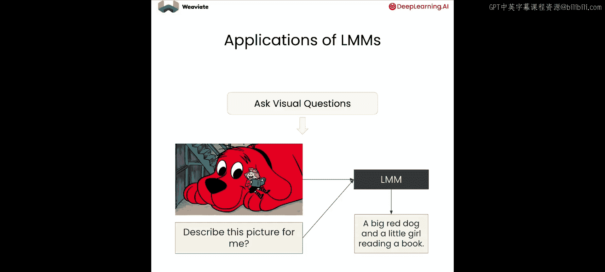

首先，我们添加一个命令来忽略所有不必要的警告。然后进行一些设置。在本课中，我们将使用 Gemini Pro。我们需要加载 API 密钥，并导入一个生成库，我们需要将密钥传入其中。

我们加载一些辅助函数。现在我们需要一个函数，它能接收一段文本并将其提取并转换为可读的 Markdown 格式。

接着，我们构建一个允许我们调用大语言视觉模型的函数。该函数将接收一个图像路径和一个提示词。我们需要做的第一件事是加载该图像，接下来需要调用 Gemini Pro 的生成模型，传入提示词和加载的图像。最后，我们需要返回结果，这里我们将使用那个转换为 Markdown 的函数，它将从响应中提取文本并解析成美观易读的格式。

现在我们可以开始分析一些图像了。我们将从这张漂亮的历史指数图表开始。

我们调用大语言视觉模型函数，提供文件和一个提示词：“解释你在这张图片中看到了什么”。我们将尝试让大语言视觉模型分析这个图表，这通常需要几秒钟。

现在我们看到了一个很好的描述，基本上说图像显示了标普500指数的历史图表，并为我们提供了相当不错的分析。这可能非常有帮助。

现在让我们尝试分析一些更复杂的内容。我们将使用幻灯片中用过的图表，并要求大语言视觉模型帮助我们解释这个图表的实际用途。

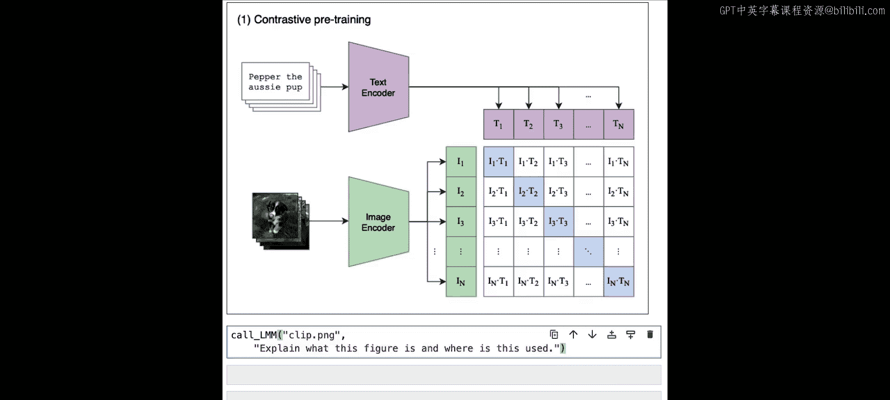

这是结果。在这里你可以看到，模型识别出这是一张用于对比预训练框架的图像，这实际上非常准确，然后解释了关于文本和图像的不同编码器类型等等。也许我应该用它来准备这节课。

## 隐藏信息的趣味示例 🕵️

这里有一个有趣的例子。如果你看这个，它只是一个绿色方块，没有什么特别的。我很好奇当大语言视觉模型试图分析这个时能得出什么结论。让我们问问大语言视觉模型，看看它是否能发现这张图片有什么特别之处。

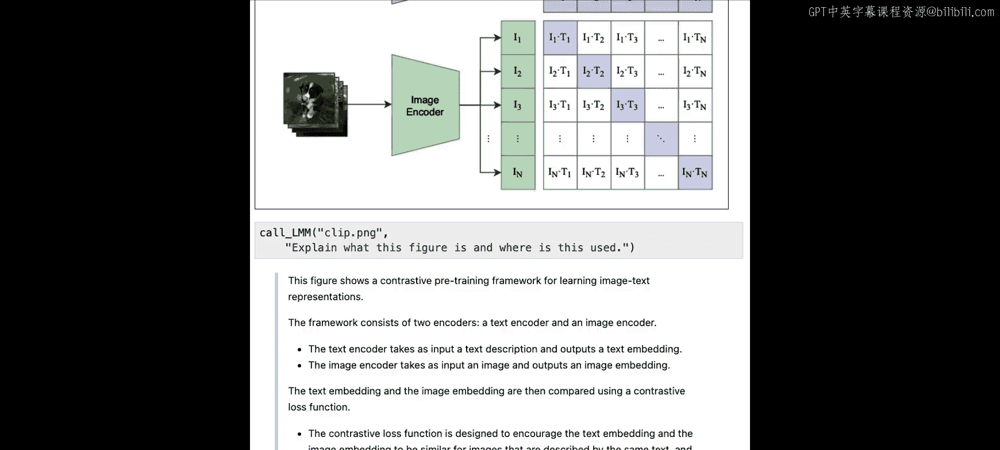

执行后，我们可以看到大语言视觉模型识别出有一条隐藏信息，写着“你可以用 Weaviate 向量化整个世界”。让我们尝试运行一个函数来显示这条信息隐藏在哪里。

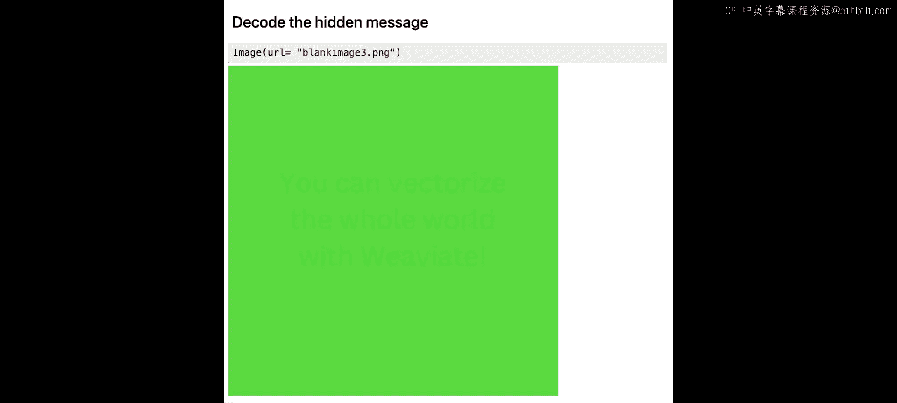

在这里，我们实际上是在寻找第一个通道中值超过 120 的任何部分。

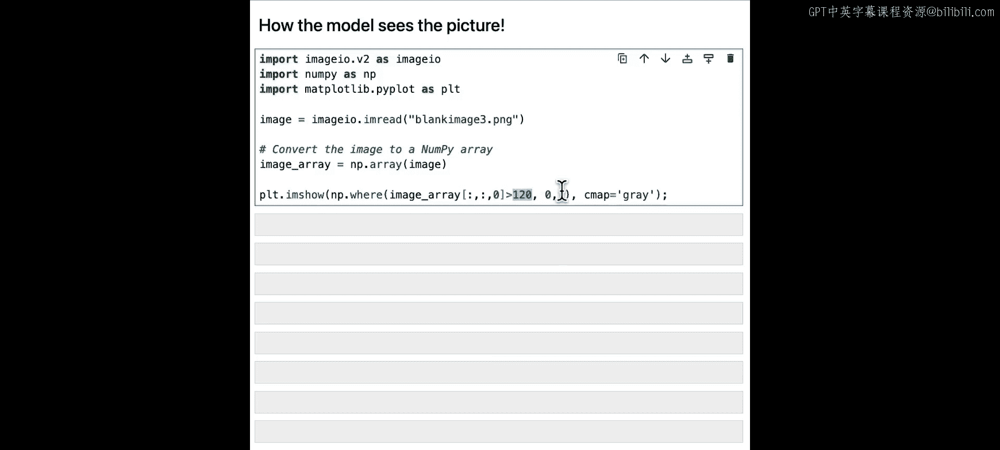

运行这个，我们可以看到这就是真正隐藏在那里的信息。任何超过 120 的部分变成了白色，低于 120 的部分是黑色。这就是大语言视觉模型能够解码信息并告诉我们它的方式。

所以，大语言视觉模型看待事物的方式与我们不同，它们实际上能看到更多，并对正在查看的图像更具探究性，这就是它们能够解码这类信息的原因。我将在本笔记的资源中包含一个函数，如果你想创建像这样带有隐藏信息的图像，你将能够轻松做到，并发送给你的朋友。

## 总结 📝

在本节课中，我们学习了如何使用图像视觉模型，以及如何结合文本提示词实际分析图像。在下一节课中，你将构建一个多模态 RAG 系统。下节课见。

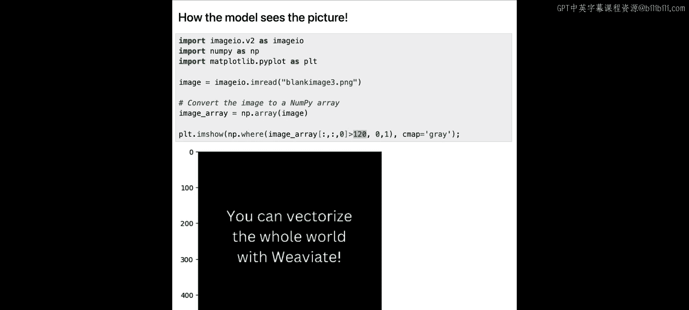

