# 005：5.L4 多模态检索增强生成 (MM-RAG)

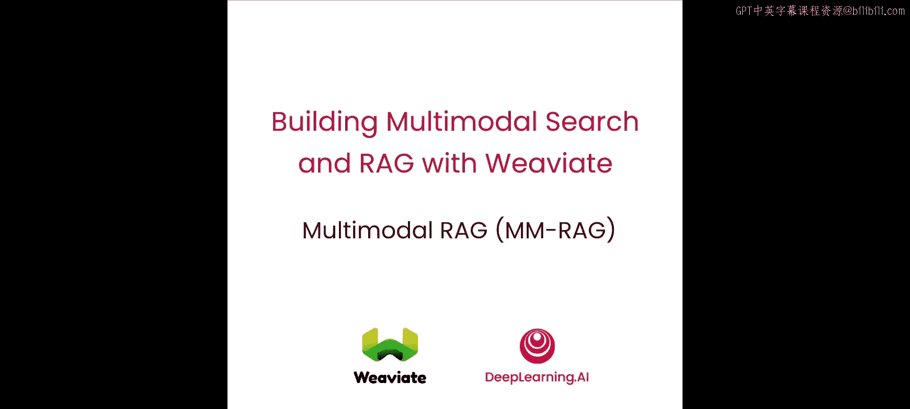

在本节课中，我们将学习多模态检索增强生成的概念，其核心是将多模态搜索与语言视觉模型相结合。然后，我们将使用 Weaviate 和一个大型多模态模型来实现完整的多模态 RAG 流程。

## 概述

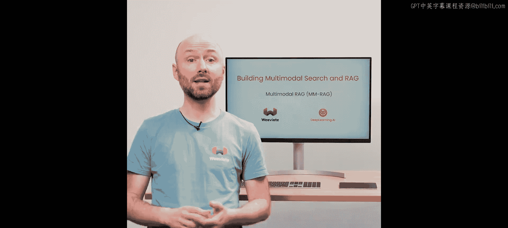

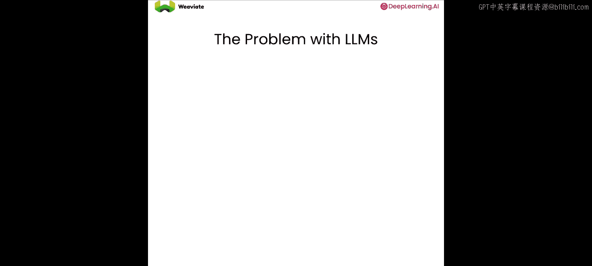

在本节课中，我们将要学习多模态检索增强生成。我们将首先理解大型语言模型在知识上的局限性，然后介绍检索增强生成作为解决方案。接着，我们将把多模态向量数据库的能力与大型多模态模型结合，构建一个完整的 MM-RAG 工作流。最后，我们将通过代码实践，实现从查询到检索图像，再到生成描述的完整过程。

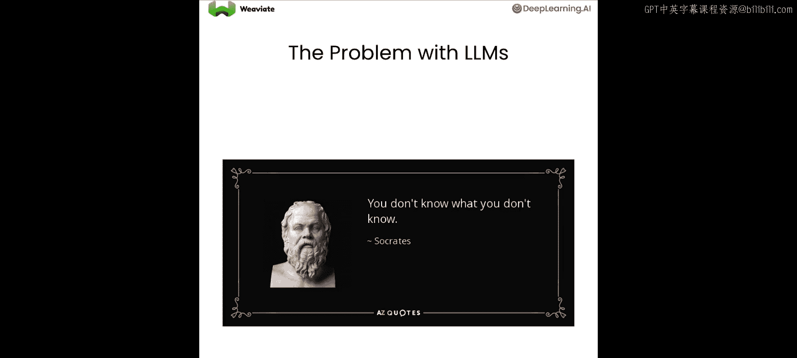

## 大型语言模型的局限性

大型语言模型的一个根本问题是，它们不具备训练数据之外的信息知识。

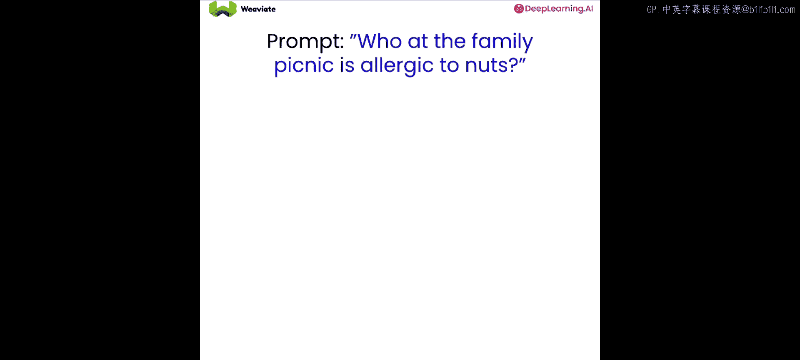

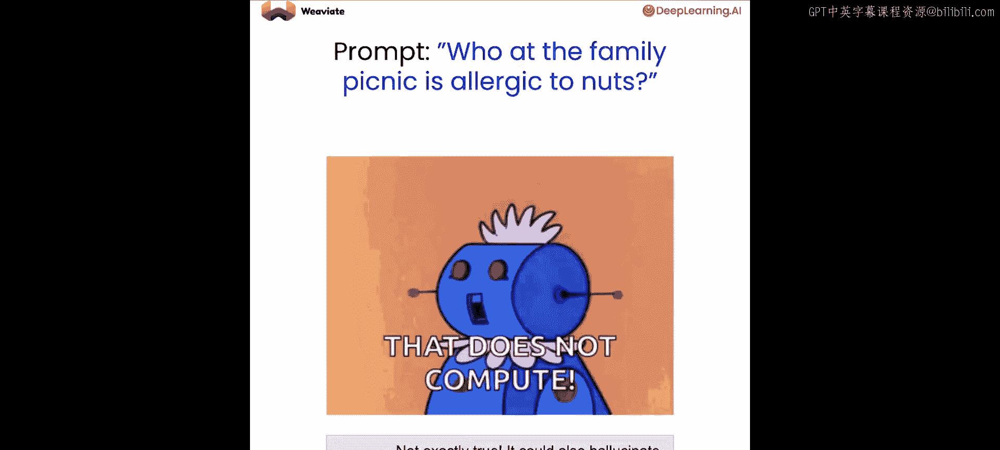

因此，如果你试图向它们询问它们没有的信息，它们要么回答不知道，要么更可能地，它们会“幻觉”并编造一个答案，这通常更糟糕。

## 解决方案：检索增强生成

针对上述问题，一个潜在的解决方案是检索增强生成。

在这里，你做的不是仅仅向语言模型提供一个提示形式的问题，而是同时给它一个问题以及检索到的相关信息。

现在，模型可以执行“读取-生成”操作，即在回答问题前先读取相关信息。这样，输出结果就能基于你提供的信息进行定制。

## 扩展 RAG 解决方案

通常，如果你想扩展 RAG 解决方案，你会希望将所有文档存入像 Weaviate 这样的向量数据库中。

然后，你可以使用提示词从向量数据库中检索最相关的文档。

并将这些相关文档与提示词一起传递到大型语言模型的上下文窗口中。

这种方式帮助你的语言模型基于提供的上下文生成回答。

## 迈向多模态 RAG

正如你已经看到的，向量数据库能够检索的远不止文本。

因此，让我们利用 Weaviate 的多模态知识库来存储和搜索图像、视频和文本。

在上图中，你可以看到从我们的多模态向量数据库中检索图像，然后将该图像与文本指令一起传递给大型多模态模型，从而得到一个基于对世界的多模态理解的回答。

这个过程被称为**多模态检索增强生成**，因为你正在用多模态数据的检索来增强生成过程。

## 实践环节

现在让我们在实践中看看这一切。在这个实验中，你将使用图像和文本作为输入。

然后让大型多模态模型对其进行推理，从而完成完整的 RAG 工作流。

和之前的课程一样，让我们从一个忽略所有不必要警告的小命令开始，然后我们就可以开始了。

现在我们需要做的是加载必要的 API 密钥。实际上，我们将使用前两节课中使用的两个密钥的组合，即嵌入 API 密钥和我们用于视觉模型的密钥。

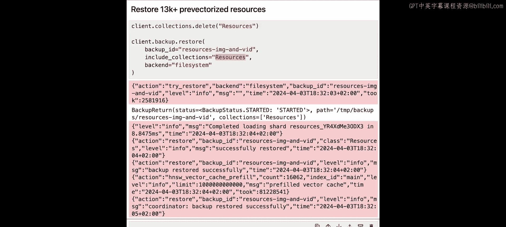

## 连接到 Weaviate 实例

现在你有了所需的 API 密钥，是时候连接到 Weaviate 实例了。这次我们要做的是使用一个特殊的备份系统，这是因为我们创建了一个包含 30,000 张预向量化图像的数据集，这样你就可以非常快速地导入它们，而无需等待。

为了恢复我们承诺的这些图像，我们基本上需要运行下面这个小命令，我们指定了要连接的资源，但最重要的是，我们将加载新数据集的集合名称是 `resources`。我们可以执行这个命令，这大约需要 5 到 10 秒，然后就应该准备好了。

现在我们可以非常快速地预览集合中对象的数量。

我们获取集合对象，运行一个聚合函数来统计内部的所有对象，并按媒体类型分组。然后我们可以根据每个分组得到的结果进行打印。运行这个，我们可以看到我们有超过 13000 张图片和 200 个视频。本节课我们不一定会使用视频，但如果你愿意，之后可以尝试查询它们。

## 实现完整的多模态 RAG

现在我们进入有趣的部分：分两步运行完整的多模态 RAG。

第一步是发送查询并从数据库检索内容。我们将把它作为一个名为 `retrieve_image` 的函数来实现。给定一个查询，我们想要获取一张图片。

在第一部分，我们基本上需要获取我们的 `resources` 集合。

现在我们有了 `resources` 集合，我们调用一个近文本查询。给定函数中的查询，我们还提供了一个过滤器，因为在这种情况下，我们只想获取稍后将传递给视觉模型的图像，并且我们只对图像的路径感兴趣，我们只返回一个对象。

然后，一旦我们得到结果，我们将获取第一个对象，获取其属性，并从该函数中只返回我们通过近文本查询找到的图像路径。

总之，如果我们运行这个函数并给定一个查询，我们应该得到一个与查询匹配的图像 URL。

## 测试检索功能

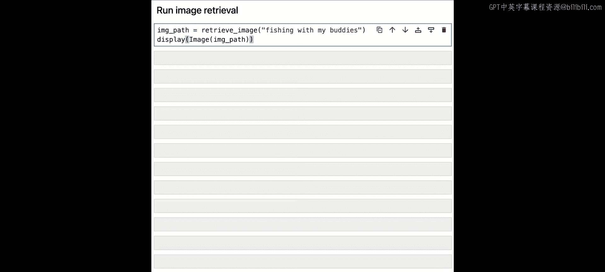

现在你可以测试 `retrieve_image` 函数。尝试查询“fish with my buddies”怎么样？

然后如果你运行这个，你应该会得到类似这样的结果：你可以看到这里有一个男人拿着一条鱼，可能图片上的狗被识别为那个男人的伙伴。

如果你运行一个不同的查询，并且你的查询在数据集中没有完全对应的表示，你可能会得到令人惊讶的结果，但不要因此而气馁，这是游戏的一部分。

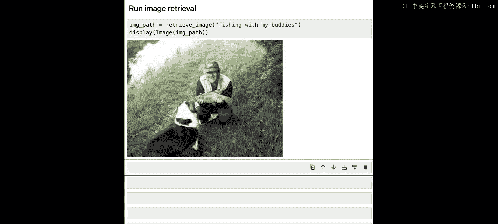

所以请随意尝试不同类型的查询，只是有一个小提醒：你得到的结果类型取决于数据集中已有的内容，所以如果你搜索不存在或没有完全表示的东西，你可能会得到一些令人惊讶的结果。现在你已经完成了检索部分，我们可以继续进行生成部分。

## 生成部分

对于生成部分，你将遵循与上一课相同的步骤。

你需要为生成模型设置 API 密钥。

并且像上一课一样，设置辅助函数来将输出转换为 Markdown 格式，以及 `call_llm` 函数，该函数给定一个图像路径和提示词，可以生成对图像的漂亮描述。

最后，为了完成循环，你将调用 `call_llm` 函数，参数是来自检索步骤的图像路径（那是第一步）和描述。你应该能够执行这个，这需要几秒钟，然后你应该得到一张描述一个男人拿着鱼、旁边有一只狗的图片的描述。

在这里你可以看到我得到的描述，它谈到一个戴着绿色帽子、穿着卡其色背心的男人手里拿着一条大鱼，等等，甚至谈到了站在男人旁边的狗。你可能得到的描述与我的不同，但这是大型语言模型逐令牌生成回答的一部分。

## 整合所有功能

现在你可以把所有功能整合在一起。让我们创建一个 `mm_rag` 函数，第一步是调用 `retrieve_image` 函数，输出将保存在 `source_image` 变量中。

第二步是调用 `call_llm` 函数，参数是上一步的 `source_image` 和提示词，这应该会返回描述。

让我们执行这个。

最后，你可以调用完整的 `mm_rag` 函数。你可以搜索类似“paragliding through the mountains”的内容，这应该既能抓取一张图片，最后也能提供对该图片的描述，就像这样。看，效果很好，你有一张某人滑翔伞的漂亮图片，并且有一段描述：有人在郁郁葱葱的绿色山脉上空滑翔伞。我相信你会得到非常相似的结果。

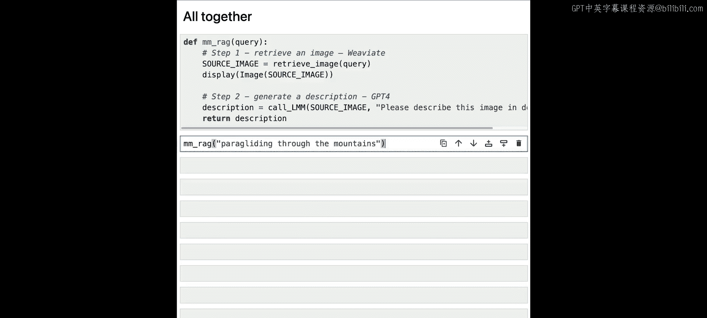

就这样，你能够将第二课和第三课的两个不同部分——检索部分和生成部分——结合起来，从而实际获得一个多模态 RAG 功能。

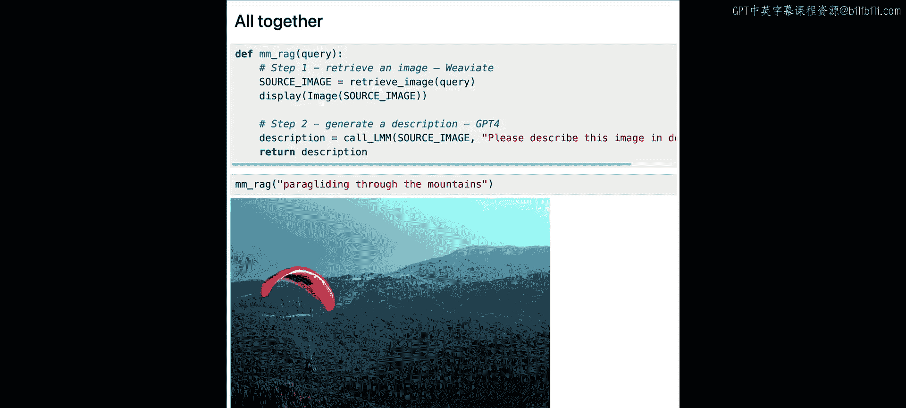

现在，Weaviate 实例已关闭。

## 总结

在本节课中，我们一起学习了如何将检索与生成模型结合起来。尽管这两个是完全不同的模型，但你能够构建出将两者结合成一个强大功能的东西。在下一课中，你将学习如何将其应用到工业应用中，并在许多不同的现实用例中尝试。我们下节课见。

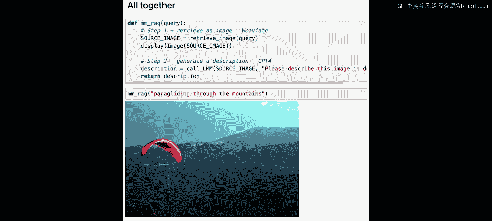

