# 006：行业应用 🏢

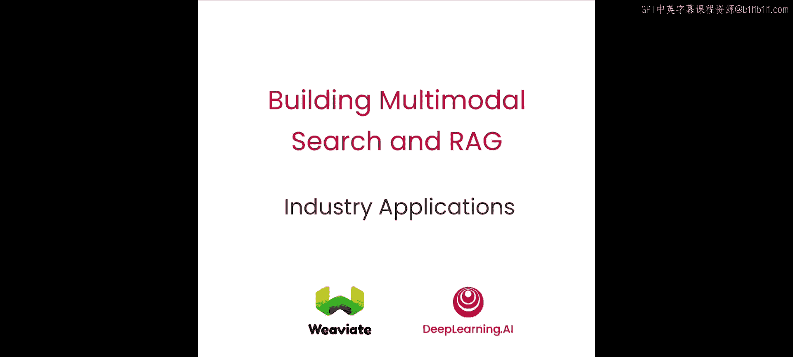


在本节课中，你将通过实现现实生活中的例子，学习多模态技术如何在工业界被应用。你将分析像发票和流程图这样的图像内容，以生成不同格式和风格的结构化输出。让我们开始构建。


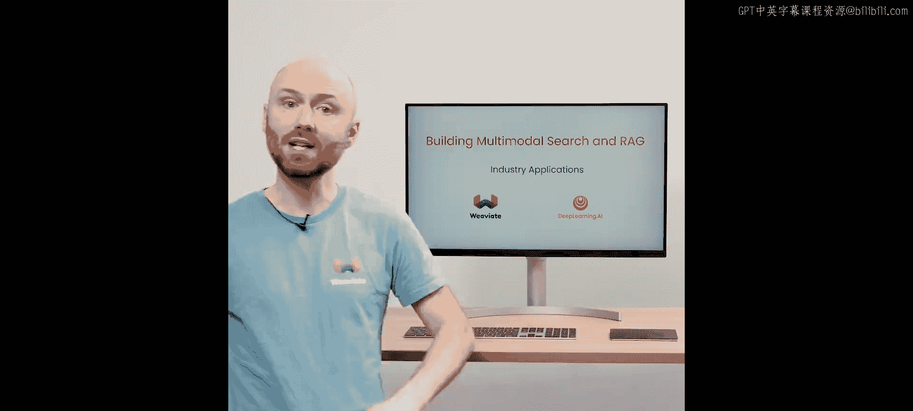


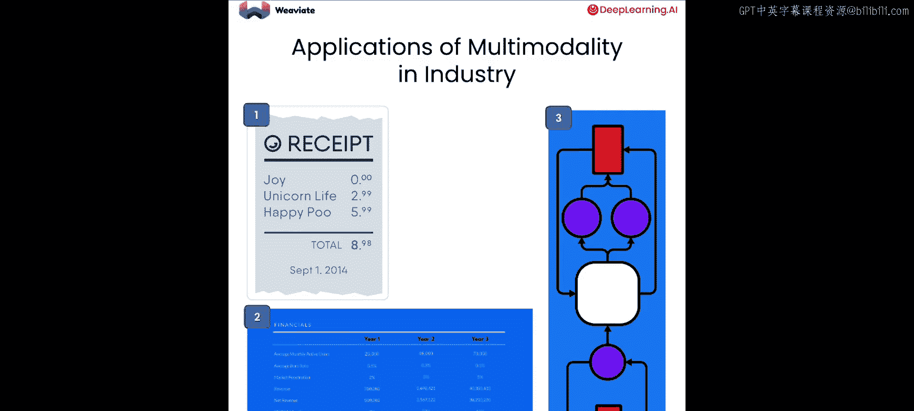

在本节课中，你将探索多模态在工业界的三种不同应用。


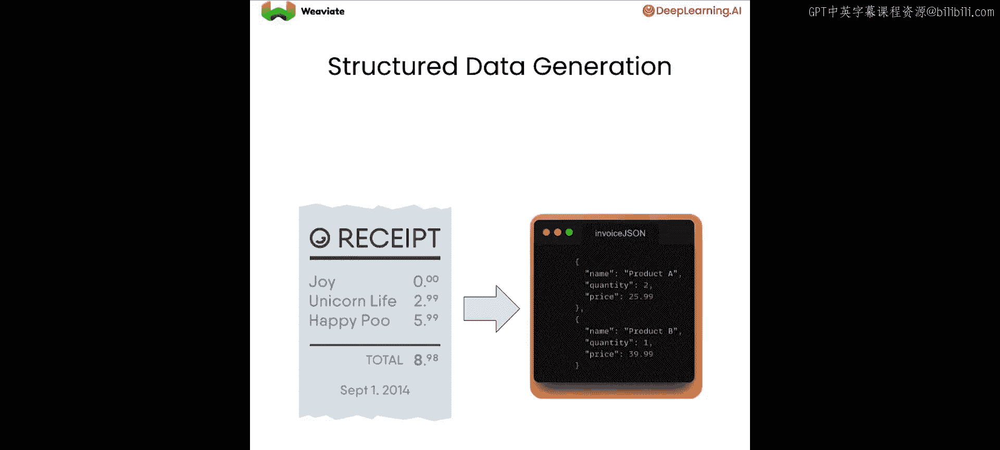


在第一个例子中，输入是一张包含结构化数据的图像，例如收据或发票。然后，你将从这张图像中提取结构化的字段和值，并将其转换为 JSON 格式。


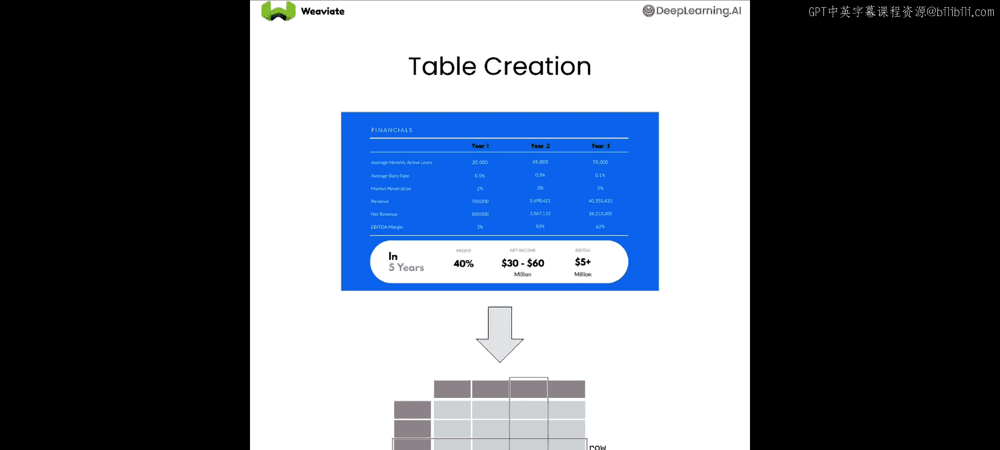

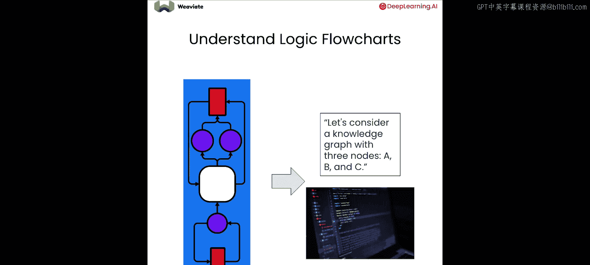

在第二个例子中，你将从一个公司的投资者演示文稿中的表格开始，提取出一个 Markdown 表格表示形式，这个表格随后可以被处理和使用。

在第三个例子中，你将让一个语言视觉模型对逻辑流程图进行推理，并让它输出实现该逻辑流程的文本甚至 Python 代码。


好的，让我们开始编码。在这里，你将使用与之前课程几乎相同的设置。

我们需要忽略警告，加载 API 密钥，然后设置 GenI 库。这很好。同样，你将使用几乎相同的辅助函数，其中一个函数将输出转换为 Markdown。

但对 `call_LMM` 函数有一个小的修改，增加了一个 `plain_text` 布尔参数。这样做的目的是，根据我们的需求，我们可以选择将输出作为纯文本返回，或者作为 Markdown 输出，这在后面会很有用。

```python
def call_LMM(prompt, image_path, plain_text=False):
    # ... 函数实现 ...
    if plain_text:
        return response.text
    else:
        return markdown(response.text)
```

作为第一个例子，你将使用视觉模型来分析这张发票。现在让我们提一个问题：给定发票文件，尝试识别发票上的项目，然后将结果以 JSON 格式输出。我们寻找的是数量、描述、单价和金额。让我们运行这个，看看视觉模型能从这张图中提取出什么。

```python
prompt = """
Given this invoice image, identify the items and output the results as JSON.
Look for: quantity, description, unit price, amount.
"""
response = call_LMM(prompt, "invoice.png", plain_text=True)
print(response)
```

现在，哇，我们看到第二个项目是“一套新的踏板臂”，单价 15，总金额 30，这与表格上的内容完全匹配，非常准确。这真是太棒了。

那么，如何基于输入提出一个推理问题呢？也许你可以检查一下，购买四套踏板臂和六小时的劳动力需要多少钱。这实际上很有趣，因为视觉模型需要从描述中提取信息，然后计算价格。

让我们运行这个，看看它在类似计算上的表现如何。哦，看这个，它实际上能够推导出踏板臂的价格，但可能我认为最棘手的部分是“6小时劳动力，每小时5美元”，它竟然能正确计算出总价为30，然后全部加起来是90美元。太棒了。


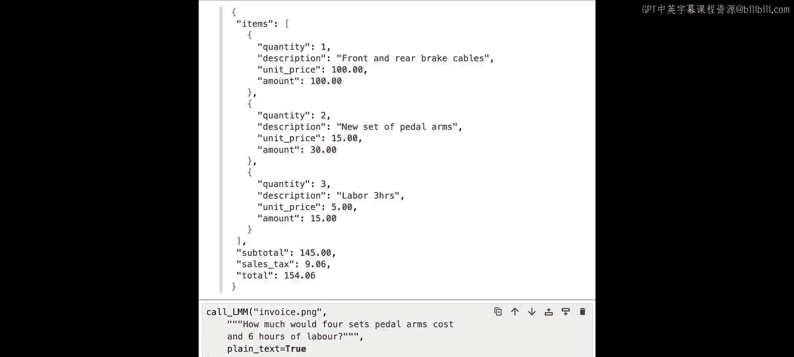


对于第二个例子，你将分析这个包含不同业务单元财务信息的表格。你可以看到一些关于收入、利润率和同比增长的信息。让我们给它一个提示。

第一个任务是将你在这里看到的内容打印成 Markdown 表格。这样它应该能够分析我们看到的每个部分，并以良好的结构进行格式化。

```python
prompt = "Print the contents of this table as a Markdown table."
response = call_LMM(prompt, "financial_table.png")
print(response)
```

如果你只看第一项，“食品配送”对应 17%， 12p 和 15%，这非常准确。


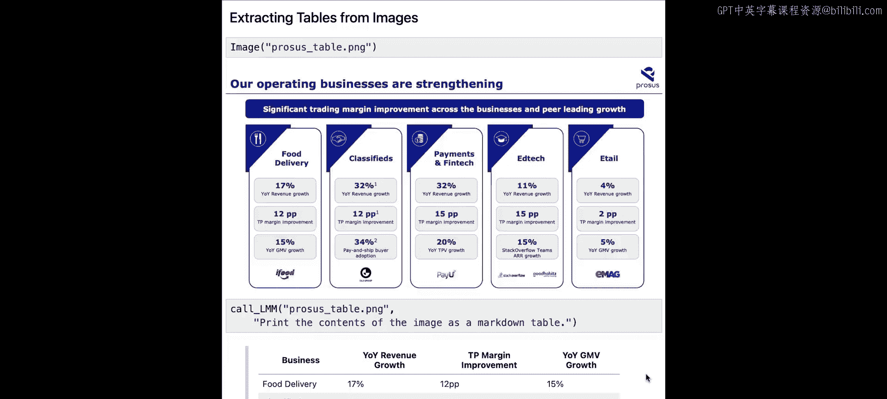


现在让我们尝试更多。运行一个类似的查询，但这次添加一个推理信息。我们想找出哪个业务单元的收入增长最高。

```python
prompt = """
Print the contents of this table as a Markdown table.
Then, reason about which business unit has the highest revenue growth.
"""
response = call_LMM(prompt, "financial_table.png")
print(response)
```

现在我们看到结果，可以看到“分类广告”以 32% 被模型识别出来。如果我们快速扫描一下，可以发现这确实是正确答案。它实际上与“支付和金融科技”持平，但这仍然是正确答案，所以我给它两个赞。

作为最后一个例子，你将使用视觉模型来分析这个流程图。让我们尝试问它一些问题。


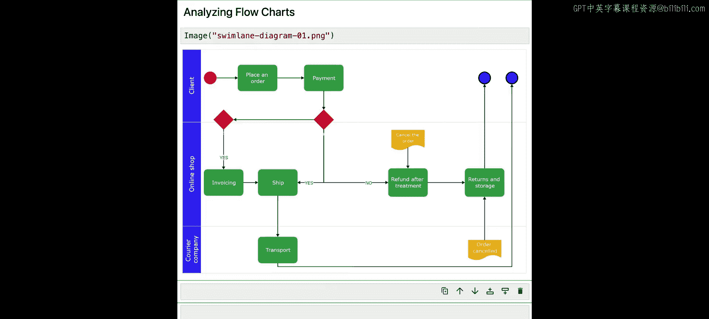


为了分析这个流程图，让我们提供这样一个提示：要求视觉模型以编号列表的形式，提供图像中流程图的总结性分解。

```python
prompt = "Provide a summarized breakdown of the flowchart in the image in the format of a numbered list."
response = call_LMM(prompt, "flowchart.png", plain_text=True)
print(response)
```

在这里，我们逐一得到了从开始到结束的每个项目。如果我们看一下，从客户下订单开始，然后进入支付环节，这是发票的一部分，依此类推。


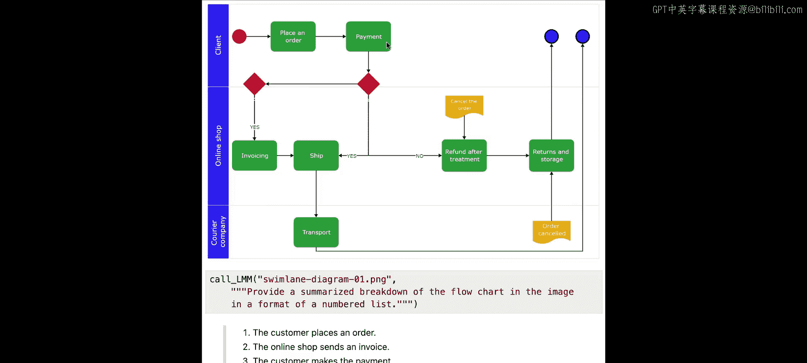


你甚至可以进一步推动视觉模型。你可以要求它分析图像中的流程图，并输出实现该流程的单个函数的代码。

```python
prompt = "Analyze the flowchart in the image and output Python code that would implement this as a single function."
response = call_LMM(prompt, "flowchart.png", plain_text=True)
print(response)
```

问题是，由于视觉模型存在一定的随机性，如果我们重新运行相同的函数，每次运行都应该能得到一个不同的函数。

在我的第二次尝试中，我得到了一个非常不同的代码，这个看起来详细得多。如果我向下滚动，可以看到函数被完整地实现了。从技术上讲，我们应该能够在另一个单元格中执行它。

让我们看看这个函数是否能执行。我可以运行这个，它可能会中断，因为它期望像 `client` 这样的参数。但至少这对我们来说是一个很好的起点，我们可以以此为基础来实现我们自己的代码。这实际上非常强大，对我们许多人来说可能非常有帮助。

😊

## 总结

在本节课中，你学习了如何在不同类型的图像上使用视觉模型，要求它提供不同的解释并提取各种信息，同时还添加了额外的推理命令，看看是否能推动这些视觉模型进一步工作，例如基于原始值计算新值。这非常强大。

我鼓励你自己动手尝试其他事情。在下一节课中，你将学习一个多模态推荐系统，在该系统中，你将能够并排使用两个不同的模型来执行跨不同模态的搜索。

很棒，我们下节课见。

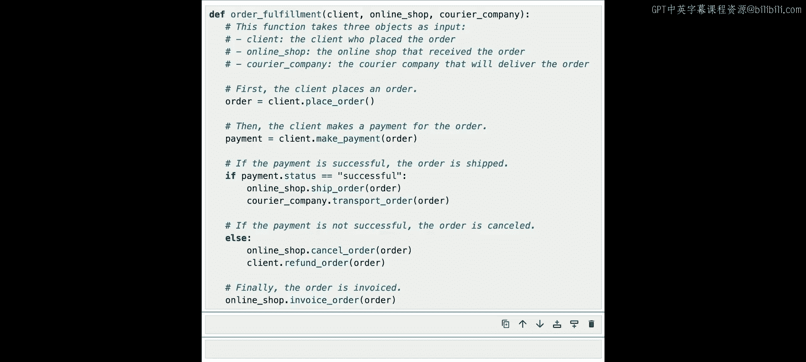

