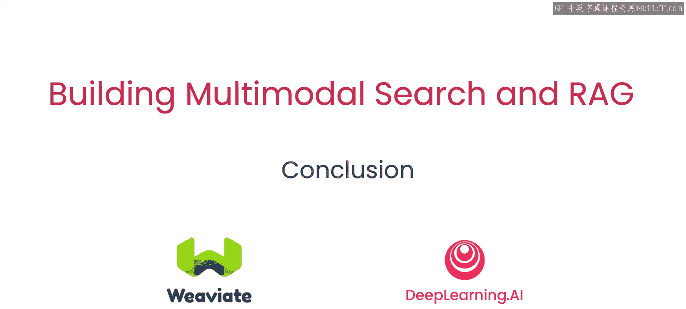

# 008：总结 🎉

在本课程中，我们学习了多模态搜索与检索增强生成（RAG）的核心概念与实践方法。从理解多模态的基础知识开始，到构建实际的搜索系统，再到集成大型多模态模型，并最终扩展至工业应用，我们完成了一次全面的技术探索。

## 课程回顾

上一节我们探讨了多模态RAG在工业场景中的实际应用。现在，让我们对整个课程内容进行总结。

以下是我们在本课程中逐步掌握的核心知识与技能：

*   **多模态概念**：我们首先学习了**多模态**的基本理念，即系统能够同时处理和整合来自不同模态（如文本、图像、音频）的信息。
*   **构建多模态搜索**：接着，我们运用这些概念，动手**构建了一个多模态搜索系统**。其核心原理可以概括为：将不同模态的数据（如图片和文本）映射到同一个向量空间，然后通过计算向量之间的相似度（例如使用**余弦相似度**公式：`similarity = (A·B) / (||A|| * ||B||)`）来检索相关内容。
*   **大型多模态模型基础**：然后，我们深入了解了**大型多模态模型（LMMs）** 的工作原理。这些模型，如GPT-4V，能够理解和生成跨模态的内容，是多模态RAG系统的“大脑”。
*   **实现多模态RAG**：我们将以上所有知识整合，**构建了一个完整的多模态RAG系统**。该系统的基本流程是：`用户查询 -> 多模态检索 -> 获取相关上下文 -> LMM生成答案`。
*   **扩展至工业应用**：最后，我们进一步将多模态RAG系统扩展到了更实际的**工业应用场景**中，探讨了其解决复杂现实问题的潜力。

## 结语

本节课中，我们一起学习了从多模态基础理论到构建高级多模态RAG应用的全过程。你已经掌握了相关的核心概念与实践技能。

期待看到你运用这些知识创造出令人惊叹的应用。😊