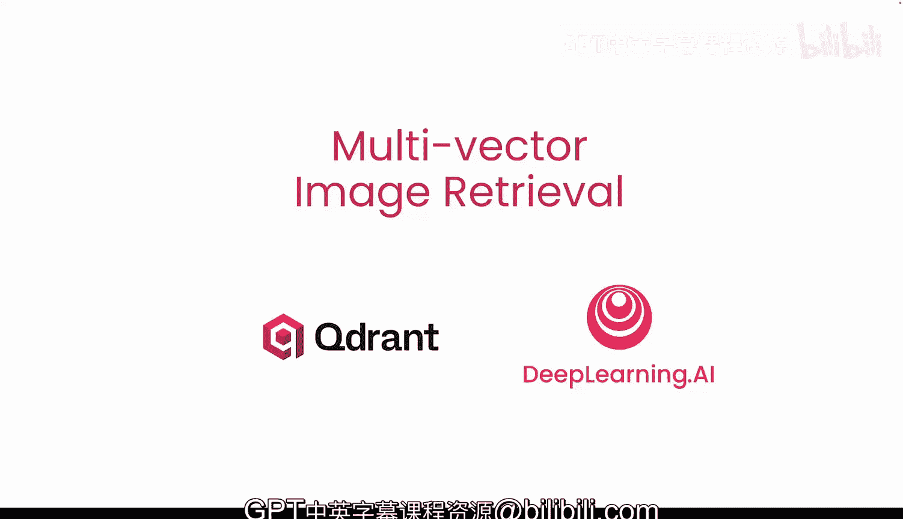
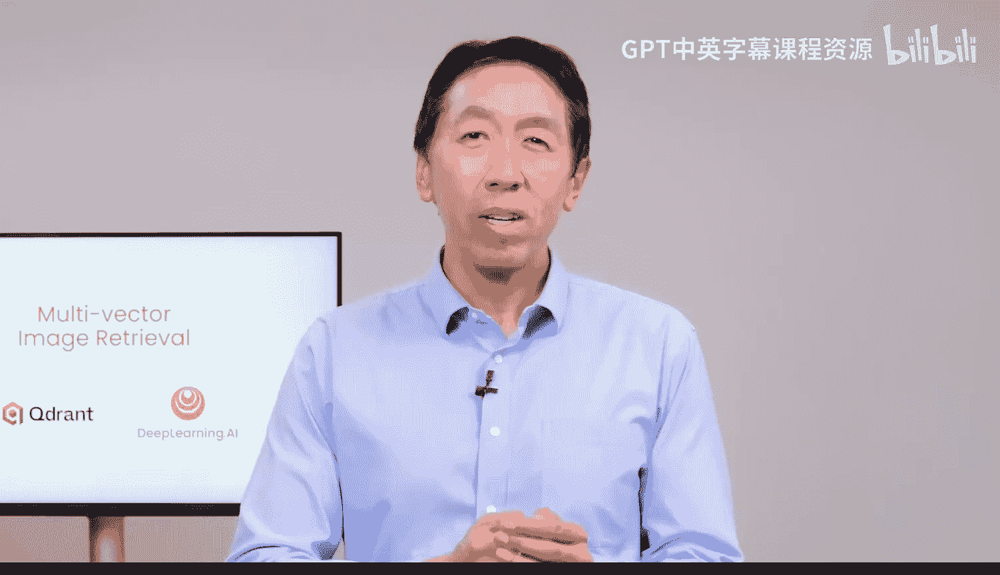
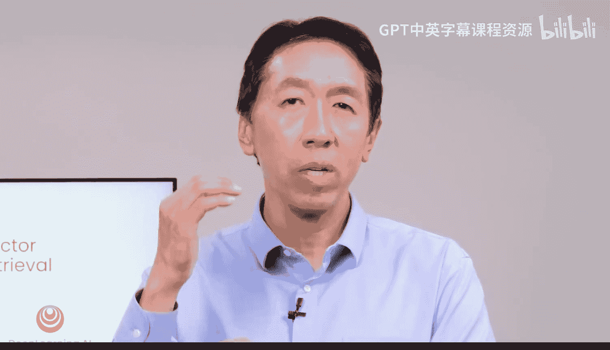
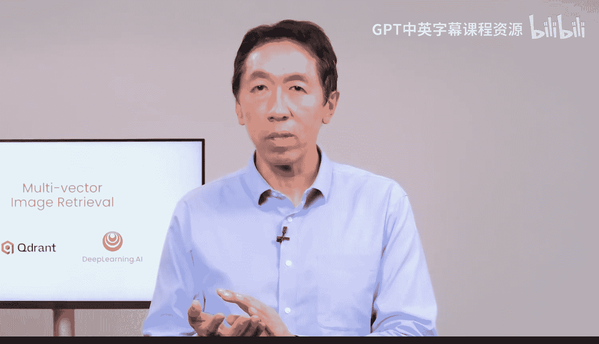
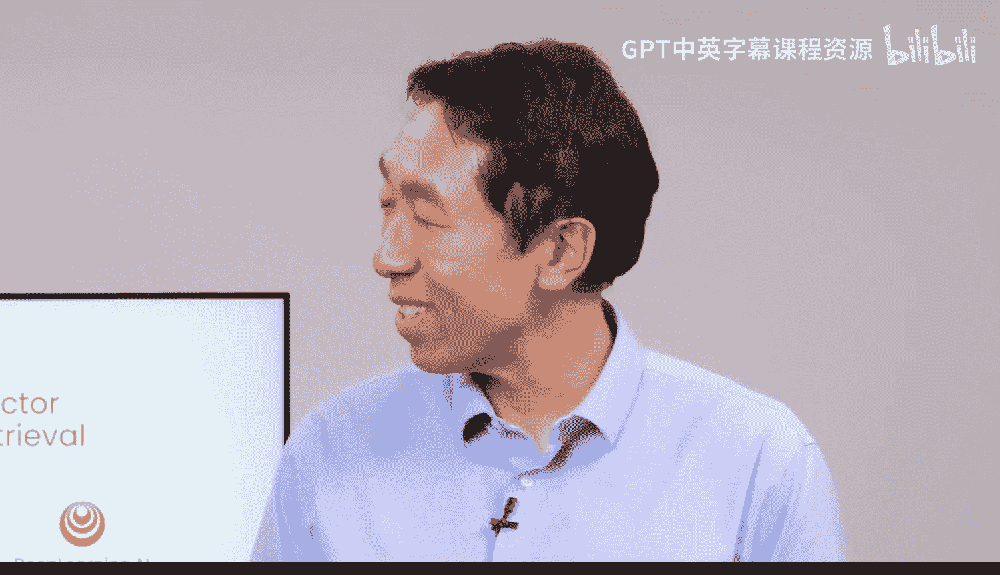
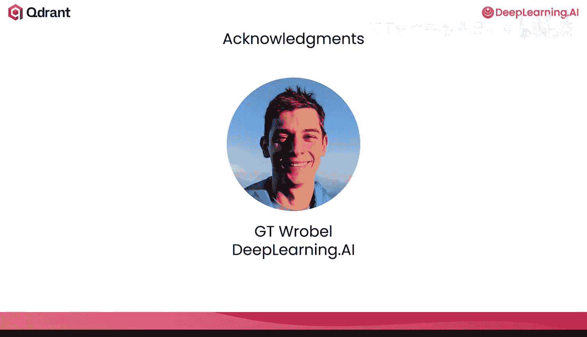
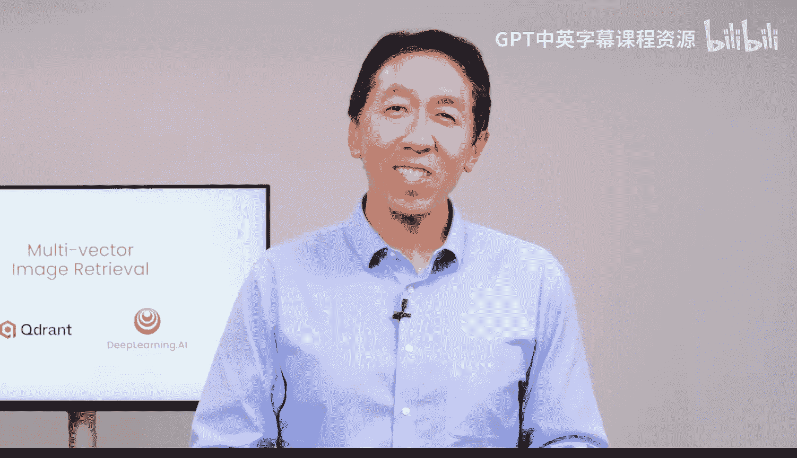

# 001：课程介绍 🖼️

在本课程中，我们将学习多向量图像检索的工作原理，以及如何在实际AI应用中最佳地使用它。

长期以来，让大型语言模型仅访问文本数据更为容易。但这使得大量以图像和其他多模态形式存储的有用信息无法被利用。本课程将重点介绍一系列名为“多向量”的图像检索技术。

## 多向量与单向量检索对比

上一节我们提到了传统方法的局限性，本节中我们来看看多向量技术的核心思想。

与标准向量检索（用单个大向量表示每个文档或图像）不同，多向量技术使用许多较小的向量来表示图像中较小片段（例如图像块）的含义。存储这些详细的向量信息后，便可以在文本查询中的词元与构成图像或文档的图像块之间进行细粒度匹配。

这种方法可以提供高质量的图像搜索，即使在包含文本、图像、幻灯片等复杂文档上也能表现良好。然而，存储大量向量数据会带来内存使用和搜索效率方面的挑战。本课程中，我们也将探讨解决这些问题的新技术。

## 课程内容与结构

为了帮助您理解这些多向量图像检索技术，本课程将由经验丰富的AI工程师、向量数据库公司Cohere的开发者倡导者Kasper Juul进行讲授。

以下是本课程的核心学习路径：

1.  **多向量检索基础**：首先通过其在文本检索中的应用来学习多向量检索的基本原理。
2.  **图像检索应用**：接着，您将了解名为**ColPali**的模型如何将这种方法应用于图像检索，以及一些优化其性能的技术。
3.  **混合方法探索**：最后，我们将探索一种名为**Movea**的方法，它旨在结合多向量和单向量图像检索的最佳特性。

您将学习每种方法背后的基础概念，然后在一个实际运行的多模态RAG系统中实现它们。本课程将很好地融合概念性主题与实践性主题。

## 行业背景与展望

目前，整个行业对图像检索，特别是多向量技术，抱有极大的热情。如今人们使用的大多数LLM实际上是VLM（视觉语言模型），它们处理图像的能力与处理文本一样强。挑战在于构建能够准确、高效地检索图像数据以利用这种能力的系统。本课程中的技术，如ColPali或Movea，正在最终实现这一目标。这很可能代表该领域的未来，并将在未来几年推动许多激动人心的应用。

本课程的开发得到了DeepLearning.AI、GPT和Roboflow的贡献。在第一课中，您将通过动手实践**CoT**来熟悉多向量检索，这是一种广泛用于文本检索的多向量方法。

---

本节课中，我们一起学习了多向量图像检索的课程概述、其核心思想（使用多个小向量进行细粒度匹配）、课程的具体学习路径（从基础到ColPali再到Movea），以及该技术在行业中的重要性和前景。接下来，让我们跟随Kasper，正式开始第一课的学习。