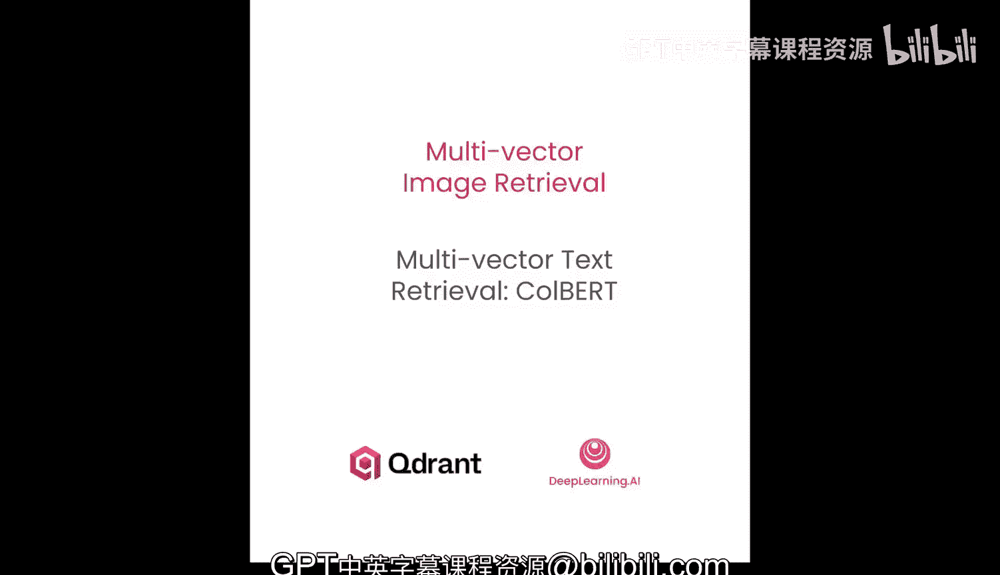
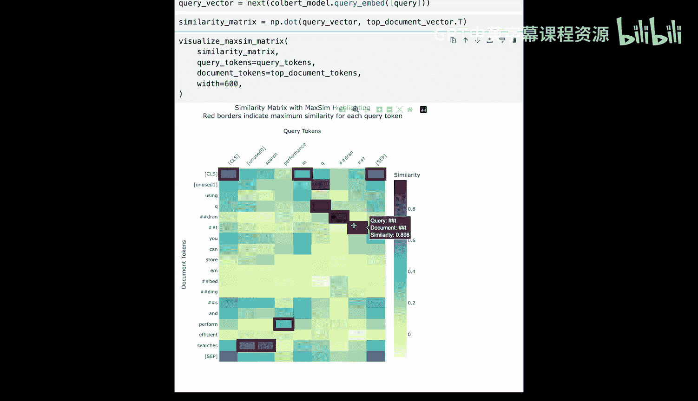

# 002：多向量文本检索与ColBERT

## 概述
在本节课中，我们将要学习多向量检索的基本概念，特别是针对文本的ColBERT模型。我们将了解其工作原理、优势、局限性以及如何在实践中使用它。

---

## 多向量检索基础概念

上一节我们介绍了检索增强生成（RAG）的重要性。本节中我们来看看实现RAG的核心技术之一——向量检索。

### 向量检索回顾
检索之所以重要，是因为大型语言模型（LLM）无法在其训练数据中涵盖所有可能相关的信息。检索增强生成（RAG）通过为LLM配备一个相关信息的数据库来解决这个问题。当系统收到一个提示时，它会快速搜索数据库并检索最相关的文档。原始的提示随后会被修改以包含这些检索到的文档，使LLM能够基于这些信息生成更准确的回答。RAG可以显著提高LLM回答的质量，是目前应用最广泛的生成式AI系统之一。

例如，一个客户服务聊天机器人如果能访问你公司的产品和政策信息，会更有帮助。这可以通过将LLM与数据源配对来实现，从而检索相关信息。

### 双编码器（Bi-Encoder）
最常见的向量检索类型称为双编码器。知识库中的每个文档都由一个语义模型分配一个向量表示。当收到查询时，它也被嵌入成一个向量。系统随后搜索数据库，找到向量与查询向量最接近的文档。

双编码器的主要优点是速度非常快。原因之一是文档向量可以预先计算。即使你的数据库有十亿个文档，也只需要在搜索时为查询生成一个向量。搜索过程本身也极快，这得益于近似最近邻（ANN）算法的使用，它们可以轻松扩展到数十亿文档。

双编码器的主要问题在于，它本质上将每个文档和提示的含义压缩成一个单一的向量。这可能会丢失文档和提示的细微差别，并可能错过它们之间的微妙联系。

### 交叉编码器（Cross-Encoder）
交叉编码器采用不同的方法。查询和文档的完整文本同时输入到交叉编码器神经网络中。这使得交叉编码器能够检测查询和文档之间独特的细微关系或交互。交叉编码器随后直接输出一个相关性分数，可用于对文档进行排序。

交叉编码器往往能产生非常高质量的结果，但其扩展性很差。因为它需要完整的文档和查询文本来生成分数，无法进行预计算，并且为每个文档评分都需要通过神经网络进行一次计算量大的前向传播。因此，交叉编码器只适用于搜索少量文档（通常是几十个或更少）的场景。

交叉编码器的最佳用途是对其他技术检索到的结果进行重新排序。例如，如果你有100万个文档需要搜索，你可以先用双编码器快速找到50个最佳匹配文档，然后用交叉编码器对这些结果进行重新排序，找出5个绝对最佳匹配。

理想情况下，我们需要一种既能像双编码器一样支持预计算，又能像交叉编码器一样实现查询和文档之间深度令牌级交互的技术。多向量技术正是为此而引入的。

---

## ColBERT：一种多向量文本检索技术

上一节我们对比了不同检索模型的优劣。本节中我们来看看最常用的文本多向量技术——ColBERT，看看它是如何工作的。

### ColBERT工作原理
让我们通过一个简单的例子来看看ColBERT是如何工作的。假设这是你的文档文本。

首先，文本被分割成令牌（Token）。接着，这些令牌中的每一个都被分配了自己的嵌入向量。这些向量不仅反映了该特定令牌的含义，也反映了它在整个文档上下文中的含义。

如果这是一个双编码器，下一步将通过一个称为“池化”的过程将所有向量缩减为一个向量。最常见的池化方法是简单地平均所有这些向量。然而，在ColBERT中，你保留所有这些向量。

表示查询的过程完全相同。查询文本被转换为令牌，每个令牌被分配一个密集的语义向量。

现在，让我们对这个查询-文档对进行评分。这种方法称为“最大相似度”或简称为“MaxSim”。其核心思想是，每个查询令牌都找到最相似的文档令牌。

以令牌“puppy”为例。“puppy”的向量使用典型的向量距离度量（如点积或余弦距离）与每个文档令牌的向量进行比较。在这里，你可能会期望它与令牌“dog”匹配最紧密。然后对查询中的每个令牌重复此过程。这个查询-文档对的最大相似度分数就是所有查询令牌的最大相似度之和。

### 最大相似度的非对称性
MaxSim与其他距离度量的不同之处在于它是非对称的：A和B之间的距离与B和A之间的距离不同。为了理解这一点，想象一下你只需翻转上一个例子中用作文档和查询的文本。最初，MaxSim是3个点积之和，但现在它是5个点积之和。

因此，你可以利用通常为向量搜索提供动力的高度优化的近似最近邻（ANN）算法。问题出现在你尝试构建算法用于搜索的HNSW索引图时。该图依赖于知道每个文档与其几个最近邻之间的距离。由于MaxSim是非对称的，A可能是B的最近邻，但B不一定是A的最近邻。这种不一致性使得根本无法构建图，因此在使用多向量搜索时，HNSW索引通常被禁用。

ColBERT最终实现了其目标：它允许像双编码器一样预计算向量，同时查询和文档令牌之间的交互又模仿了交叉编码器。

---

## ColBERT的实践应用与权衡

由于HNSW无法有效用于多向量检索，你很少单独使用它们来搜索较大的数据集。如果这样做，你将需要对所有文档执行暴力穷举搜索，这在规模上使用太慢。

### 常见使用模式：作为重排序器
使用延迟交互模型更常见的方式是作为更快技术（如双编码器）结果的重排序器。通常，使用更快的检索器进行“过采样”，意味着你检索的文档数量多于最终想要返回的数量。然后使用多向量模型作为重排序步骤，这样MaxSim只需在有限的候选集上计算。

### 主要缺点：内存消耗
ColBERT最大的缺点是所需的内存量。每个令牌一个向量，每个文档很容易存储数百或数千个向量。这些数字会迅速累加，尤其是在你拥有百万级规模设置的情况下（这在当今并不少见）。想象一下，你的文档有100个令牌，每个令牌获得一个128维的嵌入，每个数字由一个4字节的浮点数表示，仅向量就需要大约50KB。而双编码器每个文档只存储一个向量。即使你的向量维度非常高，每个文档通常也不会超过10KB，这使得规模更容易管理。

### 定位：中间地带
延迟交互模型是单向量嵌入模型和交叉编码器之间的中间地带。它们比任何其他嵌入模型需要更多内存且运行成本更高，但它们仍然允许预计算文档的表示，并且不需要为每个查询将它们通过神经网络。

最近，我们开始看到将类似方法应用于文本以外的其他模态（如图像）的巨大价值，而且它们似乎也比其前身效果更好。

---

## 动手实践：使用ColBERT进行检索

在讨论不同模态之前，让我们探索一下延迟交互模型在实践中是如何使用的。

### 加载模型与理解维度
我们将从加载斯坦福大学开发的延迟交互模型ColBERT V2开始。ColBERT将文本编码为每个令牌的128维向量，实现了细粒度的语义匹配。让我们将模型加载到内存中并查看其嵌入维度，它是128。

### 理解令牌化
在创建嵌入之前，让我们了解ColBERT如何处理文本。令牌化是将文本分解成模型可以处理的较小片段的过程。ColBERT使用WordPiece令牌化，并添加特殊令牌，如开头的`[CLS]`（用于文档编码）和结尾的`[SEP]`。常规单词要么表示为单独的令牌，有时一个单词可能会被拆分成多个子词令牌。

让我们定义一个文档。我们有一个简单的辅助方法来处理令牌化过程。如果你对技术细节感兴趣，可以随时查看辅助文件中的函数定义。

让我们看看我们的示例文档是如何被令牌化的。大多数单词被表示为单个令牌。然而，“decibels”被拆分成三个单独的令牌，这些是子词级别的令牌。让我们简单地检查一下我们的文档被分成了多少个令牌。我们的文档由55个令牌组成。

### 创建文档嵌入
现在你理解了令牌化，让我们为你的文档创建嵌入。与产生单个向量的传统密集模型不同，ColBERT为每个令牌生成一个嵌入向量。正如你所见，我们的文档有55个令牌，所以ColBERT也应该创建55个独立的128维向量，每个对应令牌化序列中的一个令牌。注意形状，这证实了我们有55个令牌嵌入，每个由128维向量表示。

在实践中，当处理较长的文档或数据块时，你可以预期每个嵌入有数百个令牌，但原理保持不变：每个令牌一个向量。

### 创建查询嵌入
现在，让我们定义并嵌入你的查询，它比文档短得多。ColBERT对查询的编码方式与文档不同。它将查询填充到固定的32个令牌长度，以确保不同查询之间的一致性比较，但它也假设查询不能更长。虽然你的查询只有几个单词，但ColBERT将生成32个令牌嵌入，并使用额外的填充令牌来达到这个长度。如果你让它更长，它可能会被截断。正如预期的那样，我们得到了一个32x128维的嵌入。我们的查询相对较短。

让我们使用与文档相同的辅助方法看看查询的令牌化是什么样子。它有一个额外的参数来控制我们是为文档还是查询创建令牌化。如你所见，大多数令牌只是填充令牌，它们会自动添加到查询中。尽管如此，原始查询的每个单词都被转换成了单个令牌。

### 可视化延迟交互
现在，让我们看看延迟交互的实际运作。我们将通过计算每个查询令牌嵌入和每个文档令牌嵌入之间的点积来计算相似度矩阵。这将创建一个32x55的矩阵，其中每个单元格代表特定查询令牌与特定文档令牌之间的相似度。

在下一步中，你将只为每个查询令牌选择最大相似度，并将它们全部相加。我们的文档对于该查询的MaxSim分数约为17。

让我们将相似度矩阵可视化为热图。我们有另一个辅助函数可以做到这一点。每个单元格显示特定查询令牌与特定文档令牌的相似程度。蓝色表示较低相似度，红色边框用于突出显示最高分。你可以看到哪些查询术语（如“advantages”或“cars”）与哪些文档术语（如“benefits”和“fleets”）匹配最强。这种可视化有助于你理解为什么ColBERT认为某些令牌对是相关的。为了清晰起见，所有掩码令牌都已从查询中移除，但它们也贡献了最终分数。

---

## 对比：ColBERT vs. 传统密集嵌入模型

为了体会延迟交互的好处，让我们将ColBERT与传统的密集嵌入模型进行比较。你将从FastEmbed加载一个流行的嵌入模型，并将其与ColBERT一起使用，看看搜索结果在实践中如何不同。

### 创建支持两种嵌入的集合
现在，你将创建一个可以存储密集和多向量嵌入的Qdrant集合。你将集合名称和向量名称保留为变量，以便以后轻松引用它们。

以下是集合的真实设置。注意ColBERT的特殊配置：你启用了带有`max`比较器的多向量配置，这告诉Qdrant使用我们之前讨论过的MaxSim评分。你还通过将`m`参数设置为0来禁用HNSW图创建，因为这种数据结构无法有效用于多向量搜索。

### 插入示例文档
让我们创建一些关于Qdrant和SQL数据库的示例文档来测试搜索质量。现在，你将把这些文档插入到之前创建的集合中。你将使用ColBERT模型创建密集嵌入和多向量表示。

### 执行搜索
现在，让我们使用两种方法进行搜索。我们将创建一个辅助函数，使用ColBERT嵌入查询集合。我们传递一个查询，向量是使用你之前定义的模型生成的。请注意，你现在调用的是`query_embed`而不是`passage_embed`，因为某些模型处理查询的方式可能与文档不同。你还可以指定想要检索的结果数量。

另一个辅助函数将执行相同的过程，但使用常规的密集嵌入模型。

### 分析查询与结果
两种方法都已定义。让我们创建一个查询。你可以随意尝试不同的查询以查看不同的输出。

你可能想知道为什么我们特别选择了这个特定的查询。专有名称，如公司名称，经常被分成多个令牌，甚至由单个字母组成。这样的令牌无法有效表示该特定公司的业务，更像是一种后备方案。尽管我们都知道Qdrant是一个向量搜索引擎，但对于我们的ColBERT模型来说，它只不过是一个字母序列。为了确认我们的查询被分成了那么多令牌，让我们使用之前使用的相同辅助函数。

确实，“Qdrant”被分成了三个单独的令牌，这证明ColBERT在其训练数据中没有接触到该公司的名称。在密集嵌入模型中，这类令牌将贡献给最终的池化向量，但它们很可能只是一种噪声。通过令牌级交互，你可以预期此类多令牌序列在文档和查询之间得到更好的匹配。

### 运行搜索并比较结果
是时候使用两种方法运行搜索来检索结果了。在这里，你可以看到生成ColBERT密集向量花了多长时间，以及返回结果花了多长时间。我们有另一个辅助函数，可以简单地可视化比较两种方法的搜索结果。

ColBERT令牌级匹配的一个关键优势是它能够捕获特定术语，如专有名称。在这种情况下，Qdrant比池化的密集向量更好，因为单个令牌在整个匹配过程中保留了它们的语义身份。

注意ColBERT和密集嵌入结果之间存在差异，但很难说谁是赢家。有重叠，但通常仅凭肉眼观察是不够的。在真实案例中，我们构建参考数据集以确保返回的结果是高质量的。

从这个简单的例子中我注意到的是，所有ColBERT结果都提到了Qdrant，而密集结果则不然，这有点出乎意料，因为我们的查询提到了Qdrant。

### 可视化贡献度
让我们检查每个查询令牌对ColBERT检索到的最佳结果的分数贡献了多少。我们可以使用之前用过的相同热图。为此，我们需要文档和查询的令牌化以及它们的ColBERT表示。相似度矩阵是最后一个缺失的部分。既然所有组件都已就绪，让我们最终显示热图。

“perform”和“performance”是最接近的邻居，这并不奇怪。然而，“Q”、“drant”和“t”也对最终的MaxSim分数有相当显著的贡献。因此，即使ColBERT不理解Qdrant是什么意思，令牌级交互也有助于实现关键词匹配。

---

## 总结
本节课中我们一起学习了多向量文本检索技术，特别是ColBERT模型。我们了解到：
1.  ColBERT通过为每个令牌生成独立的向量，实现了比双编码器更细粒度的语义匹配。
2.  它使用“最大相似度”评分机制，结合了双编码器的预计算优势和交叉编码器的深度交互能力。
3.  其主要优势在于能更好地处理专有名词和复杂短语，但代价是更高的内存消耗和计算成本。
4.  在实践中，ColBERT常作为快速检索器（如双编码器）之后的重排序器使用，以平衡速度与精度。
5.  通过代码示例，我们实践了如何使用ColBERT进行文档嵌入、查询处理、相似度计算和结果可视化。

这只是对文本多向量技术的一个非常快速的介绍。让我们在下一课中看看这些技术对于图像是什么样子的。