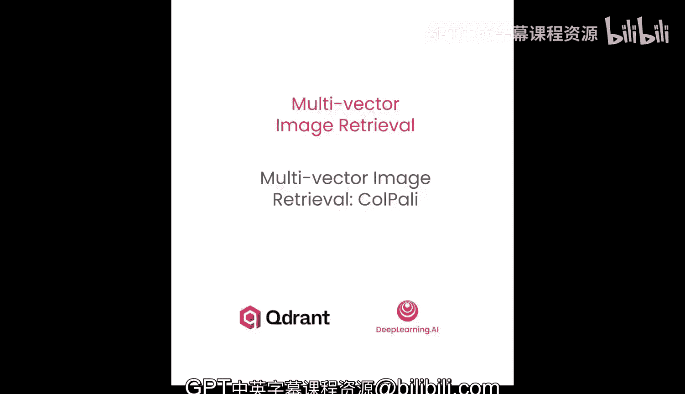
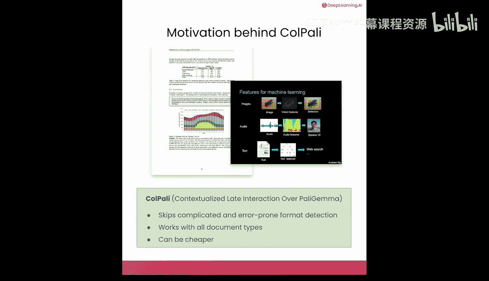
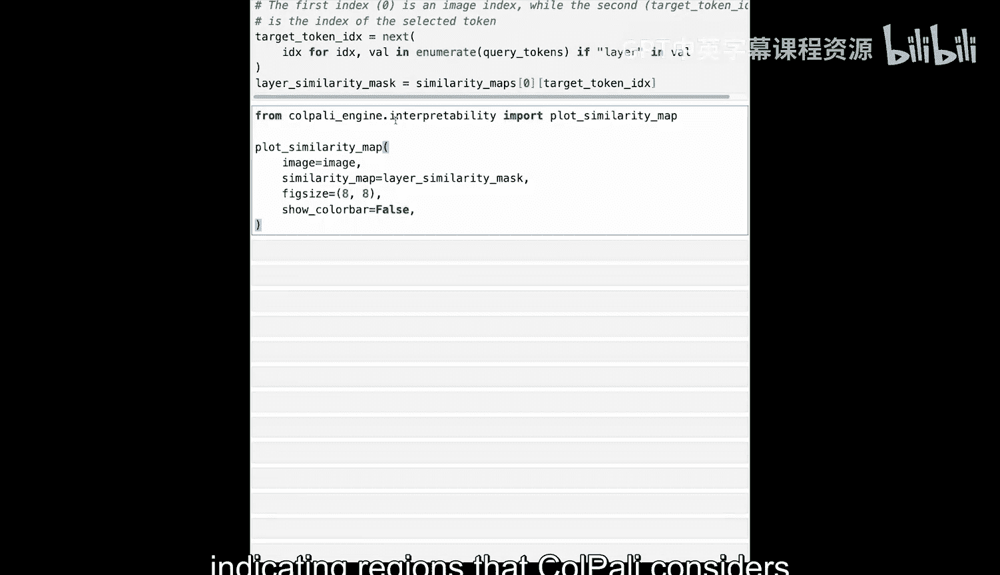
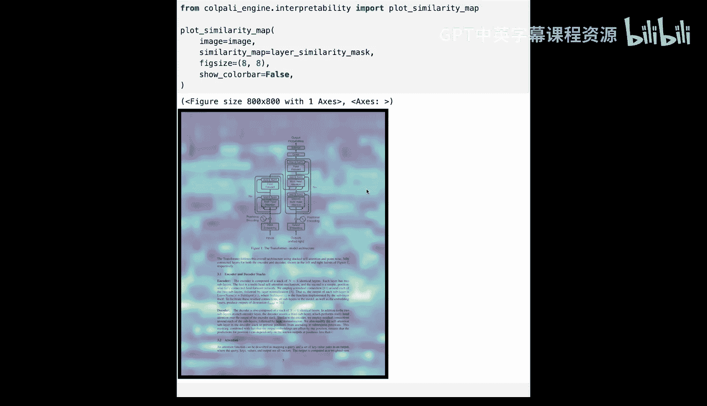
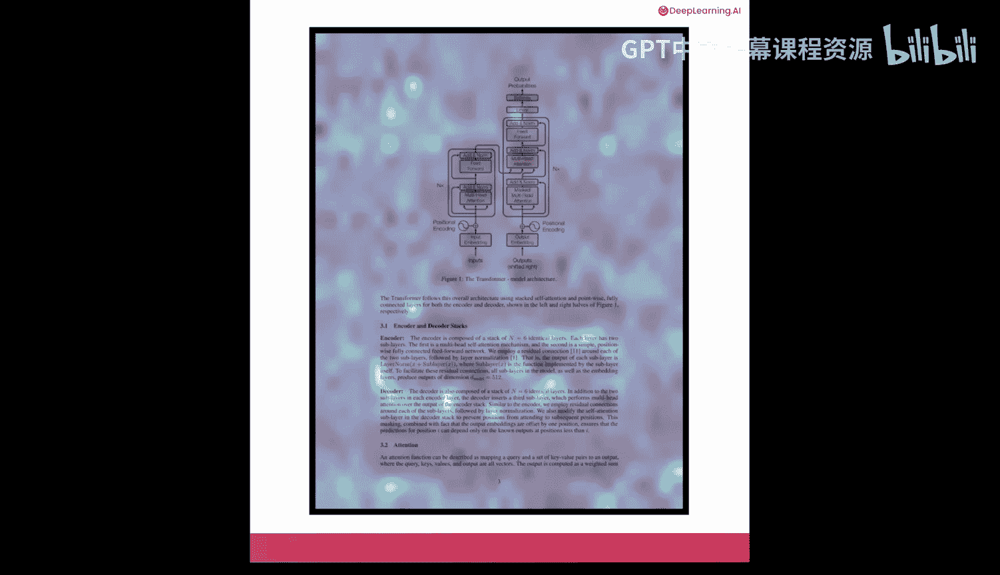
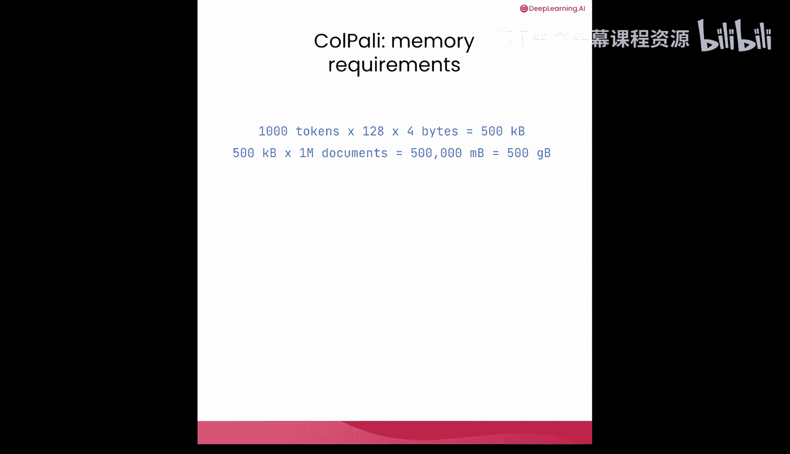

# 003：ColPali多向量图像检索方法

在本节课中，我们将学习如何将多向量方法应用于图像检索。我们将介绍ColPali模型，它能够直接处理图像文档，无需复杂的布局检测和OCR步骤，从而实现高效的多模态搜索。

## 概述

上一节我们介绍了多向量方法在文本检索中的应用。本节中，我们将看看如何将类似的方法应用于图像检索。图像检索非常重要，因为大量有用信息并非以文本形式存储，而是存在于图像文件中，例如扫描文档、PDF或幻灯片。新一代的视觉语言模型能够同时接受文本和图像作为输入，因此，只要检索到正确的文档，就能构建强大的多模态RAG系统。挑战在于如何完成检索步骤。

## 图像检索的挑战

文档是最常见的需要检索的图像类型，但它们给检索带来了许多挑战。幻灯片或文档页面通常是文本、图像、图表和表格的复杂混合体。

以下是传统方法的处理流程：

1.  首先使用专用模型检测文档的布局。
2.  然后分别解析每种元素类型。

这种方法需要构建复杂且容易出错的自定义系统。更糟糕的是，针对一种文档的检索流程通常无法适用于另一种。

## ColPali方法简介

ColPali是一种多向量图像检索方法，它解决了上述许多问题。ColPali代表“Contextualized Linear Direction over PaLI-JAMA”。PaLI-JAMA是谷歌创建的一个视觉语言模型。然而，ColPali这个名字也常用来指代基于相同原理构建的整个模型家族。

ColPali是构建在视觉语言模型之上的多向量嵌入模型，可以同时接受图像和文本作为输入。这类似于ColBERT，它既是一个特定模型，也常用来指代整个多向量文本检索技术家族。

ColPali具有许多优点：
*   它跳过了复杂且容易出错的格式检测步骤。
*   它灵活适用于所有文档类型。
*   虽然运行成本可能较高，但从长远来看，由于系统依赖单一模型而非传统方法所需的多个模型，最终可能更便宜。

## 视觉语言模型如何工作

让我们看看视觉语言模型如何被改造用于检索，然后将其应用于实践。

典型的纯语言模型工作流程如下：
1.  输入文本传递给分词器。
2.  分词器将其拆分为称为“标记”的较小单元，并创建标记ID序列，然后传递给模型。
3.  实际上，模型将这些ID转换为训练期间学到的相应标记嵌入。这些向量是静态的，并且特定于每个标记。
4.  语言模型将序列通过其自身的层，并生成考虑整个序列的当前标记的上下文化嵌入。
5.  该向量通常用于生成逻辑值，然后是词汇表中每个标记作为序列延续的概率。

视觉语言模型在用于文本生成时与此并无不同。然而，添加另一种模态需要对该架构进行一些扩展。

视觉是一种完全不同的模态，因此无法直接转换为文本。因此，它有自己的预处理流程，显然从整张图像开始。总体目标是以某种方式处理图像，使其像文本一样作为嵌入序列输入到语言模型中。

以下是图像处理流程：
1.  图像通过一个额外的Transformer进行处理，该Transformer首先将其转换为特定大小的图像块。
2.  单张图像变成一个块序列，而不是单个输入。这类似于文本被处理为标记序列，而不是整个文档。
3.  图像输入通过一个视觉Transformer神经网络，它再次产生一个上下文化的向量嵌入序列，每个输入块对应一个，通常维度很高。
4.  输出必须被投影到一个更小的维度空间，然后传递给语言模型。最后一步的原因是使图像向量具有与文本向量相同数量的维度。

总而言之，这个额外的过程使得不同的模态能够被传递到同一个网络。无论输入模态如何，语言模型都会产生一个嵌入，该嵌入将在生成过程的后期用于生成每个标记的逻辑值和概率。

因此，与纯语言模型相比，典型的视觉语言模型为图像添加了一些额外的处理，同时保持文本处理不变。VLM仍然在给定输入的情况下预测下一个标记。所以，我们还没有完成嵌入生成。我们不想要生成系统，而是想要以向量嵌入形式表示检索输入的东西。

## 生成向量嵌入

为了产生向量嵌入，需要稍微扩展VLM的逻辑，并在语言模型从其最后一层生成隐藏状态后立即添加另一个投影层。这个投影层减少了嵌入的维度以便高效存储。对于Gemma模型，它从2048维减少到128维，但不同模型之间可能有所不同。没有使用池化变体。

因此，最终，整个输入序列，无论模态如何，都通过该网络进行转换，你会得到一个代表你输入的相同长度的序列。

一般来说，仅仅开始使用VLM进行向量检索是不够的。需要对最终的投影层和语言模型参数进行一些额外的训练。许多论文建议对语言模型的注意力权重使用低秩适配器。

低秩适配向冻结的基础模型添加低秩矩阵。“低秩”一词指的是维度复杂性，其中低秩意味着矩阵可以表示为两个较小矩阵的乘积。

例如，与其训练一个完整的2048x2048权重矩阵（需要超过400万个参数），LoRA使用两个大小为2048x32和32x2048的矩阵（仅需要约13.1万个参数），减少了97%。训练过程调整整个模型以进行有效检索，但由于这些优化，它比完全参数调优更容易、更快。

## 实践：使用ColPali

实际上，你不需要知道所有这些细节就可以开始使用ColPali。你将首先根据可用硬件加载适当的模型。虽然ColPali功能更强大，但它需要大量内存才能运行，甚至需要GPU。因此，你也可以使用Cosmo，这是一个拥有2.56亿参数的较小变体，你可以在DeepLearning.AI平台上使用。你也可以在具有完整ColPali模型的不同环境中运行它，以查看差异。

无论你最终使用哪个模型，都需要一个处理器来处理原始数据并将其转换为模型可以处理的表示形式。

让我们加载著名论文《Attention Is All You Need》中的一页，看看ColPali如何处理视觉文档。这个PDF页面包含图表、方程和大量文本。你还需要使用Pillow加载图像并检查其尺寸。这个高分辨率截图保留了原始PDF的所有视觉细节。

ColPali通过将图像划分为块网格来处理图像，类似于视觉Transformer的工作方式。对于ColPali v1.3，这始终是一个固定的32x32网格。对于Cosmo，网格尺寸会根据图像的宽高比进行调整。

让我们通过在各块之间添加一些间距来可视化这个特定图像是如何被划分的。你有一个辅助方法来完成这个。

现在，你将通过ColPali处理器处理图像。该处理器将图像转换为包含输入ID、注意力掩码和像素值的张量批次，模型可以理解这些。处理后的批次包含因模型而异的输入ID：对于ColPali是1024，对于Cosmo是1039。让我们解码这个，看看ColPali在内部如何表示图像。

注意，该序列包含1024个特殊的图像标记，代表图像的不同块，后面是指令标记。ColPali将图像作为块网格进行处理，为每个块创建嵌入。对于ColPali，它始终是一个固定的32x32网格，而对于Cosmo，网格尺寸根据图像大小而变化。

让我们为图像生成嵌入。你最终会为每个标记得到一个128维向量。对于搜索，我们可能更倾向于与图像标记对应的嵌入，而不是指令标记。使用辅助函数提取图像掩码，我们隔离这1024个图像块嵌入。这个数字对于ColPali是固定的，对于Cosmo可能不同，但巧合的是，创建的块数完全相同。

## ColPali的可解释性

ColPali的一个强大特性是其可解释性。我们可以精确地可视化图像的哪些部分与特定查询标记最相关。与产生单一相似性分数的传统密集嵌入不同，ColPali的标记级嵌入允许我们看到查询中的每个单词如何与图像的不同区域相关联。这使得模型的推理过程透明，并帮助我们理解为什么检索到某些文档。

让我们通过创建一个查询并可视化它如何匹配文档的不同部分来探索这个功能。我们将创建一个关于Transformer架构的查询。《Attention Is All You Need》论文的这一页包含著名的Transformer图表，因此我们期望ColPali在处理我们的查询时突出显示这些特定区域。

你将通过模型处理查询以获得查询嵌入。每个查询标记也由一个128维向量表示，但查询只创建了21个标记。让我们通过移除填充和增强标记来稍微清理一下，然后重新分词，以便我们可以看到各个查询标记以进行进一步分析。

为了创建我们的相似性可视化，我们首先需要计算图像被划分成了多少块。你还将提取图像掩码以隔离仅图像标记嵌入，排除提取标记。现在，你将使用ColPali可解释性工具生成相似性图。这将计算每个查询标记与每个图像块之间的相似性，为查询中的每个标记创建一个热图。

让我们可视化特定查询标记的相似性图。你将选择查询中的“layer”标记，以查看图像的哪些部分它最强烈地关注。这个可视化将在原始图像上叠加一个热图，其中较暖的颜色表示ColPali认为与该特定单词最相关的区域。

这个可解释性功能对于调试和理解你的检索系统非常有价值。你可以识别模型是否关注正确的内容，发现意外的匹配模式，并建立对系统决策的信任。在生产应用中，这种透明度还可以帮助向最终用户解释检索结果。

然而，由于我们在这里使用较小的Cosmo模型，你可以看到模型似乎关注了一些背景块，这有点出乎意料。让我们看看完整的ColPali模型会是什么样子。这是相同相似性图在更大的ColPali模型上的样子。Cosmo模型进行了一些像素混洗，所以模型关注了一些随机位置。但对于ColPali，你可以看到模型主要关注页面上的“layer”一词多次，这是预期的，因为这是你正在可视化的标记。

## 构建多模态搜索系统

让我们使用Qdrant构建一个实用的多模态搜索系统。我们将使用MaxSim比较器设置一个支持向量的集合，以处理ColPali的每个文档多个嵌入。你还需要禁用HNSW图创建，因为Qdrant无论如何也无法有效使用它。

现在，我们将为《Attention Is All You Need》论文的所有页面建立索引。`load_precomputed`标志设置为`True`，这将加载每个页面的预计算向量数据，而不是实时计算。然后，每个页面的向量被上传到Qdrant，并将图像文件路径作为元数据记录。

让我们创建一个辅助搜索函数，用于处理文本查询并为它们创建ColPali嵌入。同一个函数还将查询你刚刚创建的集合以获取最接近的匹配项。由于我们正在处理视觉数据，我们有另一个辅助方法在屏幕上显示搜索结果。

让我们搜索“model architecture”，看看模型认为论文的哪些页面是最佳匹配。我们询问模型架构，所以这个最著名的图表首先出现并不奇怪，但论文中也有一个名为“Model Architecture”的特定部分，因此它也被选为回答该特定问题的最佳页面之一。

接下来，让我们搜索“scaled dot product attention”。同样，返回的第一个结果中的图表正好展示了这一点，但文档中也有一个名为“Scaled Dot-Product Attention”的部分，也被ColPali检索捕获。

最后，让我们搜索“experiment results”。这里的目的是检索包含表格和性能指标的页面，我们期望论文中包含这些内容。ColPali似乎同时理解文本内容和视觉元素，如表格和图表。令人惊讶的是，整篇论文的第一页被返回为最佳匹配，尽管它似乎不包含任何总结实验的表格。然而，实验结果可能在摘要或文章的脚注中被提及，所以这并不奇怪。尽管如此，第二和第三个匹配项都包含一些总结该方法与其他方法效率的表格，这实际上是我们期望这类系统返回的内容。

## 总结

本节课中，我们一起学习了ColPali多向量图像检索方法。ColPali无需OCR步骤或复杂的文档处理，即可实现对视觉文档的强大多模态搜索。通过直接将文档作为图像处理，它能自然地捕获文本和视觉语义。

然而，多向量表示也存在一定的局限性。假设每个文档需要0.5MB，而你有一百万个文档，最终可能仅用于搜索的ColPali嵌入就需要500GB内存。这对于拥有数千个文档的小规模项目来说可能没问题，但在实践中，你经常需要处理数十亿个文档，这将需要大量的内存来运行。如果你的公司有大量数据需要搜索，检索系统中有一百万个文档是很有可能的。通常，这些向量会包含大量冗余信息，一些有趣的优化技术可以帮助你减少它们的RAM消耗。我们将在下一课中讨论这些方法。