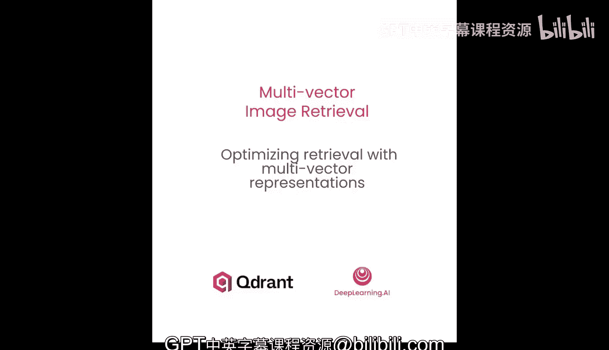
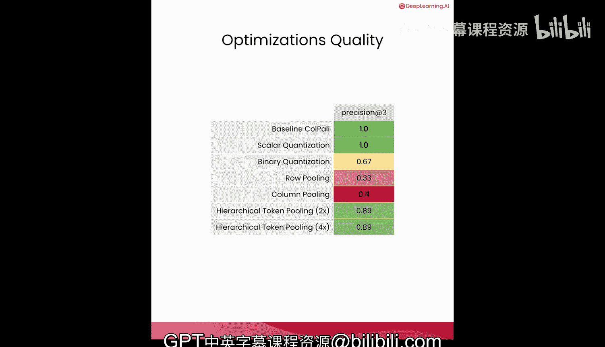

# 004：优化多向量表示的检索效率 🚀

在本节课中，我们将学习如何优化多向量图像检索系统，以减少其内存占用，同时尽可能保持检索质量。我们将探讨量化、池化和层次化聚类等多种技术。

---

## 概述

Copilot 技术的一个主要缺点是，为了存储每个文档的所有向量，它需要比其他技术多得多的内存。

因此，需要使用优化技术来减少 Copilot 的内存占用。让我们看看这些方法是什么。

---

## 优化技术概览

以下是三种主要的优化方法：

1.  **标量或二进制量化**：将每个向量中的浮点数转换为压缩格式，如四比特整数甚至一比特。
2.  **行或列池化**：将图像块按行或列分组，并通过平均池化每组中的向量来创建单个向量。
3.  **层次化池化**：这是一种更智能的行或列池化，将具有相似嵌入向量的图像块分组。

---

## 加载文档嵌入

上一节我们介绍了 Copilot 如何将 PDF 页面转换为截图并生成多向量嵌入。本节中，我们将使用一个辅助函数，它在内部处理所有这些步骤：PDF 转换、图像加载和嵌入生成。由于这些细节已在上一课中介绍，我们可以专注于本课的核心——优化技术。

为了课程流畅，我们将使用预计算的嵌入，但您也可以将 `load_precomputed` 设置为 `False` 来查看整个过程。

我们将加载 Copilot 处理器，以演示 Copilot 如何将文档图像结构化为图像块网格。这将帮助您理解稍后将探讨的空间池化技术。

另一个辅助函数处理所有复杂性：要么从 Parquet 文件加载预计算的嵌入，要么通过转换 PDF、加载 Copilot 模型和批量处理图像来重新生成它们。

`load_or_compute_image_embeddings` 函数返回一个包含图像路径和已转换为 NumPy 数组的嵌入的 DataFrame。

以下是部分条目的样子。显然，由于我们处理的是图像，我们也可以在屏幕上显示它们。这些幻灯片来自不同的深度学习 AI 课程，因此，如果您在完成本课程后曾学习过其中任何一门，您将可以直接向幻灯片提问。

每页生成大约 1000 个令牌嵌入，这是大量需要存储和搜索的向量。但让我们看看单个嵌入向量的形状。

每个图像的向量数量始终是 1031 个。现在，我们可以逐一实现不同的优化技术，并最终在同一数据集上比较它们。

---

## 标量与二进制量化

在计算存储向量所需的内存时，一个常见因素是每个单独维度的大小。标准嵌入使用每个维度 4 字节的 float32 值，但如果您能在不牺牲搜索质量的情况下减小这个大小，您将拥有一种节省大量 RAM 的简单方法。

标量和二进制量化技术旨在使用一字节整数，甚至每个维度仅用一比特来表示向量，它们被广泛用于来自编码器的常规密集嵌入。

**标量量化**将 4 字节的 float32 值压缩到仅 1 字节的 8 位值，实现了 **4 倍压缩**。

标量量化的原理是将连续的浮点数范围映射到离散的整数桶。对于每个维度，量化器学习整个数据集的最小值和最大值，然后将此范围线性映射到 0 到 255 的整数空间。

例如，如果维度 5 在所有向量中的范围是 -0.8 到 1.2，那么值 0.2 将映射到大约 128。这使得标量量化是数据集感知的。它需要分析所有向量（或至少一个代表性样本）以确定最佳范围。

幸运的是，像 Quadrant 这样的向量搜索引擎在内部处理此过程。我们只需在集合级别配置量化，发送原始的浮点嵌入，引擎就会自动处理压缩和范围校准。

**二进制量化**进一步压缩，将每个 float32 维度从 4 字节减少到仅 1 比特，实现了惊人的 **32 倍压缩比**。

过程很简单：正值变为 1，而负值或 0 变为 0。这种极端的压缩将相似性计算转换为高效的按位运算。

当嵌入以 0 为中心且分布相对对称时（这在归一化的神经网络输出中很常见），二进制量化效果特别好。然而，这种激进的压缩确实会带来权衡。

与标量量化一样，Quadrant 在内部处理二进制量化。我们在集合级别配置它，并发送原始浮点嵌入，让引擎执行二进制转换。

---

## 池化方法

池化方法可以利用 Copilot 的空间结构。回想上一课，Copilot 将文档图像处理为 32x32 的图像块网格。

**行池化**平均网格中每一行的嵌入，而**列池化**平均每一列的嵌入。这保留了空间关系，同时将向量数量大幅减少到仅 32 个。

让我们提取图像块的嵌入。处理器从 32x32 的网格中创建一个包含 1024 个图像块令牌的序列，外加一些用于模型架构的空间令牌。

对于池化方法，我们不需要这些额外的令牌，因此我们可以使用处理器的图像掩码来仅提取与图像相关的令牌位置。

通过使用此掩码过滤到仅图像块令牌，我们可以将 1024 个嵌入的扁平序列重塑为 32x32x128 的网格。

让我们创建一个辅助函数来完成这个操作。在这个 32x32 网格中的每个位置对应于原始图像中的一个图像块位置，每个图像块都有一个 128 维的嵌入。

让我们在第一个文档的嵌入上测试您的重塑函数。您刚刚应用了 `embeddings_to_grid` 函数来验证它是否正确地将掩码嵌入转换为预期的 32x32x128 维结构。

一旦我们的嵌入处于网格形式，您就可以将行和列池化实现为简单的平均操作。

行池化平均网格的 32 行中的每一行，产生 32 个代表向量，捕捉文档中的水平模式。类似地，列池化平均 32 列中的每一列，捕捉垂直模式。两种方法都将向量总数从 1024 个减少到仅 32 个。

仅看这些数字不容易判断什么，但为了确认形状正确，您将在创建的网格上运行行平均池化，它确实是 32x128 维。列平均池化也是如此。调用方法后，我们可以看到形状符合预期大小。尽管如此，我们不需要花太多时间看这些我们无法解释的数字。

---

## 层次化令牌池化

层次化令牌池化使用聚类来智能地分组相似的嵌入。该算法对令牌嵌入执行层次聚类，然后将每个聚类平均为一个代表性向量。

聚类由相似的图像块创建。因此，如果我们有很多相同颜色的背景块，它们应该被分组在一起。Copilot 引擎库提供了该技术的实现，让我展示一个简单的工作原理示例。

假设您在一张有 9 个图像块的图像上运行层次化令牌池化。每个图像块都有自己的嵌入，因此我们的多向量表示是一个包含 9 个向量的序列。如果池化因子设置为 2，您将创建 4 个聚类（因为 9 / 2 = 4.5，向下取整为 4）。我在这里假设，但很可能包含耳朵的两个图像块最终会在同一个聚类中。类似地，仅包含毛发的图像块彼此也非常相似，因此它们也很可能被分组在一起。一个有眼睛的图像块非常独特，因此很可能是一个单图像块聚类，依此类推。

图像块不必是连续的才能形成一个聚类。实际上，池化技术接收一个没有空间关系信息的嵌入序列，因此甚至无法做到这一点。您使用的 Copilot 引擎库提供了此技术的实现，因此您只需创建一个名为 `hierarchical_token_pooling` 的辅助函数，以便更简单地在我们的原始嵌入上使用它。

让我们在数据集中的一个示例上运行它，看看使用池化因子为 2 的此方法能节省多少内存。您已将 1031 个向量减少到 515 个，通过聚类保留了语义信息，同时将内存使用量减少了近一半。

---

## 实验与比较

现在到了关键的实验：在真实的向量数据库中比较我们所有的优化策略。我们将在单个 Quadrant 集合中创建多个命名向量，每个代表一种不同的优化方法。这允许您直接比较所有策略的检索质量和内存使用情况。

原始嵌入、二进制量化、不同因子下的层次化池化以及空间池化。我们将回答关键问题：在不牺牲检索质量的情况下，我们能节省多少内存？

首先，确保集合不存在。

您将在单个集合中设置多个命名向量。每个向量将使用具有最大比较的多向量配置，但池化的向量数量将根据策略而变化。对于量化方法，我们将在相应的命名向量上启用它们，以便与原始方法进行比较。

现在，让我们将所有嵌入插入到集合中。每个文档将有七种不同的向量表示，使我们能够并排比较检索性能。

辅助方法加载预计算的向量数据，并将使用的幻灯片组限制为整个列表的一个子集。为了避免将所有向量加载到内存中，辅助函数逐个生成示例。

我们在所有已实现的优化技术上运行相同的查询，以比较检索质量。辅助函数处理所有复杂性：它将根据 `load_precomputed` 标志加载预计算的查询嵌入或重新计算它们。查询、模型和处理器只是在辅助函数内部创建的。

现在，让我们使用每种向量配置进行搜索，并并排比较结果。我们将为每个查询和优化策略检索前三个文档。因此，让我们定义优化的顺序，以便我们可以轻松引用它们。

我们不会对查询应用量化和池化，因为它们在序列长度方面已经有限。对于查询，行和列池化没有意义，因为文本中没有空间关系。此外，Quadrant 在内部处理量化。因此，在所有情况下，调用的 Quadrant API 都直接使用查询嵌入。

因此，我们有一个辅助方法，它在所有向量上运行相同的查询，并将它们呈现为指标。让我们用实际的文档图像并排可视化结果。这种比较显示了带有颜色编码的精确度指标，以快速识别哪些优化保持了检索质量。

这里的精确度衡量了检索到的文档与基线（即原始嵌入）返回的文档匹配的百分比。这显示了每种优化在多大程度上保持了检索准确性。

我们的第一个查询 “coffeeoff Mac” 返回这组文档作为前三个匹配项。标量量化、二进制量化和层次化令牌池化都能够返回相同的结果集。有时顺序略有不同。尽管如此，精确度并不衡量文档的顺序，它只关注是否相关。然而，对于列池化和行池化，我们得到的结果集略有不同。我们可以清楚地看到，至少列池化在这方面做得不是很好。

由于您只有三个查询，您可以逐个运行它们。是时候进行第二个查询了。同样，标量量化能够返回相同的文档集，但所有其他方法都遇到了困难，尤其是列池化甚至无法选取一个被原始 Copilot 嵌入标记为相关的文档。

最后但同样重要的是，让我们检查最后一个查询 “one learning algorithm”。标量量化仍然提供与原始 Copilot 嵌入完全相同的结果集。类似地，层次化令牌池化能够返回与原始基线向量相同的结果集。不幸的是，行池化和列池化似乎都不太有效，至少对我们的数据集来说是这样。

然而，在实践中，我们不看特定情况下的检索质量，而是全局计算所有测试示例的指标。所有测试方法的平均精确度@5 如下所示。列池化和行池化表现不佳，因为它们很少能选择最相关的文档，正如您在笔记本示例中看到的那样。层次化令牌池化效果明显更好，而且池化因子似乎甚至没有太大影响，因此可能可以进一步增加它。

令人惊讶的是，简单的标量量化方法能够始终返回与基线相同的文档，使其成为一种有前途的方法，不需要任何预处理，因为它只能在集合级别配置。二进制量化虽然不是最好的方法，但考虑到其对内存使用和处理速度的巨大可能影响，在某些情况下可能会被考虑。

值得一提的是，您可以组合多种不同类型的内存优化。标量量化也可以在应用层次化令牌池化后为嵌入启用，如果您看到质量仍然可以接受的话。尽管如此，真正的基准测试不应只关注三个精心挑选的示例，而应更广泛。评估是关键，并且取决于您正在处理的数据集。尝试不同的技术，看看哪些组合在您的数据中效果最好。

---

## 总结

本节课中，我们一起学习了如何优化多向量图像检索系统的内存占用。我们探讨了三种主要技术：**标量与二进制量化**、**行/列池化**以及**层次化令牌池化**。通过实验比较，我们发现标量量化在保持检索质量的同时能有效压缩内存，而层次化池化则通过智能聚类在减少向量数量方面表现优异。实际应用中，应根据具体数据集评估和组合这些技术，以达到最佳平衡。