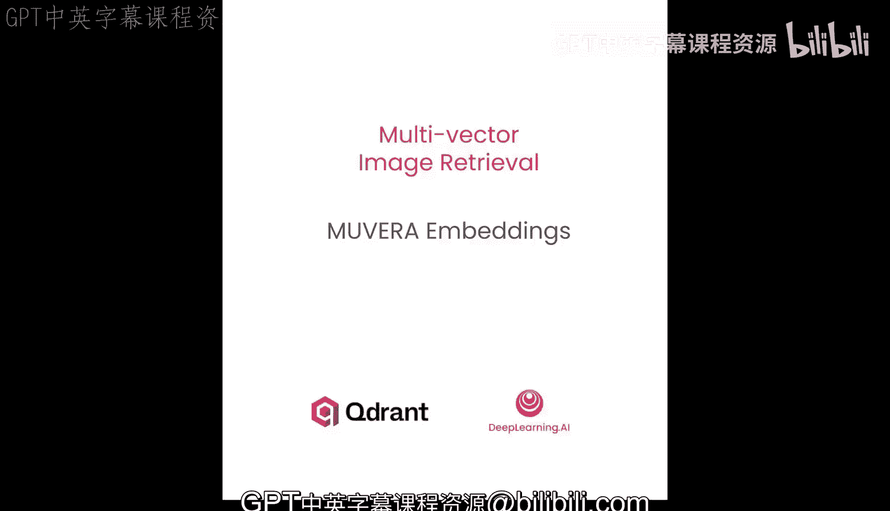
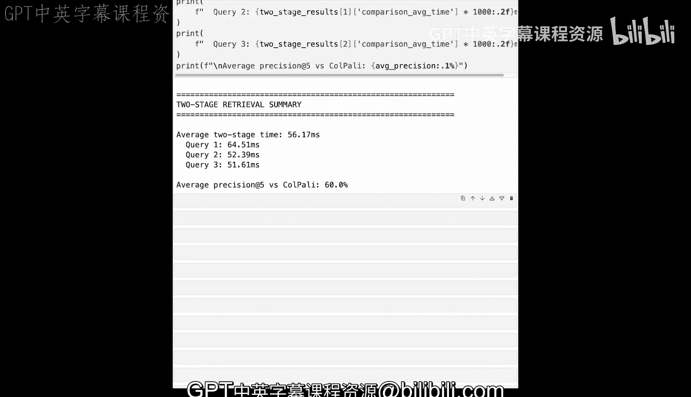

# 005：Muvera嵌入

在本节课中，我们将学习一种名为Muvera的技术，它旨在解决多向量表示在近似最近邻搜索中的核心挑战。我们将了解Muvera如何将可变长度的向量序列转换为固定维度的嵌入，从而解锁高效的HNSW搜索。

## 概述

上一节我们介绍了ColPali多向量嵌入及其内存占用问题。本节中，我们来看看Muvera方法，它通过将多向量转换为固定维度的单向量表示，解决了ColPali无法与HNSW索引高效结合的根本缺陷。

## Muvera的核心思想

Muvera的核心思想是将可变长度的向量序列转换为固定维度的嵌入。这使得我们可以使用与常规稠密向量搜索相同的近似方法。

ColPali无法使用HNSW搜索，因为无法为“最大化”这类非对称相似性度量构建HNSW索引。因此，ColPali需要线性时间的暴力搜索技术。如果你想用ColPali搜索一百万个文档，就需要计算一百万次最大化操作。

Muvera采用不同的方法，它将向量序列转换为高维度的单向量嵌入。这使得可以使用HNSW索引，其搜索时间是对数级别的，可以轻松扩展到数百万甚至数十亿个文档。这使得它比原始的多向量表示更实用。

## Muvera算法步骤

以下是实现Muvera技术所需的步骤。

**第一步：基于SimHash的聚类**

Muvera算法首先对多向量嵌入执行聚类算法。Muvera论文建议使用局部敏感哈希方法，即SimHash。

当我们的每个标记（token）被映射到一个向量空间（在我们的例子中是二维空间）时，SimHash会生成一些随机超平面，将该空间分割成两部分。每个向量将根据超平面的定义落在其中一侧。

然而，一个超平面是不够的。SimHash会生成K个超平面，将空间划分为2^K个桶（bucket）。我们可以使用0或1来为每个桶分配一个二进制字符串，以指示其位于对应超平面的哪一侧。桶ID的长度正好是K位。在我们的例子中，K=2，正好有四个不同的桶，因为两位可以表示四个值。

**第二步：文档与查询处理**

在为每个输入标记嵌入分配桶之后，我们将属于同一簇（即同一桶）的项分组在一起。SimHash旨在通过为每个桶找到一些代表性向量来减少序列的可变长度。

文档和查询的处理方式略有不同。

*   **对于文档**：SimHash会取属于特定簇的所有标记向量的平均值。由于某些桶可能是空的，它还会用汉明距离（Hamming Distance）最近的非空簇的值来填充它们。直观地说，汉明距离为1意味着两个簇ID仅相差一位。在这个过程结束时，每个簇将由一个单独的向量表示。这意味着无论你有多少个输入向量，最终总会得到2^K个代表性向量。
*   **对于查询**：与取平均值不同，我们对同一簇中的所有向量进行求和。这意味着，向量数量越多的簇，其生成的向量幅度越大。这样做的目的是保留查询项的自然分布，这可能有利于检索。与文档不同，查询不需要填充空簇。查询通常比文档短，因此某些簇更可能为空。填充它们可能会引入噪声并扭曲表示，因为每个项可能会对点积贡献多次。因此，如果某个特定簇中没有标记，它将被表示为零向量。

无论处理文档还是查询，现在每个由SimHash过程创建的簇都有一个单独的128维向量（128维是多向量表示中单个向量最典型的长度）。

通常，SimHash过程中的超平面数量K至少设置为5，这给我们32个簇（2^5=32）。每个簇向量128维，总共是4096维，维度相当高。

## 降维：随机投影

向量之间的距离对于语义搜索至关重要。当你在非常高维的空间中处理数据时，处理会变得困难，但你可以缩小数据维度而不会丢失太多信息。

随机投影是一种巧妙的技巧，它使用一个填充了随机值（通常只是+1或-1）的矩阵，将高维数据投影到低维空间。这个简单的方法可以保持点之间的距离几乎不变，这要归功于**约翰逊-林登斯特劳斯引理**。该引理保证，如果你选择足够的维度，就可以安全地降低数据维度。因此，只需一点随机数学运算，你就能在保持数据形状的同时，使其更易于处理。

所以，当你有一个应用了SimHash后的向量矩阵时，你将其乘以另一个形状为（原始维度 × 目标维度）的、由+1/-1组成的矩阵。结果，你将每个簇向量的维度降低到你想要的目标维度。就这么简单。

随机投影可以将平均相似度误差保持在非常低的水平，即使你显著减少了维度数量。图表展示了对于10000个随机生成的、每个维度为4096的向量，误差是如何变化的。这是一个有趣的方法，不仅对Muvera有用，也可以用于降低任何向量的维度。图表显示，在4000维、1000维时误差保持不变，直到接近100维时误差才显著增加。这意味着你可以显著降低数据的维度，同时只在相对距离方面引入最小的误差。

## 生成最终单向量表示

此时，你仍然拥有多向量表示，但此时它始终是相同长度的序列。每个簇向量的维度等于随机投影的目标维度。然而，HNSW搜索只需要一个向量，所以我们只需按照簇ID定义的顺序将它们全部连接起来。

最终，你会得到一个长的单向量表示，但你可以通过修改随机投影的参数来控制它的长度。

## 处理随机性：重复过程

此时，你可能已经意识到Muvera严重依赖于随机过程。如果你不够幸运，SimHash超平面可能会以某种方式分割空间，导致两个标记即使有很多共同点，也可能落在超平面的不同侧。例如，“狗是唯一会叫的动物”这句话中的标记，可能由于随机性而被分到不同的桶中。这就是为什么Muvera假设整个过程会重复多次。这既适用于SimHash，也适用于随机投影。

重复次数是你可以控制的另一个过程参数。通常，你将其设置为至少10次。一旦你重复了这个过程，就将所有嵌入连接起来，这就是你的最终向量。

## 实践应用

通常，无需从头实现这个过程，你可以依赖现有的实现。让我们看看它在实践中是如何工作的。

我们将为生产环境中的ColPali嵌入配置Muvera。你将使用`k=6`来创建64个簇（2^6=64），随机投影会将每个簇向量从128维压缩到仅16维。整个过程将重复20次。每次重复使用不同的随机超平面进行SimHash，以及不同的随机矩阵进行随机投影，从而创建多样化的表示，然后将它们连接在一起。

这给我们每个文档带来：64个簇 × 16维 × 20次重复 = 20480维。这比典型的稠密向量要大，但它实现了比完整多向量搜索更快的检索，同时保持了高精度。

请注意，你显式地设置了随机种子值。由于Muvera基于随机性，这样做是为了确保结果可重现。所有文档和查询都必须通过相同的SimHash超平面和随机投影矩阵进行处理，否则它们将无法相互兼容。

## 在真实数据集上应用Muvera

现在让我们将Muvera应用到真实文档中。你将使用与上一课相同的PDF截图数据集。这些是讲义笔记的页面，每个都用ColPali的多向量嵌入进行了编码。

相同的辅助函数将处理加载这些预计算的嵌入，或在需要时重新计算它们。这些嵌入每页包含超过1000个标记向量，是进行Muvera压缩的理想候选。

是时候将这些多向量嵌入压缩成固定维度的编码了。我们将通过我们的Muvera实例处理每个文档。`process_document`方法处理这个完整的流程：SimHash聚类、平均簇内向量、应用随机投影后连接所有簇向量。这将每个页面的1031个可变长度向量转换为单个20480维的固定维度嵌入。

现在，让我们准备搜索查询。我们仍然使用与上一课相同的三个查询，并使用Muvera的查询流程处理它们。辅助函数将类似地加载或创建查询嵌入。

现在我们可以通过相同的Muvera过程处理这些查询。但请注意，你调用的是`process_query`而不是`process_document`，因为在Muvera算法中，我们处理查询的方式略有不同。

## 建立检索对比实验

现在到了激动人心的部分：创建一个Qdrant集合，将两种表示并排存储。我们将设置两个命名向量：
1.  一个用于原始的ColPali多向量，使用最大化比较，并禁用HNSW。
2.  一个用于Muvera固定维度编码，作为启用了HNSW的常规单向量。

这种设置允许你直接比较两种方法的检索速度和准确性。

让我们将所有文档页面插入到我们的集合中，为每个页面提供两种表示。这使得Qdrant可以使用任一方法进行索引和搜索。

一旦你将向量上传到Qdrant，它们立即可用于搜索。然而，HNSW图可能仍未就绪，优化器可能在后台构建它。在生产环境中，你很少关心这一点，但在这里我们确实想测试Muvera嵌入的近似搜索。在循环中检查集合状态直到变为绿色，是确保一切就绪的简单方法。

## 对比检索结果

是时候揭晓真相了。让我们比较ColPali原始多向量和Muvera压缩表示之间的检索质量和速度。我们将用两种方法进行搜索，并检查它们检索到的文档。Muvera应该能提供显著更快的搜索速度，同时保持高精度。

我们将定义三个简单的辅助函数，使我们的研究实验清晰易懂。让我们从ColPali向量的辅助函数开始。每个辅助函数都将返回结果和计时。然后，一个比较函数将计算精度和加速指标。这种分离使得可以独立运行每次搜索并理解发生了什么。

下一个辅助函数将仅使用Muvera嵌入执行搜索。

让我们通过独立使用两种方法搜索来测试第一个查询。我们将从ColPali的原始多向量搜索（我们的基线）开始，然后通过Muvera的压缩向量运行相同的查询，最后比较结果以查看精度和加速指标。

如你所见，Muvera平均快了18倍，这使其成为提高多向量搜索速度的良好候选。

## 分析查询结果

以下是ColPali检索到的文档的样子。以下是Muvera能够检索到的内容。我们查看它是因为该查询报告的精度只有40%。

现在，让我们按照相同的模式测试第二个查询。Muvera仍然明显更快，但精度相对较低。如果你有兴趣查看单个结果，它们就显示在这里。

最后，让我们测试第三个查询以完成我们的比较。尽管Muvera再次比原始ColPali嵌入快18倍，但0%的精度使其在真正关心搜索质量时变得没有意义。以下是搜索结果的样子。你可以清楚地看到，Muvera并没有真正能为我们的查询找到最佳匹配。

## 总结性能与混合策略

让我们计算所有查询的平均性能，以了解Muvera压缩的整体影响。平均而言，Muvera比原始ColPali向量表示快17倍。然而，与原始ColPali嵌入相比，精度损失巨大。

在生产环境中，最佳方法是将两种方法结合在一个高效的查询中。使用Muvera进行快速的初始候选文档检索，然后使用原始的ColPali多向量对这些相同的文档进行重新排序以获得最高精度。

让我们创建另一个辅助函数。Qdrant的预取机制让你可以在一个API调用中实现整个流程。Muvera检索比预期更多的候选文档（正好是10倍），然后ColPali对它们进行排序以获得恰好N个结果。这为你提供了单向量搜索的速度和延迟交互模型的精度，因为在一个小子集上运行最大化操作足够快。

如果使用Muvera进行预取并只获取我们想呈现给用户的那么多文档，意义不大。如果你使用ColPali进行重新排序，那么它只能对给定的文档重新排序。因此，如果Muvera没有返回可能的最佳匹配，它只会对这个次优集合定义一个顺序。

## 测试两阶段检索

让我们使用ColPali多向量以及Muvera加ColPali排序的两阶段检索来运行同一组测试。我们将从第一个查询开始。你肯定能看到，我们获得的加速并不那么惊人。然而，精度稍好一些，因为目前对于“咖啡机”查询，精度达到了80%。

ColPali的结果没有改变。然而，我们可以预期两阶段检索会得到稍好的结果，事实上，它确实做得更好了一点。让我们测试第二个查询。你每次尝试都能得到更好的结果。你应该预期加速是相当一致的。但这次我们得到了理想的精度。这意味着我们为ColPali嵌入和两阶段Muvera加ColPali排序得到了完全相同的结果集。

还有一个我们仍然想测试的查询。不幸的是，这次Muvera两阶段检索未能找到任何有意义的结果。确实，它不断返回一些与所提供查询毫无共同之处的随机幻灯片。然而，我们可以通过增加过采样率来控制两阶段流程的检索质量。例如，通过将过采样率设置为20，这样我们可以得到100个结果，然后用ColPali重新排序。

## 最终总结

让我们总结所有查询的结果。如你所见，两阶段检索的平均耗时仍然显著低于整个ColPali嵌入搜索。然而，如果你确实需要最佳匹配，精度可能无法接受。

尽管如此，我们已经成功演示了Muvera在多模态文档检索中的实际应用。结果表明，Muvera实现了其承诺：与原始ColPali多向量相比，实现了显著更快的搜索速度，同时保持了高精度。压缩后的固定维度编码支持HNSW索引，从而显著提高了查询延迟。

两阶段检索模式是推荐的校正方法：利用Muvera的速度进行初始候选检索，然后利用ColPali的精度进行最终排序。这种混合策略提供了性能和质量的平衡，使得多向量模型在大规模应用中变得实用。在现实世界场景中，面对数千或数百万文档，Muvera的优势将变得更加明显。

在本节课中，我们一起学习了Muvera嵌入技术。我们了解了它如何通过SimHash聚类和随机投影将可变长度的多向量序列转换为固定维度的单向量，从而解锁高效的HNSW搜索。我们还探讨了其随机性特点以及通过重复过程来稳定结果的方法。最后，我们通过实验对比了纯Muvera搜索和“Muvera初筛 + ColPali精排”的两阶段混合策略，认识到在追求检索速度的同时，需要根据精度要求灵活调整策略参数。这为处理大规模多向量检索提供了一种有效的工程解决方案。