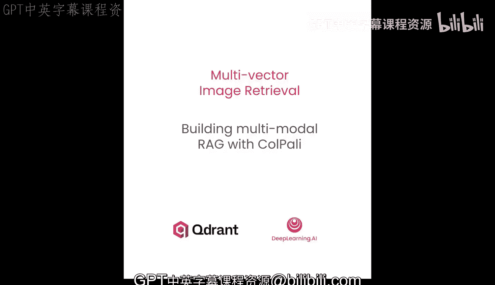
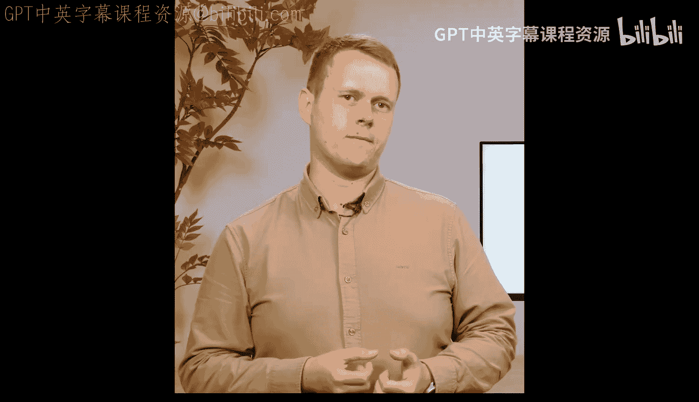
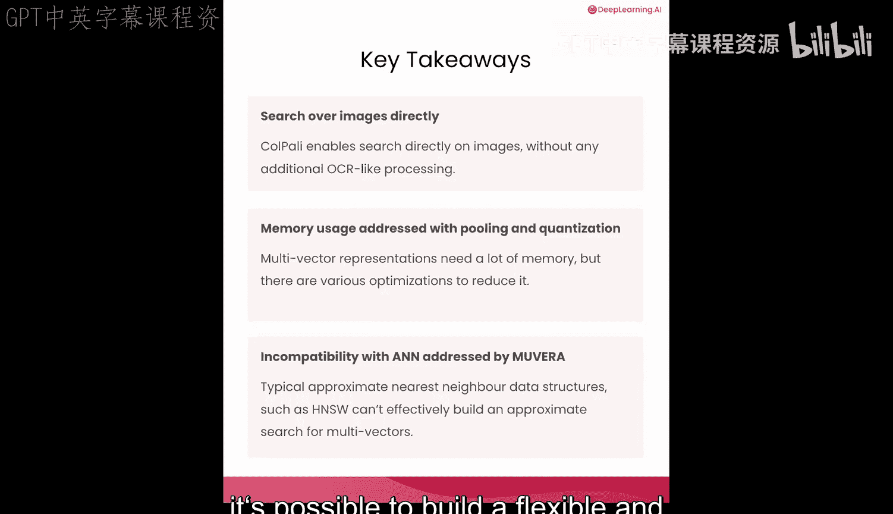

# 006：构建基于Colpali的多模态RAG系统 🛠️





在本节课中，我们将整合之前学到的所有知识，构建一个基于Colpali的、功能完整的**多模态检索增强生成（RAG）** 系统。我们将结合Colpali的多向量检索能力和OpenAI的视觉模型，创建一个能够直接理解图像文档并回答问题的系统。

## 系统概述与准备

上一节我们介绍了Colpali的工作原理、内存优化以及Movea如何加速多向量检索。本节中，我们将把这些组件组合起来。

首先，你需要加载OpenAI API密钥并创建客户端。接着，我们将重建一个包含Colpali嵌入及其各种优化版本的集合，确保本课程可以独立运行。

以下是创建集合的步骤：
1.  加载环境变量中的OpenAI API密钥。
2.  创建一个OpenAI客户端实例。
3.  调用辅助函数，重建包含所有优化策略（如原始嵌入、二进制量化、标量量化、不同池化方法）以及Movea嵌入的集合。

## 实现检索器

现在，让我们来实现系统的核心检索功能。我们将创建一个统一的检索器，它内部处理查询的嵌入过程，并返回相关的图像路径和分数。

检索器函数 `retrieve` 接收一个文本查询，并通过指定 `using` 参数来调用Quadrant的查询方法，以使用特定的向量进行检索。由于我们讨论过的某些量化方法内置了重打分机制，为了避免量化向量可能带来的结果偏差，我们在此明确不使用该机制。

此外，我们还有一个实现**两阶段检索**的辅助函数。它将首先使用Movea嵌入进行快速的**预筛选**，然后使用你指定的向量（如原始Colpali向量或池化向量）对候选结果进行**重排序**，以在速度和精度之间取得最佳平衡。

让我们用一个示例查询来测试检索器：
```python
query = "人类大脑是如何工作的？"
results = retrieve(query, using="original_colpali_vectors")
```
检索器将返回与查询最相关的PDF页面。

## 集成生成模型

检索到相关文档页面后，下一步是生成答案。我们将把检索到的图像页面连同用户问题一起发送给GPT-4o。

这个过程包含几个部分：
1.  发送一个**系统提示**，指示模型仅基于提供的文档图像回答问题，并以Markdown格式输出。
2.  传递用户的原始问题。
3.  附上所有检索到的图像。

整个交互将被发送到OpenAI服务以获取大语言模型的输出。让我们用之前检索到的文档测试生成功能，看看GPT-4o如何回答问题。

## 测试完整工作流

现在，让我们用几个不同的问题来测试完整的RAG工作流。

首先，使用原始的Colpali检索器为所有查询检索文档，提取图像路径，然后利用GPT-4o的视觉能力生成答案。这种“检索”加“生成”的两步方法使流程清晰可控。

我们不仅会显示LLM生成的答案，还会显示发送给模型的提示和输入图像。你可以对数据集中的第二个和最后一个查询重复此过程。

## 探索优化策略

在实践中，我们通常会尝试使用所有学到的技术来优化这个过程。我们的集合中存储了多种优化后的向量，因此可以轻松测试不同方法。

让我们测试一些优化技术，例如使用**二进制量化向量**和**分层令牌池化**（池化因子设为2）。现在用相同的检索器但不同的优化技术进行测试，由于输入的文档集会略有不同，你应该会看到一些不同的输出。

尽管二进制量化版本使用的图像集可能不同，但它仍然对输入提示给出了相当不错的回答。在我们的实验中，分层令牌池化表现得甚至更好。

然而，仅优化内存通常不够。正如上一课所见，单独使用Movea可能比原始Colpali多向量的精度低，但它通过HNSW索引提供了显著更快的搜索速度。

最优的生产方案是结合两者：使用Movea快速检索一个更广泛的候选集，然后用任何优化方法对这些候选进行重排序以获得最终结果。这就是我们创建 `retrieve_with_two_stage` 函数的原因，它利用Quadrant的预取机制和灵活的重排序策略实现了这一模式。

让我们看看实际操作。测试两阶段检索，并将其与原始Colpali检索器进行比较。对于此比较，我们将使用原始完整的Colpali嵌入作为默认的重排序策略，在Movea快速预取之后进行。这有望在受益于Movea的HNSW搜索（在扩展到更大文档集时尤为重要）的同时，保持较高的准确性。

## 不同策略的比较

最后，让我们比较不同的重排序策略如何影响检索质量和性能。

当我们运行这个实验时，Movea检索到的文档将分别使用以下策略进行重排序：
1.  **原始Colpali向量**：提供最高精度，但需要计算所有多向量。
2.  **二进制量化向量**：通过使用压缩表示实现更快的重排序，并显著减少存储所有向量所需的内存，但精度略有降低。
3.  **分层令牌池化**：减少了重排序期间需要比较的向量数量，提供了另一个速度与精度的平衡点。

在生产中，你可以根据需求选择：对成本敏感的应用选择二进制量化，或者坚持使用原始向量。使用Movea的两阶段检索模式对于生产系统尤其强大，它结合了HNSW索引的速度优势，同时重排序阶段又非常灵活，因为我们可以使用任何优化方法。

## 总结 🎯

本节课中，我们一起学习了如何构建一个直接处理扫描文档、PDF或图像的检索系统。我们重点解决了与多向量相关的两个关键问题：
1.  **高内存使用**：通过应用**量化**或**池化**技术，甚至组合多种方法来缓解。
2.  **与近似最近邻技术不兼容**：多向量表示默认需要全表扫描，无法扩展。**Movea** 是一种将可变长度的向量序列转换为固定维度表示的有前景的方法，从而实现了近似搜索。



通常，原始向量仍会用于重排序，以实现速度和高质量的结合。正如你所见，将所有这些工具整合在一起，可以构建一个灵活且高性能的多模态RAG系统。